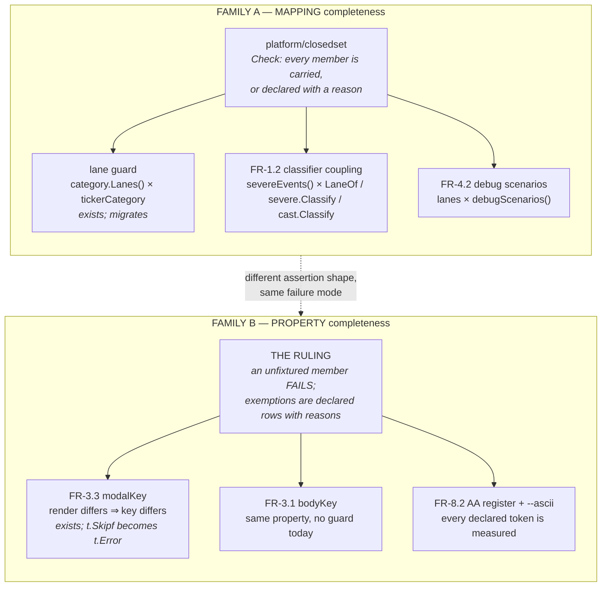
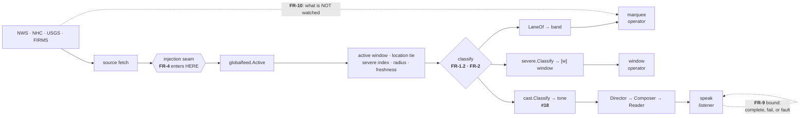
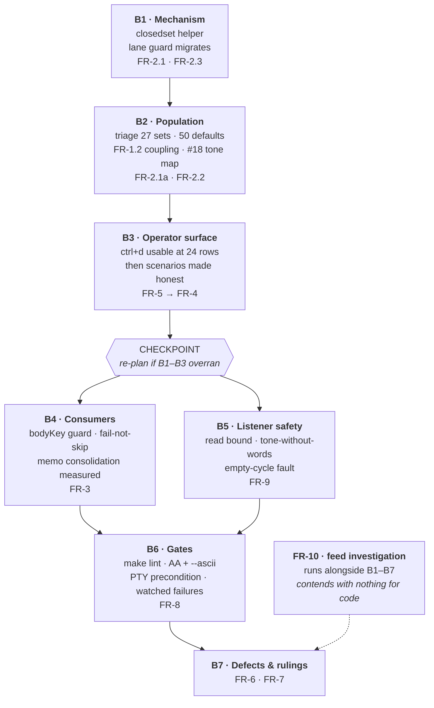

# 0.15.0 — Pre-Broadcaster UI Improvements — PLAN REPORT

## Bottom Line Up Front / BLUF

Two approach decisions were put to the HUM LEAD and both recommendations were taken: **commit to one
shared completeness helper**, and **sequence BUILD as mechanism → surfaces → rulings with FR-10
running in parallel.**

Designing against those decisions produced one correction to the first, and it is the plan's most
important architectural finding: **the five existing completeness checks are not one shape.  They
are two.**  A helper covers three of them.  The other two need a ruling, and a helper would have been
the wrong answer for both.

Nothing in this plan contains implementation code.  Contracts are stated as signatures and control
flow only; bodies are written in BUILD.  *(HUM LEAD standing rule, restated 2026-09-07: code in a
plan bloats the document and — the stronger reason — **cannot be tested**.  In a repo whose thesis is
that unverified things lie, untested code in a plan is that defect wearing a different hat.)*

## Deviations from DISCOVER

Captured per PLAN anti-pattern 6.  Nothing here silently overwrites the discovery report.

| # | Deviation | Why | Impact |
|---|---|---|---|
| **PD-1** | **FR-2 splits into two families.**  DISCOVER treated producer/consumer completeness as one mechanism with one working instance.  It is two: **mapping** completeness (assert `consumer(fixture) == member`) and **property** completeness (assert an implication holds per member) | Measured at PLAN entry: the lane guard asserts a mapping; `memo_completeness_test.go` asserts *render differs ⇒ key differs*.  A generic helper cannot express the second — the "consumer" is not a function returning the member type | FR-2.1 gains a family split.  FR-3.1, FR-3.3 and FR-8.2 move to Family B and consume a **ruling** rather than the helper.  The helper's scope shrinks from five call sites to three |
| **PD-2** | The closed-set population is **27 sets and 50 default arms**, not the 26 and 48 estimated | Counted at PLAN entry | FR-2.1a's triage is slightly larger; no structural change |
| **PD-3** | BUILD is planned as **batches**, not as 2–5 minute tasks | The `writing-plans` skill specifies 2–5 minute tasks with complete code.  At ~35 leaf items that is several hundred tasks of untested code in a document — which the HUM LEAD rule forbids, and which 0.14.0 did not do either (it ran P1–P4 batches with per-batch task lists written at batch entry) | Task decomposition happens at each batch's entry, against the code as it then exists.  Framework precedence: local preference wins over `writing-plans`' task-size rule; the anti-patterns document's actual requirement — "concrete contracts, not placeholders" — is met |

## Approaches considered

Per PLAN anti-pattern 1, strawmen are not presented as options.  Two approaches were viable and two
were rejected; all four are recorded.

### Viable

**A — Commit to one shared helper, outline its API.**  `platform/closedset` becomes a required
component; BUILD writes it first and migrates existing instances.  *Advantage:* matches the standing
rule (extract at the second caller; there are five), one ruling instead of five, and the migration
itself proves the seam.  *Cost:* commits to a seam shape before the full population is triaged.

**B — Commit to a triage task first; settle the API in BUILD.**  Classify all 27 sets and 50 default
arms before designing anything.  *Advantage:* refuses to generalise from small n — the exact error
that produced the broken lane guard.  *Cost:* delays every consuming requirement behind a pass whose
output might be "they do not unify."

**SELECTED: A**, HUM LEAD 2026-09-07.  The triage survives as an FR-2.1a deliverable inside BUILD
rather than ahead of it — see B2 — so the evidence still arrives, just not as a gate on starting.

### Rejected, with reasons

**C — Documented property, hand-written per site.**  Rejected: it contradicts the standing DRY rule
*and* leaves six near-copies of one operation, which is the defect class this release exists to
close.  Self-undermining.

**D — Runtime enforcement via `platform/invariant`.**  Rejected: it would catch a gap in production
rather than under test, but P10 forbids unbounded runtime work, and an init-time panic in a hazard
application is a worse outcome than a wrong lane.  `category.Of` already does the mild version of
this and it is the right amount.

## Architecture

### The two families



**Family A — mapping.**  A producer emits members of a closed set; a consumer maps an input to a
member; the two must agree for every member.  This is what #15 broke and what the lane guard now
checks.  It generalises cleanly because the only thing that varies is *how the caller enumerates the
set*, and that is the caller's job.

**Family B — property.**  A set is walked and a property is asserted per member.  The property is
not "returns the member" — for memo keys it is the implication *if the frame would look different,
the key must differ*.  There is nothing to extract here: the shared thing is a **ruling** about what
happens to a member with no fixture, and today the three instances answer differently (`t.Skipf`,
a `known` opt-out map, and a hand switch).

**The failure mode is identical in both families**, which is why DISCOVER saw one thing: a member
nobody checked, passing silently.  The fix differs.

### `platform/closedset` — contract only

Signatures and control flow.  Bodies are `// TBFI in BUILD`.

```go
// Package closedset asserts that a consumer knows every member a producer can emit.
//
// The caller enumerates the set — from an enum walk, a registry, or a golden —
// because that is the part that legitimately differs. Everything below the seam
// is the same for every call site, including the one ruling that matters: a
// member with no fixture FAILS. It is never skipped.

type Spec[M comparable, F any] struct {
	Members  []M               // the producer's closed set, enumerated by the caller
	Name     func(M) string    // for failure messages; nil falls back to %v
	Fixture  func(M) (F, bool) // an input the producer maps to M; ok=false means none exists
	Consumer func(F) M         // the answer under test
	Except   map[M]string      // member -> WHY no fixture can exist. A reason, not a silencer.
}

// Check fails when a member is neither carried nor declared, when a fixture
// does not actually produce its member (the defect that let the 0.14.2 lane
// guard skip three lanes), and when the consumer disagrees with the producer.
func Check[M comparable, F any](t *testing.T, s Spec[M, F]) // TBFI in BUILD
```

**Three failure modes, deliberately.**  The third is the original #15 check; the first two are what
the 0.14.2 guard lacked.  A call site that cannot state a `Fixture` for a member must write a reason
into `Except`, and that reason is reviewable.

### The hazard path, and where each requirement intervenes

The junior-dev lens asked for this diagram by name: FR-4's correctness argument is currently one
run-on sentence, and it is the claim a reader must believe to fund the requirement.



**Why the seam sits where it does:** an injected event crosses the active-window filter, the location
tie, the severe index, the radius scope, freshness detection, the rail's plan, the Composer and the
Reader — every stage a real hazard crosses.  **FR-10 is drawn outside that path on purpose:** its
question is what never enters the fetch at all, which no amount of testing downstream can reach.

### FR-1.1 — the single config owner

Contract only.  One serialized read-modify-write, replacing six.

```go
// Mutate is the ONE write path for config.toml. It loads, applies edit, and
// saves under a package mutex, so two owners cannot lose an update between
// their own Load and Save.
func Mutate(edit func(*Config)) error // TBFI in BUILD
```

**Two design points the plan commits to now**, because BUILD would otherwise decide them by accident:

- **The mirror stays inside `Save`.**  `Save` already owns the `ticker_muted` back-compat mirror and
  says so.  `Mutate` wraps `Save`; it does not absorb it.  This is the god-object risk the red team
  named, and the answer is that `Mutate` owns *serialization only*.
- **The lock is package-level and held across load-edit-save**, not per-caller.  A caller-held lock
  is the arrangement that already failed.

### FR-9 — where the read bound lives

The bound belongs in `player.Engine.watch`, not in the Director.  `watch` is the only place that
knows a read has started and has not ended; the Director knows what it asked for, not what happened.
A bound in the Director would be a success bound on someone else's work — the F-50 shape.

## BUILD sequence

Selected: **mechanism → surfaces → rulings, with FR-10 in parallel.**



**Critical path:** B1 → B2 → B3 → B4/B5 → B6 → B7.  **B4 and B5 are parallelisable** after the
checkpoint; nothing else is.  **FR-10 is parallel throughout** because it investigates external feeds
and touches no file the other batches touch.

### Sizing

Relative, with the driver named.  No hours are invented — the honest input for durations does not
exist yet, and fabricating it to make the batches look comparable is the failure this release is
about.

| Batch | Size | What drives it |
|---|---|---|
| B1 Mechanism | **S** | One package, one contract, one migration.  Bounded by design |
| B2 Population | **L** | 27 sets × 50 default arms is a reading pass, not a coding one; the classifier coupling and #18's tone map fall out of it |
| B3 Operator surface | **M** | FR-5 is a layout fix with a measured repro; FR-4 is six small items on a seam that already exists |
| B4 Consumers | **M** | `bodyKey`'s guard does not transfer as-is — `bodyKeyFor` derives 10 fields from `frameLayout` and 4 by computation |
| B5 Listener safety | **M** | FR-9.1's bound is small; FR-9.3's empty-cycle fault needs the rotation's invariant established first |
| B6 Gates | **L** | `golangci-lint` and `staticcheck` have never run here — the finding count is unknown until they do |
| B7 Defects & rulings | **M** | Six independent defects plus five rulings; low coupling, high count |
| FR-10 | **?** | **Genuinely unsized.**  It is an investigation against external feeds.  It gets a timebox at B1 entry and a written disposition, per RS-4's discipline |

**B2 and B6 are the two unbounded-looking items and both are bounded by counting, not by building.**
B6's real risk is that a first `golangci-lint` run over this codebase returns hundreds of findings;
the mitigation is that the gate lands with an explicit baseline-and-ratchet rather than a clean bill.

## Risk mitigations, tied to this approach

Per anti-pattern 7 — generic mitigations are not carried forward.

| Risk | Mitigation *specific to the selected approach* |
|---|---|
| **RS-1 scope**, unmitigated by descoping | The checkpoint after B3 is the lever.  B1–B3 are the batches whose sizes are best understood; if they overrun, the plan is re-cut there rather than at B7 when it is too late |
| **PD-1's family split proves wrong under load** — the helper does not fit even three sites | B1 migrates the lane guard as its **first** call site.  If `closedset` cannot express the check it was derived from, the approach has failed cheaply and visibly, before three more sites depend on it |
| **The helper repeats the lane guard's own defect** — a fixture that does not produce its member | Built into the contract: `Check` fails when `Fixture(m)` does not actually produce `m`.  That is failure mode two, and it exists because the 0.14.2 guard lacked it |
| **RS-3 injection stakes** — FR-4 makes the surface user-facing | B3 orders FR-5 **before** FR-4, and NFR-2's artifact check gates the batch.  If the check is not ready, FR-4 does not land |
| **RS-7 / #17** | Not on the critical path.  B5 carries FR-9 regardless of #17's outcome, and the cheap disproof — `fakePlayer`'s unordered drain and `Play()` — is a B5 entry task, ahead of any hardware work |
| **B6 returns hundreds of lint findings** | The gate lands as a baseline plus a no-new-findings ratchet.  A clean bill is not a B6 exit condition and never was |

## Decision log

| ID | Decision | Alternatives | Rationale | Revisit when |
|---|---|---|---|---|
| **PL-D-1** | One shared helper for mapping completeness | Triage first; per-site; runtime | Standing rule: extract at the second caller, and there are five.  Triage survives as B2 | The B1 lane-guard migration cannot express the existing check |
| **PL-D-2** | The helper covers **Family A only**; Family B gets a ruling | One helper for all five | Measured: the memo guard asserts an implication, not a mapping.  A generic helper cannot express it | A third family appears |
| **PL-D-3** | Mechanism → surfaces → rulings; FR-10 parallel | Listener-safety first; two tracks | FR-2 gives every later item a way to prove itself; FR-10 contends with nothing for code | The B3 checkpoint shows B1–B3 overran |
| **PL-D-4** | `Mutate` owns serialization only; the mirror stays in `Save` | `Mutate` absorbs the mirror | Avoids the god-object the red team named; `Save` already documents itself as the mirror's sole owner | A second back-compat mirror appears |
| **PL-D-5** | FR-9's bound lives in `player.Engine.watch` | In the Director; in the schedule | Only `watch` knows a read started and has not ended.  A Director-side bound is a success bound on someone else's work — the F-50 shape | The engine gains a completion signal that removes the polling |
| **PL-D-6** | BUILD is planned as batches; tasks decomposed at batch entry | 2–5 minute tasks written now | ~35 leaf items would be several hundred tasks of untested code.  0.14.0 ran P1–P4 the same way | A batch exceeds one working session |
| **PL-D-7** | B6 lands lint as baseline + ratchet, not a clean bill | Clean bill as exit condition | The finding count is unknown until it runs; making an unknown a gate is how a batch becomes unbounded | The first run returns a small number |

## Internal validation

Run before requesting approval, per anti-pattern 5.

- **Every DISCOVER requirement has a batch.**  FR-1 → B2/B4 · FR-2 → B1/B2 · FR-3 → B4 · FR-4 → B3 ·
  FR-5 → B3 · FR-6 → B7 · FR-7 → B7 · FR-8 → B6 · FR-9 → B5 · FR-10 → parallel.  **10 of 10.**
- **Every NFR has an owner.**  NFR-1 → B4 · NFR-2 → B3 gate · NFR-3 → B6 (as FR-8.4) · NFR-4 → all
  batches (push early) · NFR-5 → B3 · NFR-6 → B7.
- **Task ordering is stated** with a critical path, one parallel pair, and one parallel track.
- **Risks are tied to this approach**, not recited.
- **Decisions are logged with revisit conditions.**
- **Diagrams generated** — three, per FULL DIAGRAMS: component relationship, data flow, sequence.
- **No implementation code.**  Two contracts stated as signatures with `// TBFI in BUILD`.

**One gap this validation found and did not fix:** FR-10 is unsized and the plan says so rather than
inventing a number.  It is the only item without a size, and it gets a timebox at B1 entry.

## Exit criteria

- Approach selected and recorded — **done** (PL-D-1, PL-D-3).
- Architecture documented — **done**, contracts only.
- Diagrams generated — **done**, three.
- Implementation plan exists — **`04-development/implementation-plan.md`**, batches with entry and
  exit conditions.
- Critical analysis — **red team at PLAN exit, SEV-0, not yet run.**
- HUM LEAD approval — **pending.**
