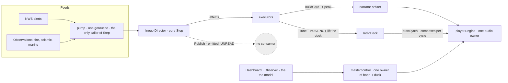

# Approach options

**Three decisions need a ruling before the task breakdown can be written**, because each changes what
the breakdown contains. They are ordered by dependency: **A gates B and C.**

Everything below is **Tier B** — names, signatures and shapes, no bodies. Where a body would clarify,
the text says what it does instead of writing it.

---

## The architecture as it stands



**The two paths to speech are visible here**: alerts go `BuildCard → Speak → arbiter → engine`, and the
rotation goes `Tune → radioDeck → startSynth → engine`. They meet only at the engine, and `Tune` is
forbidden from lifting the duck because every tune today is automatic.

---

# Decision A — the release's shape

**This is the descope question, re-opened at PLAN as the red team asked.**

### A1 — Wire everything: the console displays, reorders, and owns ordinary reads

The full brief. The main track gains operator mutation, the two audio paths merge, the cut-over lands.

- **Delivers** all three inabilities in the locked problem statement.
- **Costs** the merge of two audio owners — the item wave 2 and the safety lens both called the
  riskiest work in the release — inside the same cycle as a new surface, a new router, a new settings
  split and a new location bound.
- **The risk is concentrated on the safety path**, and RS-2's duck question is unresolved until it is
  built.

### A2 — Display and takeovers first; the rotation keeps its own path *(recommended)*

The console reads `Publish` and shows all three lanes. The operator controls the **priority track** —
promote, demote, drop, and the takeover handles. **The main track is displayed read-only**, and the
rotation's audio path is not touched.

- **Delivers** "cannot see what is about to be transmitted" in full, and "cannot change its order"
  **for the lane that matters most on the worst day** — the alert rail.
- **Leaves** ordinary-read reordering to 0.17.0, where the audio merge gets its own cycle, its own red
  team and its own UAT, exactly as the takeover swap got in 0.14.0.
- **Does not touch the duck**, so RS-2 does not arise this release.
- **Honest gap**: an operator cannot reorder ordinary reads. The problem statement's second inability
  is *partly* met, and the release must say so rather than imply otherwise.

### A3 — Everything except the cut-over

A1 minus the bed cut-over. Keeps the merge, drops the pressed-tune problem.

- **Costs** most of A1's risk while delivering less of its value; the merge is the dangerous half, not
  the cut-over.

| | A1 full | **A2 display + takeovers** | A3 no cut-over |
|---|---|---|---|
| Locked inability 1 — *see what is next* | ✔ | **✔** | ✔ |
| Locked inability 2 — *change the order* | ✔ | **partial — priority lane only** | ✔ |
| Locked inability 3 — *confirm on air* | ✔ | **✔** | ✔ |
| Touches the audio merge | **yes** | **no** | yes |
| RS-2 (duck on cut-over) arises | yes | **no** | no |
| Cycles to full brief | 1 | 2 | 2 |

**RECOMMENDATION: A2.** It retires two of three inabilities completely and the third for the lane where
being wrong hurts a listener most, without joining two audio owners in the same release that introduces
a second surface. The 0.14.0 precedent is directly on point: the riskiest swap of that release was
given its own task, its own red team and a UAT shared with nothing.

**The strongest argument against A2**, and it is a real one: the ten-card stack is the mock's centre,
and shipping it read-only may read as unfinished to the operator who wanted it. **That is a HUM LEAD
judgement about the product, not a technical one, which is why this is decision A.**

---

# Decision B — how operator intent reaches the Director

**Only if A includes any operator mutation** (A1, A3, or A2's priority-lane control).

The Director's contract is a closed set: `Step(ev Event) (Director, []Effect)`, nine event types, nine
effects, one caller. Operator intent has to enter as **events**, because that is the only door.

### B1 — One event carrying an intent *(recommended)*

```go
// Tier B — shape only, no body.

// Moved is an operator's placement of a card, expressed as WHERE, not HOW.
type Moved struct {
    isEvent
    ID    string // the card the operator addressed
    Place Place  // Lead, Earlier, Later, or Dropped
}

type Place int // Lead | Earlier | Later | Dropped
```

- **One new event, one new handler**, `onMoved`. The closed set grows by one, deliberately and once —
  the same discipline `Speak` was grown under in 0.14.0.
- The Director decides what a placement *means* against the track it holds, so the console never
  computes an index. **The UI names an intent; the Director owns the order.**
- **Needs** a reorder-capable mutator beside `Queue`/`Set`/`Remove`, because `Set` refuses to reorder by
  design and routing a promote through it would silently no-op — RS-1 exactly.

### B2 — Four events, one per verb

`Promoted`, `Demoted`, `Dropped`, `Pinned`. More literal, and four handlers to keep consistent.

- **Costs** four places for the same rule to drift, which is the shape this codebase has removed twice
  (the duck, the config writer).

### B3 — A command channel beside `Step`

An operator path that does not go through the Director.

- **Rejected outright.** It creates a second writer of the schedule, which is the invariant the whole
  architecture is built to protect.

**RECOMMENDATION: B1.**

---

# Decision C — the duck on an operator-initiated cut-over

**Only if A includes the cut-over** (A1). **Under A2 this decision does not arise**, which is a
substantial part of A2's case.

The seam's comment is the constraint and the clue: *"Every tune the Director asks for is AUTOMATIC —
the dwell elapsed, a cycle ended — and nobody pressed anything. Lifting the dip here would bring the
next location's report in at full volume over a breaking alert still reading."*

| | Option | What a listener hears |
|---|---|---|
| **C1** | **Never lift** — a pressed cut-over behaves exactly like an automatic one | The bed comes up ducked under a reading alert. Safe, and the operator may think the control failed |
| **C2** | **Lift, but not while the rail is reading** — refuse or defer the cut-over until the alert finishes | The alert completes, then the bed comes up clean. **The operator is told why it waited** |
| **C3** | Lift always | A report at full volume over a live tornado warning. **Named only to be rejected** |

**RECOMMENDATION: C2**, with the refusal visible to the operator. It preserves the invariant that
matters — nothing ever plays over a reading alert at full volume — while making the pressed control
behave like a pressed control. **C1 is the safe fallback** if C2's deferral proves fiddly.

---

## What PLAN produces once A is ruled

| Under A2 (recommended) | Under A1 |
|---|---|
| The router and the swap gate | Same |
| The console reading `Publish` · three lanes · the card modal | Same |
| Priority-lane operator control (B1) | Full main-track control (B1) |
| Station state wired to `Power` | Same |
| The settings split · the tower · gain | Same |
| Breakpoints and the minimum-size notice | Same |
| **Not** the audio merge, **not** the cut-over, **not** RS-2 | The merge, the cut-over, and C's ruling |

**Task breakdown, dependency ordering, file paths, test-case descriptions and the diagrams for the
chosen shape follow the ruling on A** — writing them for three shapes would be three plans, two of
which get thrown away.
