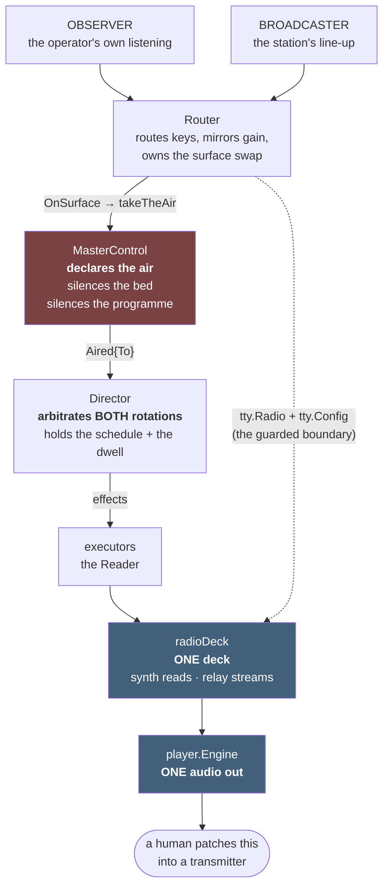
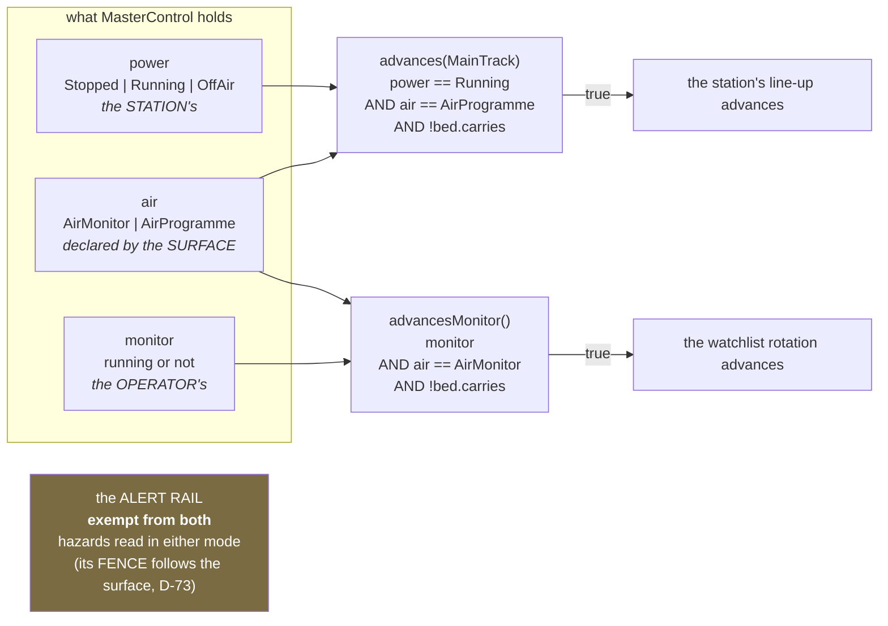
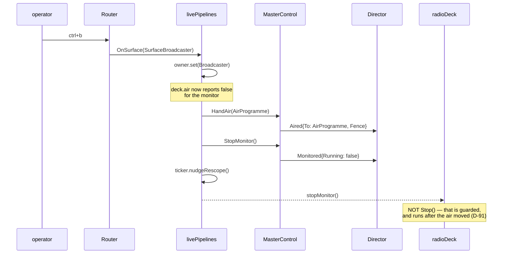
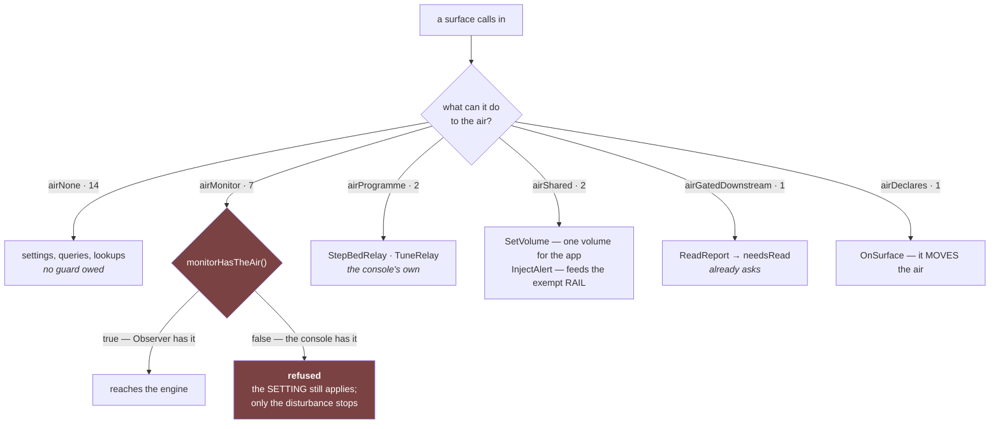
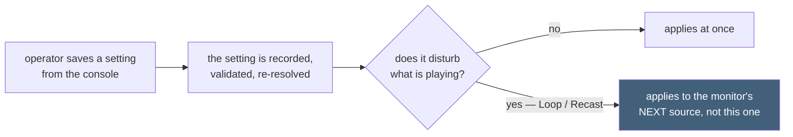

# How this actually works now

**`diagrams.md` is the PLAN's picture (2026-09-09) and stays as the record of what was intended.**
This is the audio path as BUILT, after D-74, D-78, D-90 and D-91.

**Why it exists:** the shared-deck decision has been re-litigated across sessions because the model
was rebuilt from `app/radio.go` instead of read from the rulings.  A picture is harder to
misremember than a call graph.

---

## 1. One deck, one air

**Both surfaces run through the SAME deck, on purpose** (HUM LEAD, 2026-09-12): both do synth reads
and relay streams, so two decks would be duplicated code and two things that could play at once.
The Director arbitrates the rotation in BOTH modes; MasterControl gates the deck from the air.

**"ON AIR" never means the antenna is radiating** (FR-5.5).  Watchpost produces audio; a person
patches it.  That is why anything mixed into the output on the console *goes out*.

---

## 2. Who may advance, and it is mutually exclusive by construction

`TestOnlyOneProgrammeCanEverAdvance` states the exclusivity.  **This is why Observer's watchlist dwell
cannot re-tune the deck while the console holds the air** — F-99 was filed claiming it could, and
retracted when measured.

---

## 3. The surface swap

**Going back does not resume the monitor.**  The operator presses play, "like if Observer was first
opened" — which is also what stops a rapid `ctrl+b`/`ctrl+o` flip from re-resolving relays and
re-fetching products (D-74).

---

## 4. The guard boundary — D-91

**31 seams** between a surface and `app`: 26 `tty.Config` func fields and 5 `tty.Radio` methods.
The classification is a closed set, derived by reflection, ratcheting both ways
(`app/air_boundary_test.go`).

**The seven refused:** `Radio.Tune`, `Radio.Stop`, `Radio.SetRepeat`, `Radio.SetMode`, `SetVoice`,
`SetCast`, `PreviewVoice`, `NarrateEvent`/`EndEventRead`.

**The guard is at the CALLER, never the method** — because `tune` serves the monitor AND the
Director's `Tune` effect, and `tuneCallsign` serves Observer's relay pick AND the console's own bed
selector.  The exported `tty.Radio` methods are the monitor's surface; the lower-case internals are
shared.

---

## 5. What a settings change does now

**The pattern is `setTones`', already in the tree:** *"deliberately NOT a recast — `[M]` must be
instant and must not disturb a broadcast in flight."*

---

## 6. The five roles, unchanged

| Role | Owns | Does not own |
|---|---|---|
| **Card Producer** | that a card should exist | what it says |
| **Card Composer** | what it says, at standby | arrangement, the UI |
| **Director** | the order, the operator's will, BOTH rotations | the air |
| **Reader** | performing the LIVE card, with its pacing | the running order |
| **MasterControl** | **the air**; declares ON AIR / STANDBY; silences the bed and the programme | planning; owning the bed |

**MasterControl declares and everyone complies, the Director included** (MVS-D-77).

---

## What this does not yet show

- **Settings surface-awareness** (D-18 / M4) — stage B.  `setup*.go` has no reference to `Surface`
  today, so Observer's rows are visible from the console.
- **The relay-fault window's data flow on the console** — stage C.
- **F-102** — voice preview is refused on the console; a cue/PFL bus is the real answer and there is
  one audio out.
