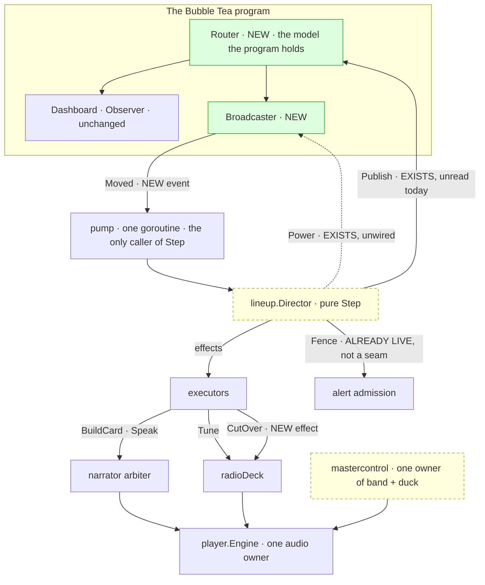
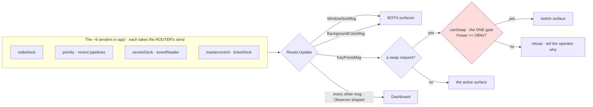
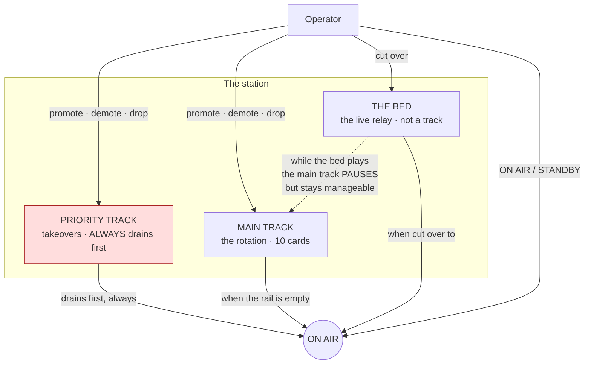

# Diagrams

**Mermaid, because it renders where these documents are read.**  Each diagram marks what EXISTS today
against what this release WIRES, because the distinction is the release's central fact: seven
subsystems were built for it and left without consumers.

---

## 1. Target architecture — what 0.16.0 wires



**Yellow dashed = a seam that exists and has no consumer today.**  Green = genuinely new.
**The new column is short**: a router, a surface, one event, one effect.

---

## 2. P0 — the router's message fan-out

**The batch whose claim is "nothing changes".**  Three messages are program-scoped and must reach both
surfaces; everything else is Observer-shaped data that goes to Observer.



**The two hazards this diagram is drawn to expose:**

- **`canSwap` is the ONE gate.**  If a second path could swap, the rule would have two carriers, which
  is the failure `mastercontrol`'s comment records from this codebase's own history.
- **The breaking-alert pair** (`TickerBreakingMsg` / `TickerBreakingDoneMsg`) must arrive together.
  Observer clears its marquee on the second with no guard, so a router that drops or delays one leaves
  the marquee stuck.  **Ordering and completeness, not merely delivery.**

---

## 3. P4 — the operator-intent path

```mermaid
sequenceDiagram
  participant OP as Operator
  participant BC as Broadcaster
  participant PUMP as pump
  participant DIR as Director
  participant L as Lineup

  OP->>BC: selects slot [3], chooses PROMOTE
  BC->>PUMP: Moved{ID, Place: PlaceLead}
  PUMP->>DIR: Step(Moved)
  DIR->>L: Reorder(id, PlaceLead)
  Note over L: NEW mutator.  Set REFUSES to reorder<br/>by design — routing through it<br/>would silently no-op (RS-1)
  L-->>DIR: a new Lineup, order changed
  Note over DIR: ⚠ The first draft marked Origin = FromOperator HERE.<br/>lineup.go:227 forbids it — a card keeps its origin<br/>for life. OPEN RULING, not settled design.
  DIR-->>PUMP: Publish{Lineup}
  PUMP-->>BC: the console re-renders from what was PUBLISHED
  Note over BC: The console never computes an index.<br/>It names an intent; the Director owns the order.

  rect rgb(255,235,235)
    Note over OP,L: THE OPEN QUESTION (D-23)<br/>A takeover can arrive mid-edit.  The rail drains<br/>first regardless, and the card being moved may<br/>already be gone.  HUM LEAD ruling at BUILD entry.
  end
```

**Why the console must re-render from `Publish` and not from its own optimism:** if it painted the
promoted order locally and the Director declined the move, the screen would assert an order the
schedule does not follow — RS-1, the release's UI-integrity risk.

---

## 4. The three lanes, and what the operator can do to each



**The invariant the red team will attack, and the one worth stating plainest:** the priority track
drains first in **every** state — while the bed plays, while the main track is paused, and regardless of
what the operator is doing. The only thing that holds it is STANDBY, which holds everything, by design
and unbypassably.
