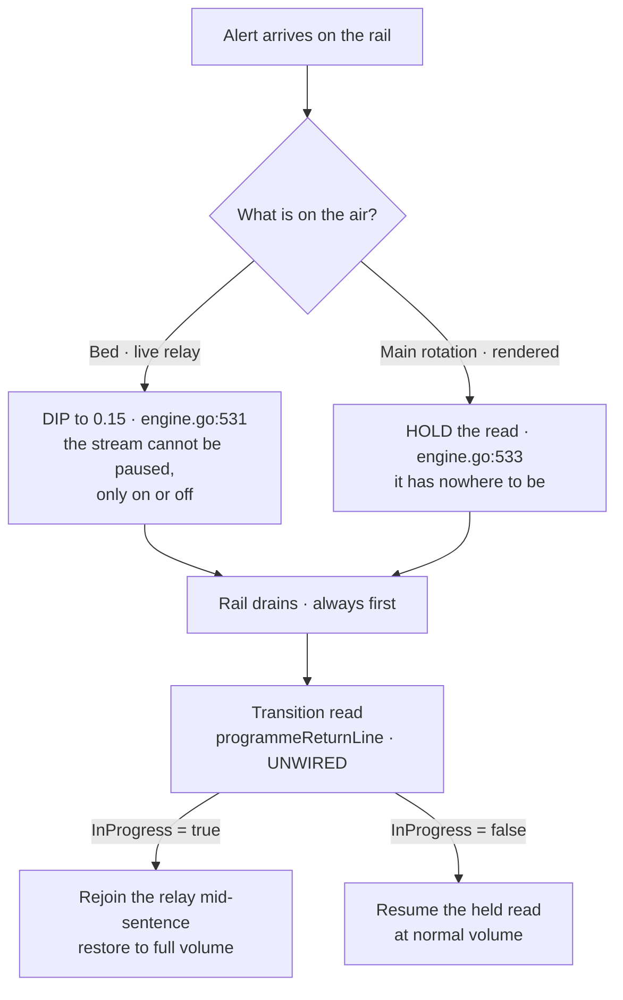

# Implementation plan — A1, the full wire

## The rulings this plan is built on

| | Ruling | Verbatim |
|---|---|---|
| **D-22 (A)** | **A1 — the full wire.  This release is the MVP.** | *"we've already spent time to take this piecemeal by wiring the foundation in a prior release - this is not the UX side of the release and it needs to function as intended out of the gate.  This release IS the MVP - as I have deliberately chosen to defer things like map visualizations for later"* |
| **D-23 (B)** | **B1 approved** — one placement event.  **Open:** how it serves an operator doing several things | *"Approved, but we'll need to figure out how that operates for a human operator who wants to potentially do multiple things."* |
| **D-24 (C)** | **The medium decides.**  Duck the bed; pause the rotation, drain the rail, insert a transition, resume at full volume | *"Your recommendation is correct ONLY during a takever while the bed is playing.  With the main rotation - we can PAUSE the read, let the alert rail drain - insert a transition read, then resume the read at normal volume.  The duck is important for the stream because that relay is fundamentally out of our control (we can 'pause' the stream, only turn it on or off)"* |

## D-24 is already the code, and that is the plan's biggest saving

**The engine decides exactly this, and its comment gives the same reason the HUM LEAD did**
(`player/engine.go:486-500, 528-534`):

> *"A relay DIPS: it is live radio, and a paused relay resumes into audio that is minutes stale — a
> listener would hear a warning that had already expired.  A rendered cycle HOLDS: it has nowhere to
> be, so dipping loses the words under the alert for good where holding means the whole report is heard
> afterwards."*

`alertDuck = 0.15` for live; hold for rendered. **And the decision is fixed at the moment the alert
arrives, not per source**, so a relay that falls back to synth mid-alert cannot end up in the wrong mode.

**The transition read is a SEVENTH pre-built seam.**  `app/transition.go` holds `programmeReturnLine`
and `mastheadLine`, both complete, both with **zero production callers**.  `transition/resume.txt`
carries an `.InProgress` flag whose own comment says it is *"true when the programme is a LIVE RELAY,
which kept running underneath and is therefore rejoined mid-sentence; false for a synth read, which
starts its next card cleanly."*

**So D-24 is not new behaviour to design. It is three existing pieces to join.**



## The eight batches

**Serial, on the standing instruction** — *"better to reduce variables if something doesn't work."*
Each batch pushes on its first commit so CI sees both platforms while the work is warm.

| # | Batch | Delivers | Depends on |
|---|---|---|---|
| **P0** | **The router** | FR-1.1-1.3 — the router becomes the model; ~9 senders take its send; **Observer behaviour identical** | — |
| **P1** | **The console shell** | FR-2.1-2.4, FR-7 — three lanes read from `Publish`, read-only; breakpoints; the minimum-size notice | P0 |
| **P2** | **Station state and the swap gate** | FR-5, FR-1.4-1.6 — `Power` wired; Variant C banner; the "on the air" boundary; STANDBY-before-swap | P1 |
| **P3** | **The main track producer** | T3.2b, FR-2.5 — the rotation becomes main-track cards; **the audio merge**; no double-speak | P2 |
| **P4** | **Operator intent** | FR-3, B1 — the `Moved` event, the reorder mutator, the card modal, mis-action recovery | P3 |
| **P5** | **The bed and the cut-over** | FR-4, D-24 — transitions wired, duck-per-medium, the paused main track | P3 |
| **P6** | **Settings, tower, radius, cadence** | FR-6, FR-8, FR-9, FR-10 | P2 |
| **P7** | **Instruments and gates** | FR-11 — runs THROUGHOUT, closed here | all |

**P0's claim is the one a test can state: *nothing changes*.**  That is the T3.2a discipline that
worked in 0.14.0, and it is why the router goes first rather than alongside.

**P3 is the dangerous batch.**  It gets **its own red team and a UAT shared with nothing**, on the
0.14.0 precedent for the takeover swap — *"it replaces the working takeover path, so it carries its own
red team, and it must not share a UAT with anything else or a regression cannot be attributed."*

## Tier B shapes

Signatures only. Bodies are `// TBFI in BUILD`.

### P0 — the router

```go
// modes/tty/router.go — new.
type Surface int // SurfaceObserver | SurfaceBroadcaster

type Router struct { /* the two models, the active surface, the shared key map */ }

func NewRouter(o Dashboard, b Broadcaster) Router
func (r Router) Init() tea.Cmd
func (r Router) Update(msg tea.Msg) (tea.Model, tea.Cmd) // fans the 3 program-scoped msgs; routes the rest
func (r Router) View() tea.View

// canSwap is the ONE place the D-1 precondition is checked.
func (r Router) canSwap(to Surface) (bool, string) // false + the reason to show
```

**Senders to rewire** — each takes the router's send instead of the program's:
`app/dashboard.go:177,192,197,376` · `app/pipelines.go:170,299` · `app/ticker.go:145,152`.

### P4 — operator intent, and D-23's open question

```go
// platform/lineup/operator.go — new.
type Place int // PlaceLead | PlaceEarlier | PlaceLater | PlaceDropped

type Moved struct {
    isEvent
    ID    string
    Place Place
}

// Reorder is the mutator Set deliberately refuses to be.
func (l Lineup) Reorder(id string, to Place) (Lineup, error)
```

**D-23 — the operator doing several things.**  Three shapes, for a ruling at BUILD entry:

1. **Sequential intents.**  Each action is its own `Moved`, applied in order.  Simplest; an operator
   doing four things sends four events, and a takeover landing between them is applied between them.
2. **A staged set, committed together.**  The operator marks several cards and commits once.  Matches
   how a person actually re-cuts a running order, and needs a staging state the schedule does not have.
3. **Sequential, with the schedule frozen while a modal is open.**  A middle path: intents apply one at
   a time, but the operator's view cannot shift underneath them mid-decision.

**Recommendation: 1 for the mechanism, 3 for the experience** — the event stays singular so the
Director keeps one rule, and the freeze is a console concern rather than a schedule concern.
**The question this must answer is what happens when a takeover fires while the operator is mid-edit**,
because the rail drains first regardless and the card they were moving may already be gone.

### P5 — the cut-over

```go
// The bed cut-over is an operator act, so it needs its own effect —
// `Tune`'s comment forbids lifting the duck precisely because nobody pressed anything.
type CutOver struct { isEffect; Ref string }
```

## Test-case descriptions

**Descriptions only — the tests are written in BUILD.**

| Batch | The cases that must exist |
|---|---|
| P0 | Observer renders byte-identical before and after the router · a window resize reaches both surfaces · every rewired sender still lands · the breaking-alert pair survives a swap |
| P1 | Three lanes render at each breakpoint · below the floor a notice appears and nothing exceeds the terminal · the console shows only what `Publish` carried |
| P2 | The swap is refused unless the power is `OffAir` · a planted second swap path is refused by the same gate · the banner reads from `Power`, never a UI flag |
| P3 | **A report is never read twice** · the rail still drains first · a mutant reversing precedence is CAUGHT · Observer's audio is unchanged |
| P4 | A promote changes what `Next()` walks · **a mutant that updates display without reordering is CAUGHT** (RS-1) · a dropped active warning is recoverable · an edit survives a subsequent arrival |
| P5 | A takeover over the bed DIPS · a takeover over a read HOLDS · a transition read is inserted on resume · `InProgress` is true for relay and false for synth |
| P6 | A 0.15.0 config loads, re-saves, and diffs to only the new table · a shared value survives a swap · a per-surface value does not leak · a 3-mile radius still receives county products |
| P7 | Every gate has a watched failure · every subject list is derived · each new instrument answered a KNOWN case first (INST-4) |

## Risks this plan carries

| Risk | Where it lands |
|---|---|
| RS-1 promote that displays but does not reorder | P4, with the mutant named above |
| RS-2 duck on cut-over | **Reduced by D-24** — the engine already decides per medium.  P5 wires it |
| RS-4 the breaking pair split by the router | P0's test list |
| The audio merge | **P3, its own red team, its own UAT** |

## What PLAN still owes before BUILD

1. **The diagrams for each batch** — this document carries the D-24 flow; P0's message fan-out and
   P4's intent path still need theirs.
2. **D-23's ruling** on the multi-action shape, at BUILD entry.
3. **The provider-key ruling** carried from DISCOVER.
4. **The cadence measurement** — current requests per minute at idle and during a burst, which the cap
   needs and nobody has taken.
