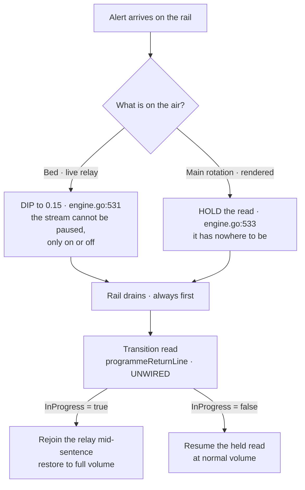

# Implementation plan — A1, the full wire

## The rulings this plan is built on

| | Ruling | Verbatim |
|---|---|---|
| **D-22 (A)** | **A1 — the full wire.  This release is the MVP.** | *"we've already spent time to take this piecemeal by wiring the foundation in a prior release - this is not the UX side of the release and it needs to function as intended out of the gate.  This release IS the MVP - as I have deliberately chosen to defer things like map visualizations for later"* |
| **D-23 (B)** | **B1 approved** — one placement event.  **Open:** how it serves an operator doing several things | *"Approved, but we'll need to figure out how that operates for a human operator who wants to potentially do multiple things."* |
| **D-24 (C)** | **The medium decides.**  Duck the bed; pause the rotation, drain the rail, insert a transition, resume at full volume | *"Your recommendation is correct ONLY during a takever while the bed is playing.  With the main rotation - we can PAUSE the read, let the alert rail drain - insert a transition read, then resume the read at normal volume.  The duck is important for the stream because that relay is fundamentally out of our control (we can 'pause' the stream, only turn it on or off)"* |

## D-24 — CORRECTED.  Half of it is the code.  The half this release needs is NOT.

> **This section overstated the saving, and the PLAN-exit red team caught it doing the exact thing I
> asked it to look for.**  The original text is kept below the correction, because the error is more
> instructive than the fix.

**What exists** is give-way triggered by **an alert arriving** — `Suppress`/`Restore`
(`engine.go:503-515`) reacting against audio already playing, resolved by `giveWayLocked`
(`engine.go:526-534`).  That mechanism is real, shipped, and correct.

**What D-24 is actually about** is an **operator pressing a cut-over**.  That is a different trigger,
and `engine.go` has no state for it — there is no pending or queued cut-over concept anywhere.

**The tell was in my own diagram and my own test list.**  The flowchart below starts from
*"Alert arrives on the rail"* — it diagrams the mechanism that already works.  And P5's test rows all
exercise the existing alert path; **not one tests an operator pressing cut-over.**  The untested case
is the one that matters: **what happens when a cut-over is pressed while an alert is reading.**

**This is the same rhetorical move the previous round caught** — a true "the pieces exist" observation
used to imply the risky part is done.  Wave 2 made that claim and kept the hard part as a tracked top
risk; this plan made the claim and did not.

## The original section, as written, kept for the record

**The engine decides exactly this, and its comment gives the same reason the HUM LEAD did**
(`player/engine.go:486-500, 528-534`):

> *"A relay DIPS: it is live radio, and a paused relay resumes into audio that is minutes stale — a
> listener would hear a warning that had already expired.  A rendered cycle HOLDS: it has nowhere to
> be, so dipping loses the words under the alert for good where holding means the whole report is heard
> afterwards."*

`alertDuck = 0.15` for live; hold for rendered. **And the decision is fixed at the moment the alert
arrives, not per source**, so a relay that falls back to synth mid-alert cannot end up in the wrong mode.

**The transition read is a pre-built seam** (and see the corrected count below).  `app/transition.go` holds `programmeReturnLine`
and `mastheadLine`, both complete, both with **zero production callers**.  `transition/resume.txt`
carries an `.InProgress` flag whose own comment says it is *"true when the programme is a LIVE RELAY,
which kept running underneath and is therefore rejoined mid-sentence; false for a synth read, which
starts its next card cleanly."*

**So D-24 is not new behaviour to design. It is three existing pieces to join.**



## CORRECTION — there are FIVE seams, not seven

**Two of the seven I claimed are live production infrastructure, not dormant seams.**  Counting them
inflated the release's savings, and I had the contradicting evidence in my own earlier analysis.

| Claimed seam | Verdict |
|---|---|
| `lineup.Publish` | **Seam.**  Emitted, no production reader |
| `lineup.Power` | **Seam, partially** — the WRITE side is already wired (`app/radio.go:569,743` send `Powered{}`); only the `Power()` read has no consumer |
| `term.Breakpoint` | **Seam** — and worse than stated: `radio_panel.go:145` runs a *different, conflicting* scheme the plan never reconciles |
| `Origin.FromOperator` | **Seam.**  Constructed only in tests |
| `app/transition.go` | **Seam** for `programmeReturnLine`; `mastheadLine` is also unwired **and unbatched** — claimed as savings, then dropped |
| ~~`lineup.Fence`~~ | **NOT A SEAM.**  Fully consumed: `app/ticker.go:344` passes `Fence: t.fence()` into `Arrived`, and `plan.go:298` admits against it.  **I verified this myself during DISCOVER and still counted it as unwired.** |
| ~~the bed~~ | **NOT A SEAM.**  `bed.go`'s dwell and tune state machine drives today's rotation.  Only the **operator-manual trigger** is new |

**The corrected claim: five seams, one of them half-wired.**  The release's saving is real and smaller
than I said.

## The eight batches

**Serial, on the standing instruction** — *"better to reduce variables if something doesn't work."*
Each batch pushes on its first commit so CI sees both platforms while the work is warm.

**RE-CUT BY D-25.**  The merge is spiked FIRST, in its own worktree, before any batch begins — see
`spike-the-merge.md`.  The HUM LEAD's read that *"the main thing is going to be the operator controls"*
also moves the release's centre of gravity to P4, which the original order buried behind the riskiest
batch.

| # | Batch | Delivers | Depends on |
|---|---|---|---|
| **S0** | **THE SPIKE — the audio merge** | One question, one session, its own worktree, code deleted after.  **Answers whether P3 is wiring or a re-shape** | — |
| **P0** | **The router** | FR-1.1-1.3 — the router becomes the model; **11 senders** (derived, below) take its send; **Observer behaviour identical**.  **F-67's five unhandled program messages are dispositioned here** | — |
| **P1** | **The console shell** | FR-2.1-2.4, **FR-2.6** (clamp reuse), FR-7 — three lanes read from `Publish`, read-only; breakpoints; the **minimum-size notice at 44 lines**; **the `--ascii` render**; **NFR-3's frame measurement** | P0 |
| **P2** | **Station state and the swap gate** | FR-5, **NFR-7** (bounded silent station), FR-1.4-1.6 — `Power` wired; Variant C banner; the "on the air" boundary; STANDBY-before-swap; **`mastheadLine` wired** | P1 |
| **P3** | **The main track producer** | T3.2b, FR-2.5 — the rotation becomes main-track cards; **the audio merge**; no double-speak.  **Re-planned from S0's answer, not from this row** | P2, **and S0's verdict** |
| **P4** | **Operator intent** | FR-3, B1 — the `Moved` event, the reorder mutator, the card modal, mis-action recovery | P3 |
| **P5** | **The bed and the cut-over** | FR-4, D-24 — transitions wired, duck-per-medium, the paused main track | P3 |
| **P6** | **Settings, tower, radius, cadence** | FR-6, FR-8 **including FR-8.9's national-scope answer**, FR-9, FR-10.  **BLOCKED on the cadence measurement** | P2 |
| **P7** | **Instruments and gates** | FR-11 — runs THROUGHOUT, closed here | all |

**P0's claim is the one a test can state: *nothing changes*.**  That is the T3.2a discipline that
worked in 0.14.0, and it is why the router goes first rather than alongside.

**THE SWAP GATE HAS A WINDOW, AND IT MUST FAIL CLOSED.**  The gate lands with the router (P0) but the
state it reads — a real `Power` — is not wired until **P2**.  A second surface first exists in **P1**,
so the window is **P1 → P2**.  *(The safety lens drew it as P0 → P2; sharpened against the batch table
it opens when a surface to swap TO exists, not when the router does.)*

**Ruling for the window: `canSwap` FAILS CLOSED.**  Until `Power` is wired, a swap away from
Broadcaster is refused, not permitted.  A refused swap is an inconvenience; a permitted one during a
live read is the hazard D-1 exists to prevent.  **P1 carries a test that the gate refuses while its
state source is a stub.**

**P3 is the dangerous batch.**  It gets **its own red team and a UAT shared with nothing**, on the
0.14.0 precedent for the takeover swap — *"it replaces the working takeover path, so it carries its own
red team, and it must not share a UAT with anything else or a regression cannot be attributed."*

**That control is necessary and NOT sufficient**, and the safety lens said why: a scenario UAT targets
**precedence and duplication**, not **timing**.  It would not catch a race where a cycle ending
coincides with an alert arriving at the tick a dedup guard resets.  **P3 therefore also carries:**

- **A property test over arrival timing**, not a fixed scenario — the merge's guard asserted across
  randomised interleavings of cycle-end and alert-arrival.
- **A dark path.**  The merged producer runs and is observed **without owning the air** before it owns
  it, so its decisions can be compared against the live path's for a period.
- **An explicit go/no-go before P4 and P5 begin.**  Today the dependency is structural; this makes it
  risk-gated.

## Tier B shapes

Signatures only. Bodies are `// TBFI in BUILD`.

### P0 — the router

```go
// modes/tty/router.go — new.
type Surface int // SurfaceObserver | SurfaceBroadcaster

type Router struct {
    observer    Dashboard
    broadcaster Broadcaster
    active      Surface
    keys        term.KeyMap // merged once, shared by value
    width, height int       // the last WindowSizeMsg, fanned to both
    darkBG      bool        // the last BackgroundColorMsg, fanned to both
}

func NewRouter(o Dashboard, b Broadcaster) Router
func (r Router) Init() tea.Cmd
func (r Router) Update(msg tea.Msg) (tea.Model, tea.Cmd)
func (r Router) View() tea.View

// canSwap is the ONE place the D-1 precondition is checked.
// FAILS CLOSED while its state source is a stub (the P1 -> P2 window).
func (r Router) canSwap(to Surface) (bool, string) // false + the reason to show
```

### P1 — the console shell (the `Broadcaster` model)

**Shaped here because P0's `NewRouter` takes it and the first draft never defined it.**

```go
// modes/tty/broadcaster.go — new.
type Broadcaster struct {
    lineup   lineup.Lineup // the last PUBLISHED snapshot — never locally mutated
    power    lineup.Power  // read from the Director, never a local flag (FR-5.1)
    focus    Slot          // which handle is selected
    modal    bcModal       // the one open window, exclusivity by construction
    width, height int
    bp       term.Breakpoint // FR-7.1 — SELECTS the layout, not a discarded call
}

func (b Broadcaster) Init() tea.Cmd
func (b Broadcaster) Update(msg tea.Msg) (Broadcaster, tea.Cmd)
func (b Broadcaster) View(o render.Opts) string
func (b Broadcaster) minSize() (cols, rows int) // rows = 44 (wave 1, measured)
```

**Senders to rewire — DERIVED, not estimated.**  The first draft said "~9" and cited line numbers that
mostly pointed at function signatures and the construction site rather than the send calls.  **INST-1
says a subject list is computed, never hand-written, and I hand-wrote this one.**  Derived by walking
`app/` for holders of `*tea.Program`, `p.Send` and `func(tea.Msg)`:

| Holder | Wired at | Sends at |
|---|---|---|
| `severeDeck` | `dashboard.go:177` | `severe.go:284,303` |
| `director` / `mastercontrol` | `dashboard.go:192,305`; `ticker.go:152` | `mastercontrol.go:233,247` |
| `eventReader` | `dashboard.go:197` | `severe_read.go:119,205` |
| `radioDeck` | `dashboard.go:376` (`deck.p = p`, the construction site) | `radio.go:244,687,758,785,1002`; `voices.go:200` |
| priority pipeline | `pipelines.go:170` (signature) | `pipelines.go:178` |
| recent pipeline | `pipelines.go:299` (signature) | `pipelines.go:316` |
| `tickerDeck` | `ticker.go:145` (signature), `:157` | `ticker.go:207,255` |

**Eleven send sites across six holders.**  **P0's own gate is that this list is re-derived by the build
rather than read from this table** — a table in a plan is exactly the stale hand-written set INST-1
forbids.

### P4 — operator intent, and D-23's open question

```go
// platform/lineup/operator.go — new.

// Place is WHERE, relative to the card's CURRENT position on its own track.
//   PlaceLead    — to the head of its track (not across tracks)
//   PlaceEarlier — swap with the card immediately ahead; a no-op at the head
//   PlaceLater   — swap with the card immediately behind; a no-op at the tail
//   PlaceDropped — see the open ruling below
// A card ON AIR is refused for all four: the on-air lock already forbids it.
type Place int

type Moved struct {
    isEvent
    ID    string
    Place Place
}

// Reorder is the mutator Set deliberately refuses to be.
func (l Lineup) Reorder(id string, to Place) (Lineup, error)
```

**TWO OPEN RULINGS THE FIRST DRAFT HID INSIDE A SHAPE.**  Both surfaced at the PLAN red team, and
both are recorded rather than smuggled:

1. **`Origin` cannot be re-marked, and my diagram said it could.**  `lineup.go:227` enforces
   *"a card keeps its slot and its origin for life"*.  The intent-path diagram had the Director set
   `Origin = FromOperator` **after** a reorder, which that invariant forbids.  **Options:** the card
   records provenance at proposal only and operator placement is tracked elsewhere; or the invariant is
   relaxed for origin alone.  **The invariant is load-bearing and should probably win.**
2. **`PlaceDropped` overlaps `Remove`.**  `lineup.go:247-249` explicitly reserves the operator's DROP
   for `Remove` — *"it is not the Operator's DROP control, which arrives with the Broadcaster UI"*.
   Folding drop into `Reorder` means one of them delegates or the two duplicate.  **Options:** drop
   `PlaceDropped` and let `Moved` mean placement only, with drop its own event; or have `Reorder`
   delegate.  **The first is cleaner and matches what `Remove`'s comment already reserved.**

**D-23 — the operator doing several things.**  Three shapes, for a ruling at BUILD entry:

1. **Sequential intents.**  Each action is its own `Moved`, applied in order.  Simplest; an operator
   doing four things sends four events, and a takeover landing between them is applied between them.
2. **A staged set, committed together.**  The operator marks several cards and commits once.  Matches
   how a person actually re-cuts a running order, and needs a staging state the schedule does not have.
3. **Sequential, with the schedule frozen while a modal is open.**  A middle path: intents apply one at
   a time, but the operator's view cannot shift underneath them mid-decision.

**Recommendation: 1 for the mechanism, 3 for the experience** — the event stays singular so the
Director keeps one rule, and the freeze is a console concern rather than a schedule concern.
**The question this must answer is what happens when a takeover fires while the operator is mid-edit**,
because the rail drains first regardless and the card they were moving may already be gone.

### P3 — the main-track producer, the merge

**The first draft described the release's most dangerous batch in six words.**  Shaped here, because
"it is dangerous" and "here is no detail" cannot both stand.

```go
// platform/lineup/rotation.go — new.
// The rotation's turn becomes a MainTrack card, so the two paths to speech become one.

// Rotated says the rotation's turn came round: this location is next.
// It is the event the dwell/cycle-end already decides, expressed as data.
type Rotated struct {
    isEvent
    Ref string // the location whose turn it is
}
```

**The merge's shape, in words rather than code**, because the decision is what matters:
`onRotated` proposes a `LocationReport` card onto `MainTrack` instead of emitting `Tune` directly.
The card then travels the ordinary path — `BuildCard` composes it, `Speak` reads it through the
arbiter — so `executors.go:277,289`'s two `decline`s ("read by the main track, which arrives with
T3.2") are deleted rather than worked around.

**What makes this the dangerous batch, stated plainly:** the rotation currently owns its own audio via
`d.engine.StartSource`, and after the merge the arbiter owns it. **Two owners become one, and the
window where both could speak is the defect.**  FR-2.5's guard and the property test above exist for
exactly that window.

**Files touched:** `platform/lineup/rotation.go` (new) · `platform/lineup/director.go` (the tenth and
eleventh event cases) · `app/executors.go` (the two declines removed) · `app/radio.go` (the direct
`StartSource` path retires behind the arbiter).

### P2 — station state

```go
// modes/tty/broadcaster_state.go — new.
// The banner reads the DIRECTOR's power.  Never a local flag (FR-5.1).
func (b Broadcaster) stationLine(o render.Opts) string
// Variant C: "STATION:  *** ON AIR · BROADCASTING ***   ( SHIFT + ENTER -> STANDBY )"
// plus the D-21 background treatment, whose pair enters the AA register (FR-5.3).
```

### P6 — settings

```go
// platform/config/config.go — additive only.  Nothing existing is renamed or repurposed.
type Broadcaster struct {
    Tower           Location `toml:"tower,omitempty"`             // a SINGLE table, never an array (FR-6.4)
    ServiceRadiusMi float64  `toml:"service_radius_mi,omitempty"` // the LOOKUP bound (D-20)
    Relay           string   `toml:"relay,omitempty"`
    GainPct         int      `toml:"gain_pct,omitempty"`
    Tones           Tones    `toml:"tones,omitempty"`             // SPLIT per D-19
}
```

### P7 — instruments

No new types.  P7 is the roster in `07-readiness/gates.md`, one evidence line per gate, plus the
derived-subject checks FR-11.2 names.  **It runs throughout and is closed here**, not deferred to here.

### P5 — the cut-over

```go
// The bed cut-over is an operator act, so it needs its own effect —
// `Tune`'s comment forbids lifting the duck precisely because nobody pressed anything.
type CutOver struct { isEffect; Ref string }
```

## Test-case descriptions

**Descriptions only — the tests are written in BUILD.**

| Batch | The cases that must exist |
|---|---|
| P0 | Observer renders byte-identical before and after the router · a window resize reaches both surfaces · every rewired sender still lands · the breaking-alert pair survives a swap |
| P1 | Three lanes render at each breakpoint · below the floor a notice appears and nothing exceeds the terminal · the console shows only what `Publish` carried |
| P2 | The swap is refused unless the power is `OffAir` · a planted second swap path is refused by the same gate · the banner reads from `Power`, never a UI flag |
| P3 | **A report is never read twice** · the rail still drains first · a mutant reversing precedence is CAUGHT · Observer's audio is unchanged |
| P4 | A promote changes what `Next()` walks · **a mutant that updates display without reordering is CAUGHT** (RS-1) · a dropped active warning is recoverable · an edit survives a subsequent arrival |
| P5 | **The four rows below test the EXISTING alert path and are kept as regression** — a takeover over the bed DIPS · a takeover over a read HOLDS · a transition read is inserted on resume · `InProgress` is true for relay and false for synth.  **THE NEW CASES, which the first draft had none of:** an operator presses cut-over **while an alert is reading** · a cut-over deferred by that rule **fires during the transition read** · a cut-over pressed with nothing playing · a cut-over pressed twice in flight |
| P6 | A 0.15.0 config loads, re-saves, and diffs to only the new table · a shared value survives a swap · a per-surface value does not leak · a 3-mile radius still receives county products |
| P7 | Every gate has a watched failure · every subject list is derived · each new instrument answered a KNOWN case first (INST-4) |
| **error paths** | **Added after the PLAN red team, which found none.**  A provider fails mid-swap · `Reorder` is called on a card staleness already dropped while its modal was open · the router panics mid-fan-out and strands one surface · a config write is torn mid-save, leaving a partial tower · a field belonging to one surface leaks into the other's render |

## Risks this plan carries

| Risk | Where it lands |
|---|---|
| RS-1 promote that displays but does not reorder | P4, with the mutant named above |
| RS-2 duck on cut-over | **Reduced by D-24** — the engine already decides per medium.  P5 wires it |
| RS-4 the breaking pair split by the router | P0's test list |
| The audio merge | **P3, its own red team, its own UAT** |

## What PLAN still owes before BUILD

**Corrected: the first draft listed two diagrams as owed that `diagrams.md` had already delivered.**

### Rulings for the HUM LEAD

| # | Decision | Why it is yours |
|---|---|---|
| **1** | **The batch ORDER inverts the value you chose A1 for.**  Every operator-facing capability (P4 cards, P5 cut-over) sits AFTER P3, the largest and riskiest batch.  If the release stalls at P3 it will have absorbed the whole audio-merge risk while shipping only a read-only console — worse than either A1 as intended or A2.  **Options:** keep the order (dependencies are real); move a slice of P4's priority-lane control ahead of P3, since alert-rail reordering needs no main-track producer; or spike the merge before P0 so its cost is known before three batches are sunk | You chose A1 *because* it must function out of the gate.  The ordering works against that, and which matters more is a product call |
| **2** | **Undo or confirm for a dropped card (FR-3.7).**  My own requirement says PLAN chooses and may not choose neither.  **PLAN chose neither.**  Under severe-weather pressure a confirm steals focus and costs a keystroke on every drop; an auto-expiring undo is a hard timeout.  **My recommendation: an explicit, untimed restore** — the dropped card stays visible and recoverable, no dialog, no clock | Read order, pacing and interaction cost are HUM LEAD rulings, not mine |
| **3** | **The provider key.**  Owed at three checkpoints now.  One key means one revocation or one throttle degrades both surfaces | Named as yours at DISCOVER exit |
| **4** | **May `Origin` change after a card is queued?**  `lineup.go:227` says a card keeps its origin for life.  Recording operator provenance needs either a different field or a relaxed invariant | It is an architecture invariant with a stated reason |
| **5** | **Does `Moved` carry drop, or does drop stay `Remove`'s?**  `Remove`'s own comment reserved the operator DROP for itself | Small, but it decides a public shape |

### Measurements owed, and what each blocks

| Measurement | Blocks | Why it cannot be guessed |
|---|---|---|
| **Current requests per minute** — idle and during a burst, on the main client, with a realistic watchlist | **P6** | FR-8.6's cap needs the share Observer already spends.  One priority location costs ~4.2 req/min against 1,800; the unknown is not the ceiling but what is already spoken for |
| **Frame cost against the recorded baseline** (NFR-3) | **P1** closing | NFR-3 had no owning batch until this revision.  A full three-lane repaint at 150x74 is 11,100 cells, and the settle frequency that drives it is unstated |

### Gaps recorded rather than closed

- **The console shows SCHEDULE state, not confirmed AUDIO state.**  A card can read as on-air in the
  console while the engine is mid-switch.  This is the same shape as FR-5.5's radio boundary and gets
  the same treatment: **stated, not pretended away.**  Whether it earns a requirement is a PLAN-exit
  question.
- **F-67's five program-scoped messages** are dispositioned into P0 rather than left un-triaged.
- **`term.Breakpoint` collides with `radio_panel.go`'s own scheme.**  D-13 chose the platform
  vocabulary; whether Observer's migrates is still not ruled, and P1 must not assume it does.
