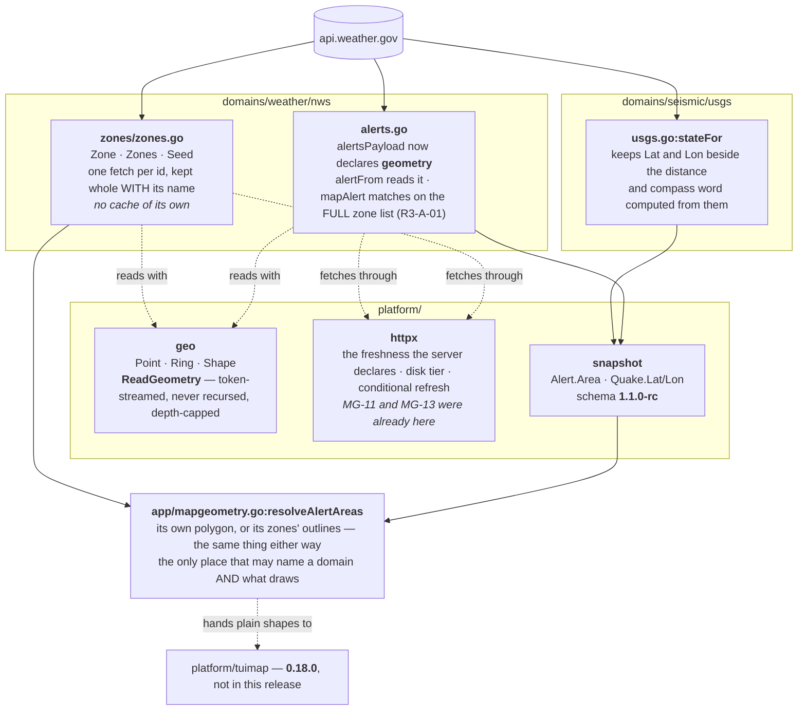
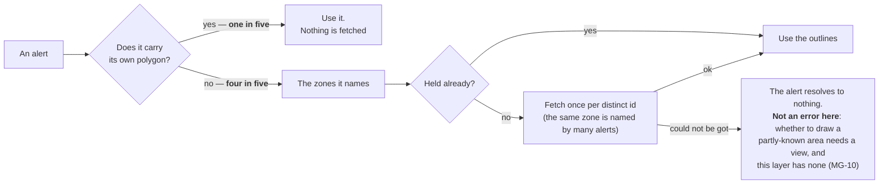

# As built

**This is what 0.17.0 actually does**, drawn from the code rather than from the
plan. Where it differs from [the plan](plan.md), the difference is named.

## The whole of it

## Where an alert's area comes from

## What differs from the plan, and why

| Planned | As built | Why |
|---|---|---|
| `platform/geo` gains Douglas-Peucker; shapes simplified at ingest to 0.5 km | **No simplification anywhere** | The map library rules that hosts pass full detail and it simplifies per zoom; 0.5 km is visible from zoom 10 and it draws to 18. Red-team round 1 (MG-6) |
| The zone store keeps a disk cache, a freshness rule and a revalidation path | **It keeps only parsed shapes** | All three were already in `platform/httpx`. Found while building p3, not while reviewing |
| An alert resolves whole or not at all | **It reports what it has** | Whole-or-nothing is a drawing decision and had been put in the data layer, where there is no view. It also cancelled the seeding ruling. Red-team round 2 (MG-10) |
| Zones fetched concurrently off the pump | **Concurrent, six at a time - and the bound is not the ordering** | Written serially at first (RT-3). Fixed, but the measurement matters more than the fix: the client's own token bucket is five a second, so a forty-two-zone alert takes eight seconds however it is issued. **That is the argument for seeding**, not concurrency |
| Seeding at start-up | **It is called now** | It was approved, built, tested - and nothing called it (RT-2). It passed every test it had and did nothing. The wiring now has a test of its own, because a test of the thing is not a test of the wiring |
| *(not planned)* | **The store forgets** | Nothing bounded what it held; a program that runs for days would keep every zone it ever saw (RT-4) |
| *(not planned)* | **The store counts what it does** | A new path over the network with no counters is invisible when a map is blank (RT-5) |

## What this release does NOT do

- **It draws nothing.** `resolveAlertAreas` is where 0.18.0 begins.
- It does not change how alerts are matched to locations: that is zone-string
  matching, unchanged.
- ~~It does not resolve a zone id to a *county* zone.~~ **It does.** That
  sentence was true about the wrong thing: `/zones/county/<id>` answers 404 for
  a *forecast*-zone id, which is what had been tested, and county zones were
  written off on it. A county id at the county path answers 200. Measured on
  the live service, 47 of 332 active alerts named county zones and nothing
  else, and 45 of those were Flood Warnings - so the hole was a seventh of all
  alerts, on the hazard a map is most wanted for. The kind is read from the
  id's third character now (`zones.pathFor`).

## What the BUILD-exit red team found

Ten findings, eight fixed here. The two that mattered:

**A denial of service in the parser, in the class it was written to prevent.**
The cap counted *positions*; nothing counted *rings*, so a document of two
million empty rings was accepted and held 117 MB while reporting zero vertices.
Depth was bounded and size was bounded; **quantity was not**. Rings are capped
now and a ring with no positions is refused outright - emptiness is not
geometry.

**An approved ruling that did nothing.** Seeding was measured, argued,
approved, built and tested, and never called. The lesson is not "wire it up" -
it is that **a test of a thing is not a test of its wiring**, and only the
second kind would have caught it.

Two smaller ones are worth keeping in view: a ring with no positions is now an
error rather than a silent empty, and the seeding goroutine cannot take the
program down - a panic there would have ended a weather station because a map
shortcut failed.

## The finding the red team got wrong

RT-8 was filed as a minor deferral: *"two overlapping zones would punch a
phantom hole under the even-odd fill."* It was checked before the blind round,
and it is **far larger than that, and needs no overlap at all**.

`overlay.Feature` in the map library documents its rings as "a polygon's outer
ring and its holes" - the first ring is the outline, **every ring after it is a
hole** - and the fill scans only the first ring's vertical extent. `geo.Shape`
was a flat list of rings, so the level saying which rings belong to one area was
discarded at read time, and it cannot be recovered afterwards: an island and a
hole are the same list of positions.

Measured on our own Glacier Bay fixture, which is **thirty-two separate
islands, not one island with thirty-one holes in it**:

| | |
|---|---|
| The ring that would have become "the outline" | a 26-position islet |
| Its share of the zone's height | **1.1%** |
| Areas falling outside its scan band | **28 of 32** - never drawn at all |
| Areas overlapping it | 3 - drawn as holes |

One ordinary Alaskan zone would have rendered as almost nothing. Three reviews
missed it because all three read the producer; it was found by opening the
consumer's source and then measuring a real zone.

**The fix is one type change.** `Shape` is `[]Polygon` and `Polygon` is
`[]Ring`, so the reader keeps the grouping the document already carried and each
area maps one-to-one onto one `Feature`. It closes **RT-7 with it** - the same
root cause wearing a different hat, which made a MultiPoint into one ring
joining unrelated places. And it makes joining several zones *correct* rather
than merely tolerable: the map library fills overlapping polygons separately
(its FR-11), so once areas stay apart the original overlap complaint dissolves
on its own.

`SchemaVersion` stays at `1.1.0-rc`. That version was introduced on this branch
and has never shipped - `main` carries `1.0.0-rc` - so this is a release
candidate being finalised, which is what `-rc` is for, not a published contract
being broken.

**Also closed:** `MaxVertices` is derived now rather than chosen (RT-6) - eighty
zones read live, weighted towards the island chains, median 252 positions and
largest 15,194 - and the pre-code READY verdict is reconstructed from the
branch's own evidence and marked plainly as retroactive (RT-10), at
`07-readiness/build-exit-record.md`.

**Carried, with the evidence that decides them:** `F-171` (the caps are a
sample, not a census) and `F-172` (winding is never read, so an outline is one
only by position). Both are now in `06_docs/follow-ups.md`, which is the record
- all four of these sat only in this page until now, and that is how RT-8 was
nearly lost.
