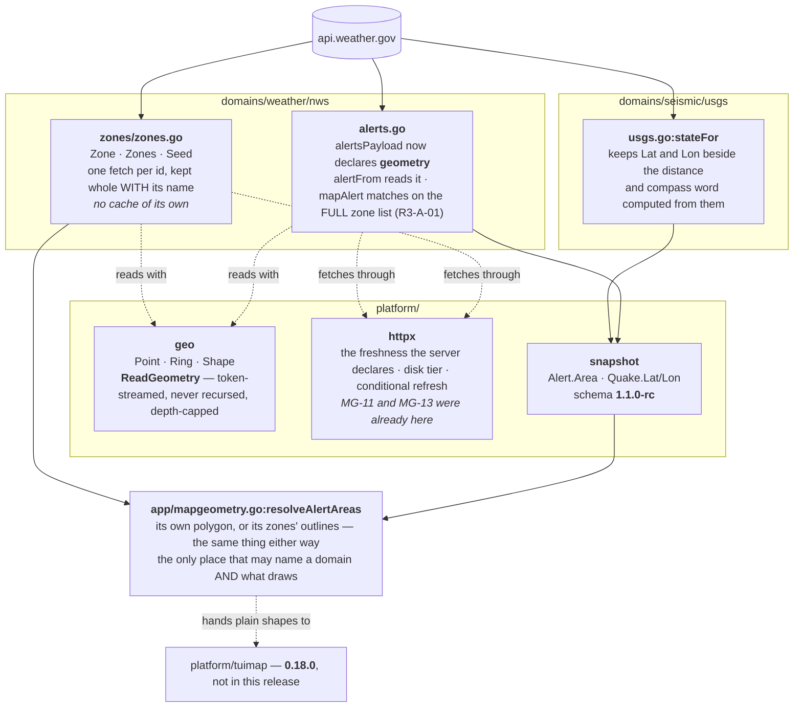
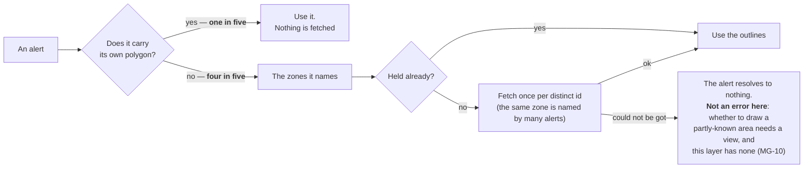

# As built

**This is what 0.17.0 actually does**, drawn from the code rather than from the
plan. Where it differs from [the plan](plan.md), the difference is named.

## The whole of it

## Where an alert's area comes from

## What differs from the plan, and why

| Planned | As built | Why |
|---|---|---|
| `platform/geo` gains Douglas-Peucker; shapes simplified at ingest to 0.5 km | **No simplification anywhere** | The map library rules that hosts pass full detail and it simplifies per zoom; 0.5 km is visible from zoom 10 and it draws to 18. Red-team round 1 (MG-6) |
| The zone store keeps a disk cache, a freshness rule and a revalidation path | **It keeps only parsed shapes** | All three were already in `platform/httpx`. Found while building p3, not while reviewing |
| An alert resolves whole or not at all | **It reports what it has** | Whole-or-nothing is a drawing decision and had been put in the data layer, where there is no view. It also cancelled the seeding ruling. Red-team round 2 (MG-10) |

## What this release does NOT do

- **It draws nothing.** `resolveAlertAreas` is where 0.18.0 begins.
- It does not change how alerts are matched to locations: that is zone-string
  matching, unchanged.
- It does not resolve a zone id to a *county* zone; `/zones/county/<id>` answers
  404 for a forecast-zone id, and county zones carry their own identifiers.
