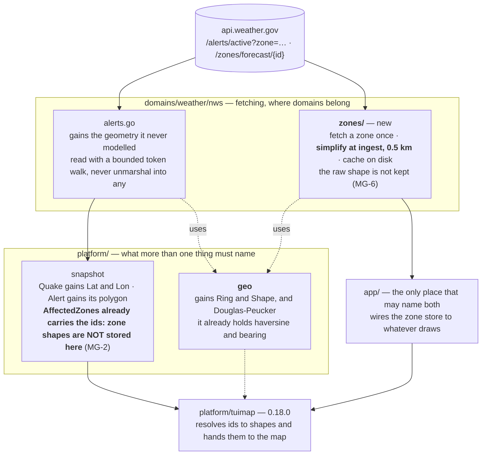

# The plan

Everything here rests on measurements in [the data, measured](../02-analysis/data-shape.md),
and the numbers changed the shape of it twice. Read those before this.

## The shape, and why each piece is where it is

**The import gate decides the placement, not taste.** Neither `modes/` nor
`platform/` may import a domain (`scripts/lint-imports.sh`), and both the map
wrapper and the window must name a shape. So the **type** is in `platform/geo`
and the **fetching** is in a domain, with `app/` the one place that may hold
both (MG-3). Named for the data rather than its first use (MG-4).

## What is built, in order, each with the test that fails first

| # | The change | The test written first |
|---|---|---|
| **1** | `platform/geo` gains `Ring` and `Shape`, and `Simplify` | a known square keeps its corners; a line of collinear points collapses to two; a ring stays closed; simplifying twice changes nothing |
| **2** | `platform/geo.Simplify` holds the measured figures | Glacier Bay's 12,004 vertices become fewer than 1,000 at 0.5 km, and Dallas's 80 become fewer than 20 - from committed fixtures, not the network |
| **3** | A bounded GeoJSON reader in `platform/geo` | a hostile deeply-nested `coordinates` is refused rather than recursed (red-team 0.12.0 P4 F2, the discipline `geoPoint` already follows); a Point, a Polygon and a MultiPolygon each read correctly; an absent geometry answers "none" |
| **4** | `snapshot.Alert` gains its polygon; the per-location fetcher stops discarding it | an alert with a polygon carries it; a zone-only alert carries none and is not an error; the polygon is simplified before it is stored |
| **5** | `snapshot.Quake` gains `Lat` and `Lon`; `stateFor` stops throwing the position away | a quake's position survives into the snapshot; distance and bearing are unchanged, computed from the same numbers |
| **6** | The schema is regenerated and **bumped to 1.1.0-rc** | the published schema matches the generator; every new field has a JSON tag; a real envelope validates |
| **7** | `domains/weather/nws/zones` fetches, simplifies and caches a zone | a zone is fetched once and served from the cache after; a 404 for a bad id is an error, not a panic; the cache survives a restart |
| **8** | The zone store answers a set of ids at once | the median case (one zone) and the tail (forty-two) both answer; the network is asked once per distinct id; an id already held is not refetched |
| **9** | `app/` wires the store | a snapshot's alerts can be resolved to shapes end to end, from fixtures |

**Nothing draws in this release** (objectives). Task 9 ends at the seam the map
window will use in 0.18.0.

## The gates this work must not break

| Gate | What to do about it |
|---|---|
| `lint-imports` | the placement above is chosen to satisfy it; task 1 proves it |
| `alloc-budget` | `TestBoxMemoHitAllocBudget` sits on the USGS memo path task 5 touches. Measure before and after |
| `TestEveryExportedFieldHasJSONTag` | every new snapshot field carries one |
| `TestPublishedSchemaMatchesGenerator` | `make schema` in the same commit as task 6 |
| `declset` | tasks 1, 3 and 7 add top-level declarations; re-capture with `-update-declset` and say why in the build log |
| **UAT 81** - coordinates are never spoken | task 4 adds a field near the narration path. The stripping test (`synth_test.go:255`) must still pass, and a new test says a polygon never reaches spoken text |

## Risks, answered or carried

| | Risk | Answer |
|---|---|---|
| **MG-R1** | an alert naming forty-two zones on a cold cache | **Measured down**: the median alert names one, the 95th names five, and a zone is ~150 ms and cached for good. Fetched concurrently off the pump, never on the draw path. Seeding the whole country stays available - a few megabytes simplified - if this proves wrong |
| **MG-R2** | zone shapes are the large kind | **Answered by measurement**: 0.5 km takes the worst case from 12,004 vertices to 744, and simplification happens at ingest so the large form is never stored (MG-6) |
| **MG-R3** | allocation budgets are gated | task 5 measures the USGS memo path before and after |
| **MG-R4** | coordinates must never be narrated | a test in task 4, named for the rule |
| **MG-R5** | *new* - the raw shape is discarded, so a later need for more detail means refetching | accepted by HUM LEAD with MG-6. Zones are cached by id, so a refetch is a cache rebuild, not a redesign |
