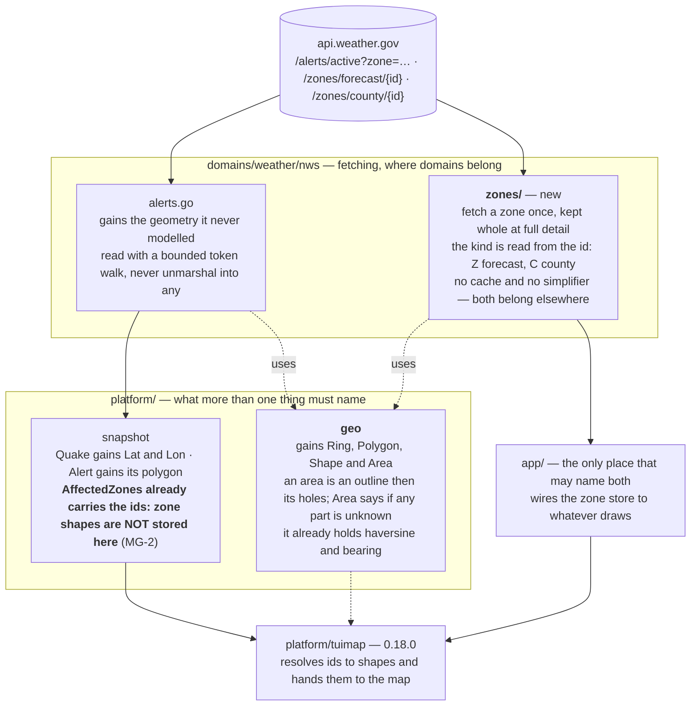

# The plan

Everything here rests on measurements in [the data, measured](../02-analysis/data-shape.md),
and the numbers changed the shape of it twice. Read those before this.

## The shape, and why each piece is where it is

**The import gate decides the placement, not taste.** Neither `modes/` nor
`platform/` may import a domain (`scripts/lint-imports.sh`), and both the map
wrapper and the window must name a shape. So the **type** is in `platform/geo`
and the **fetching** is in a domain, with `app/` the one place that may hold
both (MG-3). Named for the data rather than its first use (MG-4).

## What is built, in order, each with the test that fails first

**Revised after the first red-team.** Two approved rulings did not survive it, and the
revision **deletes** work rather than adding it - see [the revision](#what-the-red-team-changed).

### Phase 1 - the shape, and the reader (p1)

| # | The change | The test written first |
|---|---|---|
| **1.1** | `platform/geo` gains `Ring` and `Shape` - lon/lat pairs, nothing more | a ring stays closed; a shape of several rings keeps their order; the zero value is usable |
| **1.2** | A **bounded** GeoJSON reader in `platform/geo` | a hostile deeply-nested `coordinates` is refused rather than recursed - the discipline `geoPoint` already follows (red-team 0.12.0 P4 F2); Point, Polygon and MultiPolygon each read; an absent geometry answers "none"; a truncated one is an error, not a panic |

**Gate p1:** the reader survives a fuzz target over arbitrary bytes, and
`lint-imports` still passes.

### Phase 2 - the data that already exists and is thrown away (p2)

| # | The change | The test written first |
|---|---|---|
| **2.1** | `snapshot.Alert` gains its polygon; the per-location fetcher stops discarding it | an alert with a polygon carries it at **full detail**; a zone-only alert carries none and is not an error |
| **2.2** | `snapshot.Quake` gains `Lat` and `Lon`; `stateFor` stops throwing the position away | the position survives into the snapshot; distance and bearing are unchanged, computed from the same numbers |
| **2.3** | The schema is regenerated and **bumped to 1.1.0-rc** | the published schema matches the generator; every new field has a JSON tag; a real envelope validates |
| **2.4** | Coordinates stay out of speech | a polygon on an alert never reaches spoken text - the rule UAT 81 already holds for text, now held for the new field |

**Gate p2:** `alloc-budget` measured before and after on the USGS memo path;
`make schema` in the same commit; declset re-captured with its reason.

### Phase 3 - the zone store (p3)

| # | The change | The test written first |
|---|---|---|
| **3.1** | `domains/weather/nws/zones` fetches one zone and keeps it **whole, as numbers** (MG-12) | a zone is fetched once and served from the cache after; its **name is kept beside its shape** (MG-9); a 404 is an error, not a panic; the cache survives a restart |
| **3.2** | The cache honours the service's own freshness | a zone older than its `Cache-Control` max-age is refetched; one inside it is not (MG-11); **a stale zone with no network still answers with what is held** (MG-13) |
| **3.3** | The store answers a set of ids at once | the median case (one zone) and the tail (forty-two) both answer; the network is asked once per distinct id; **the answer says which ids are held and which are not** (MG-10), and the caller is left to decide |
| **3.4** | The user's own zones are seeded at start-up | the zones of every watched location are fetched in the background before any alert needs them; a cold start with no network is not an error |

**Gate p3:** a snapshot's alerts resolve to shapes end to end, from fixtures,
with the network switched off.

### Phase 4 - the seam (p4)

| # | The change | The test written first |
|---|---|---|
| **4.1** | `app/` wires the store to whatever will draw | the wiring is exercised without a map: given a snapshot, the shapes for its alerts can be got |

**Nothing draws in this release.** Phase 4 ends at the seam the map window uses
in 0.18.0.

## What the red-team changed

| | Was | Now |
|---|---|---|
| **MG-6** | simplify at ingest, 0.5 km, keep only the simplified shape | **no simplification at all.** D-16 rules that hosts pass full detail and the library simplifies per zoom; 0.5 km was visible from zoom 10 up, and the map draws to 18. The library's cap is 2,000,000 vertices an overlay - the worst zone measured is 12,004, or 0.6% of it. **This deletes Douglas-Peucker from the plan** |
| **MG-7** | fetch every zone on demand | **seed the user's own zones at start-up**, on demand for the rest. On-demand alone was coldest during severe weather - the one time the map matters |
| **MG-9** | *new* | keep the zone's **name** with its shape. It arrives in the same response and is what a toponymic description will need |
| **MG-10** | *new, then withdrawn in round 2* | **Deferred to 0.18.0.** Whole-or-nothing is a *drawing* decision and it was put in the data layer. A map draws a view, so zones outside it need no shape and "partial" is the ordinary case. It also cancelled MG-7: seeding the user's two zones bought nothing if a forty-two-zone alert drew nothing until all forty-two arrived. **The store reports which ids it holds and which it does not, and the caller decides** |
| **MG-12** | *new, round 2* | Store **parsed coordinates, not the fetched text**. GeoJSON is a wire format: as text the worst zone is 1.4 MB and a country is tens of megabytes; as numbers it is ~192 KB and a few |
| **MG-13** | *new, round 2* | Stale never means discard. A zone past its freshness is refetched **when the network is reachable**, and the held shape is used meanwhile. A weather application is used in bad conditions |
| **MG-11** | *new* | honour the service's own `Cache-Control` - it declares zone geometry good for **4.9 days**, which sets the refresh rule and answers the rate-limit question |

## The gates this work must not break

| Gate | What to do about it |
|---|---|
| `lint-imports` | the placement above is chosen to satisfy it; task 1 proves it |
| `alloc-budget` | `TestBoxMemoHitAllocBudget` sits on the USGS memo path task 5 touches. Measure before and after |
| `TestEveryExportedFieldHasJSONTag` | every new snapshot field carries one |
| `TestPublishedSchemaMatchesGenerator` | `make schema` in the same commit as task 6 |
| `declset` | tasks 1, 3 and 7 add top-level declarations; re-capture with `-update-declset` and say why in the build log |
| **UAT 81** - coordinates are never spoken | task 4 adds a field near the narration path. The stripping test (`synth_test.go:255`) must still pass, and a new test says a polygon never reaches spoken text |

## Risks, answered or carried

| | Risk | Answer |
|---|---|---|
| **MG-R1** | an alert naming forty-two zones on a cold cache | **Measured down**: the median alert names one, the 95th names five, and a zone is ~150 ms and cached for good. Fetched concurrently off the pump, never on the draw path. Seeding the whole country stays available - a few megabytes simplified - if this proves wrong |
| **MG-R2** | zone shapes are the large kind | **Answered by measurement**: 0.5 km takes the worst case from 12,004 vertices to 744, and simplification happens at ingest so the large form is never stored (MG-6) |
| **MG-R3** | allocation budgets are gated | task 5 measures the USGS memo path before and after |
| **MG-R4** | coordinates must never be narrated | a test in task 4, named for the rule |
| **MG-R5** | *new* - the raw shape is discarded, so a later need for more detail means refetching | accepted by HUM LEAD with MG-6. Zones are cached by id, so a refetch is a cache rebuild, not a redesign |
