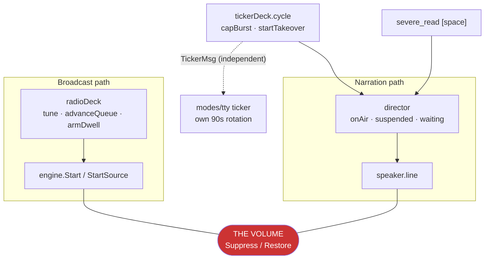
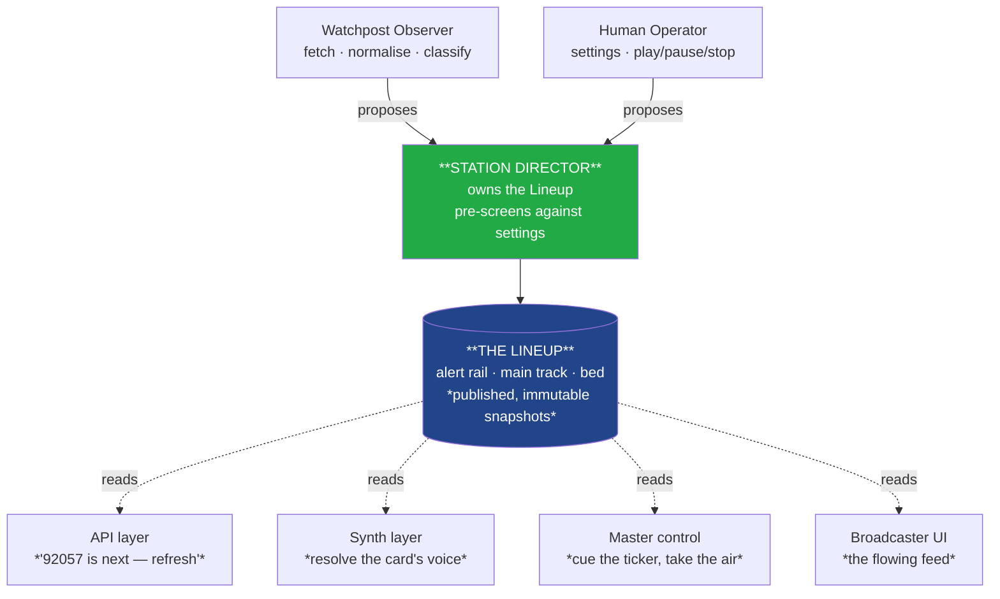
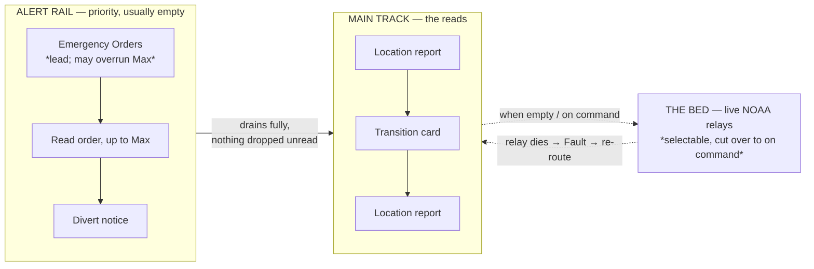
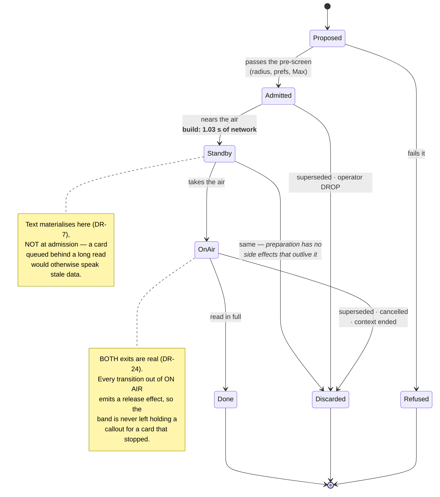
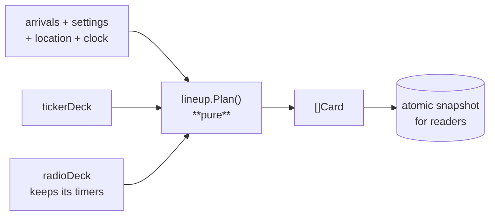
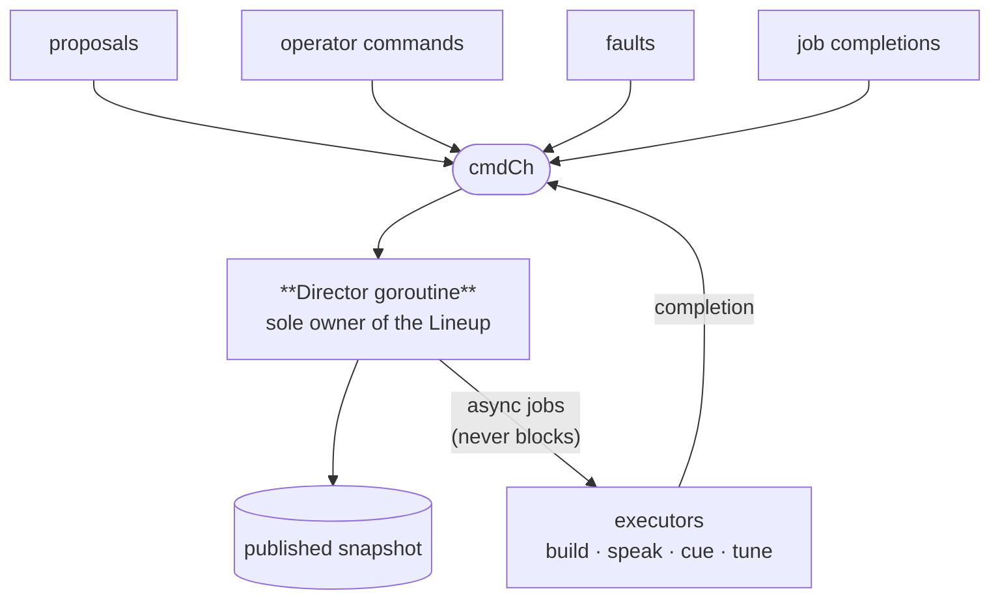
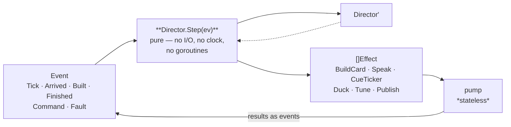
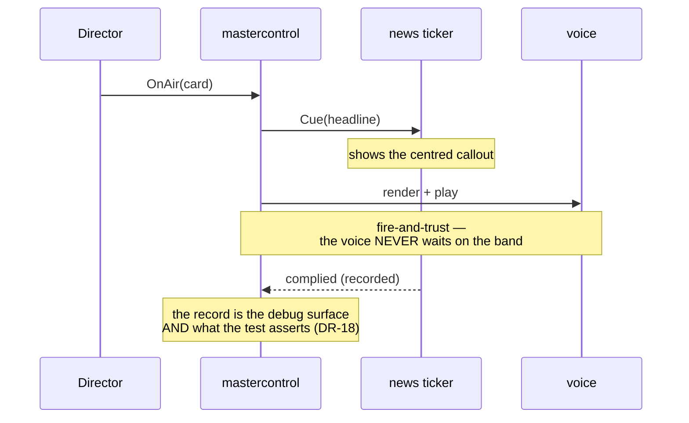

# Architecture — Station Director & the Lineup

> **CORRECTED BY `role-model.md` (MVS-D-77, HUM LEAD 2026-09-04).** Three things below are
> superseded: a burst is **one card**, not one card per alert; the effect set grows to let `Speak`
> carry a script's parts, because the pacing MVS-D-72 ruled has no owner otherwise; and STOP is not
> STANDBY. The five roles — Producer, Composer, Director, Reader, MasterControl — are named there.
> Everything else in this document stands.

**PLAN, 2026-09-01 · SEV-0 · HUM LEAD.** Three approaches, compared against
`01-objectives/director-requirements.md` (DR-1…DR-21) and `02-analysis/director-risks.md`.

> **APPROACH C IS APPROVED — HUM LEAD, 2026-09-01: *"Approved for C."*** The comparison below is kept
> in full, because the rejected options are the record of why C was chosen, and because **A is the
> named retreat** if the build finds C unworkable. **PD-5 is resolved as a consequence** — see *What
> this settles about PD-5*.

## The problem, drawn

Today there are two paths to audio and they meet only at the volume. Neither is a schedule.

The two paths agree about what the listener experiences only because their inputs happen to agree.
A bound in one can silence a hazard the other believes is being read — which is the defect two
red-team rounds each moved rather than removed.

## The target, drawn

The Lineup is a **published read-model**. The Director owns every write; everyone else reads what is
coming and prepares their own half (L-4).

## The three tracks and their precedence

**The guarantee that removes the defect (DR-3):** bounds apply at **admission**. Once a card is on the
rail it is read. `breakingCap` cut mid-burst, which is why whichever hazard sorted last was the one
silenced.

## The card's life

**`OnAir --> Discarded` was added at T1.2**, having been missing from this diagram at PLAN. DR-24
enumerates five exits from the air — read in full, discarded, superseded, cancelled, context ended —
and the last four are one transition. Drawn with only `Done`, a superseded takeover is
unexpressible and the paired release effect has nothing to hang on, which is the very failure DR-24
exists to prevent. The lock (DR-6) is against **edits**, never against this transition: a lock that
could hold a card on the air would wedge the station.

## The measurement that shapes all three (P-1, perf-protocol §6)

| Pass | Wall clock | Network | Cache |
|---|---|---|---|
| **Cold card build** | **1.03 s** (median of 5) | 11 (not parallelisable) | 0 |
| Warm | 1–2 ms | 0 | 8 |

Against §1's ≈0.7 s output buffer, a cold build is **about one and a half times the audible-silence
threshold** — before `tune`'s own requests and before the first render. **Audio look-ahead already
exists** inside a report (`Source.Open`'s one-deep channel; the writer is forbidden to synthesise). So
the thing worth putting on standby is the **card build**, not the speech, and the warm figure shows
standby *removes* the gap rather than relocating it.

**And it cannot simply be made fast.** Issuing the same calls concurrently — only `products` depends on
`office`; the rest are independent — measures a floor of **0.96 s median against 1.03 s sequential**,
with the same 11 requests. The calls funnel through a shared `/points` resolution that serialises
however they are issued, so the build is **not latency-parallelisable** and standby is the remedy
rather than one of two (PL-3).

**Consequence for the architectures:** whoever owns the Lineup must be able to start a one-second
job for the *next* card while the *current* one plays, and must not block while it runs. That single
sentence is what separates the three options below.

---

# Approach A — Pure planner, decks execute

The ordering becomes a pure function. Everything else stays where it is.

**Absorbs:** the read order, the fence, Max, the divert count.
**Instructs:** nothing — the decks call a function and carry on as they are.

| | |
|---|---|
| **Wins** | Smallest possible change. Lowest RD-2 exposure — `armDwell`/`advanceQueue` are untouched. The planner is perfectly testable. Lands the whole read-order ruling set (DR-9…DR-15). |
| **Fails** | **DR-1** — "one writer" is nominal; the decks still decide *when*, which is the half that produced the defect. **DR-3** — no rail object exists; the tracks stay implicit. **DR-7** — nothing owns the 1.03 s pre-build. **NFR-D-1** — the scheduling half still needs timers and goroutines to test. **Broadcaster stays a rewrite**: a plan that is recomputed cannot hold an operator's edit. |

**Honest summary:** this delivers the *read order*, not the *Director*. It is worth naming because it
is the low-risk fallback if PLAN runs into trouble — but it does not satisfy the charter, and MVS-D-56
holds the release for the charter.

---

# Approach B — Actor: a Director goroutine with a command channel

The Lineup is mutated only on the Director's own goroutine. Every executor call is dispatched
asynchronously and reports back as a message, so the 1.03 s card build never stalls the schedule.

| | |
|---|---|
| **Wins** | One writer **by construction**. Absorbs dwell/advance, burst selection and air control cleanly. Operator card editing is just another message, so Broadcaster is additive. The pre-build has an obvious owner. |
| **Costs** | **The deadlock class is real**: any blocking call that creeps into the loop wedges the whole schedule, and this codebase has already needed three mutexes plus an epoch counter to keep `radioDeck` honest (RD-3). Tests must **run the goroutine and synchronise with it** — better than today, but the assertion path still coordinates with a live goroutine, which is exactly what NFR-D-1 asks us to avoid. |

---

# Approach C — A step function and one pump *(recommended)*

`Step` is a **pure function**: it takes the Director and one event, and returns the next Director and
a list of **effects as data**. It performs nothing. A tiny stateless pump runs the effects and feeds
their results back as events.

**This is not a novel architecture here — it is the one the codebase already uses.** bubbletea's
`Update(msg) (Model, Cmd)` is the same shape: state plus message in, state plus *described* work out.

*Claim narrowed after review (PL-13).* The original wording was "a reviewer who knows the UI already
knows this", which does not survive its own test: `Update` lives in `modes/tty` and the Director lives
in `app/`, and `scripts/lint-imports.sh` deliberately keeps those layers apart — so a newcomer to
`app/` may never have opened it. The precedent is real and worth citing, but it is a **pointer to
read** (`modes/tty/dashboard.go`'s `Update`), not prior knowledge to assume.

### The effect set is closed and enumerated (PL-6)

The effect vocabulary **is** the architecture's interface, so it is named here rather than discovered
during BUILD — "adapters over existing code" is otherwise unbounded work hidden in a short sentence.

| Effect | Executor today | Result event |
|---|---|---|
| `BuildCard{id}` | `radioDeck.segments()` | `Built{id, text}` / `Fault` |
| `Speak{clip}` | the existing render + play | `Finished{id}` / `Fault` |
| `CueTicker{item}` | `tty.TickerBreakingMsg` | recorded, not awaited (DR-18) |
| `ReleaseTicker{}` | `tty.TickerBreakingDoneMsg` | **paired with the cue — DR-24** |
| `Duck{}` / `Restore{}` | `mastercontrol` over `engine.Suppress`/`Restore` | — |
| `Tune{ref}` | `radioDeck.tune` | `Playing` / `Fault` |
| `Publish{lineup}` | the snapshot readers subscribe to | — |

**The set is closed**: adding an effect is a deliberate change to this table and to `Step`'s output
type, not an incidental new call site. That is what keeps the Director a coordinator rather than a
thing that quietly grows the ability to do work itself.

| | |
|---|---|
| **Wins** | **NFR-D-1 is satisfied by construction.** A test feeds a sequence of events and asserts the effect list — no goroutines, no sleeps, no clock plumbing, nothing to synchronise. This is the property three previous attempts could not get, and the reason every fixture written against the old design was vacuous. **DR-20 is free**: the clock is an event (`Tick{now}`), so determinism is structural rather than a seam bolted on. **The deadlock class does not exist** — `Step` cannot block, because it cannot perform. **One writer by construction** — only the pump calls `Step`. The 1.03 s build is an `Effect` the pump runs off the `Step` path. Operator edits are events; Broadcaster is additive. |
| **Costs** | Every interaction must be modelled as an event/effect pair — real design work up front, and failure results need explicit events rather than error returns. A naive `Step` would be one enormous switch and would breach **P10-04** (≤60 lines / ≤40 statements), so it must decompose into per-event handlers from the first commit rather than after the gate complains. |

## How much each approach absorbs

| Owner today | A | B | C |
|---|---|---|---|
| `armDwell` · `advanceQueue` | stays | absorbed | absorbed (`Tick` → `Advance`) |
| `capBurst` · `startTakeover` | ordering only | absorbed | absorbed |
| `director` (the arbiter) | stays | absorbed | **decision half absorbed; effector half stays** |
| ticker rotation | stays | instructed | instructed (`CueTicker`) |
| `tune` · fallback | stays | instructed + `Fault` | instructed + `Fault` |
| `Composer` · `script` · `pronounce` | stays | stays | stays |
| `severe.Classify` · `globalfeed.Merge` | stays | stays | stays |

## What this settles about PD-5 (the rename)

**The concurrency choice answers it, which is why it was right to hold.**

Under **A**, the arbiter is untouched, so `director` → `mastercontrol` is a standalone rename and a
pure RD-8 risk with no structural payoff.

Under **B** and **C**, `app/director.go` **splits rather than moves**. Its *decision* half — who gets
the air, what suspends what — becomes state inside the Director's step, where it is testable as data.
Its *effector* half — `duck`, `pause`, `resume`, `discard`, `restore`, plus the new ticker cue — is
what remains, and that is the thing the HUM LEAD's condition asked for: *a system directly responsible
for ensuring the radio output and the news ticker are properly synced for takeover events.*

**So the recommendation is not a rename.** It is: `app/director.go` dissolves; the name **`Director`**
goes to the coordinator that owns the Lineup; and the surviving effector becomes **`mastercontrol`**,
whose job is to put one card on the air across both outputs at once. Nothing is renamed for the sake
of it, and the entity the condition demanded exists by name.

## The cue, drawn

## Recommendation

**Approach C.** The deciding reason is not elegance — it is that **C is the only one where the
requirement "a test states the arrangement it wants and asserts what is read" is true by
construction.** Two red-team rounds and roughly thirty remediation defects on this exact code all
share one root: there was no artifact to assert against, only behaviour to observe through timers and
goroutines. A pure `Step` produces the artifact. B improves the ownership but keeps the assertion
path coupled to a running goroutine; A does not address the scheduling half at all.

The secondary reasons: it removes the deadlock class rather than managing it (RD-3, the highest open
risk), it makes DR-20's determinism structural instead of a seam, and it is already the codebase's
own idiom, so it is a familiar shape rather than a new one for whoever reviews it.

**The cost I would accept knowingly:** more up-front modelling, and a discipline — `Step` decomposes
into per-event handlers from the first commit, not after P10-04 fails.

**If C is rejected**, B is the fallback and delivers the charter; A does not, and should be
considered only as a retreat if PLAN finds C unworkable.
