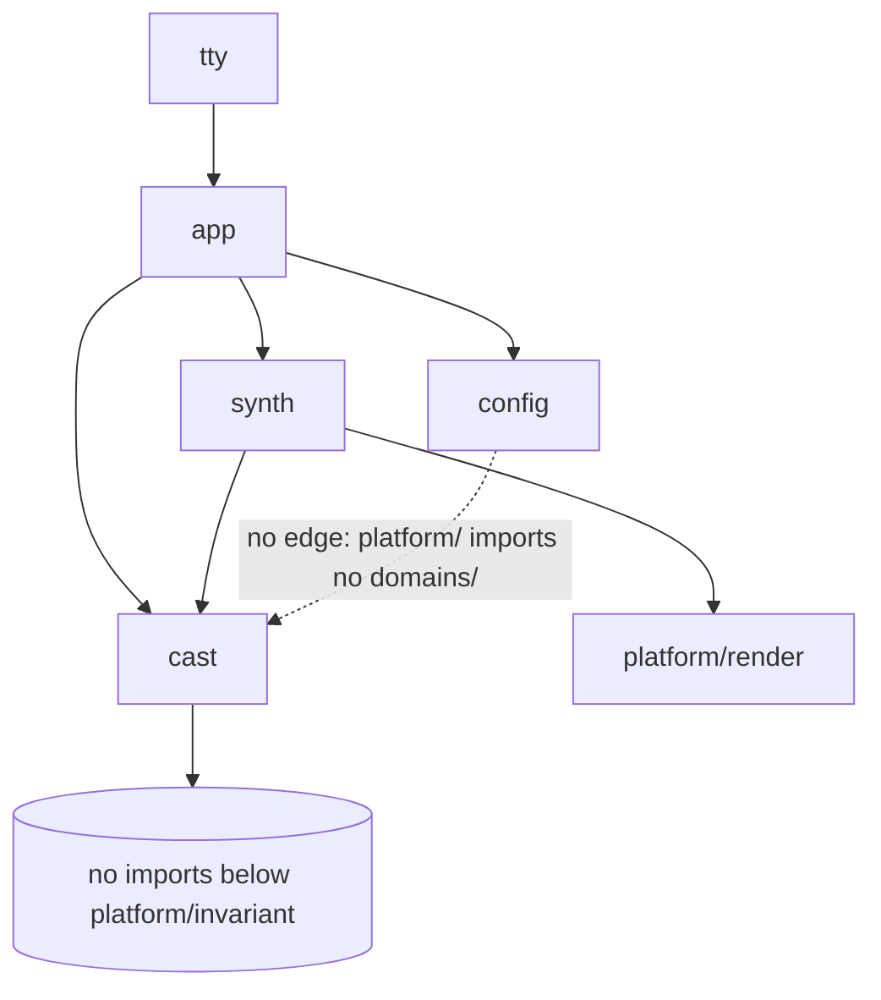

# Multi-Voice Support — PLAN (architecture & design)

**Feature:** `multi-voice-support` · **Target:** 0.14.0 · **Phase:** PLAN (FULL PLAN · FULL DIAGRAMS · FULL TDD)
**Status:** AX-1…8 RATIFIED (HUM LEAD 2026-08-29, MVS-D-23; RAT-4 OK). Both mocks received (§5). Edited in place; rulings applied through MVS-D-28; red-team rounds 1–3 remediated (`08-reports/red-team-plan.md` §12–§13; D-R2-1..5, D-R3-1..3) — AX-1's resident backend is cut from 0.14.0 pending the HUM LEAD's confirmation at this gate.

## In plain words (for the Designer and the PM)

- **What the listener gets.** Every alert opens with a tone that says which kind of alert it is (five sounds
  for six classes: disasters and warnings share the loudest); the station can have a *cast* — one voice for
  alerts, one for the reports, and, if you like, a different correspondent for the local weather, the sea, the
  fires or the quakes — and the correspondents hand over to each other by name; coastal listeners get a
  maritime report (the coastal forecast, the buoy, the tides and currents) between the forecast and the fire
  report.
- **What changes on screen.** Setup gains two groups — ALERTS - TONE (keep every tone, or mute the classes you
  choose) and WATCHPOST RADIO - CORRESPONDENTS (Single Voice, or Correspondent Cast with its pickers and a
  `p` preview); `[V]` and `[T]` leave the Radio panel, `V` opens Setup at the correspondents, and the panel
  takes one of three fixed layouts by width; `[S]` shows who speaks for whom and why; `[M]` mutes the tones
  only — the words always read.
- **What stays the same.** A fresh install keeps one voice, as 0.13.0; what is new to the ear is the tone by
  class before a takeover — and a tone before a severe read, which had none; the radio's sacred rule (R6: the
  broadcast never stalls) is guarded by a cap on how many voices render at once and by rendering every
  hand-over ahead of the air.

**Glossary.** *Cast* — the assignment of voices to roles, with inheritance (a role without a voice uses its
parent's). *Role* — a slot in the cast tree (Alerts, Standard, Weather, Maritime, Fire, Seismic, Station…).
*Resolution* — which voice a role actually gets, and why (the link followed, the fallback taken).
*Station Director* — the arbiter that decides what is on the air (a takeover, a read, a preview) and ducks the
broadcast for it. *Source* — the broadcast's stream of segments rendered ahead into audio. *Hand-over* — the
line an incoming correspondent speaks when the voice changes. *Class* — an alert's tone class (disaster ·
warning · watch · advisory · statement · storm). *Limiter* — the cap on concurrent renders. *Preset* — one tone's
parameters. Code names in the batch files (`P10-nn`, `UAT nn`, `RS-n`, `FR-n`) are explained in
`04-development/implementation-plan.md` §Legend.
**Inputs:** `01-objectives/objectives.md` v1.2.0 (FR-1..14, NFR-1..8), `02-analysis/data-shape.md`,
`02-analysis/{voice-architecture, maritime-report, piper-and-platform, tones, risk-register}.md`,
`07-readiness/perf-protocol.md`, `08-reports/discover-report.md`. Decisions continue the `MVS-D-n` namespace.

## 0. Measurements owed before the design is pinned (perf-protocol.md)

| # | Measure | When | Owner |
|---|---|---|---|
| 0.1 | 0.13.0 time-to-tone-start (`perf-protocol.md` §1), macOS | **PLAN batch 0** (BUILD Task 0.1) | agent |
| 0.2 | Setup-open frame allocations at 80×24 and 133×44 on `main@186d97c` (the "before" for the new pin) | BUILD Task 0.2 | agent |
| 0.3 | Resident-Piper RSS and the B-5 checklist (`perf-protocol.md` §3) | UAT, Arch box (MVS-D-17) | HUM LEAD |

0.3 is 0.15.0's DISCOVER input: the resident backend is cut from 0.14.0 (E-1); the seam it needs (`synth.Voice`,
`buildVoice`) already exists.

## 1. Approaches (PLAN Step 2) — for ratification

| Axis | Options | Recommendation |
|---|---|---|
| AX-1 Piper backend | (A) process-per-utterance + the FR-12 cap · (B) a resident `piper` per assigned voice · (C) hybrid: resident for the *alert-role* voice only | **build the seam for all three; ship (A) as the 0.14.0 default with (C) switchable by a config knob once 0.3 admits it** — *red-team round 1 (four lenses): the seam is `synth.Voice` + `buildVoice`, which already exist; the resident code and the `piper_mode` knob are cut from 0.14.0 and return with 0.3's measured policy (pending HUM LEAD confirmation at the PLAN exit)* |
| AX-2 where role resolution lives | (A) `radioDeck.voiceFor(role)` in `app` · (B) a new `domains/radio/cast` package (pure: registry, inheritance, resolution over a host-facts interface; `app` supplies the facts) | **B** |
| AX-3 the hand-over | (A) Source-time, one injected script-tree line as a single `Say` (ruled by red-team B-3) · (B) compose-time segments (superseded) | **A** (already ruled) |
| AX-4 the cap | (A) a `synth.Limiter` decorator around any `Voice` (`Limited(v, lim)`), one owner in `synth`, reserved slots taken by a context value the Station Director sets (the rule of record is FR-12 / §1.3) · (B) a semaphore in `radioDeck` around every call site | **A** |
| AX-5 the tones | (A) `tone.go` generalised to five parameterised presets (`Preset{Freqs, Pulses, PulseDur, Gap, Sweep, Decay, Amp}`) generated at first use and memoised per rate · (B) embedded WAVs | **A** |
| AX-6 the Setup form | (A) collapsing groups inside Setup with focus-following scroll (the ruled "merge into Setup") · (B) a Correspondents sub-window opened from Setup · (C) inline per-role picker rows without collapsing | **A** — subject to the HUM LEAD's mock |
| AX-7 the CWF marine zone | (A) nearest zone polygon among the product's own UGCs (geometry fetched once per zone, 24 h TTL) · (B) the first "out to 10 nm" block after the synopsis, by header text | **A with B as the fallback when geometry is unavailable** |
| AX-8 per-section voices in one Source | (A) `Segment.Role` + `resolve(role)` injected into `Source`, voice in the cache key, `renderedSeg.voice`, a resolution generation · (B) one `Source` per role, chained by the deck | **A** |

### 1.1 AX-1 — the Piper backend, evaluated

| Criterion | (A) per-utterance + cap | (B) resident per voice | (C) hybrid (alert voice resident) |
|---|---|---|---|
| Latency per line (Linux) | ~10 s model load every line (today) | ~0.5–1 s after a one-time ~10 s warm-up | alerts ~1 s; reports ~10 s |
| Takeover under the default one-voice config | its own process, in parallel — **not worse than 0.13.0** | **queues behind the in-flight segment on the same process** (red-team B-2) unless the alert voice gets its own process | the alert voice has its own process by construction — not worse |
| Peak RSS | transient: N × (model + arena) only while rendering; bounded by the cap | N resident × (model + arena) permanently — **unmeasured** (0.3) | 1 resident + transients |
| Failure surface | none new | crash detection, restart, idle reaper, cancel = kill-and-respawn, a shutdown owner (RS-23) | the same, for one process |
| Cancel | `CommandContext` kills at once | kill-and-respawn (~10 s to be useful again) | as (B) for the alert voice only |
| Code | the `Limiter` only | a `ResidentPiper` type behind `synth.Voice` (+ ~250 lines, tests with a fake process) | (B)'s type + a policy line |
| Disk | unchanged | unchanged | unchanged |
| Ships in 0.14.0 without the Arch measurement | **yes** | no (RS-6/RS-23 open) | no |

**Recommendation (as remediated).** 0.14.0 ships (A) — process-per-utterance under FR-12's cap. The
`synth.Voice` interface (`voice.go:21-25`) and `buildVoice` (P2 Task 2.7) are the seam a resident backend
plugs into; no resident code and no `piper_mode` key ship in 0.14.0 (P2 Task 2.11 records the cut; E-1 asks
the HUM LEAD to confirm it). The HUM LEAD's measurement 0.3 decides 0.15.0's policy — (B) or (C) — and the
knob returns with it.

### 1.2 AX-2 — where resolution lives, evaluated

| Criterion | (A) `radioDeck.voiceFor` | (B) `domains/radio/cast` |
|---|---|---|
| Testability | through the deck (needs an engine fake) | pure: `cast.Resolve(role, cfg, host)` with a table-driven host fake — the M5 matrix is one test file |
| Reuse | the deck only | the diagnostic dump (`report --verbose`), Setup's picker (installed notes), the `[S]` cast table — all read `cast.Resolution` |
| Single owner | the deck already owns install + `voice()`; adding the walk grows it past its length budget (P10-04) | one package owns registry + inheritance + resolution; the deck keeps *host facts* (`Discovered()`, `Installed(key)`) |
| Seam rule | domain logic in `app` | domain logic in a domain package; `app` maps config → `cast.Config` and supplies `cast.Host` |

**Recommendation: (B).** `cast` is ~150 lines + the matrix test; `app` shrinks.

### 1.3 AX-4 — the cap, evaluated

(A) `synth.Limited(v Voice, l *Limiter) Voice` wraps `Say` only — exactly what FR-12 asks, one owner, no
call-site audit; N = 2 ordinary slots on Linux/Windows (a Piper render is a ~63 MB model load) and 3 on macOS
(`say` ≈ 1 s a line) + **2 reserved for the Station Director** — the perf protocol's soak may lower N, never
raise it; a reserved slot is taken when `ctx` carries `synth.Priority(ctx)`, which the Director sets for
**every job it runs** (a takeover, a read), so a line the listener is waiting for never queues behind the
broadcast's render-ahead; two slots because a takeover is admitted while the read it suspended may still hold
one for its in-flight render (round-3 red-team: with one slot the takeover fell through to the ordinary pool);
every `Say`
carries one bound (`DefaultBound = 90 s`, the slot wait included) inside the same decorator — the only timeout
on a render. (B) would need every `Say` caller in `app` to remember the semaphore
and could not see the Source's internal renders. **(A).**

### 1.4 AX-8 — per-section voices, evaluated

(B) one Source per role would give each section its own render loop and cache — but the engine's
`StartSource` halts the previous stream (`engine.go:394-395`), so chaining Sources means a re-arm per section
boundary (a gap) and a stream name per section. (A) keeps one stream, one look-ahead, and puts the voice in
the cache key; the hand-over is a Source-time line. **(A).**

## 2. Selected architecture

### 2.1 Components

| Component | Package / file | Responsibility |
|---|---|---|
| **Cast** (new) | `domains/radio/cast` (files: the implementation plan's map) | the role registry (`Role` enum, `Parent(role)`, `Assignable()`, `Key()`), `Config` (the typed pairs + mode + tones), `Host` interface (`Platform()`, `Discovered() []string` — a closed allowlist at every moment, `Installed(key) bool`), `Resolve(role) Resolution` (+ `WantsInstall`), `Validate(cfg, host)` (the class keys' one validator; the app lists its problems in `[S]`); the tone classifier (`Classify(product) Class`), `ToneName(class) string` — a *name*, since `cast` cannot import `synth`; `synth.PresetByName` turns it into the preset — and `Muted(class, tones)` |
| **Limiter** (new) | `domains/radio/synth/limit.go` | `Limiter{ordinary, reserved}`; `Limited(v, l) Voice`; `WithPriority(ctx)`; per-`Say` bound |
| **Presets** | `domains/radio/synth/tone.go` (generalised) | `Preset` struct, the five ratified presets, `AlertTone(preset, rate)`; the classic preset is the zero value |
| **Source** (extended) | `domains/radio/synth/source.go` | `Segment.Role`; `SetResolver`; a voice-keyed, byte-bounded cache; `renderedSeg` resolved once with its hand-over rendered ahead (`renderHandoff`, cached per from → to); soft/hard resolution generations (`Invalidate` at the next segment, `Recast` at the spot reached); the hand-over line via `SetHandoff(func(from, to string) string)` |
| **Reports struct** | `domains/radio/synth/compose.go` | `Compose(loc, products, now, imperial, station, Reports{Fire, Seismic, Maritime})` — replaces the 8 positional params |
| **Maritime** (new) | `domains/radio/synth/marine.go`, `scripts/maritime-report/*.txt`, `platform/snapshot/assembler.go` (`MarineFor`), `app/marine.go`, `domains/weather/nws/marinezone.go` (new: the zone resolver + geometry cache) | `MarineReport{Known, State, TZ, Lat, Lon, Forecast string}`; `MarineSegments`; the CWF via `Products` + `FilterUGC` |
| **Station Director** (renamed) | `app/director.go` (from `narrate.go`) | the arbiter, unchanged in protocol; `Run(ctx, class, role, audible, seq)`; owns the duck for previews too |
| **Deck** | `app/radio.go`, `app/voices.go` | `Host` facts; `resolveVoice(role)` = `cast.Resolve` + construction; find-only; background `ensureRoleVoices`; the tone's constant rate; previews on the app ctx |
| **Config** | `platform/config/config.go` | `Radio.Cast` (single voice vs the cast, MVS-D-25), `Radio.Voices` (nine `RoleVoice` pairs), `Radio.Tones{Mode, Muted}` (the per-class mute, MVS-D-26); `Radio.Validate()`; save preserves unknown keys |
| **Setup** | `modes/tty` (files: the implementation plan's map) | the row table; the Correspondents and Tones groups (two columns like Help, the body built once, focus-following scroll, pinned chips), pickers, previews, notes |
| **Radio UI** | `modes/tty` (the theme chooser moves whole to `modal_theme.go`; the voice chooser is deleted) | the panel per breakpoint from the mock (no voice name — MVS-D-24); the `voice` action → Setup deep-link |
| **Diagnostics** | `app/stats.go`, `app/dump.go` | the cast table (role → requested → spoken → link) beside `disk.voices`; unknown config keys |

### 2.2 The `cast` package (AX-2)

```go
package cast

type Role int
const (
    All Role = iota; Alerts; Breaking; SevereRead; Standard; Weather; Maritime; Fire; Seismic; Station; roles
)
func (r Role) Parent() Role  // Breaking→Alerts→All; Weather…Station→Standard→All; All→All

type Pair struct{ MacOS, Piper string }          // "" = inherit
type Config struct {
    Root  string                                   // config `voice`
    Pairs map[Role]Pair                            // from the nine typed fields (app maps the struct → map once)
    CastMode string                                // "" single voice | "cast" (MVS-D-25)
    Tones Tones                                    // Tones{Mode, Muted}: the per-class mute (MVS-D-26)
}
type Host interface {
    Platform() string            // "darwin" | "linux" | "windows"
    Discovered() []string        // macOS say names: the curated list until `say -v ?` answers, the intersection after — never nil
    Installed(key string) bool   // Piper: os.Stat both files
}
type Link int                                     // LinkRole · LinkGroup · LinkRoot · LinkDefault
type Resolution struct {
    Role Role; Requested, Spoken string; Link Link; Reason string
}
func Resolve(role Role, cfg Config, host Host) Resolution   // the walk: role → parent → root → default
func Validate(cfg Config, host Host) []Problem              // key-level messages
```

`Resolve` reads only this host's half of each pair; a name is *resolvable* when it is on the host's list (a
closed allowlist at every moment — D-R2-2 deleted the "trust while discovering" window), or the sentinel, or
`Installed(key)`; the first resolvable link wins and
`Reason` says why the requested one lost. `Spoken` is the only string that ever reaches a `Voice` or `[S]`
(RS-18). Nothing in `cast` imports `synth`, `config` or `tty`.

### 2.3 The Source under roles (AX-8)

- `Segment{Key, Text, Pause, Role cast.Role}`; `Compose` tags each section (lead/tail → `Station`,
  conditions/alerts/products → `Weather`, the three reports → their role).
- The Source keeps a resolver (`SetResolver`) and two generations: a *soft* one (`Invalidate` — a host fact
  changed: the next segment re-resolves; the one already rendered plays as it is, never a writer render) and a
  *hard* one (`Recast` — the listener's Setup save: the running segment hands over at the spot reached, the one
  render the writer waits for). `render` resolves a segment's voice ONCE and returns `renderedSeg{seg, pcm,
  voice Voice, spoken, gen, line, handoff}`; the cache is keyed `voiceName + "\x00" + key` and bounded in bytes.
- **Hand-over:** `renderLoop` sees the voice change between two segments and renders the scripted line
  **ahead of the air** (`renderHandoff`, cached per (from → to, line) under the incoming voice; the ≤ 72 lines a
  cast can need are pre-warmed at `SetResolver`); `play` only writes it. A line that could not render is
  reported and the segment plays. The mid-segment Recast folds the line and the remainder into one `Say`
  (FR-12), non-fatal. `{{voice}}` resolves from the segment's voice for both audio and marquee (one function).
  The batch of record is P2 Tasks 2.2–2.3; this section does not restate their code.
- `Rate()` stays the stream's rate (22 050); a new-rate catalogue voice arrives with a resampling decorator
  (backlog — no rate rule in `Validate`).

### 2.4 The narration seam and the Station Director

`director.Run(ctx, class, role cast.Role, audible bool, seq int)`; `narrationJob.role`; `speaker.attention(class)`
plays `synth.AlertTone(synth.PresetByName(cast.ToneName(class)), synth.ToneRate)` (no memo: ~1 ms) — nothing when `cast.Muted(class, tones)` — where `class = cast.Classify(product)` and the
product is the highest-severity event's (breaking) or the row's (severe read); `speaker.line` renders through
`deck.render(ctx, role, text)` = `resolveVoice(role)` → `Limited(v)` → `AlertNarration`. `ToneRate = 22050`
is a constant; the tone never resolves a voice. A Setup preview calls `director.Duck(ctx)`/`Restore()` around
`Audition`. Every Director job runs its `Say` under `synth.WithPriority(ctx)` (the reserved slot — §1.3).

### 2.5 The tones (AX-5)

The five presets' parameters are the contract in `02-analysis/tones.md` §1 and the code in
`04-development/p3-maritime-tones.md` Task 3.6 (`Presets()`, `PresetByName`, `AlertTone(p, rate)`, all functions —
no package state); this section does not repeat them. The six classes and the classifier **rule of record are
`02-analysis/tones.md` §1–2** (`cast.Classes()`: disaster · warning · watch · advisory · statement · storm;
storm > statement > advisory > watch > warning-default; the ticker maps `ClassQuake` → disaster and
`ClassTropical` → storm before classifying); `data-shape.md` §4b carries the keys and points there. `cast.ToneName(class)` names the preset (disaster and warning share
the dual-tone); `cast.Muted(class, tones)` is the per-class mute (MVS-D-26; the share switch of MVS-D-9 is
dropped).

### 2.6 The maritime report (FR-6)

`MarineReport{Known bool; State snapshot.Marine; TZ *time.Location; Lat, Lon float64; Forecast string}` —
`Forecast` is the CWF cut to the synopsis + nearest nearshore zone by `FilterUGC(text, zone, synopsisZone)` and
capped to the first three periods (`SpokenPeriodsCap = 3` — RAT-6, E-7 pending). `MarineSegments` order: head (2 s) · forecast ·
observed · sea+swell (one sentence) · water · wind · tide · tide-next · current · absence · link. Script parts as
`maritime-report.md` §8; wording per MVS-D-21 ("above the low-water mark", 12-hour clock in the location's
zone, wind in the listener's unit, currents in knots, "minus" for negative heights). `seaState`/`tideTrend`
lift to `platform/render/marine.go` so the screen and the voice share them. Zone resolution
(`nws.MarineZoneFor(ctx, codes, lat, lon)`, the codes from `synth.UGCCodes` in document order): `/zones/coastal/<id>`
geometry (24 h TTL; ≤ 32 zones and a 20 s budget per call; centroids memoised on the Provider) → nearest
polygon by centroid distance → fallback AX-7 (B), the first nearshore block after the synopsis (E-8 asks whether
(B) alone should ship).

### 2.7 Setup and the Radio UI (AX-6; the mocks decide)

Setup follows `02-analysis/mocks/setup.md` (MVS-D-10/25/26/27/28): two column groups by the Help modal's rule,
a scroll rail with the focused row always on screen (RS-19); the WATCHPOST RADIO - CORRESPONDENTS group
(Single Voice with one picker, or Correspondent Cast with the Alerts / Takeovers and All Reports pickers and
four optional per-report overrides — a mode that keeps assignments when switched back); the ALERTS - TONE
group (All Tones On / Mute: + a checkbox per class; `[M]` flips the mode, tones only); a `p  Preview` chip
while a picker is focused. The Radio panel follows `02-analysis/mocks/radio-panel.md` (MVS-D-23/24): both
`[V]` and `[T]` retire, a standard vertical size per breakpoint (8 · 6 · 5 rows), the header with the volume
bar, the inner box with the visualizer (wide 3 rows, medium 1, narrow none — the `v` control follows it) and
the marquee, and no voice name. The tasks: `04-development/p4-ui.md`.

## 3. Diagrams (FULL DIAGRAMS — Mermaid; FigJam skipped by rule)

### 3.1 Architecture

```mermaid
flowchart LR
  subgraph config[platform/config]
    C[Radio.Cast · Voices pairs · Tones mute]
  end
  subgraph cast[domains/radio/cast]
    R[Registry + inheritance]
    RES[Resolve → Resolution]
    CL[Classify → Class · ToneName · Muted]
  end
  subgraph synth[domains/radio/synth]
    LIM[Limiter · Limited(Voice)]
    SRC[Source: Segment.Role · voice-keyed cache · hand-over]
    TON[Presets · AlertTone]
    MAR[MarineSegments]
    COMP[Compose(Reports{})]
  end
  subgraph app
    DECK[radioDeck: Host facts · resolveVoice · ensureRoleVoices]
    DIR[Station Director: Run(class, role) · duck]
    TICK[tickerDeck breaking]
    READ[eventReader]
    MARF[marineFor]
  end
  subgraph tty[modes/tty]
    SET[Setup: Correspondents group]
    PANEL[Radio panel per breakpoint]
    STATS["[S] cast table"]
  end
  C --> R --> RES --> DECK
  CL --> DIR
  DECK --> LIM --> SRC
  COMP --> SRC
  MAR --> COMP
  MARF --> COMP
  TON --> DIR
  TICK --> DIR
  READ --> DIR
  DIR --> DECK
  SET --> C
  SRC -->|onSeg| PANEL
  RES --> STATS
```

### 3.2 Component relationships (who may import whom)



`platform/config` validates the *shape* of the `[radio]` tables (mode, cast, tones.mode) and never the class
keys — those are `cast.Validate`'s at `castConfig` time in `app` (one owner, no mirror). `modes/tty` reaches the
cast only as strings through `app` (`CastView`, `ToneClass`, `CastRow`).

### 3.3 Data flow — one broadcast with two correspondents

```mermaid
sequenceDiagram
  participant D as radioDeck
  participant S as Source
  participant Cst as cast.Resolve
  participant V as Limited(Voice)
  participant E as Engine
  D->>S: Compose(Reports{Fire, Seismic, Maritime}) → segments tagged by Role; SetResolver(resolveVoice)
  S->>Cst: resolve(Weather) → Samantha
  S->>V: Say(conditions) [ordinary slot]
  V-->>S: pcm (cache key Samantha\0conditions)
  S->>E: write
  S->>Cst: resolve(Maritime) → Rishi
  Note over S: voice differs from lastSpoken → hand-over
  S->>V: Say("This is Rishi, taking over for Samantha.") in Rishi (rendered ahead, cached per from → to)
  S->>V: Say(maritime head)
  S->>E: write · marquee "{{voice}}"=Rishi
```

### 3.4 Data flow — a breaking takeover under roles

```mermaid
sequenceDiagram
  participant T as tickerDeck
  participant Dir as Station Director
  participant Cst as cast
  participant Dk as radioDeck
  participant L as Limiter
  T->>Dir: Run(narrateBreaking, Breaking, events)
  Dir->>Dir: admit → duck · suspend a read
  Dir->>Cst: Classify(highest-severity product) → warning; ToneName → dual-tone; Muted? no
  Dir->>Dk: tone(DualTone) [rate constant, no resolve]
  Dir->>Dk: render(ctx+priority, Breaking, line)
  Dk->>Cst: Resolve(Breaking) → Rishi (Link=group Alerts)
  Dk->>L: Say under the reserved slot
  Dir->>Dir: settle → resume the read
```

### 3.5 Setup state

```mermaid
stateDiagram-v2
  [*] --> Form
  Form --> Picker: focus on a voice row
  Picker --> Picker: ←/→ cycles the host's voices
  Picker --> Previewing: p (Audition, ducked by the Station Director)
  Previewing --> Picker: done / esc
  Picker --> Installing: a Piper voice not on this host (the first p offers the download, the second proceeds; or Save)
  Installing --> Picker: progress line → done
  Form --> ToneRow: focus on All Tones On / Mute: / a class
  ToneRow --> ToneRow: space toggles
  Form --> [*]: enter on the last question (save → SetTones → SetCast → Commit)
  Form --> [*]: esc (cancel)
```



## 4. Batches (the implementation plan's spine — `04-development/implementation-plan.md`)

| Batch | Scope | Gate |
|---|---|---|
| P0 | measurements 0.1–0.2 | numbers recorded in `perf-protocol.md` |
| P1 | `synth.Limiter` + bounded `Say`; `Reports{}` refactor of `Compose`; `cast` package (registry, config mapping, `Resolve`, `Validate`, `Classify`, `ToneName`, `Muted`); config pairs/`cast`/tones; save preserves unknown keys; fixtures | `go test ./domains/radio/... ./platform/config`; the M5 matrix green; p10 with the predicted rows ratified |
| P2 | Source under roles (cache key, `renderedSeg.voice`, resolution generation, Source-time hand-over, `{{voice}}` one owner, the tail key); `Segment.Role` tagging; the Station role; `director.go` rename + `Run(role)`; the tone as constants; deck `resolveVoice` find-only + `ensureRoleVoices`; previews on the app ctx; the ticker's class tone and burst rule; the read's tone and the mute rule | `go test ./app ./domains/radio/...` incl. the recording-output tests; race; `make pty-severe` |
| P3 | maritime: `MarineFor`, `marineReportOf`, `MarineSegments`, scripts, `render/marine.go` lift, the zone resolver + CWF; the other four presets (the classifier, the mute and the burst rule land in P2) | script tests; `TestReportsAreSeparatedByAir`; tone tests |
| P4 | Setup's Correspondents and Tones groups per the mock (two columns, scroll); `[V]`/`[T]` retired + the `voice` deep-link; the Radio panel per breakpoint; the `[S]` cast table; goldens re-recorded once; README/CHANGELOG/help/where-things-happen; the PTY journey; NFR-8 grep | goldens; `make pty-severe`; the 80×24 Setup golden; alloc pins |

## 5. Mocks (MVS-D-10)

(a) **Radio panel — received 2026-08-29**: `02-analysis/mocks/radio-panel.md` (three breakpoints; `[V]` and `[T]`
retired; open points 1–3 in the file). (b) **Setup — received 2026-08-29**: `02-analysis/mocks/setup.md` (two-column like Help; Single Voice vs Correspondent Cast;
per-class tone mute; four open points asked). Reproduced exactly in P4; colour is the HUM LEAD's pass.

## 6. Ratification items

| # | Item | Recommendation |
|---|---|---|
| RAT-1 | AX-1…AX-8 as recommended | **ratified (MVS-D-23)** |
| RAT-2 | `[radio] piper_mode` knob, default per-utterance | **withdrawn** — the resident backend is cut from 0.14.0 (red-team round 1); the knob returns with the measured policy |
| RAT-3 | Blizzard Warnings in the storm class | **E-7** — an explicit ruling is asked for (SEV-0: silence is not a ruling) |
| RAT-4 | the hand-over wording default: "This is {{.To}}, taking over for {{.From}}." (`scripts/handover/line.txt`) | **OK (MVS-D-23)** |
| RAT-5 | the maritime scripts' default wording (P3 Task 3.3 with MVS-D-21) — the HUM LEAD's words | **E-7** — reword at will; an explicit "as written" is asked for |
| RAT-6 | `SpokenPeriodsCap = 3` for the CWF | **E-7** — an explicit ruling is asked for |
