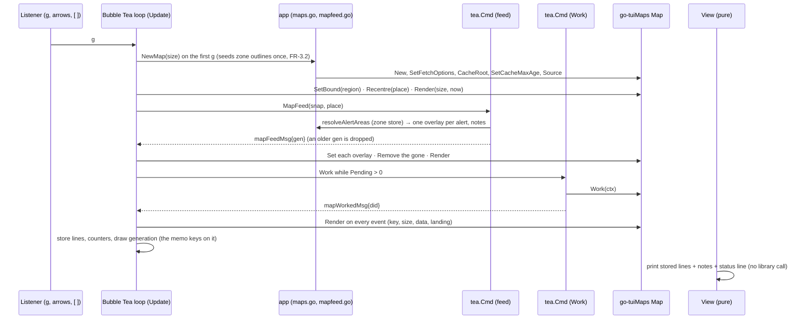

# Approach 1 — where the map is drawn

**The question** (discover report, "What PLAN inherits" item 1). Which goroutine calls the library,
and where is the frame drawn: in Bubble Tea's `Update`, or in `View` under a lock? Wave 1 called it a
genuine choice with a cost either way (W1-C, synthesis §12).

**The facts it rests on** (W1-C, brief C-7):
- `View` is a value receiver (`modes/tty/view.go:19`). Memo slots are pointers for that reason
  (`memo.go:9-10`), and the memo-completeness guard (`memo_completeness_test.go:39`) sees only
  Dashboard fields.
- Snapshots arrive by `p.Send` from the publisher's timer goroutine, and are routed through `dispatch`
  (`dashboard.go:975`).
- **The spike called the map from three goroutines**: `Show` on the timer goroutine, two `Work`
  goroutines, and `Render` from inside `View`. Its `MapChangedMsg` did nothing, and its memo key read
  `Map.Changed()`, which the guard could not see.
- The library locks internally, starts no goroutine, and does its work in `Work` on the host's
  goroutine. From v0.2.0 it also reports `Changed()`, `FrameTicks()` and `NextCall()` (go-tuiMaps D-54).

## A — Draw in `Update`; `View` only prints

Every library call happens on Bubble Tea's own goroutine, in `dispatch`, beside `SnapshotMsg`: `Set`,
`Recentre`, `SetPlayback`, `Render`. The rendered lines go into a pointer slot on the Dashboard, and
`View` prints them. The fetch and decode `Work` runs in a `tea.Cmd` and reports back with a message.

```go
// Messages the map adds to dispatch (signatures only):
type mapWorkedMsg struct{ changed, ticks uint64 }   // a Work pass returned
type mapTickMsg   struct{ at time.Time }             // scheduled from NextCall
type selectionMsg struct{ index int }                // selection moved (today it has no event, W1-C)

// On the Dashboard (a pointer slot, as the memo is):
type mapPane struct {
	m     *tuimaps.Map
	lines []string // the last frame, drawn in Update
	key   mapKey   // Changed(), FrameTicks(), size: what the lines were drawn for
}
```

Redraws happen when `Changed()` or `FrameTicks()` move, when the window's size changes, or when the
selection moves. A tick is scheduled with `tea.Tick` at the time `NextCall` gives, never polled.

- **For:** one owner goroutine for every mutator and for `Render` (C-7 answered). `View` stays pure, so
  the memo guard sees the frame key because it is a Dashboard field. It fits go-tuiMaps v0.2.0
  directly: `FrameTicks` and `NextCall` become `tea.Tick` messages.
- **Against:** a render adds to the time `Update` holds the loop. That is measured at about 27 ms for
  12 frames composited together (go-tuiMaps W2 M-B) and less for one frame, at no more than 2.5
  frames a second (the ceiling). It also means a message round-trip per redraw, and new message types
  in `dispatch`.

## B — Draw in `View`, under the library's lock

`View` calls `Render(size, now)` through a pointer the model holds, every time Bubble Tea asks for a
view. The library's own frame reuse (`sameOverlays`, `sameLook`) makes an unchanged frame cheap.
Mutators still run in `Update`, so only the draw moves.

```go
func (d Dashboard) mapBody(size tuimaps.Size) []string // calls d.pane.m.Render(size, time.Now())
```

- **For:** the frame is always exactly current, with no key to keep, no redraw messages, and less code.
  `Update` never pays for a render.
- **Against:** `View` stops being a pure function of the Dashboard: it reads the clock and the library's
  state, which the memo discipline and its guard were built to forbid (F-30). `View` runs after every
  message, including ones that change nothing on the map, so the reuse check runs each time. And a
  `View` that calls into a locking library is exactly what the spike did and could not test.

## Recommendation

**A.** It answers the defect the spike demonstrated: one goroutine owns the map, and the frame's key
is a field the existing guard already checks. It also uses the two signals go-tuiMaps v0.2.0 added for
this purpose. The render cost it moves into `Update` is bounded by the frame-rate ceiling and was
measured small.

**The strongest argument against A.** B is less code and cannot draw a stale frame. A has a key to get
wrong. A missing field in `mapKey` would show an old frame, the same class of defect as the spike's
invisible memo key, now in a new place. The cure is that the guard must include `mapKey`, and that is a
test PLAN writes first.

## AS BUILT 0.18.0 — how it fits (D-41, D-45; BUILD batches 1–5)

Drawn from the code as of batch 5 (`modes/tty/map_pane.go`, `app/maps.go`, `app/mapfeed.go`).
Every library call but `Work` is made in `Update`; `View` prints the stored lines. **Still
owed:** the `NextCall` tick (`mapTickMsg`), W2.2's goroutine record, and W2.6's join on close.



## Cross-reference with go-tuiMaps v0.2.0

| go-tuiMaps | Used here |
|---|---|
| D-54: `FrameTicks()`, `NextCall()` with frame changes | The redraw key and the `tea.Tick` schedule |
| D-26: playback off by default; `SetPlayback` | Called in `Update` from the FR-5.8 Setting |
| v0.1.0: no goroutine in the library; `Work` on the host's goroutine | `Work` in a `tea.Cmd` |
