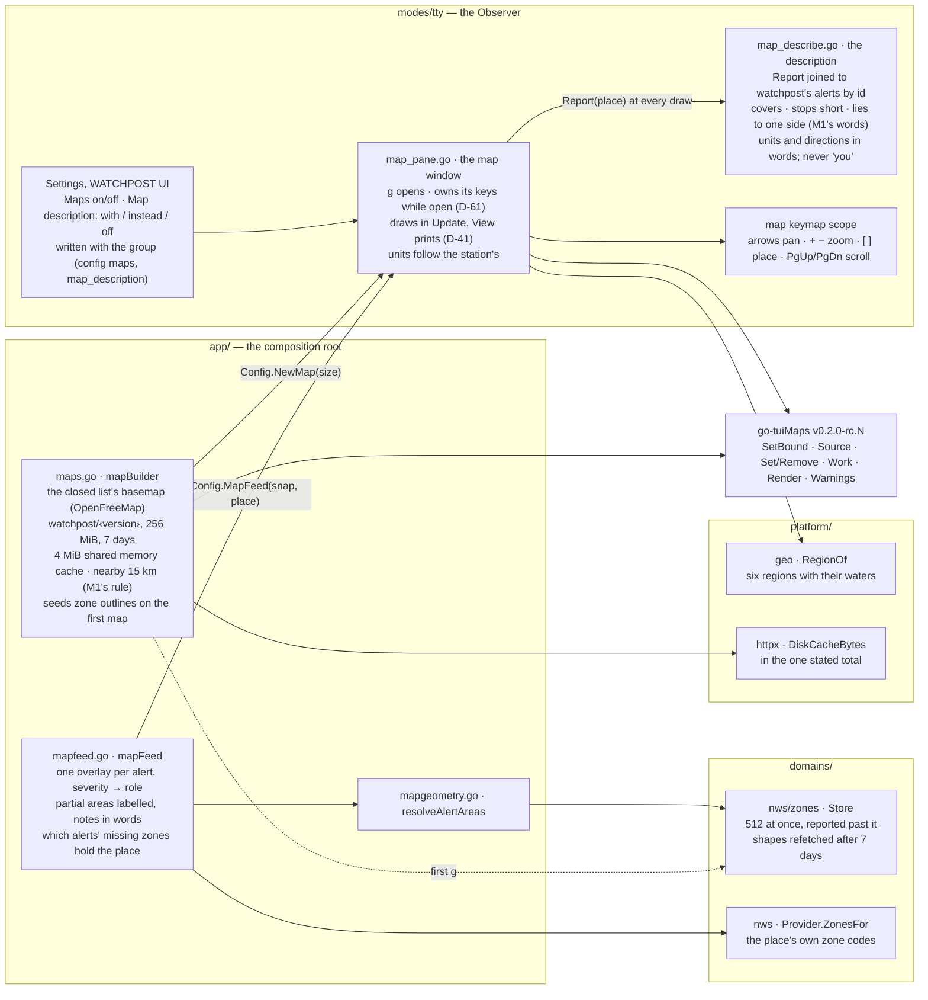
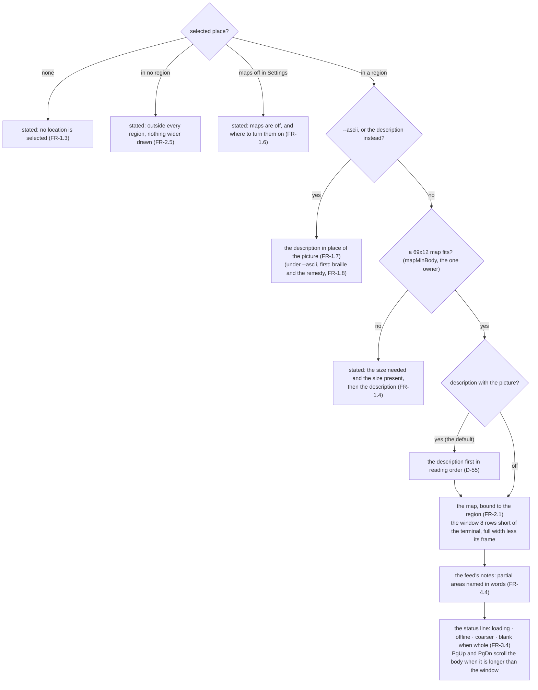

# As built: where the map lives

**This page is kept in step with the code, batch by batch** (the build log, `04-development/build-log.md`,
says what each batch moved). The atlas draws from its diagrams (`go run ./tools/atlas`).

## The parts, and who may name whom

`app/` is the only package that may name a domain and what draws (the import rule,
`scripts/lint-imports.sh`), so the zone store and the weather service are reached from `app/`
alone, and the window is handed functions.

## What the window's body is

## Not built yet

The `NextCall` tick; the remaining Settings rows (W1.11: default scale, layers, alert scope, nearby); the exposure
disclosure, the registry and the cost warning (W1.12–W1.14); the legend (W1.17); the national
scope (W5.3's second half); the clear path on the library's `Purge` (W3.8 with W9.5); radar (W8).
