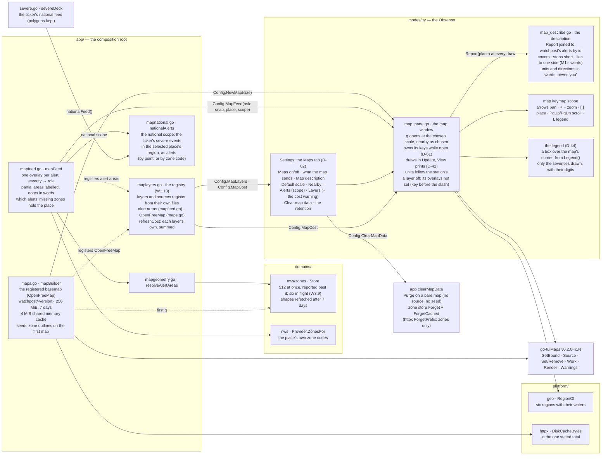
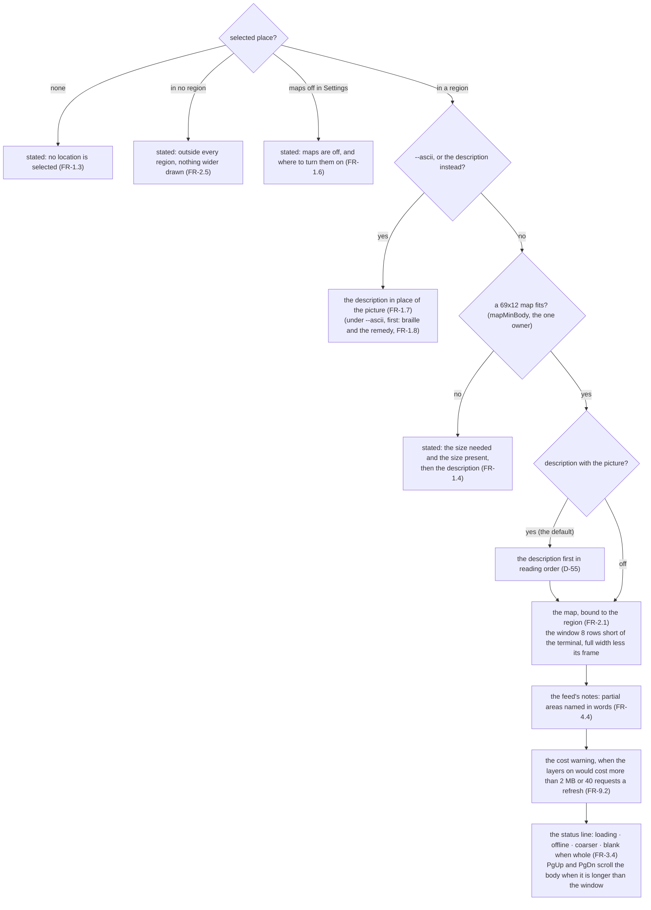
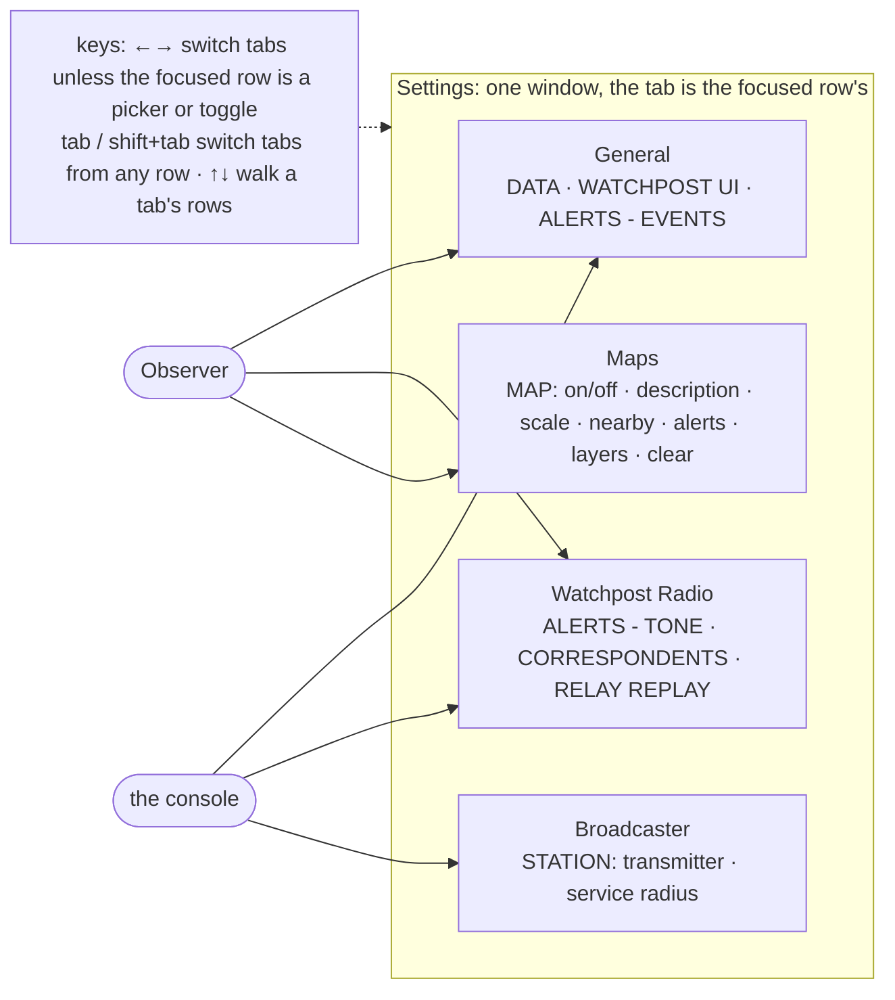

# As built: where the map lives

**This page is kept in step with the code, batch by batch** (the build log, `04-development/build-log.md`,
says what each batch moved). The atlas draws from its diagrams (`go run ./tools/atlas`).

## The parts, and who may name whom

`app/` is the only package that may name a domain and what draws (the import rule,
`scripts/lint-imports.sh`), so the zone store and the weather service are reached from `app/`
alone, and the window is handed functions.

## What the window's body is

## Settings, in tabs (D-62)

Each tab fits unscrolled at 133×44; the window is as wide as its widest tab on every tab.

## Not built yet

The `NextCall` tick and the rest of W2 (the goroutine record, the frame guards, join on close, the
allocation pin, the width goldens); radar (W8), which registers its sources and its layer.
