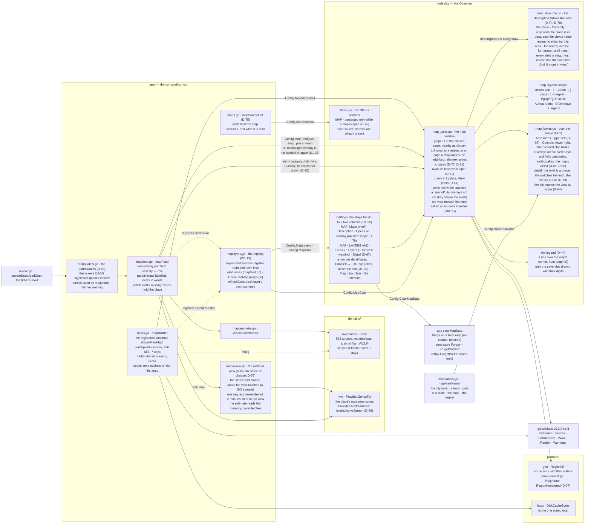
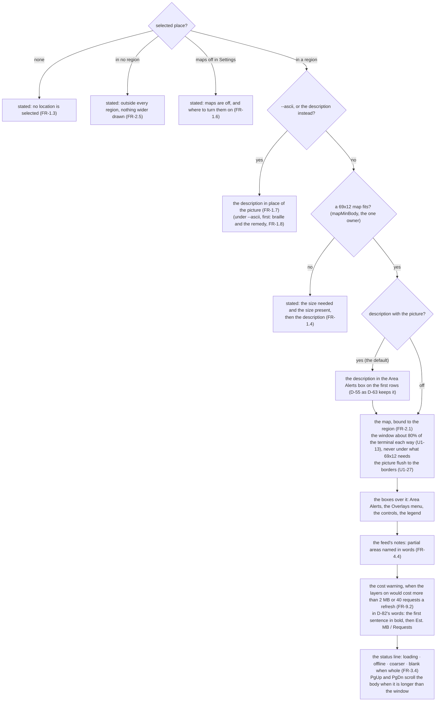
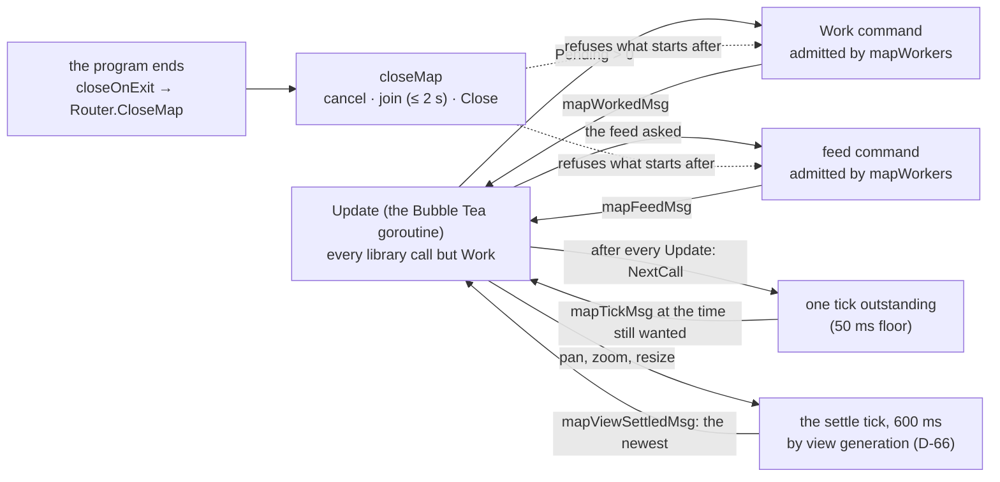
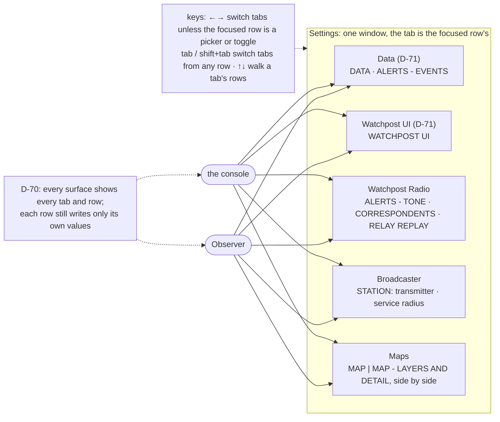

# As built: where the map lives

**This page is kept in step with the code, batch by batch** (the build log, `04-development/build-log.md`,
says what each batch moved). The atlas draws from its diagrams (`go run ./tools/atlas`).

## The parts, and who may name whom

`app/` is the only package that may name a domain and what draws (the import rule,
`scripts/lint-imports.sh`), so the zone store and the weather service are reached from `app/`
alone, and the window is handed functions.

## What the window's body is

## The map's commands, its clock and its close (W2)

## Settings, in tabs (D-62)

Each tab fits unscrolled at 133×44; the window is as wide as its widest tab on every tab, and **no wider than
80% of the terminal** (U1-36) - the one-column floor on a terminal too small for that - with the column plan
fitted inside it, so the Maps tab's words are cut to keep its two columns side by side at 133. A blank row sets
the tabs off the page where the height allows (U1-30). Within a column the labels and the pickers' values are
padded to one width, so the arrows line up (U1-24).

## Not built yet

The theme's palette and the colour-depth hint (W7), which bring W2.3's theme and depth rows; radar (W8),
which registers its sources and its layer and brings the frame-advance rows.
