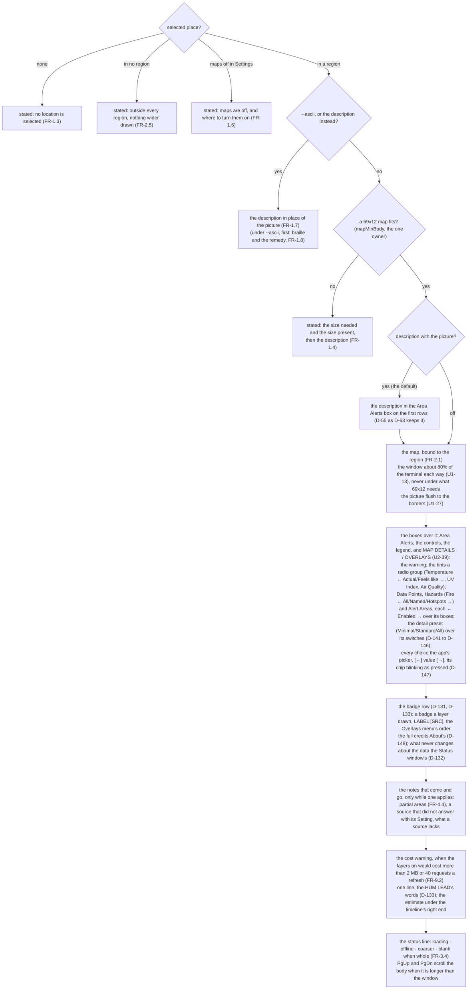
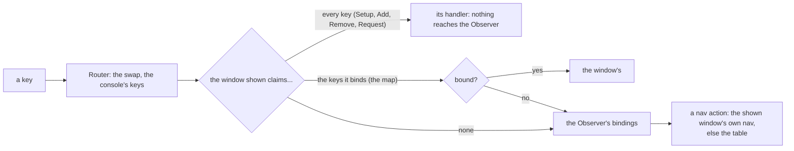
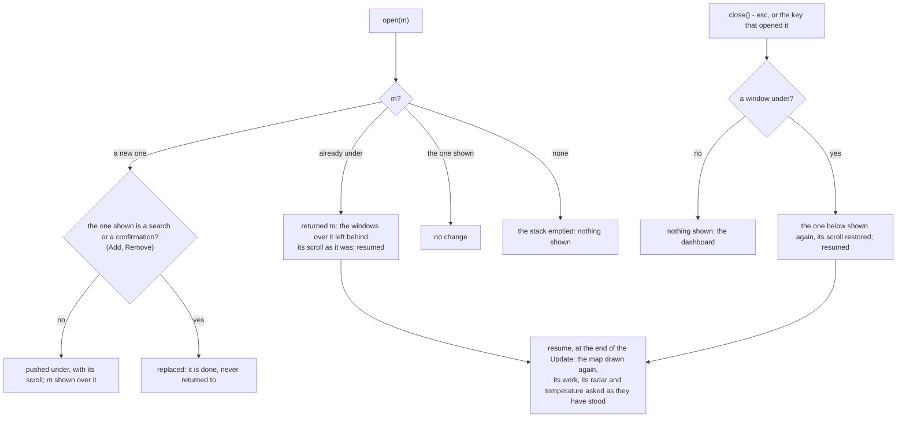
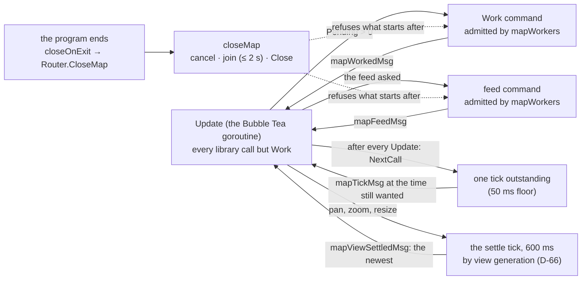
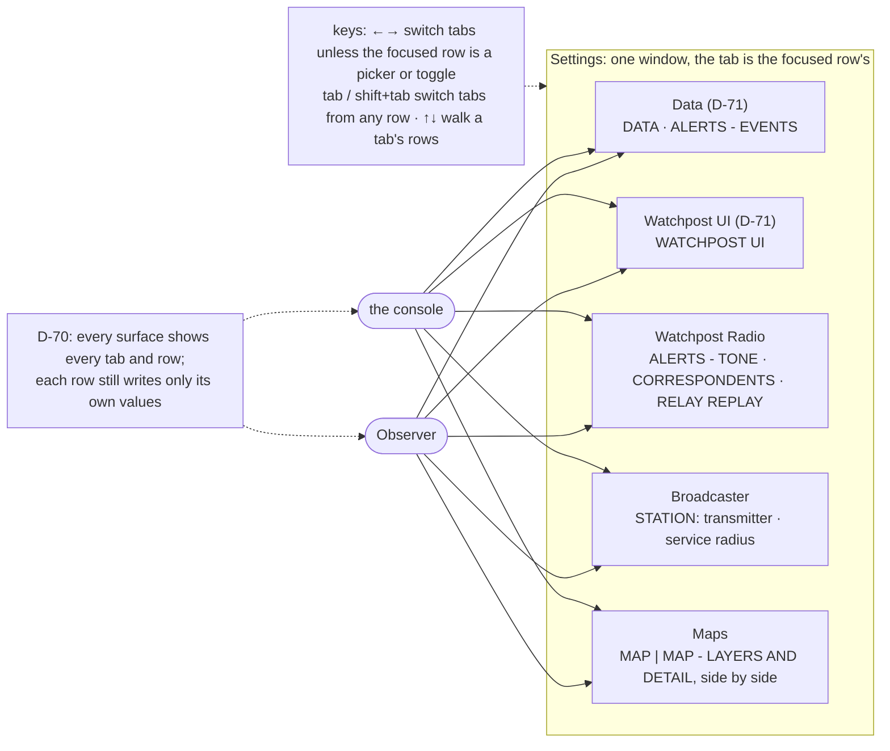

# As built: where the map lives

**This page is kept in step with the code, batch by batch** (the build log, `04-development/build-log.md`,
says what each batch moved). The atlas draws from its diagrams (`go run ./tools/atlas`).

## The parts, and who may name whom

`app/` is the only package that may name a domain and what draws (the import rule,
`scripts/lint-imports.sh`), so the zone store and the weather service are reached from `app/`
alone, and the window is handed functions.

```mermaid
flowchart LR
  subgraph app["app/ — the composition root"]
    MB["maps.go · mapBuilder\nthe registered basemap (OpenFreeMap)\nwatchpost/‹version›, 256 MiB, 7 days\n4 MiB shared memory cache\nseeds zone outlines on the first map"]
    REG["maplayers.go · the registry (W1.13)\nlayers and sources register from their own files\nalert areas (mapfeed.go) · OpenFreeMap (maps.go)\nrefreshCost: each layer's own, summed"]
    MF["mapfeed.go · mapFeed\none overlay per alert, severity → role\npartial areas labelled, notes in words\nwhich alerts' missing zones hold the place"]
    MG["mapgeometry.go · resolveAlertAreas"]
    MV["mapinview.go · the alerts in view (D-66; no scope to choose, D-76)\nthe states and marine areas the view touches (a 5x5 sample)\none request, remembered 2 minutes; kept to the view\nthe estimate reads the memory, never fetches"]
    MS["maps.go · mapSourceList (D-75)\neach host the map contacts, and what it is sent"]
    MQ["mapquakes.go · the earthquakes (D-80, D-122, D-123)\nthe USGS feed chosen, in view: rings by magnitude, coloured by age\nNEW within the loop's hours; one overlay for all (D-129)"]
    MR["mapradar.go · the radar (W8)\nMRMS by default, IEM for the lower 48 if chosen (D-83); none in American Samoa\n24 five-minute slots over two hours, a missing one a stated gap\nnewest first, six at a time (D-130); an all-empty loop checked against the other source (D-84)\ntrimmed of its oldest frames to fit the 24 MiB image budget (D-88)\neach frame's check kept by the frame - source, region, box, time, size (P-17)\nthe hours ahead (D-113): HRRR's quarter-hours from IEM, fetched alongside (D-130), a forecast loop a box,\nthe same boxes' last standing in while a new fetch runs (U2-59),\nthe observed drawn until now and the forecast after it; the farthest trimmed to fit\nbeyond the lower 48 (maprain.go, D-115): Open-Meteo's hourly rain in radar's scale, painted with a table of its own, a frame an hour"]
    MT["maptemp.go · the temperature (W10)\nUV: EPA's cities first (D-186) - the spread asked and every city read today in view, no two within the spacing (D-225); each city's hours kept in the history's epa-uv-cities (D-224)\na whole answer kept for its hour, by region, boxes, source, mode, units and hour (P-16) - UV and air added to a copy\nRadar mode: Open-Meteo, every hour up to now, each grid during its hour (D-96)\nForecast mode: Open-Meteo by default, NDFD if chosen (D-101); a box NDFD refuses is Open-Meteo's\none look in both modes: labelled isotherms over faint bands (D-102, Grid.Lines)\nNow and each day's high and low, each during its step (D-94, D-97)\na lattice a fixed box of the fields' own (D-111): the radar's in the lower 48, the whole region elsewhere, split at the antimeridian; a day the source lacks filled from Open-Meteo (D-100), else said\noff by default, fetched and held while the map is open (D-99)\nwind in the same requests (W11): Radar mode's every hour, Forecast mode's Now and each day's peak (D-108);\nits direction interpolated as a vector; off by default (D-110)\nan answer the same all hour: nothing handed in again (U2-13)\nfeels-like in the same requests (W13.1, D-119): drawn as temperature is; NDFD's days worked out, Now filled from Open-Meteo\nForecast mode's rain and snow (maprain.go, W12.3): Open-Meteo always (D-118); Now's hour and each day's heaviest in radar's scale, the day's total marked on it (D-116, go-tuiMaps L-17)"]
  end
  subgraph domains["domains/"]
    ZS["nws/zones · Store\n512 at once, reported past it; six in flight (W3.9)\nshapes refetched after 7 days"]
    RD["radar · IEM, MRMS (W8.3)\nfixed boxes, never the view (D-47); outside the lower 48 each MRMS product's whole extent; only advertised times, always sent (D-84)\nits own client: memory only, 1 MiB cap, public addresses, https"]
    TD["temperature · NDFD, Open-Meteo (W10.2)\na lattice of at most 80 points a box, never the view (D-47)\nNDFD: the hour sent with its zone; offshore missing, never zero\na cell drawn only where its nearest point has a value (D-101)\nwind: hourly speed and direction; each day's peak worked out from NDFD's hours\nits own client: 2 MiB cap, public addresses, https; 24 MiB in memory and a 64 MiB disk cache at map-http, in the stated total (D-219)\nOpen-Meteo through the quota gate: while held, what is in the cache is served; only a network answer frees it (D-217)\nwaves: NDFD first; Open-Meteo Marine only for the points past NDFD's reach, the land it answered nothing for left out - kept by lattice in marine-land.json beside quota.json, merged across instances, asked again after 90 days, gone with Clear map data (D-194, D-218)"]
    WS["nws · Provider.ZonesFor\nthe place's own zone codes\nProvider.AlertsInAreas: /alerts/active?area= (D-66)"]
  end
  subgraph tty["modes/tty — the Observer"]
    MW["map_pane.go · the map window\ng opens at the chosen scale, nearby as chosen\n1-6 snap to a region; at an edge a chip names the neighbour, the next press crosses (D-77, D-81)\nowns its keys while open (D-61)\ndraws in Update, View prints (D-41)\nunits follow the station's\na layer off: its overlays not set (key before the slash)\nthe view moved: the feed asked again once it settles (600 ms)\na radar answer swaps its loops all or none, the leaving ones first (U2-59)\nclosed: the app forgets the zone shapes (D-162); closed five minutes, the window lets its map go - the library's map and the pictures handed in - and the next open builds a new one, generations carried on (D-221)"]
    MD["map_describe.go · the description follows the view (D-74, D-78)\nthe place - Currently: … only while the place is in view; else the view's name\n‹event› in effect for this area · for nearby ‹areas› · for ‹areas›, until ‹time›\nevery alert in view, most severe first; the box ends 'And N more in view.'"]
    MK["map keymap scope\narrows pan · + − zoom · [ ] place · 1-6 region · PgUp/PgDn scroll\nA Area Alerts (closed on open, D-87) · R Radar mode on/off (D-94) · O Overlays · L free (the legend retired, D-103)\nspace play · shift+← shift+→ step · n now (D-86): the loop in Radar mode, the days in Forecast mode\n< > the days' high or low (D-97)\nunder the map (D-103, D-105): the colour row, the notes, the picture's status and estimate,\nthe loop's row RADAR · FRAME · NEWEST · STOPPED (yellow) or PLAYING (green) over the timeline, the controls beside them,\na blank, MAPS: 1-6, a blank, the chips"]
    PT["map_parts.go · the parts, one each whatever the mode (D-103)\nchipBox: the edge chip, the mode's chip · chipFace: every source's chip, "  NAME  " bold on its own ground, black or white words (D-134) · mapBadge + withTab: the badge, one line, a tab on the frame's top right (D-120)\nscrubber: radar's loop and Forecast mode's steps, one bar\nmap_scrub.go lays the rows under the map from them"]
    MTW["map_temp.go · the two modes (D-94)\nevery grid handed in up front with its span; a step moves the moment, never a Set (L-15.1, L-15.2)\nan alert from its onset, and every alert in effect on now's frame (D-98)\nForecast mode: the host steps and plays, the last day held\nwind beside temperature or alone: braille arrows, every other with its speed (D-109, go-tuiMaps L-16)\nno main overlay on: temperature turned on for Forecast mode alone, a chip says so (D-103, D-104)\nan arrow in the Overlays menu moves its cursor alone; a refused refresh keeps what is drawn (U2-13, U2-14)\nrain and snow: Forecast mode's row, on by default; the colour row says MODEL RAIN · NOT RADAR (D-117)\nfeels like: its own row, never on with temperature - one tint; FEELS on the badge's step and the colour row (D-119)"]
    BX["map_boxes.go · over the map (UAT-1)\nthe radar's badge, upper right: RADAR DATA, the source's chip, the frame's time (D-92)\nin Forecast mode: FORECAST, the temperature's source, the step\nthe library's stamp handed to it (ShowStamp, go-tuiMaps D-87)\nArea Alerts, upper left (D-63) · the Controls moved under the map (D-103), the pressed chip blinks\nMAP DETAILS / OVERLAYS, in Settings' heading style (D-103): alert areas and [w]'s categories, earthquakes, temperature, the map's detail (D-65, D-80); radar is R's (D-94)\ndetail: the level is a preset, the switches the truth; the library at Full (D-79)\nthe title names the view by scale (D-64)"]
    ST2["Settings, the Maps tab (D-62), two columns (U1-25)\nMAP: Maps on/off · Description · Opens at · Nearby (no alert scope, D-76) · Radar · Temperature (D-93)\nMAP - LAYERS AND DETAIL: Layers (+ the cost warning) · Detail (D-67)\na row per detail layer, ← Enabled → (U1-35); Lakes, never the sea (U1-39) · Map data: clear · the retention"]
    SW["status.go · the Status window\nMAP - contacted only while a map is open (D-75)\neach source: its host and what it is sent"]
  end
  subgraph plat["platform/"]
    RG["geo · RegionOf\nsix regions with their waters; Hawaii and the Caribbean wide enough to see their weather (D-91)\narrangement.go: Neighbour, RegionNumbered (D-77)"]
    HX["httpx · DiskCacheBytes, with temperature's CacheBytes and the tiles' cap, the one stated total\nConfig.MemBytes / DiskBytes size a client's tiers; Cached reads the cache, never the network (D-217, D-219)\nClear map data empties the map clients' caches, memory and disk"]
  end
  L["go-tuiMaps v0.2.0-rc.N\nSetBound · Source · Set/Remove · Work · Render · Warnings"]
  MB -- "Config.NewMap(size)" --> MW
  MF -- "Config.MapFeed(ask: snap, place, view)\nan unchanged overlay is not handed in again (U1-28)" --> MW
  MF --> MG --> ZS
  MF -- "ask.View" --> MV --> WS
  MR --> RD
  MT --> TD
  MT --> RD
  MT -- "Config.MapTemperature(ask: mode, source, unit, the hour's start)\none request at a time; asked only while on (D-25)" --> MW
  MW --> MTW
  MR -- "Config.MapRadar(ask): the whole loop\none request at a time; shown once in (D-85); a region left cancelled (D-130)\nits own command: the alerts never wait (W8.12)" --> MW
  SD["severe.go · severeDeck.feedCopy\nthe ticker's feed"] --> MQ --> MF
  MF -- "alert/‹category›/‹id›: [w]'s Classify; forecasts not drawn (D-80)\nTimes: each overlay's onset and end (D-98)" --> MW
  MS -- "Config.MapSources" --> SW
  MF --> WS
  MB -. "first g" .-> ZS
  MW --> RG
  MW --> MK
  MW --> PT
  MW --> BX
  NM["mapnames.go · mapAreaNamer\nthe city index: a town · part of a state · the state · the region"] -- "Config.MapAreaName" --> BX
  ST2 --> MW
  ST2 -- "Config.ClearMapData" --> CL["app clearMapData\nPurge on a bare map (no source, no seed)\nzone store Forget + ForgetCached\n(httpx ForgetPrefix: zones only)"]
  MW -- "Report(place) at every draw" --> MD
  MW --> L
  MB --> L
  MB --> HX
  MF -. "registers alert areas" .-> REG
  MB -. "registers OpenFreeMap" .-> REG
  REG -- "Config.MapLayers · Config.MapCost" --> ST2
  REG -- "Config.MapCost" --> MW
```

## What the window's body is

```mermaid
flowchart TB
  S{"selected place?"} -- "none" --> N["stated: no location is selected (FR-1.3)"]
  S -- "in no region" --> O["stated: outside every region, nothing wider drawn (FR-2.5)"]
  S -- "maps off in Settings" --> OFF["stated: maps are off, and where to turn them on (FR-1.6)"]
  S -- "in a region" --> A{"--ascii, or the description instead?"}
  A -- "yes" --> T["the description in place of the picture (FR-1.7)\n(under --ascii, first: braille and the remedy, FR-1.8)"]
  A -- "no" --> F{"a 69x12 map fits? (mapMinBody, the one owner)"}
  F -- "no" --> FL["stated: the size needed and the size present,\nthen the description (FR-1.4)"]
  F -- "yes" --> DS{"description with the picture?"}
  DS -- "yes (the default)" --> D1["the description in the Area Alerts box on the first rows (D-55 as D-63 keeps it)"] --> M
  DS -- "off" --> M["the map, bound to the region (FR-2.1)\nthe window about 80% of the terminal each way (U1-13), never under what 69x12 needs\nthe picture flush to the borders (U1-27)"]
  M --> BXS["the boxes over it: Area Alerts, the controls, the legend, and MAP DETAILS / OVERLAYS (U2-39):\nthe warning; the tints a radio group (Temperature ← Actual/Feels like →, UV Index, Air Quality);\nData Points, Hazards (Fire ← All/Named/Hotspots →) and Alert Areas, each ← Enabled → over its boxes;\nthe detail preset (Minimal/Standard/All) over its switches (D-141 to D-146);\nevery choice the app's picker, [←] value [→], its chip blinking as pressed (D-147)"] --> BG["the badge row (D-131, D-133): a badge a layer drawn, LABEL [SRC], the Overlays menu's order\nthe full credits About's (D-148); what never changes about the data the Status window's (D-132)"]
  BG --> NT["the notes that come and go, only while one applies: partial areas (FR-4.4), a source that did not answer with its Setting, what a source lacks"]
  NT --> CW["the cost warning, when the layers on would cost more than 2 MB or 40 requests a refresh (FR-9.2)\none line, the HUM LEAD's words (D-133); the estimate under the timeline's right end"]
  CW --> ST["the status line: loading · offline · coarser · blank when whole (FR-3.4)\nPgUp and PgDn scroll the body when it is longer than the window"]
```

## The windows, a stack (D-106, D-107)

`Dashboard.modal` is the window shown, and `under` the windows beneath it. Every open and close
goes through `open` and `close`, so the forty-three places that ask which window is shown read the
top of the stack and nothing else changed.

**The keys (F-184).** Each window declares, once, in `window_keys.go`, how much of the keyboard it
claims: every key (a form or a search: Setup, Add, Remove, Request), the keys it binds (the map), or
none (the Observer's bindings reach it, and its own nav walks its scroll or rows). Only the window
shown is asked; the windows under it never see a key. Help's groups for a window's own keys come from
the same declaration. `window_keys_test.go` derives the windows from the constants and holds every one
to it: declared, its arrows its own, left by esc, no key bound twice, forms taking every key. The
Router, above the stack, keeps the surface's keys - the swap and the console's windows.

```mermaid
flowchart LR
  K["a key"] --> RT["Router: the swap, the console's keys"]
  RT --> W{"the window shown claims..."}
  W -- "every key (Setup, Add, Remove, Request)" --> ALL["its handler: nothing reaches the Observer"]
  W -- "the keys it binds (the map)" --> B{"bound?"}
  B -- "yes" --> MAPK["the window's"]
  B -- "no" --> OBS["the Observer's bindings"]
  W -- "none" --> OBS
  OBS --> NAV["a nav action: the shown window's own nav,\nelse the table"]
```

```mermaid
flowchart TB
  O["open(m)"] --> Q{"m?"}
  Q -- "none" --> CLR["the stack emptied: nothing shown"]
  Q -- "the one shown" --> SAME["no change"]
  Q -- "already under" --> BACK["returned to: the windows over it left behind\nits scroll as it was; resumed"]
  Q -- "a new one" --> T{"the one shown is a search or a confirmation?\n(Add, Remove)"}
  T -- "yes" --> REP["replaced: it is done, never returned to"]
  T -- "no" --> PUSH["pushed under, with its scroll; m shown over it"]
  C["close() - esc, or the key that opened it"] --> E{"a window under?"}
  E -- "yes" --> POP["the one below shown again, its scroll restored; resumed"]
  E -- "no" --> NONE["nothing shown: the dashboard"]
  POP --> R["resume, at the end of the Update: the map drawn again,\nits work, its radar and temperature asked as they have stood"]
  BACK --> R
```

## The map's commands, its clock and its close (W2)

```mermaid
flowchart LR
  U["Update (the Bubble Tea goroutine)\nevery library call but Work"] -- "Pending > 0" --> W["Work command\nadmitted by mapWorkers"]
  U -- "the feed asked" --> F["feed command\nadmitted by mapWorkers"]
  W -- "mapWorkedMsg" --> U
  F -- "mapFeedMsg" --> U
  U -- "after every Update: NextCall" --> T["one tick outstanding\n(50 ms floor)"]
  U -- "pan, zoom, resize" --> VS["the settle tick, 600 ms\nby view generation (D-66)"]
  VS -- "mapViewSettledMsg: the newest" --> U
  T -- "mapTickMsg at the time still wanted" --> U
  Q["the program ends\ncloseOnExit → Router.CloseMap"] --> C["closeMap\ncancel · join (≤ 2 s) · Close"]
  C -. "refuses what starts after" .-> W & F
```

## Settings, in tabs (D-62)

```mermaid
flowchart LR
  subgraph S["Settings: one window, the tab is the focused row's"]
    DA["Data (D-71)\nDATA · ALERTS - EVENTS"]
    UI["Watchpost UI (D-71)\nWATCHPOST UI"]
    R["Watchpost Radio\nALERTS - TONE · CORRESPONDENTS · RELAY REPLAY"]
    B["Broadcaster\nSTATION: transmitter · service radius"]
    M["Maps\nMAP | MAP - LAYERS AND DETAIL, side by side"]
  end
  O(["Observer"]) --> DA & UI & R & B & M
  C(["the console"]) --> DA & UI & R & B & M
  N["D-70: every surface shows every tab and row;\neach row still writes only its own values"] -.-> O & C
  K["keys: ←→ switch tabs unless the focused row is a picker or toggle\ntab / shift+tab switch tabs from any row · ↑↓ walk a tab's rows"] -.-> S
```

Each tab fits unscrolled at 133×44; the window is as wide as its widest tab on every tab, and **no wider than
80% of the terminal** (U1-36) - the one-column floor on a terminal too small for that - with the column plan
fitted inside it, so the Maps tab's words are cut to keep its two columns side by side at 133. A blank row sets
the tabs off the page where the height allows (U1-30). Within a column the labels and the pickers' values are
padded to one width, so the arrows line up (U1-24).

## Not built yet

The theme's palette and the colour-depth hint (W7), which bring W2.3's theme and depth rows. Radar's
motion Setting's off and normal (W8.9; slow is built) and its goldens over alert areas (W8.11). The wind
overlay (F-182), which joins the Forecast mode's steps.
