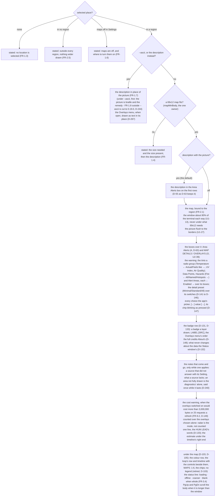
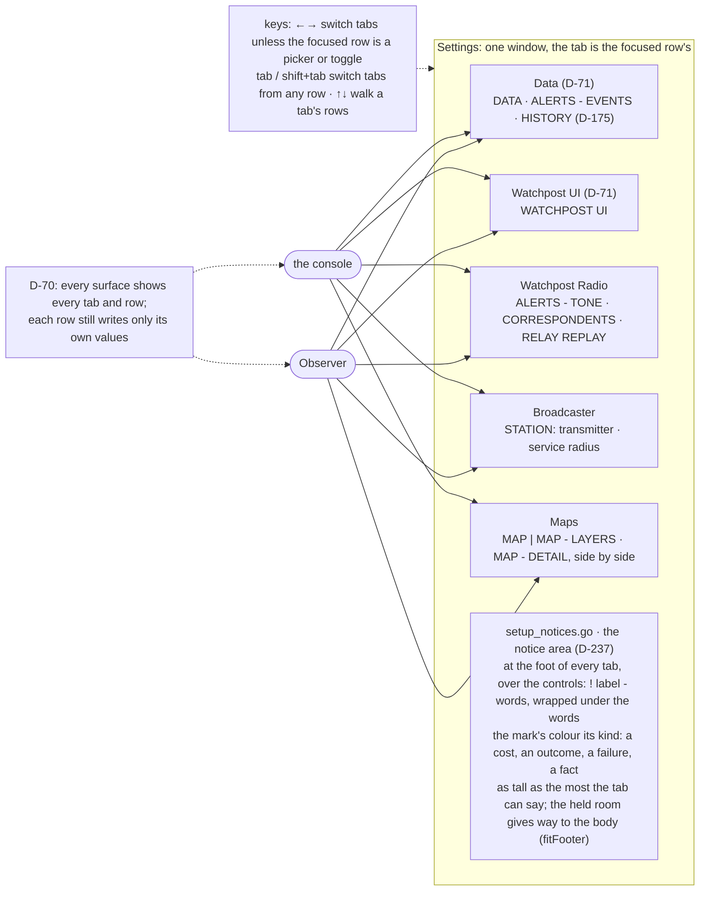
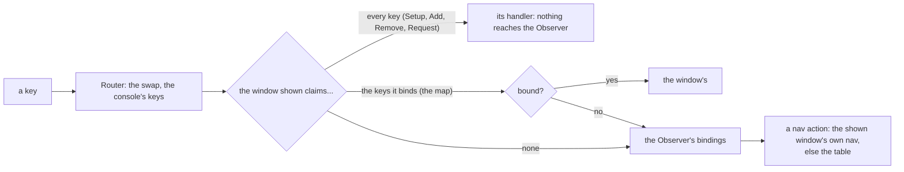
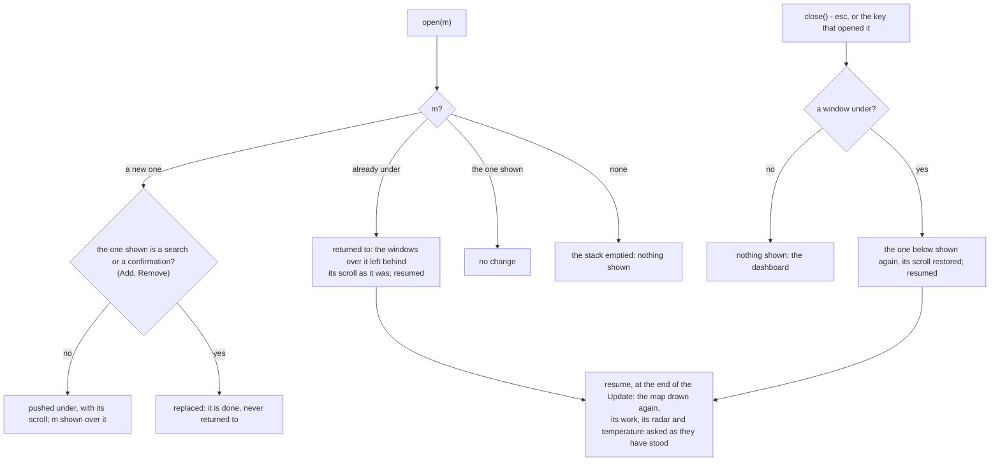
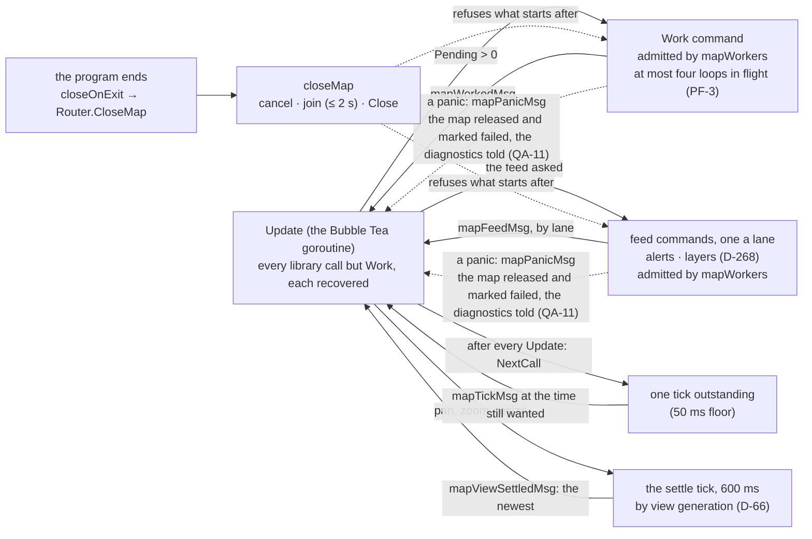

# As built: where the map lives

**This page is kept in step with the code, batch by batch** (the build log, `04-development/build-log.md`,
says what each batch moved). The atlas draws from its diagrams (`go run ./tools/atlas`). It opens on
what the listener sees - the window, then Settings - and the parts follow (D-260). The map's keys
are in the parts diagram's keymap box, and in the README's *Map* section.

## What the window's body is

```mermaid
flowchart TB
  S{"selected place?"} -- "none" --> N["stated: no location is selected (FR-1.3)"]
  S -- "in no region" --> O["stated: outside every region, nothing wider drawn (FR-2.5)"]
  S -- "maps off in Settings" --> OFF["stated: maps are off, and where to turn them on (FR-1.6)"]
  S -- "in a region" --> A{"--ascii, or the description instead?"}
  A -- "yes" --> T["the description in place of the picture (FR-1.7)\n(under --ascii, first: the picture is braille and the remedy - FR-1.8 outside --ascii is cut to 0.19.0, D-244)\nthe Overlays menu, when open, drawn as text in its place (D-267)"]
  A -- "no" --> F{"a 69x12 map fits? (mapMinBody, the one owner)"}
  F -- "no" --> FL["stated: the size needed and the size present,\nthen the description (FR-1.4)"]
  F -- "yes" --> DS{"description with the picture?"}
  DS -- "yes (the default)" --> D1["the description in the Area Alerts box on the first rows (D-55 as D-63 keeps it)"] --> M
  DS -- "off" --> M["the map, bound to the region (FR-2.1)\nthe window about 80% of the terminal each way (U1-13), never under what 69x12 needs\nthe picture flush to the borders (U1-27)"]
  M --> BXS["the boxes over it: Area Alerts (A, D-63) and MAP DETAILS / OVERLAYS (O, U2-39):\nthe warning; the tints a radio group (Temperature ← Actual/Feels like →, UV Index, Air Quality);\nData Points, Hazards (Fire ← All/Named/Hotspots →) and Alert Areas, each ← Enabled → over its boxes;\nthe detail preset (Minimal/Standard/All) over its switches (D-141 to D-146);\nevery choice the app's picker, [←] value [→], its chip blinking as pressed (D-147)"] --> BG["the badge row (D-131, D-133): a badge a layer drawn, LABEL [SRC], the Overlays menu's order\nthe full credits About's (D-148); what never changes about the data the Status window's (D-132)"]
  BG --> NT["the notes that come and go, only while one applies: a source that did not answer with its Setting, what a source lacks; an area not fully drawn is the diagnostics' alone, said once while it lasts (D-240)"]
  NT --> CW["the cost warning, when the overlays switched on would cost more than 3,000,000 bytes or 25 requests a refresh (FR-9.2, D-149)\ncounted over the overlays chosen alone: radar is the mode, not counted\none line, the HUM LEAD's words (D-133); the estimate under the timeline's right end"]
  CW --> ST["under the map (D-103, D-105): the colour row, the loop's row and timeline with the controls beside them, MAPS: 1-6, the chips; no legend (retired, D-103)\nthe status line: loading · offline · coarser · blank when whole (FR-3.4)\nPgUp and PgDn scroll the body when it is longer than the window"]
```

## Settings, in tabs (D-62)

```mermaid
flowchart LR
  subgraph S["Settings: one window, the tab is the focused row's"]
    DA["Data (D-71)\nDATA · ALERTS - EVENTS · HISTORY (D-175)"]
    UI["Watchpost UI (D-71)\nWATCHPOST UI"]
    R["Watchpost Radio\nALERTS - TONE · CORRESPONDENTS · RELAY REPLAY"]
    B["Broadcaster\nSTATION: transmitter · service radius"]
    M["Maps\nMAP | MAP - LAYERS · MAP - DETAIL, side by side"]
    NA["setup_notices.go · the notice area (D-237)\nat the foot of every tab, over the controls: ! label - words, wrapped under the words\nthe mark's colour its kind: a cost, an outcome, a failure, a fact\nas tall as the most the tab can say; the held room gives way to the body (fitFooter)"]
  end
  O(["Observer"]) --> DA & UI & R & B & M
  C(["the console"]) --> DA & UI & R & B & M
  N["D-70: every surface shows every tab and row;\neach row still writes only its own values"] -.-> O & C
  K["keys: ←→ switch tabs unless the focused row is a picker or toggle\ntab / shift+tab switch tabs from any row · ↑↓ walk a tab's rows"] -.-> S
```

**Every tab's notes are notices at its foot** (D-237), over the controls: the Data tab's history size or
what clearing it did, the Radio tab's voice note, the Maps tab's costs and the map's retention or what
clearing it did. The area is as tall as the most its tab can say, so a notice arriving or following the
cursor moves neither the groups nor the controls; the window is centred, so where a tab does not fit, the
held room gives way to the body and the window is the screen's height whatever the notices say. The
transmitter's storage sentence stays with its question (FR-9.4).

Each tab fits unscrolled at 133×44 while it has no notice to show; the window is as wide as its widest tab on every tab, and **no wider than
80% of the terminal** (U1-36) - the one-column floor on a terminal too small for that - with the column plan
fitted inside it, so the Maps tab's words are cut to keep its two columns side by side at 133. A blank row sets
the tabs off the page where the height allows (U1-30). Within a column the labels and the pickers' values are
padded to one width, so the arrows line up (U1-24).

## The parts, and who may name whom

`app/` is the only package that may name a domain and what draws (the import rule,
`scripts/lint-imports.sh`), so the zone store and the weather service are reached from `app/`
alone, and the window is handed functions.

```mermaid
flowchart LR
  subgraph app["app/ — the composition root"]
    MB["maps.go · mapBuilder\nthe registered basemap (OpenFreeMap)\nwatchpost/‹version›, 256 MiB, 7 days\n4 MiB shared memory cache\nseeds zone outlines on the first map"]
    REG["maplayers.go · the registry (W1.13)\nlayers and sources register from their own files\nalert areas (mapfeed.go) · OpenFreeMap (maps.go)\nrefreshCost: each layer's own, summed"]
    MF["mapfeed.go · mapFeed, by part (D-268)\nthe alerts: one overlay per alert, severity → role, zones under their own bound\npartial areas labelled; what is undrawn in words, for the diagnostics alone (D-124, D-240)\nwhich alerts' missing zones hold the place (the description says so); a failed ask said (D-266)\nthe other layers: fire, the sea's stations, AirNow, quakes, each input bounded at 10 s"]
    MG["mapgeometry.go · resolveAlertAreas"]
    MV["mapinview.go · the alerts in view (D-66; no scope to choose, D-76)\nthe states and marine areas the view touches (a 5x5 sample)\none request, remembered 2 minutes; kept to the view\nthe estimate reads the memory, never fetches"]
    MS["maps.go · mapSourceList (D-75)\neach host the map contacts, and what it is sent"]
    HI["history.go · the recorder (D-172, D-234)\nwhenever watchpost runs, in any mode, maps on or off\na pass every five minutes; each hour claimed by one instance\nNDFD's hour and totals for the station's region and the map's last; AirNow's national file; the USGS feed\nreplayed when a source does not answer (D-166)"]
    MQ["mapquakes.go · the earthquakes (D-80, D-122, D-123)\nthe USGS feed chosen, in view: rings by magnitude, coloured by age\nNEW within the loop's hours; one overlay for all (D-129)"]
    MR["mapradar.go · the radar (W8)\nMRMS by default, IEM for the lower 48 if chosen (D-83); none in American Samoa\n24 five-minute slots over two hours, a missing one a stated gap\nnewest first, six at a time (D-130); an all-empty loop checked against the other source (D-84)\ntrimmed of its oldest frames to fit the 24 MiB image budget (D-88)\nmeasured once, live, the lower 48 cold (batch 44): the loop in 1.26 s, 1.45 s with three hours ahead\neach frame's check kept by the frame - source, region, box, time, size (P-17)\nthe hours ahead (D-113): HRRR's quarter-hours from IEM, fetched alongside (D-130), a forecast loop a box,\nthe same boxes' last standing in while a new fetch runs (U2-59),\nthe observed drawn until now and the forecast after it; the farthest trimmed to fit\nbeyond the lower 48 (maprain.go, D-115): Open-Meteo's hourly rain in radar's scale, painted with a table of its own, a frame an hour"]
    MT["maptemp.go · the temperature (W10)\nUV: EPA's cities first (D-186) - the spread asked and every city read today in view, no two within the spacing (D-225); each city's hours kept in the history's epa-uv-cities (D-224)\na whole answer kept for its hour, by region, boxes, source, mode, units and hour (P-16) - UV and air added to a copy\none Temperature picker for both modes (D-190): NDFD by default where it covers, else Open-Meteo; a box NDFD refuses is Open-Meteo's\nRadar mode: every hour up to now, each grid during its hour\none look in both modes: labelled isotherms over faint bands (D-102, Grid.Lines)\nNow and each day's high and low, each during its step (D-94, D-97)\na lattice a fixed box of the fields' own (D-111): the radar's in the lower 48, the whole region elsewhere, split at the antimeridian; a day the source lacks filled from Open-Meteo (D-100), else said\noff by default, fetched and held while the map is open (D-99)\nwind in the same requests (W11): Radar mode's every hour, Forecast mode's Now and each day's peak (D-108);\nits direction interpolated as a vector; off by default (D-110)\nan answer the same all hour: nothing handed in again (U2-13)\nfeels-like in the same requests (W13.1, D-119): drawn as temperature is; NDFD's days worked out, Now filled from Open-Meteo\nForecast mode's rain and snow (maprain.go, W12.3, D-192): NDFD's totals for today and three days on; past them Open-Meteo's heaviest hour in radar's scale, the day's total marked on it (D-116, go-tuiMaps L-17)"]
  end
  subgraph domains["domains/"]
    ZS["nws/zones · Store\n512 at once, reported past it; six in flight (W3.9)\nshapes refetched after 7 days"]
    RD["radar · IEM, MRMS (W8.3)\nfixed boxes, never the view (D-47); outside the lower 48 each MRMS product's whole extent; only advertised times, always sent (D-84)\nits own client: memory only, 1 MiB cap, public addresses, https"]
    TD["temperature · NDFD, Open-Meteo (W10.2)\na lattice of at most 80 points a box, never the view (D-47)\nNDFD: the hour sent with its zone; offshore missing, never zero\na cell drawn only where its nearest point has a value (D-101)\nwind: hourly speed and direction; each day's peak worked out from NDFD's hours\nits own client: 2 MiB cap, public addresses, https; 24 MiB in memory and a 64 MiB disk cache at map-http, in the stated total (D-219)\nOpen-Meteo through the quota gate: while held, what is in the cache is served; only a network answer frees it (D-217)\nwaves: NDFD first; Open-Meteo Marine only for the points past NDFD's reach, the land it answered nothing for left out - kept by lattice in marine-land.json beside quota.json, merged across instances, asked again after 90 days, gone with Clear map data (D-194, D-218)"]
    PD["propagation · Service (0.19.0 W4.1)\nthe one go-ionomaps object, made on the first update (FR-4.8)\none update at a time, joined by any asked while it runs (D-131); its own 60 s deadline; the mode's context ends it\nits fetcher: https to go-ionomaps' own hosts alone (FR-4.7); of each reply the status, the rate headers and the validators (FR-4.5)"]
    WS["nws · Provider.ZonesFor\nthe place's own zone codes\nProvider.AlertsInAreas: /alerts/active?area= (D-66)"]
  end
  subgraph tty["modes/tty — the Observer"]
    MW["map_pane.go · the map window\ng opens at the chosen scale, nearby as chosen\n1-6 snap to a region; at an edge a chip names the neighbour, the next press crosses (D-77, D-81)\nowns its keys while open (D-61)\ndraws in Update, View prints (D-41)\nunits follow the station's\na layer off: its overlays not set (key before the slash)\nthe view moved: the feed asked again once it settles (600 ms)\na radar answer swaps its loops all or none, the leaving ones first (U2-59)\nclosed: the app forgets the zone shapes (D-162); closed five minutes, the window lets its map go - the library's map and the pictures handed in - and the next open builds a new one, generations carried on (D-221)"]
    MD["map_describe.go · the description follows the view (D-74, D-78)\nthe place - Currently: … only while the place is in view; else the view's name\n‹event› in effect for this area · for nearby ‹areas› · for ‹areas›, until ‹time›\nevery alert in view, most severe first; the box ends 'And N more in view.'"]
    MK["map keymap scope\narrows pan · + − zoom · [ ] place · 1-6 region · PgUp/PgDn scroll\nA Area Alerts (closed on open, D-87) · R Radar mode on/off (D-94), from the Propagation mode to Radar · P the Propagation mode on/off (0.19.0 D-153) · O Overlays · L free (the legend retired, D-103)\nspace play · shift+← shift+→ step · n now (D-86): the loop in Radar mode, the days in Forecast mode\n< > the days' high or low (D-97)\nunder the map (D-103, D-105): the colour row, the notes, the picture's status and estimate,\nthe loop's row RADAR · FRAME · NEWEST · STOPPED (yellow) or PLAYING (green) over the timeline, the controls beside them,\na blank, MAPS: 1-6, a blank, the chips"]
    PT["map_parts.go · the parts, one each whatever the mode (D-103)\nchipBox: the edge chip, the mode's chip · chipFace: every source's chip, "  NAME  " bold on its own ground, black or white words (D-134) · mapBadge + withTab: the badge, one line, a tab on the frame's top right (D-120)\nscrubber: radar's loop and Forecast mode's steps, one bar\nmap_scrub.go lays the rows under the map from them"]
    MP["map_prop.go · the Propagation mode (0.19.0 D-21, D-153, D-154)\nmapMode: Radar, Forecast or Propagation; each place that decides by it names the modes it means (W2.0)\nP enters it and returns to the mode it came from; R leaves it for Radar; never saved, every open a weather mode\nno weather layer drawn or asked for in it (layerOn); its rows under the map held, blank, so the map's size never changes\nno region's bound: the whole world, any meridian crossed; the least zoom, the world filling the map, held by the host\na place in no region: no weather map, its words name P; the Propagation mode draws there\nthe badge PROPAGATION; the chip [P] Propagation On/Off; the description says the mode\nmap_prop_ack.go: the acknowledgement (D-46, D-81), a window over the map at the first P - Enter or Esc, the cursor on its first line, its version kept (A-9)"]
    MTW["map_temp.go · the two weather modes (D-94)\nevery grid handed in up front with its span; a step moves the moment, never a Set (L-15.1, L-15.2)\nthe feed's overlays - alerts, quakes, fire, the sea's stations - on every frame of both modes (D-275)\nForecast mode: the host steps and plays, the last day held\nwind beside temperature or alone: braille arrows, every other with its speed (D-109, go-tuiMaps L-16)\nno main overlay on: temperature turned on for Forecast mode alone, a chip says so (D-103, D-104)\nan arrow in the Overlays menu moves its cursor alone; a refused refresh keeps what is drawn (U2-13, U2-14)\nrain and snow: Forecast mode's row, on by default; the colour row says MODEL RAIN · NOT RADAR (D-117)\nfeels like: its own row, never on with temperature - one tint; FEELS on the badge's step and the colour row (D-119)"]
    BX["map_boxes.go · over the map (UAT-1)\nthe radar's badge, upper right: RADAR DATA, the source's chip, the frame's time (D-92)\nin Forecast mode: FORECAST, the temperature's source, the step\nthe library's stamp handed to it (ShowStamp, go-tuiMaps D-87)\nArea Alerts, upper left (D-63) · the Controls moved under the map (D-103), the pressed chip blinks\nMAP DETAILS / OVERLAYS, in Settings' heading style (D-103): alert areas and [w]'s categories, earthquakes, temperature, the map's detail (D-65, D-80); radar is R's (D-94)\ndetail: the level is a preset, the switches the truth; the library at Full (D-79)\nthe title names the view by scale (D-64)"]
    ST2["Settings, the Maps tab (D-62), two columns (U1-25)\nMAP: Maps on/off · Description · Opens at · Nearby (no alert scope, D-76) · Radar · Radar ahead · Quakes · Temperature (D-190) · Rain Day 4+ · UV cities\nMAP - LAYERS: a picker a registered layer, Enabled or Disabled\nMAP - DETAIL: the preset (D-67); a row per detail layer, ← Enabled → (U1-35); Lakes, never the sea (U1-39) · Map data: clear\nNOTICES at the bottom (D-237): Open-Meteo metered · Rain Day 4+ · UV cities · the layers' cost · the retention or what clearing did"]
    SW["status.go · the Status window\nMAP STATUS (D-150): a row a host the map can contact - OK, FAIL, or IDLE until asked\nthe notes about the data (D-132); what opening the map sends (D-151)"]
  end
  subgraph plat["platform/"]
    RG["geo · RegionOf\nsix regions with their waters; Hawaii and the Caribbean wide enough to see their weather (D-91)\narrangement.go: Neighbour, RegionNumbered (D-77)"]
    HP["httpx · Plain (0.19.0 FR-4.4)\nthe propagation client: every reply handed back as it came, a 429 included; no retry, no cache, no shared pacing\nhttps alone, no private address, an 8 MB cap"]
    HX["httpx · DiskCacheBytes, with temperature's CacheBytes and the tiles' cap, the one stated total\nConfig.MemBytes / DiskBytes size a client's tiers; Cached reads the cache, never the network (D-217, D-219)\nClear map data empties the map clients' caches, memory and disk"]
  end
  IO["go-ionomaps\nLibrary.Update: GloTEC's newest grid through its index, the solar file daily; the background (D-101)\nD-39 for NOAA: one ask every ten minutes, six grids an hour, a 429 backs off"]
  L["go-tuiMaps v0.3.0-rc.1\nSetBound · Source · Set/Remove · Work · Render · Warnings"]
  MB -- "Config.NewMap(size)" --> MW
  MF -- "Config.MapFeed(ask: snap, place, view, part)\ntwo lanes: the alerts first and on their own, the layers after (D-268)\nuntil the alerts land: 'Alerts for the map are loading.' (D-266)\nan unchanged overlay is not handed in again; a refused one keeps its last (U1-28, D-257)" --> MW
  MF --> MG --> ZS
  MF -- "ask.View" --> MV --> WS
  MR --> RD
  MT --> TD
  HI --> TD
  MT -- "the hours recorded" --> HI
  MT --> RD
  MT -- "Config.MapTemperature(ask: mode, source, unit, the hour's start)\none request at a time; asked only while on (D-25)" --> MW
  MW --> MTW
  MW --> MP
  MPU["mapprop.go · the Propagation update's seam (0.19.0 W4.1)\nMAP STATUS's GIRO and NOAA SWPC rows, read from go-ionomaps' own hosts (FR-4.3)"] -- "Config.PropagationUpdate(ctx)\nasked once the mode is open and its acknowledgement closed (FR-4.2, D-81); every 10 minutes while open (FR-4.10)" --> MP
  MPU --> PD --> IO
  PD --> HP
  MR -- "Config.MapRadar(ask): the whole loop\none request at a time; shown once in (D-85); a region left cancelled (D-130)\nits own command: the alerts never wait (W8.12)" --> MW
  SD["severe.go · severeDeck.feedCopy\nthe ticker's feed"] --> MQ --> MF
  MF -- "alert/‹category›/‹id›: [w]'s Classify; forecasts not drawn (D-80)\nTimes: each overlay's onset and end (D-98)" --> MW
  MS -- "Config.MapSources" --> SW
  MF --> WS
  MB -. "first g" .-> ZS
  MW --> RG
  MW --> MK
  MW --> PT
  MW --> BX
  NM["mapnames.go · mapAreaNamer\nthe city index: a town · part of a state · the state · the region"] -- "Config.MapAreaName" --> BX
  ST2 --> MW
  ST2 -- "Config.ClearMapData" --> CL["app clearMapData\nPurge on a bare map (no source, no seed)\nzone store Forget + ForgetCached\n(httpx ForgetPrefix: zones only)"]
  MW -- "Report(place) at every draw" --> MD
  MW --> L
  MB --> L
  MB --> HX
  MF -. "registers alert areas" .-> REG
  MB -. "registers OpenFreeMap" .-> REG
  REG -- "Config.MapLayers · Config.MapCost" --> ST2
  REG -- "Config.MapCost" --> MW
```

## The windows, a stack (D-106, D-107)

`Dashboard.modal` is the window shown, and `under` the windows beneath it. Every open and close
goes through `open` and `close`, so the forty-three places that ask which window is shown read the
top of the stack and nothing else changed.

**The keys (F-184).** Each window declares, once, in `window_keys.go`, how much of the keyboard it
claims: every key (a form or a search: Setup, Add, Remove, Request), the keys it binds (the map), or
none (the Observer's bindings reach it, and its own nav walks its scroll or rows). Only the window
shown is asked; the windows under it never see a key. Help's groups for a window's own keys come from
the same declaration. `window_keys_test.go` derives the windows from the constants and holds every one
to it: declared, its arrows its own, left by esc, no key bound twice, forms taking every key. The
Router, above the stack, keeps the surface's keys - the swap and the console's windows.

```mermaid
flowchart LR
  K["a key"] --> RT["Router: the swap, the console's keys"]
  RT --> W{"the window shown claims..."}
  W -- "every key (Setup, Add, Remove, Request)" --> ALL["its handler: nothing reaches the Observer"]
  W -- "the keys it binds (the map)" --> B{"bound?"}
  B -- "yes" --> MAPK["the window's"]
  B -- "no" --> OBS["the Observer's bindings"]
  W -- "none" --> OBS
  OBS --> NAV["a nav action: the shown window's own nav,\nelse the table"]
```

```mermaid
flowchart TB
  O["open(m)"] --> Q{"m?"}
  Q -- "none" --> CLR["the stack emptied: nothing shown"]
  Q -- "the one shown" --> SAME["no change"]
  Q -- "already under" --> BACK["returned to: the windows over it left behind\nits scroll as it was; resumed"]
  Q -- "a new one" --> T{"the one shown is a search or a confirmation?\n(Add, Remove)"}
  T -- "yes" --> REP["replaced: it is done, never returned to"]
  T -- "no" --> PUSH["pushed under, with its scroll; m shown over it"]
  C["close() - esc, or the key that opened it"] --> E{"a window under?"}
  E -- "yes" --> POP["the one below shown again, its scroll restored; resumed"]
  E -- "no" --> NONE["nothing shown: the dashboard"]
  POP --> R["resume, at the end of the Update: the map drawn again,\nits work, its radar and temperature asked as they have stood"]
  BACK --> R
```

## The map's commands, its clock and its close (W2)

```mermaid
flowchart LR
  U["Update (the Bubble Tea goroutine)\nevery library call but Work, each recovered"] -- "Pending > 0" --> W["Work command\nadmitted by mapWorkers\nat most four loops in flight (PF-3)"]
  U -- "the feed asked" --> F["feed commands, one a lane\nalerts · layers (D-268)\nadmitted by mapWorkers"]
  W -- "mapWorkedMsg" --> U
  F -- "mapFeedMsg, by lane" --> U
  W & F -. "a panic: mapPanicMsg\nthe map released and marked failed, the diagnostics told (QA-11)" .-> U
  U -- "after every Update: NextCall" --> T["one tick outstanding\n(50 ms floor)"]
  U -- "pan, zoom, resize" --> VS["the settle tick, 600 ms\nby view generation (D-66)"]
  VS -- "mapViewSettledMsg: the newest" --> U
  T -- "mapTickMsg at the time still wanted" --> U
  Q["the program ends\ncloseOnExit → Router.CloseMap"] --> C["closeMap\ncancel · join (≤ 2 s) · Close"]
  C -. "refuses what starts after" .-> W & F
```

## Cut to 0.19.0

Each by a ruling (`../02-analysis/rulings.md`). 0.19.0 builds the accessibility and motion items before
any new layer (D-256).

| Requirement | What it is | Ruling |
|---|---|---|
| FR-1.8 | The window says, outside `--ascii`, that the picture is braille and names the remedy. 0.18.0's release notes name `--ascii` instead | D-244 |
| FR-5.8, FR-5.9, FR-9.6 | A motion Setting, loop rates and a speed row. 0.18.0 plays at a fixed one-second step, on and off by `space` | D-245 |
| FR-9.5 | The radar's step as a Setting. 0.18.0 keeps the five-minute step, 24 slots | D-246 |
| FR-7.1, FR-7.2, FR-7.5 | The Monochrome theme drawing the map without colour (W7, with W2.3's theme and depth rows), a guard on colour literals, a palette and depth test matrix | D-247 |
| Reduce motion | The library's `ReduceMotion` behind a Setting. 0.18.0 has no reduce-motion control: the loop plays only when the listener presses play | D-255 |

There is no motion Setting in 0.18.0. W8.11's goldens of radar over alert areas are not built, and no
ruling covers them yet.
