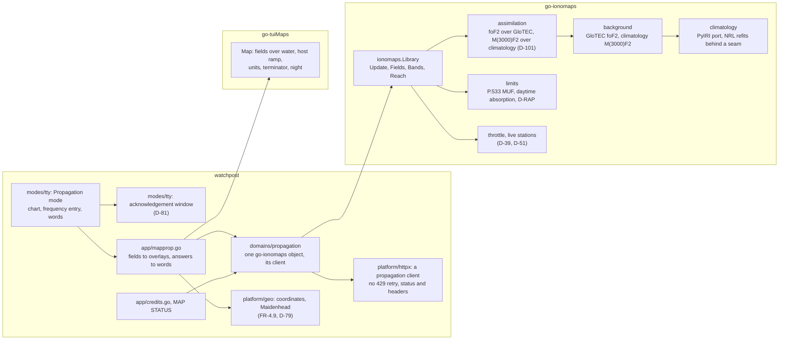

# Architecture

## Summary

**One place, three projects.**
- **watchpost** shows the reference chart in its map window's Propagation mode (D-21, D-76).
- **go-ionomaps** computes the fields and the answers (D-40, D-76).
- **go-tuiMaps** draws them (D-32 to D-36, D-65).

Nothing is fetched until the mode opens and its acknowledgement has been shown (D-81). The library is
asked through one object per process, on its own HTTP client that never retries a 429 (FR-4.4, FR-4.8).

watchpost's structure is kept:
- `domains/` are data sources;
- `platform/` is shared leaves;
- `modes/` are surfaces;
- `app/` is the composition root, and the only package that names a domain and what draws (`scripts/lint-imports.sh`; 0.18.0's plan, "Where new code lives").

## The pieces



| Path | Holds | Why there |
|---|---|---|
| `modes/tty/map_prop*.go` (new) | The Propagation mode beside Radar and Forecast (`modes/tty/map_temp.go:167` decides Radar mode today); the chart; the frequency entry; the hour step; the words; the acknowledgement window | every window is a file of package `tty`; the closed-set guards are package-internal |
| `modes/tty/dashboard.go` (`Config`, `:72`) | two seams beside `MapTemperature` (`:114`): `PropagationUpdate func(ctx) <-chan Snapshot` (the update's one owner, D-131) and `PropagationAnswers func(ctx, Snapshot, MapAsk) MapPropagation` (pure answers) | the window cannot import `domains/`; the app hands it functions (`MapAsk`, `modes/tty/map_prefs.go:556`) |
| `app/mapprop.go` (new) | turns go-ionomaps' fields into `tuimaps.Grid` overlays and its answers into the chart's rows and words; credits; MAP STATUS entries | the only package that may name a domain and what draws |
| `domains/propagation/` (new) | the one go-ionomaps object per process; the fetcher it is given; the acknowledgement's record read before the first fetch | a data source is a domain |
| `platform/geo/coords.go`, `maidenhead.go` (new) | one finite-checked coordinate parser and the Maidenhead parser, used by every resolver (FR-4.9, D-79) | shared and pure |
| `platform/httpx/` (existing) | a client built for propagation: no retry on 429, status and headers returned on every outcome, no shared pacing hold (FR-4.4) | the single door |
| `domains/locations/resolver.go` (existing) | the coverage gate made mode-aware (`:101-102`) | where the gate is |
| `platform/history/` (existing) | #27's fix only (FR-6.5) | the store |

## Opening the mode

```mermaid
sequenceDiagram
  participant L as Listener
  participant W as Propagation mode (UI goroutine)
  participant A as app/mapprop.go
  participant P as domains/propagation (the update's one owner)
  participant I as go-ionomaps
  participant N as GIRO / NOAA
  L->>W: the mode's key
  W->>W: acknowledgement seen? if not, show it (Enter/Esc)
  W->>P: PropagationUpdate(): start, or join the running update
  Note over P: its own context and a 60 s deadline; a keypress never cancels it; closing the mode does
  P->>I: Update(ctx)
  I->>I: throttle (D-39): a cancelled burst still spends the hour; too soon, answer from the last field
  I->>N: NOAA first (GloTEC newest by name or index, D-RAP, the scales; solar indices daily)
  N-->>I: replies
  I-->>P: Snapshot 1: GloTEC and the climatology, no stations yet (said)
  I->>N: GIRO since the last reading (one burst, at most 40)
  N-->>I: replies
  I-->>P: Snapshot 2: with the stations assimilated
  P-->>W: snapshot ready (Computed, inputs' times)
  W->>A: PropagationAnswers(snapshot, ask): off the UI goroutine
  A->>A: overlays (the hour on screen), best bands, reach, words; memo keyed on every input
  A-->>W: frames and words
  W-->>L: the picture or the words
  Note over W,P: while open, the refresh tick (10 min default) or the refresh-now key starts the next update
```

**The update and the answers are separate** (FR-1.17, FR-4.8; L-F9, P-4, P-5, P-6, A-29):
- **One owner runs the update.** `domains/propagation` runs one `Update` at a time, in its own command with its own context and a 60 s deadline (a burst of 39 took 36 s in PLAN), driven by a refresh tick while the mode is open (FR-4.10) or by the refresh-now key (D-120). A keypress never cancels it; closing the mode does (FR-4.2), and a cancelled GIRO burst still spends the hour's budget (D-39). NOAA is fetched first, so a first picture (GloTEC and the climatology, said as "no stations yet") comes before the GIRO burst ends.
- **Answers come from the last snapshot.** They are pure functions of it (R-2), asked in their own command, so an hour step or a new frequency is answered at once, never behind a GIRO burst.
- **Their memo key carries every input**: the snapshot's `Computed`, the origin, the hour, the frequency, the near-vertical radius (D-100) and the target set; a new snapshot or a changed Setting misses the memo; the centre is keyed separately. FR-8.2's guard covers this key.
- **A returned snapshot is immutable** (fresh slices on every update).
- **Only the hour on screen** is converted for go-tuiMaps (D-112).

## go-ionomaps' shape (signatures only)

Package `ionomaps`, module `github.com/branden-thompson/go-ionomaps`:

```go
type Fetcher interface {
    Fetch(ctx context.Context, url string, validators Validators) (Response, error)
}
type Response struct {
    Status     int
    Rate       RateHeaders // only the rate-related headers (D-83, FR-4.5); never a whole header (I-1)
    Validators Validators  // for the next ask
    Body       []byte      // empty on a 304 (Status says so)
}
type RateHeaders struct{ RetryAfter, Limit, Remaining, Reset string }
type Validators struct{ ETag, LastModified string }

type Options struct {
    Clock             func() time.Time
    Tables            Tables           // the refits, swappable (D-43, R-4.4)
}
// The reference circuit is fixed by ruling (D-73, D-91), so it is not an option.

func New(f Fetcher, o Options) (*Library, error)                                // the grid is 2° (R-1.1, D-138)
func (l *Library) Update(ctx context.Context, u UpdateOptions) (Snapshot, error) // pull; throttle inside (D-42); safe for concurrent use (R-5.6)

type UpdateOptions struct {
    CorrectNoReadings bool // per update, from the host's Setting: no new object, no new burst (D-105, persona N5)
}
func (l *Library) Sources() []Source                            // every source: name, host, terms, citation (R-4.1, D-113)

// A Snapshot is immutable: every Update returns fresh slices (P-6).
type Snapshot struct {
    Computed     time.Time    // the age is the host's clock minus this
    Hours        []Hour       // Hours[0] is now; then up to 24 hours ahead, typical, sharing the climatology cache's fields (R-1.3, D-109, D-131)
    NearestKm    []float32    // per cell: distance to the nearest assimilated station, one table per snapshot (R-2.11, D-116, D-131); a cell is measured within 500 km (R-3.2)
    Background   Backgrounds  // per field (D-101)
    Inputs       Inputs       // what fed it, and when (R-3.3, R-9.5, R-9.7, FR-5.1)
    Early        Reason       // why this is not from new data: none, too soon, GIRO paused, offline (R-5.4)
    Scales       Scales       // (D-88)
    Offset       Offset       // (D-105)
    TypicalError TypicalError // the hours ahead's error, with its basis (D-109)
}
type Backgrounds struct{ FoF2, M3000 Background } // foF2: GloTEC, else the climatology; M(3000)F2: the climatology
type Inputs struct {
    Stations, Rejected int           // readings used, and refused by range checks (R-3.3)
    GloTECValid        time.Time     // the grid's own valid time; zero when GloTEC was missing (FR-5.1)
    OldestReading      time.Time     // the oldest GIRO reading assimilated (R-5.7, FR-5.1)
    DRAPValid          time.Time     // zero when D-RAP was missing: no "disturbed" state (R-2.6)
    F107Mean           float32       // the 30-day mean used (D-104)
    F107Days           int           // observed days in it
    F107Age            time.Duration // since the solar file was last fetched
    CoordsExtrapolated bool          // past IGRF-14's last year (R-9.7)
}
type TypicalError struct {
    Bands []BandError // by distance to the nearest reporting station (D-134)
    Basis string      // where and when it was measured (D-109, D-134)
}
type BandError struct {
    UpToKm              float32 // 500, 1000, 2000, then no limit
    FoF2MHz, MUF3000MHz float32
}
type Scales struct {
    R, S, G int        // NOAA levels now, 0 to 5
    Outlook []DayScale // NOAA's next three days, as published
    Valid   time.Time  // zero when the feed is missing: never read as level 0
}
type DayScale struct {
    Day                        time.Time
    RMinorPct, RMajorPct, SPct int // NOAA's probabilities
    G                          int
}
type Offset struct {
    LiveMHz, TypicalMHz, SpreadMHz float32 // stations minus GloTEC, foF2
    Corrected                      bool    // the no-readings correction is in use
}

type Hour struct {
    At      time.Time
    MUF3000 Field
    FoF2    Field
}
type Field struct {
    West, South, East, North float64
    Cols, Rows               int
    Values                   []float32 // finite everywhere (R-3.3)
    NoData                   Bitset    // where no value is known (D-131)
}

// One place or many in one call (R-2.3), at most 64 places (R-3.5); bad input refused; no answer fetches.
// `at` falls in the hour that contains it (the hour starting at its UTC hour).
func (s Snapshot) At(points []LatLon, at time.Time) ([]Reading, error)                          // R-2.1
func (s Snapshot) Bands(origins []LatLon, radiusKm float64, at time.Time) ([][]BandStatus, error) // near-vertical (R-2.8)
func (s Snapshot) Path(from LatLon, to []LatLon, at time.Time) ([][]BandStatus, error)           // R-2.2
func (s Snapshot) Reach(origin LatLon, mhz float64, at time.Time) (Reach, error)                 // R-2.9

type Reading struct {
    FoF2, MUF3000 float32
    NoData        bool
    NearestKm     float32
}
type BandStatus struct {
    Band      Band    // 160 m ... 10 m
    Status    Status  // Open, AboveUpper, Absorbed, Disturbed, NoData (R-2.6)
    Limit     Limit   // which limit decided it, typed; the host writes the words (A-9)
    LimitMHz  float32
    OpenHours []Span  // the UTC day's typical open hours, from the climatology (R-2.8, D-135)
    NearestKm float32 // (D-116)
}
type Reach struct {
    SkipKm, MaxKm float64
    Area          Field // reached or not, for go-tuiMaps' host ramp (L-2.2) and its non-colour edge (L-2.6)
    Limit         Limit
}
```

Internal packages: go-ionomaps' design (`03-architecture-design/design.md`, "Packages") holds the one list (C-U3).

## go-tuiMaps v0.3.0, as watchpost uses it

| Library row | watchpost's use |
|---|---|
| L-1 fields over water, per overlay | both propagation fields cross the sea (FR-1.6); weather fields still stop at the shore |
| L-2.1 `muf`, `fof2` presets | the two layers' fills and legends (FR-1.5) |
| L-2.2 generic host ramp | the reach area, a two-class field (FR-1.16) |
| L-3 units on labels and in `Report` | MHz on contours, and the words' units (FR-3.2) |
| L-4 terminator and night, said in words (L-4.4) | the day/night line and the words' "day or night" (FR-1.5, FR-3.1) |
| L-6 `SafeRamps` for every scale | themes cannot repaint the MUF ramps under `SafeRamps` |
| L-7 shade key, default depth, colour-only marks, checked dialer | readable at 16 colours and none |

## Data and cost per update

| Source | Each update | Since |
|---|---|---|
| GIRO | about 39 requests, readings since the last held (R-5.2), tens of KB | D-39, D-51 |
| NOAA GloTEC | the newest grid (timestamped, so never a 304), about 2.5 MB decoded and about 0.27 MB gzipped; while open, each new grid every 10 minutes by default; the wire cost re-ruled from W0.0 (D-111) | FR-4.6, D-94, D-111 |
| NOAA D-RAP | about 42 KB, or a 304 | D-47 |
| NOAA space-weather scales | about 1.1 KB, or a 304 | D-88 |
| NOAA daily solar indices | about 3 KB, at most once a day | D-104 |
| compute | a GP over about 39 stations, two fields, a 2° grid | G-G1, set in the dry run |

## When things fail

| Failure | What the listener sees | Where held |
|---|---|---|
| GIRO refuses (429) | the last good field, its age, "GIRO paused", back-off 60 s to 15 min | go-ionomaps R-5.3; FR-5.2 |
| GIRO blocks for good | the GloTEC background alone, named | D-40, D-75; F-208 |
| GloTEC missing | the climatology fallback, named | FR-5.2 |
| D-RAP missing | no "disturbed" state; said | R-2.6 |
| scales missing | no level named, and the gap said; never shown as level 0 | FR-1.18 |
| solar indices missing | the last 30-day F10.7 mean held, with its age and the days in it, said | R-9.5 |
| past IGRF-14's last year | the coordinates said to be extrapolated; a test fails a margin before it ships | R-9.7 |
| a hostile or broken reply | the value refused and counted; never NaN on the map | R-3.3 |
| offline | the last good field with its age, or "no data yet" naming the refresh-now key (D-120) | FR-5.2; 0.18.0 D-124 |

## Release order

1. go-tuiMaps v0.3.0 release candidates (L-1 to L-7), tagged first.
2. go-ionomaps v0.1.0 release candidates: the library, then its own gate.
3. watchpost pins both candidates in BUILD and ships on their final tags (D-3).
