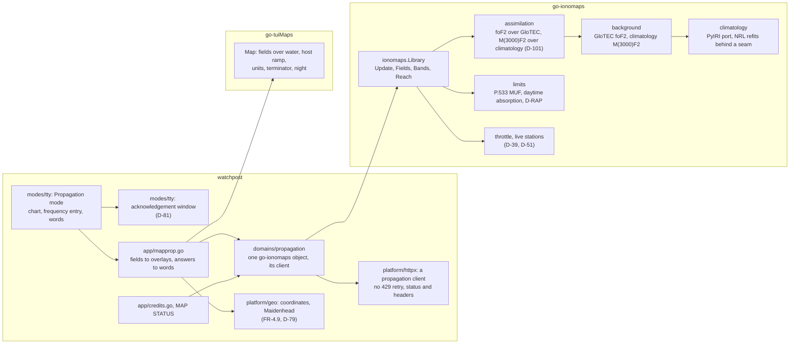

# Architecture

## Summary

**One place, three projects.**
- **watchpost** shows the reference chart in its map window's Propagation mode (D-21, D-76).
- **go-ionomaps** computes the fields and the answers (D-40, D-76).
- **go-tuiMaps** draws them (D-32 to D-36, D-65).

Nothing is fetched until the mode opens and its acknowledgement has been shown (D-81). The library is
asked through one object per process, on its own HTTP client that never retries a 429 (FR-4.4, FR-4.8).

watchpost's structure is kept:
- `domains/` are data sources;
- `platform/` is shared leaves;
- `modes/` are surfaces;
- `app/` is the composition root, and the only package that names a domain and what draws (`scripts/lint-imports.sh`; 0.18.0's plan, "Where new code lives").

## The pieces



| Path | Holds | Why there |
|---|---|---|
| `modes/tty/map_prop*.go` (new) | The Propagation mode beside Radar and Forecast (`modes/tty/map_temp.go:167` decides Radar mode today); the chart; the frequency entry; the hour step; the words; the acknowledgement window | every window is a file of package `tty`; the closed-set guards are package-internal |
| `modes/tty/dashboard.go` (`Config`, `:72`) | a new `MapPropagation func(ctx, ask MapAsk) MapPropagation`, beside `MapTemperature` (`:114`) | the window cannot import `domains/`; the app hands it functions (`MapAsk`, `modes/tty/map_prefs.go:556`) |
| `app/mapprop.go` (new) | turns go-ionomaps' fields into `tuimaps.Grid` overlays and its answers into the chart's rows and words; credits; MAP STATUS entries | the only package that may name a domain and what draws |
| `domains/propagation/` (new) | the one go-ionomaps object per process; the fetcher it is given; the acknowledgement's record read before the first fetch | a data source is a domain |
| `platform/geo/coords.go`, `maidenhead.go` (new) | one finite-checked coordinate parser and the Maidenhead parser, used by every resolver (FR-4.9, D-79) | shared and pure |
| `platform/httpx/` (existing) | a client built for propagation: no retry on 429, status and headers returned on every outcome, no shared pacing hold (FR-4.4) | the single door |
| `domains/locations/resolver.go` (existing) | the coverage gate made mode-aware (`:101-102`) | where the gate is |
| `platform/history/` (existing) | #27's fix only (FR-6.5) | the store |

## Opening the mode

```mermaid
sequenceDiagram
  participant L as Listener
  participant W as Propagation mode (UI goroutine)
  participant A as app/mapprop.go
  participant P as domains/propagation
  participant I as go-ionomaps
  participant N as GIRO / NOAA
  L->>W: the mode's key
  W->>W: acknowledgement seen? if not, show it (Enter/Esc)
  W->>A: MapPropagation(ask), off the UI goroutine
  A->>P: snapshot for the hour
  P->>I: Update(now)
  I->>I: throttle: within D-39? else answer from the last good field
  I->>N: GIRO since the last reading; GloTEC newest (304 if unchanged); D-RAP; the scales
  N-->>I: replies
  I->>I: parse, range-check, assimilate, limits
  I-->>P: Snapshot (fields, valid, age, sources, background)
  P-->>A: Snapshot
  A->>A: overlays, best bands, reach, words
  A-->>W: MapPropagation (frames ready, words, notes)
  W-->>L: the picture or the words
```

**Off the UI goroutine** (FR-1.17, FR-4.8): `Update` and every answer (best bands, reach, centre) run in a
command, as `MapTemperature` does today (`app/maptemp.go:163`). A keypress that changes the hour or the
frequency asks again; an answer arriving for a superseded ask is dropped (the memo key carries the ask).

## go-ionomaps' shape (signatures only)

Package `ionomaps`, module `github.com/branden-thompson/go-ionomaps`:

```go
type Fetcher interface {
    Fetch(ctx context.Context, url string, validators Validators) (Response, error)
}
type Response struct {
    Status     int
    Header     http.Header // rate headers and validators; never logged whole (D-83)
    Body       []byte
    NotChanged bool        // a 304 against the validators
}
type Validators struct{ ETag, LastModified string }

type Options struct {
    Grid      float64       // 2 by default, 1 as an option (R-1.1)
    Reference Circuit       // SSB voice, 100 W, +13 dB in 2.5 kHz (D-73, D-91)
    Clock     func() time.Time
    Tables    Tables        // the climatology's coefficients, swappable (D-43, R-4.4)
}

func New(f Fetcher, o Options) (*Library, error)
func (l *Library) Update(ctx context.Context) (Snapshot, error) // pull; throttle inside (D-42)

type Snapshot struct {
    Valid, Computed time.Time
    Hours           []Hour     // now, then up to 24 hours ahead, typical (R-1.3, D-109)
    Background      Background // GloTEC or Climatology (FR-5.2)
    Scales          Scales     // NOAA's R, S and G, named not modelled (D-88)
    Offset          Offset     // live and typical GloTEC-against-stations offsets (D-105)
    Sources         []Source   // name, terms, citation (R-4.1)
    Stale           bool
    Age             time.Duration
}
type Scales struct {
    R, S, G int        // NOAA levels now, 0 to 5
    Outlook []DayScale // NOAA's next three days, as published
    Valid   time.Time  // zero when the feed is missing: never read as level 0
}
type Offset struct {
    LiveMHz, TypicalMHz, SpreadMHz float32 // stations minus GloTEC, foF2
    Corrected                      bool    // the no-readings correction is in use
}
type DayScale struct {
    Day                      time.Time
    RMinorPct, RMajorPct, SPct int // NOAA's probabilities
    G                        int
}

type Hour struct {
    At       time.Time
    Typical  bool    // an hour ahead: the climatology for that hour (D-109)
    MUF3000  Field
    FoF2     Field
}
type Field struct {
    West, South, East, North float64
    Cols, Rows               int
    Values                   []float32 // NaN for no data; never Inf (R-3.3)
}

func (s Snapshot) Bands(origin LatLon, radiusKm float64, at time.Time) []BandStatus // near-vertical (R-2.8)
func (s Snapshot) Path(a, b LatLon, at time.Time) []BandStatus                      // R-2.2
func (s Snapshot) Reach(origin LatLon, mhz float64, at time.Time) Reach             // R-2.9

type BandStatus struct {
    Band      Band      // 160 m ... 10 m
    Status    Status    // Open, AboveUpper, Absorbed, Disturbed, NoData (R-2.6)
    Limit     string    // which limit decided it
    OpenHours []Span    // today (R-2.8)
}
type Reach struct {
    SkipKm, MaxKm float64
    Area          Field // reached or not, for go-tuiMaps' host ramp (L-2.2)
    Limit         string
}
```

Internal packages (no exported surface): `giro` (FastChar requests and parsing, header lines dropped first,
R-3.4), `glotec` (typed GeoJSON, R-8.2), `drap`, `climatology` (the PyIRI port over `Tables`), `assimilate`
(the Gaussian process on the sphere, R-9.2), `limits` (P.533 path MUF, daytime absorption, D-RAP), `throttle`,
`stations` (seed and rotation, R-5.5), `terms`.

## go-tuiMaps v0.3.0, as watchpost uses it

| Library row | watchpost's use |
|---|---|
| L-1 fields over water, per overlay | both propagation fields cross the sea (FR-1.6); weather fields still stop at the shore |
| L-2.1 `muf`, `fof2` presets | the two layers' fills and legends (FR-1.5) |
| L-2.2 generic host ramp | the reach area, a two-class field (FR-1.16) |
| L-3 units on labels and in `Report` | MHz on contours, and the words' units (FR-3.2) |
| L-4 terminator and night, said in words (L-4.4) | the day/night line and the words' "day or night" (FR-1.5, FR-3.1) |
| L-6 `SafeRamps` for every scale | themes cannot repaint the MUF ramps under `SafeRamps` |
| L-7 shade key, default depth, colour-only marks, checked dialer | readable at 16 colours and none |

## Data and cost per update

| Source | Each update | Since |
|---|---|---|
| GIRO | about 39 requests, readings since the last held (R-5.2), tens of KB | D-39, D-51 |
| NOAA GloTEC | the newest grid, about 2.5 MB, or a 304; while open, each new grid every 10 minutes by default (about 15 MB an hour) | FR-4.6, D-94 |
| NOAA D-RAP | about 42 KB, or a 304 | D-47 |
| NOAA space-weather scales | about 1.1 KB, or a 304 | D-88 |
| NOAA daily solar indices | about 3 KB, at most once a day | D-104 |
| compute | a GP over about 39 stations, two fields, a 2° grid | G-G1, set in the dry run |

## When things fail

| Failure | What the listener sees | Where held |
|---|---|---|
| GIRO refuses (429) | the last good field, its age, "GIRO paused", back-off 60 s to 15 min | go-ionomaps R-5.3; FR-5.2 |
| GIRO blocks for good | the GloTEC background alone, named | D-40, D-75; F-208 |
| GloTEC missing | the climatology fallback, named | FR-5.2 |
| D-RAP missing | no "disturbed" state; said | R-2.6 |
| scales missing | no level named, and the gap said; never shown as level 0 | FR-1.18 |
| a hostile or broken reply | the value refused and counted; never NaN on the map | R-3.3 |
| offline | the last good field with its age, or "no data yet" with the way to retry | FR-5.2; 0.18.0 D-124 |

## Release order

1. go-tuiMaps v0.3.0 release candidates (L-1 to L-7), tagged first.
2. go-ionomaps v0.1.0 release candidates: the library, then its own gate.
3. watchpost pins both candidates in BUILD and ships on their final tags (D-3).
