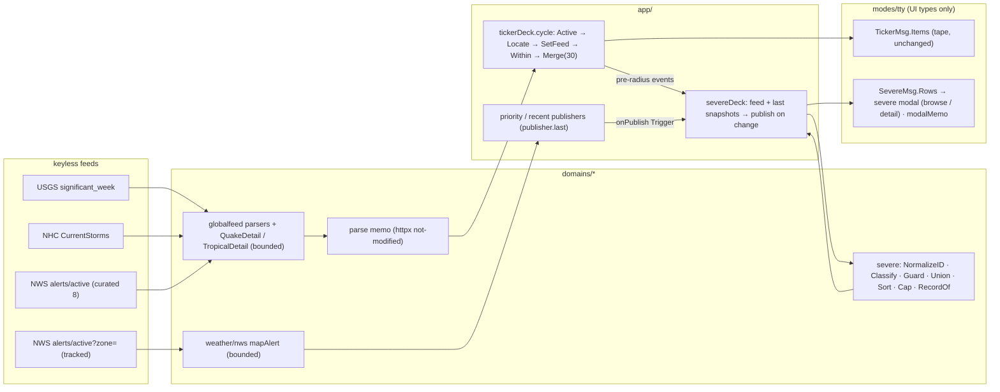
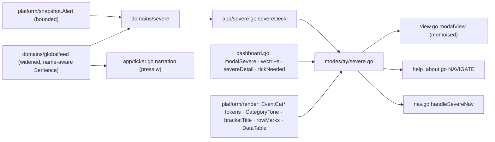
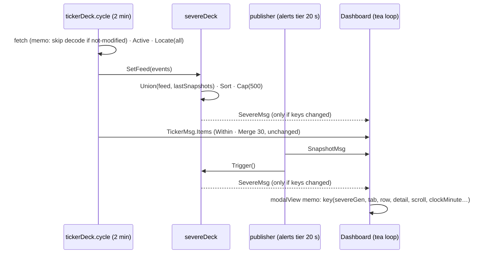

# Severe Weather / Disaster Events modals — PLAN (architecture & design)

**Feature:** `severe-alerts-modals` · **Target:** 0.13.0 · **Phase:** PLAN (FULL PLAN · FULL DIAGRAMS · FULL TDD)
**Status:** ALL RATIFIED — HUM LEAD 2026-08-28, SAM-D-26: "All recs approved; we can fine tune in UAT once the
feature is built" (AX-1 = A; M-1..M-6; N-1; P-1). Implementation plan: `04-development/implementation-plan.md`.
**Inputs:** `01-objectives/objectives.md` (FR-1..15, NFR-1..14, RS-1..17), `02-analysis/data-shape.md`,
`08-reports/discover-report.md`. Decisions continue the `SAM-D-n` namespace.

## 0. Perf spike (NFR-2 inputs, measured 2026-08-28, `go test ./modes/tty -bench Frame`)

| Frame @ 133×44 | allocs/op | ns/op |
|---|---|---|
| Closed, memo hit | 554 | 0.14 ms |
| Closed, memo miss | 7 126 | 0.40 ms |
| Help modal open (static list, unmemoised) | 4 422 | 1.0 ms |

An open modal costs ~8× the closed hit frame every 300 ms today. Provisional budgets to pin after FR-10 lands
(BUILD task 1 re-measures): **open-modal hit ≤ 1 500**, **open-modal miss ≤ 12 000**, closed frames unchanged,
80×24 row added.

## 1. Approaches (PLAN Step 2 — rulings SAM-D-25)

| Axis | Options | Ruling |
|---|---|---|
| AX-1 join location | (A) app-layer domain package · (B) TTY composes | **A** — evaluated in §2 at HUM LEAD's direction ("I like A … separation of concerns … reuse in other features/applications … deeper discovery at PLAN"); ratified SAM-D-26 |
| AX-2 detail model | (A) per-class structs · (B) flat `Event` · (C) ordered `[]Field` | **A** |
| AX-3 detail-view state | (A) `severeDetail bool` · (B) enum + breadcrumb | **A** |
| AX-4 memo scope | (A) modal family · (B) new modal only | **A** |
| AX-5 table composition | (A) go-studs `DataTable` + local chrome · (B) local composer | **A** |
| AX-6 parse-memo key | (A) httpx not-modified flag · (B) sha256 | **A** (B fallback) |

## 2. AX-1 evaluation — the concrete shape of approach A

### 2.1 Where the two streams actually meet today

| Stream | Producer | Cadence | Retained where |
|---|---|---|---|
| Global feed events (USGS/NHC/NWS-national) | `tickerDeck.cycle` goroutine (`app/ticker.go:145-201`) | every 2 min | nowhere after the cycle (only ids in the seen-store) |
| Tracked-location alerts (`snapshot.Location.Alerts`) | priority + recent `publisher`s (`app/pipelines.go:73-117`) | alerts tier 20 s (priority); coalesced 50 ms / 5 s windows | **`publisher.last` (atomic pointer, `pipelines.go:45`, `:117`)** — already retained |

So the join in the app needs no new retention for the snapshot half: `lp.priority.pub.lastSnapshot()` and
`lp.recent.pub.lastSnapshot()` already hold the latest published snapshots. Only the feed half needs a slot.

### 2.2 The package, the deck, the UI contract — pointers, not copies

The code is owned by the implementation plan and written there in full, RED-test-first; this section
carries intent only (red-team PLAN B-10: a second copy drifted twice in one day).

- **`domains/severe`** — pure, no goroutines, no UI types: normalise ids (OID grammar), classify products
  into the six tabs, apply the guarded superseded rule to both paths, union the feed events with the tracked
  locations' alerts (location record wins, feed point/label merges in), sort Declared DESC, cap at 500,
  bucket by tab, and compose the `[A]`-shaped record — the ONE class type switch. → `04-development/p1-domain.md`
  Tasks 1.8 (index) and 1.9 (record).
- **`app/severe.go` `severeDeck`** — the join: the ticker cycle hands over the pre-radius, `Locate`d feed
  events plus each source's health; the publishers' existing `onPublish` closures poke it; `publish` is
  **serialised end to end** and sends a `SevereMsg` only when the row set or a source's health changed;
  `Updated` is the newest successful fetch (dataAsOf), never the publish time. → `p2-app.md` Tasks 2.1–2.3.
- **`modes/tty` contract** — `SevereMsg{Rows, Totals (pre-cap, per tab), Updated, Sources, Gen}`; rows carry
  pre-formatted zone-correct times and the composed record; the TTY never imports the domain. → `p3-tty.md`
  Task 3.2.

### 2.5 Reuse story (HUM LEAD's criterion)

- **`modes/report`** can list severe events tomorrow: `severe.Union` over the report's snapshot + a one-shot
  feed fetch — no TTY involved.
- A future `watchpost severe --json` or an HTTP/JSON surface serialises `[]severe.Row` directly.
- The radio synth could read `severe.ByTab` for a "severe events" segment without touching the TTY.
- None of that is possible under (B), where the union lives in `modes/tty`.

### 2.6 A vs B on the concrete shape

| Criterion | (A) `domains/severe` + `severeDeck` | (B) TTY composes |
|---|---|---|
| New code | package (~250 lines + tests) + deck (~80) + 3 trigger lines | helpers in `modes/tty` (~250 lines) + recompute on 2 messages |
| Domain logic location | domain package, unit-tested with fixtures, no model needed | TTY package, tested through the model |
| Cross-goroutine risk | one mutex, copy-on-publish, sends only on change | none (all in the update loop) |
| Perf | recompute off the UI loop; TTY receives finished rows; zone lookups off the render path | recompute in the update loop on every SnapshotMsg (≤ every 20 s) unless memoised |
| Seam rule ("app maps domain → UI type") | kept: `SevereMsg` mirrors `TickerMsg` | bent: classification/id/guard logic in the TTY |
| Reuse | report mode, JSON, radio — free | none without a later extraction |
| Testability of the join | `severeDeck` tested with a capture `send` (the `tickerDeck` precedent) | model tests only |

**Recommendation: (A).** The join point HUM LEAD worried about is already solved by `publisher.last`; the
deck is the `tickerDeck` pattern in miniature; the reuse criterion is only met by A.

## 3. Selected architecture (AX-1 = A, SAM-D-26)

### 3.1 Components

| Component | Package / file | Responsibility |
|---|---|---|
| Feed parsers (widened) | `domains/globalfeed/{usgs,nhc,nws}.go` + `detail.go` (new) | decode the render list + name; per-class `QuakeDetail` / `TropicalDetail`; bounds (`clampField`, ranges, prose cap 4 000, `parameters` allowlist) |
| Parse memo | `domains/globalfeed/source.go` (new) wrapping each `Source.Fetch` | skip decode when httpx reports not-modified (AX-6); `fire.Memo[T]` instantiation as fallback |
| Location alerts (bounded) | `domains/weather/nws/alerts.go` `mapAlert` | apply the same bounds; keep `References`, `SenderName`, `Sent` |
| Unified index | `domains/severe/*.go` (new) | §2.2 |
| Publish path | `app/ticker.go` `cycle` (Locate before radius; `SetFeed`), `app/severe.go` `severeDeck`, `app/pipelines.go` triggers | §2.3 |
| UI types + modal | `modes/tty/severe.go` (new: state, nav, tabs table, browse/detail composition), `modes/tty/dashboard.go` (enum value, key, `toggleModal`, `tickNeeded`), `modes/tty/nav.go` (route), `modes/tty/view.go` (`modalView`, `modalWidth`, memo) | FR-1..4, FR-9, FR-13..15 |
| Modal memo | `modes/tty/memo.go` (`modalMemo`) | FR-10 — memoise `modalView(o)` for every modal |
| Tokens + tone | `platform/render/theme.go`, `sgr.go` (`CategoryTone`) | FR-6, NFR-14 |
| Narration | `app/ticker.go` strings; `globalfeed.Event.Sentence()` name-aware | FR-8, FR-12 |
| Help | `modes/tty/help_about.go` NAVIGATE group | NFR-8 |
| PTY journeys | `scripts/quality/severe-modal.expect` (new) | NFR-9 |

### 3.2 The tab registry (FR-2; red-team C-19)

```go
type severeTab struct {
    Label, Short string        // "Spec. Statements" / "Stmts"
    Tone         render.Token  // EventCatOrangeBG …
    Empty        string        // "No active warnings events"
    WatchlistHint bool         // Advisories, Statements: "(tracks your watchlist — add locations with ctrl+a)"
}
func severeTabs() []severeTab { return []severeTab{ {"Warnings","Warn",render.EventCatOrangeBG,…}, {"Watches","Watch",EventCatYellowBG,…}, {"Advisories","Advis",Yellow,…,true}, {"Spec. Statements","Stmts",Yellow,…,true}, {"Sig. Quakes","Quakes",Red,…}, {"Tropical","Tropical",Blue,…} } }
```
Classification (product → tab) lives in `domains/severe.Classify`; the TTY table is presentation only.

### 3.3 Tokens and tone (FR-6, E-3)

`EventCatRedBG "48;2;58;18;18"`, `EventCatOrangeBG "48;2;64;36;10"`, `EventCatYellowBG "48;2;60;52;14"`,
`EventCatBlueBG "48;2;14;34;64"` — fixed, pre-darkened tints in `defaultTheme()` next to the Ticker block
(values are HUM LEAD's colour pass to adjust at UAT); Monochrome overrides to the ticker's grey ladder.
`CategoryTone(hue Token, dark)` returns `(Tok(AlertModalText), mixBG(tint, substrate, categoryBlend))` with
`categoryBlend = 0.6` of the pre-darkened tint over `ModalBGDark`/`ModalBGLight` (≈ 0.30 of the pure hue —
one constant, tuned at UAT); the tab registry owns which tab wears which token (RS-11; red-team PLAN B-9). Guard test iterates `ThemeNames()` with a planted override as the positive control.

### 3.4 Modal memo (FR-10, AX-4 A)

`modalKey{ modal, width, height, modalScroll, alertIdx, selected, snap, recent, severeGen, severeTab,
severeRow, severeDetail, severeScroll, units, ascii, theme, darkBG, clockMinute, statsGen }` — one field per
input any modal renderer reads; **no `shimmer`** (P4); `clockMinute = now.Unix()/60` covers Status/Details
ages; `statsGen` bumps in the Stats hook. Slot `modalMemo{mu, ok, key, out string, hits, misses}` beside
`bodyMemo`. `modalView` becomes: key → hit? return `out` : render → store. Positive control: frozen clock,
20 ticks with a loading row → 1 miss / 19 hits; and every modal rendered twice byte-identical.

### 3.5 Browse composition (AX-5 A)

Columns through go-studs `DataTable` (`NoAutoStyle`, explicit width): marks 7 (`›`, `▶`, severity glyph in
the `rowMarks` idiom) · `001.` 5 · EVENT fill · LOCATION 22 · DECLARED 15 · EXPIRES 15, gutters 2. Degrade
(`layoutFor` idiom): drop EXPIRES below 22 EVENT cells, then DECLARED, then LOCATION → 16. Header cells are
`bracketTitle` bands (`[  E V E N T  ]`, unspreading when narrow). The table rows alone carry the rail
(`railify`, `body.go:293` — the RECENT-table precedent, exactly the mock's ▲…▼ span); the tab row, category
line, total and chips are fixed. Tabs degrade `[ › Warnings ]` → `[›Warnings]` → `[›Warn]` (`alertCompactLine`
idiom). Only the visible window is wrapped (P5). Sort/zone at publish (P9).

### 3.6 Publish path (FR-11)

`cycle`: fetch → `Active` → **`Locate` on the full set** → `deck.SetFeed(events)` → radius `Within` (the tape's
filter only) → superseded strip → `Merge` cap 30 → `TickerMsg.Items` (unchanged). `severeDeck.publish`:
`Union(feed, locations)` with `NormalizeID` (OID grammar) and `Guard` on both halves → `Sort` → `Cap(500)` →
`SevereMsg` on change. `TickerMsg` itself is untouched (C-17 said "a field on TickerMsg"; a sibling message
from the deck is the same seam with independent cadence — noted as the one deviation, for the ruling).

## 4. Diagrams (FULL DIAGRAMS — Mermaid; FigJam skipped by rule: no Figma workspace belongs to this project)

### 4.1 Architecture



### 4.2 Component relationships



### 4.3 Data flow (one cycle + one alerts tier)



### 4.4 Modal states (AX-3 A)

```mermaid
stateDiagram-v2
    [*] --> Dashboard
    Dashboard --> Browse: w / ctrl+s (tab = breaking<10min ? its tab : Warnings; severeDetail=false)
    Browse --> Browse: left/right tab · up/down row · scroll
    Browse --> Detail: enter (severeDetail=true, scroll=0)
    Detail --> Detail: up/down scroll
    Detail --> Browse: esc (severeDetail=false)
    Browse --> Dashboard: esc (close)
    Dashboard --> Dashboard: w inert while Setup/Add/Remove/Theme/Voice capture keys
```



## 5. Mocks (rendered by the column math, not hand-typed — `02-analysis/mocks/mock.py`, committed; re-run it before touching Task 3.5)

Panel corners: the app's `PanelColored` draws square corners (UAT 10.5) and `[A]` uses it; the intake mock
had rounded corners — **ratification item M-1** (square, for R-7 consistency, is what is drawn).

### 5.1 Browse — 120 columns (modal 110)

```
┌── SEVERE WEATHER / DISASTER EVENTS ───────────────────────────────────── Updated 08/28/2026 15:38:05 PDT ──┐
│                                                                                                            │
│    [ › Warnings ] [ Watches ] [ Advisories ] [ Spec. Statements ] [ Sig. Quakes ] [ Tropical ]             │
│                                                                                                            │
│    Warnings — 9 active                                                                                     │
│              [           E V E N T           ]  [  L O C A T I O N   ]  [  DECLARED   ]  [E X P I R E S] ▲ │
│  ›  ▶ ⚠ 001. Extreme Heat Warning               Wicomico, MD            08/28 11:20 EDT  08/28 20:00 EDT █ │
│       ⚠ 002. Tornado Warning                    Olathe, KS              08/28 08:45 CDT  08/28 09:00 CDT │ │
│       ⚠ 003. Flash Flood Warning                Palomar Mountain, CA    08/28 09:30 PDT  08/28 10:45 PDT │ │
│       ⚠ 004. Severe Thunderstorm Warning        San Diego, CA           08/28 07:00 PDT  08/28 13:00 PDT │ │
│       ⚠ 005. Gale Warning                       Cape Cod Bay, MA        08/28 05:12 EDT  08/29 06:00 EDT │ │
│       ⚠ 006. Red Flag Warning                   Kern County Mtns, CA    08/28 04:00 PDT  08/28 20:00 PDT ▼ │
│                                                                                  9 Total Category Events   │
│                                                                                                            │
│    [↑↓] Navigate  [←→] Category  [enter] Event Details  [esc] Close                                        │
└────────────────────────────────────────────────────────────────────────────────────────────────────────────┘
```
Colour pass (HUM LEAD directs): the selected tab chip and the tile carry the category tint; `›` bold white
(`FocusPointer`); `⚠` toned by severity tier (`⚠⚠` for Red-tier rows: `!!` under `--ascii`); title bold white.

### 5.2 Browse — 100 columns (modal 93): EXPIRES dropped, tabs unspread

```
┌── SEVERE WEATHER / DISASTER EVENTS ──────────────────── Updated 08/28/2026 15:38:05 PDT ──┐
│                                                                                           │
│    [›Warnings] [Watches] [Advisories] [Spec. Statements] [Sig. Quakes] [Tropical]         │
│                                                                                           │
│    Warnings — 9 active                                                                    │
│              [           E V E N T           ]  [  L O C A T I O N   ]  [  DECLARED   ] ▲ │
│  ›  ▶ ⚠ 001. Extreme Heat Warning               Wicomico, MD            08/28 11:20 EDT █ │
│       ⚠ 002. Tornado Warning                    Olathe, KS              08/28 08:45 CDT │ │
│       ⚠ 003. Flash Flood Warning                Palomar Mountain, CA    08/28 09:30 PDT │ │
│       ⚠ 004. Severe Thunderstorm Warning        San Diego, CA           08/28 07:00 PDT │ │
│       ⚠ 005. Gale Warning                       Cape Cod Bay, MA        08/28 05:12 EDT │ │
│       ⚠ 006. Red Flag Warning                   Kern County Mtns, CA    08/28 04:00 PDT ▼ │
│                                                                 9 Total Category Events   │
│                                                                                           │
│    [↑↓] Navigate  [←→] Category  [enter] Event Details  [esc] Close                       │
└───────────────────────────────────────────────────────────────────────────────────────────┘
```

### 5.3 Browse — 80 columns (modal 73): DECLARED dropped, short tabs

```
┌── SEVERE WEATHER / DISASTER EVENTS ───────────────────────────────────┐
│                                                                       │
│    [›Warn] [Watch] [Advis] [Stmts] [Quakes] [Tropical]                │
│                                                                       │
│    Warnings — 9 active                                                │
│              [         E V E N T          ]  [  L O C A T I O N   ] ▲ │
│  ›  ▶ ⚠ 001. Extreme Heat Warning            Wicomico, MD           █ │
│       ⚠ 002. Tornado Warning                 Olathe, KS             │ │
│       ⚠ 003. Flash Flood Warning             Palomar Mountain, CA   │ │
│       ⚠ 004. Severe Thunderstorm Warning     San Diego, CA          │ │
│       ⚠ 005. Gale Warning                    Cape Cod Bay, MA       │ │
│       ⚠ 006. Red Flag Warning                Kern County Mtns, CA   ▼ │
│                                             9 Total Category Events   │
│                                                                       │
│    [↑↓] Navigate  [←→] Category  [enter] Event Details  [esc] Close   │
└───────────────────────────────────────────────────────────────────────┘
```

### 5.4 Browse — 120 columns, `--ascii` (FR-13)

```
+-- SEVERE WEATHER / DISASTER EVENTS ------------------------------------- Updated 08/28/2026 15:38:05 PDT --+
|                                                                                                            |
|    [ > Warnings ] [ Watches ] [ Advisories ] [ Spec. Statements ] [ Sig. Quakes ] [ Tropical ]             |
|                                                                                                            |
|    Warnings — 9 active                                                                                     |
|              [           E V E N T           ]  [  L O C A T I O N   ]  [  DECLARED   ]  [E X P I R E S] ^ |
|  >  * ! 001. Extreme Heat Warning               Wicomico, MD            08/28 11:20 EDT  08/28 20:00 EDT # |
|       ! 002. Tornado Warning                    Olathe, KS              08/28 08:45 CDT  08/28 09:00 CDT | |
|       ! 003. Flash Flood Warning                Palomar Mountain, CA    08/28 09:30 PDT  08/28 10:45 PDT | |
|       ! 004. Severe Thunderstorm Warning        San Diego, CA           08/28 07:00 PDT  08/28 13:00 PDT | |
|       ! 005. Gale Warning                       Cape Cod Bay, MA        08/28 05:12 EDT  08/29 06:00 EDT | |
|       ! 006. Red Flag Warning                   Kern County Mtns, CA    08/28 04:00 PDT  08/28 20:00 PDT v |
|                                                                                  9 Total Category Events   |
|                                                                                                            |
|    [up/dn] Navigate  [lt/rt] Category  [enter] Event Details  [esc] Close                                  |
+------------------------------------------------------------------------------------------------------------+
```

### 5.5 Empty state — Advisories, empty watchlist (FR-14)

```
┌── SEVERE WEATHER / DISASTER EVENTS ───────────────────────────────────── Updated 08/28/2026 15:38:05 PDT ──┐
│                                                                                                            │
│    [ Warnings ] [ Watches ] [ › Advisories ] [ Spec. Statements ] [ Sig. Quakes ] [ Tropical ]             │
│                                                                                                            │
│    Advisories — no active events                                                                           │
│                                                                                                            │
│    No active advisories events · Updated 08/28 15:38 PDT                                                   │
│    (tracks your watchlist — add locations with ctrl+a)                                                     │
│                                                                                                            │
│                                                                                  0 Total Category Events   │
│                                                                                                            │
│    [↑↓] Navigate  [←→] Category  [enter] Event Details  [esc] Close                                        │
└────────────────────────────────────────────────────────────────────────────────────────────────────────────┘
```

### 5.6 Detail — NWS warning (the `[A]` record shape; Orange tint)

```
┌── SEVERE WEATHER / DISASTER EVENTS ─── Warnings · 2 / 9 ──────────────── Updated 08/28/2026 15:38:05 PDT ──┐
│                                                                                                            │
│    TORNADO WARNING  [Extreme · Immediate · Observed]                                                       │
│    Declared 08/28 08:45 CDT   Expires 08/28 09:00 CDT   (~15m)                                             │
│    Area: Johnson County, KS · NWS Kansas City/Pleasant Hill MO                                             │
│                                                                                                          ▲ │
│    At 845 AM CDT, a severe thunderstorm capable of producing a tornado was located near Olathe, moving   █ │
│    northeast at 30 mph.                                                                                  │ │
│      - HAZARD: Damaging tornado and quarter size hail.                                                   │ │
│      - SOURCE: Radar indicated rotation.                                                                 │ │
│      - IMPACT: Flying debris will be dangerous to those caught without shelter.                          │ │
│                                                                                                          │ │
│    Instructions: TAKE COVER NOW! Move to a basement or an interior room on the lowest floor of a         ▼ │
│                                                                                                            │
│    [esc] Back  [esc esc] Close  [↑↓] Scroll                                                                │
└────────────────────────────────────────────────────────────────────────────────────────────────────────────┘
```

### 5.7 Detail — significant quake (Red tint)

```
┌── SEVERE WEATHER / DISASTER EVENTS ─── Sig. Quakes · 1 / 3 ───────────── Updated 08/28/2026 15:38:05 PDT ──┐
│                                                                                                            │
│    M 5.8 EARTHQUAKE  [Magnitude 5.8 mww · Depth 61 km · PAGER green · Tsunami no]                          │
│    Recorded 08/28 03:12 PDT   Updated 08/28 05:25 PDT                                                      │
│    Location: 55 km NW of Kodāri, Nepal (27.94 N, 85.62 E)                                                  │
│                                                                                                            │
│    Felt reports 153 · Community intensity 5.7 · Modelled intensity 4.6 · Significance 651 · Reviewed       │
│                                                                                                            │
│    [esc] Back  [esc esc] Close                                                                             │
└────────────────────────────────────────────────────────────────────────────────────────────────────────────┘
```

### 5.8 Detail — tropical cyclone (Blue tint)

```
┌── SEVERE WEATHER / DISASTER EVENTS ─── Tropical · 1 / 2 ──────────────── Updated 08/28/2026 15:38:05 PDT ──┐
│                                                                                                            │
│    TROPICAL STORM DOLLY (AL04)  [Winds 45 kt · Pressure 999 mb · Moving W at 25 kt]                       │
│    Reported 08/28 09:00 PDT   Advisory 5 issued 08/28 08:00 PDT                                            │
│    Position: 15.0N 46.9W · Atlantic basin                                                                  │
│                                                                                                            │
│    Advisories: public 5, forecast 5, discussion 5 (nhc.noaa.gov)                                           │
│                                                                                                            │
│    [esc] Back  [esc esc] Close                                                                             │
└────────────────────────────────────────────────────────────────────────────────────────────────────────────┘
```
(URLs are named, never rendered as links — NFR-5/S6.)

### 5.9 Browse with a dead source (red-team PLAN A-1/B-7 — the category line states it)

```
│    Warnings — 9 active · NHC unavailable                                                                   │
```
The line replaces §5.1's category line whenever a feed's last fetch failed; nothing else in the frame
changes, and "Updated" keeps the newest *successful* fetch time.

## 6. Narration script (OQ-7 / FR-8 / FR-12) — for ratification

| Case | Today | Proposed |
|---|---|---|
| Single event tail (`alertNarration`) | "…at 3:42 PM until 4:15 PM. Play the Watchpost Radio Broadcast of that location for more details" | "…at 3:42 PM until 4:15 PM. **Press W in Watchpost for the full report on this event.**" |
| Burst closing (`burstClosing`) | "For more information regarding any of these events, play the Watchpost Radio broadcast at that location for details." | "**For the full report on any of these events, press W in Watchpost.**" |
| Storm sentence (`Sentence()`, name-aware) | "A Tropical Storm has been reported for the Atlantic basin" | "**Tropical Storm Dolly has been reported for the Atlantic basin**" (no article when named) |
| Quake / warning sentences | unchanged | unchanged ("An Earthquake has been recorded for …", "A Tornado Warning has been declared for …") |
| Opening confirmation (A11y Y5) | — | the modal's first body line names the category; no extra speech (the radio is not ducked for a keypress) |

## 7. Risk mitigations for the selected approach

| Risk | Mitigation in this design |
|---|---|
| RS-5/RS-8 perf | memo on `modalView` (§3.4); parse memo on httpx flag; deck publishes only on change; sort/zone at publish |
| RS-7 duplicates | `NormalizeID` with OID grammar + fixture test with both id forms |
| RS-9 hidden state | `severeDetail` reset in `openSevere` and on `close`; exclusivity test covers both frames |
| RS-11 light terminal | `CategoryTone` mixes onto the active substrate |
| RS-12 a11y | `--ascii` forms for every glyph (§5.4); fg×bg contrast test; category named in the first body line |
| RS-13 empty modal | §5.5 |
| RS-14 narrow terminal | §5.2/5.3 degrade; goldens at 80/100/120 |
| RS-16 suppression | `Guard` same sender+product+newer sent |
| RS-17 unstripped prose | `RecordOf` applies `Plain` to every field once; escape-injection fixture |

## 7b. Carried red-team items ruled here

- **DISCOVER C-20** (house style stamps release numbers into comments — "(0.12.0)…"): **Declined with
  rationale.** The convention is consistent across the codebase and is how the record is navigated
  (`docs/where-things-happen.md`); new code follows it. Re-open at a codebase-wide quality pass, not per
  feature.
- **Budgets have one owner:** the numbers in §0 above. `p3-tty.md` Task 3.9 and `objectives.md` NFR-2 cite
  §0 and state no numbers of their own (red-team PLAN B-9).

## 8. Ratification items — ALL APPROVED (SAM-D-26, "we can fine tune in UAT once the feature is built")

| # | Item | Recommendation |
|---|---|---|
| AX-1 | Join location | **A** (§2.6) |
| M-1 | Panel corners: square (app's `PanelColored`, R-7) vs the intake mock's rounded | square |
| M-2 | The rail spans the table rows only (`railify`), tabs/count/chips fixed — as the intake mock | yes |
| M-3 | Category line above the table ("Warnings — 9 active") in addition to the mock's total line | yes (FR-2/A11y) |
| M-4 | Date cells `MM/DD HH:MM ZONE` (15 cells) — zone always shown (tied: location's; untied: local) | yes |
| M-5 | Severity glyph in the marks column (`⚠` / `⚠⚠`), not a trailing column | yes |
| M-6 | Detail title bar shows `Tab · n / N` | yes |
| N-1 | Narration script §6 | as proposed |
| P-1 | `SevereMsg` as a sibling message from the deck (vs a field on `TickerMsg`) | sibling (independent cadence) |
