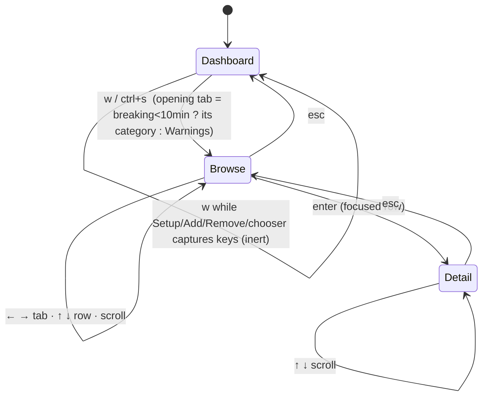
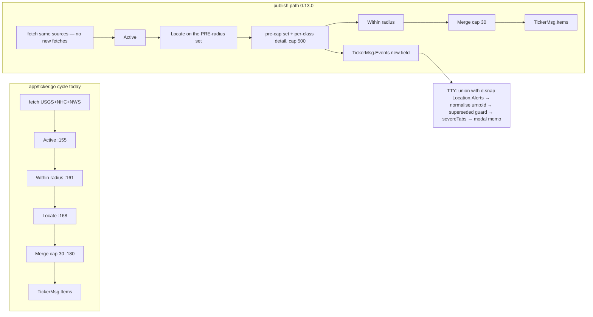

# Discovery Report — Severe Weather / Disaster Events Modals

| Field | Value |
|---|---|
| Report | discovery-report v1.1.0 · detail level FULL |
| Feature | `severe-alerts-modals` → **0.13.0** |
| Phase | DISCOVER (RCC) — exit |
| Classification | LEVEL-1 · SEV-0 · HUMAN LEAD |
| Directives | FULL GIT · FULL DOCS · FULL REPORTS · FULL RCC · FULL PLAN · FULL DIAGRAMS · FULL TDD · standing performance lens (SAM-D-13) |
| Branch | `feature/severe-alerts-modals` @ `e3cda5a` + this exit's remediation (uncommitted until approval) |
| Date range | 2026-08-28 (intake → research → red-team → remediation, one session) |
| Related | `project-brief.md` (v1.2.0), `01-objectives/objectives.md`, `02-analysis/data-shape.md` + `samples/`, `red-team-discover.md` |
| Status | **APPROVED — HUM LEAD, 2026-08-28 ("APPROVED; GO 4 PLAN")**; E-1..E-3 ratified per recommendation (SAM-D-24) |

## Executive Summary

Watchpost's 0.12.0 ticker announces the world's largest severe-weather and disaster events but gives the
person at the terminal no way to open them: for a significant earthquake or a tropical cyclone there is no
record in the app at all, and for a US weather warning the only path is to remember a place name, look it
up and page to its alerts. Discovery confirmed the problem, measured what the three data feeds really carry,
found that the modal can be built with **no new network traffic** by keeping data the app already fetches,
and — through a seven-lens adversarial review — corrected the three design assumptions that would have sent
PLAN down the wrong path. The recommendation is to proceed to PLAN, with three rulings for the owner.

## Context

**What it is.** A window, opened with `w` from anywhere on the dashboard, listing every active severe
event in six tabs (Warnings · Watches · Advisories · Spec. Statements · Sig. Quakes · Tropical), newest
first, with a full record for any event one keypress away; category colours fixed across themes; the
spoken alert re-pointed at it; storms announced by name.

**Locked problem.** *A Watchpost user who has just been told a severe weather or disaster event is active
cannot see which events are active, or read the full details of any one of them, without leaving the app or
recalling and searching a location by hand.* Criterion-5 evidence corrected at red-team: the "no path"
half is exactly true for quakes and cyclones; a US weather event is reachable today in ≈ 5 actions plus
typing a place name (`l` → query → `enter` → `esc` → `A`; `modes/tty/modal_location.go:95-98`).

**How discovery ran.** DATA FIRST: live probes of the three feeds (samples committed under
`domains/globalfeed/testdata/`); six parallel research lenses with file:line evidence; verify-before-accept
spot-checks (one corrected the brief: `TickerBlueBG` already exists, `platform/render/theme.go:74`);
HUM LEAD rulings OQ-10..17; then red-team — four axes, the DISCOVER phase lens, four personas — 85
findings, all dispositioned, 77 remediated in the documents before this report was authored.

## Functional Requirements

Full evidence columns live in `01-objectives/objectives.md §3`; this section states each requirement, its
derivation, and the testable criteria a BUILD engineer turns into tests.

### FR-1 — Open from anywhere (brief R-1; SAM-D-19)
One action — **`w`**, alias `ctrl+s` — opens the modal from the base dashboard and from any read-only modal;
inert while a text input or chooser owns the keyboard.
**Refined by research:** `w`/`W`/`ctrl+s` are unbound (`modes/tty/dashboard.go:208-238`); `ctrl+s` is
XOFF outside raw mode, so it is the alias, not the primary (RS-4); reachability falls out of resolving a
`"severe"` action in `toggleModal` (`dashboard.go:618`) with the existing capture pre-switch
(`:485-494`).
**Testable:** (1) PTY `.expect` journey sends `w`, expects `─ SEVERE`; (2) a second journey sends `\x13`;
(3) `modal_test.go` exclusivity: `w` with Setup open does nothing.

### FR-2 — Six tabs, importance order, highlighted current tab (R-2; SAM-D-10, SAM-D-17)
`←`/`→` switch tabs in the fixed order; the current tab is highlighted; the modal opens on the category of
the most recent breaking event within 10 minutes, else Warnings; **the first body line names the open
category**.
**Refined by research:** tabs are a data table **(proposed** `severeTabs`) — label, colour token,
population rule, order — so a seventh tab is one row (red-team C-19); arrow keys are re-interpreted inside
the modal by `handleNav` (`nav.go:19-23`), the `modalAlerts` precedent; selection by glyph + bold
(watchpost-cli R-12a), category by tint.
**Testable:** (1) tab order golden; (2) with a breaking event 9 min old the modal opens on its category, at
11 min on Warnings — clock injected via `d.now` (`dashboard.go:302`); (3) the first body line equals the
tab label.

### FR-3 — Row focus and rail (R-3)
`↑`/`↓` move the focused row; a rail appears when the table exceeds the viewport.
**Refined by research:** `modalScroll` + `ScrollPanel` (`platform/render/panel.go:172-201`); row marks via
`rowMarks` (`platform/render/table.go:265-311`); sort at publish, never per frame (red-team P9).
**Testable:** scroll clamp at both ends; rail thumb position golden at 3 scroll offsets.

### FR-4 — In-place detail, esc / esc esc (R-4; SAM-D-9)
`enter` replaces the body with the record; `esc` returns to the table; a second `esc` closes. The detail
chip row reads `[esc] Back  [esc esc] Close`.
**Refined by research:** no esc-backs-out precedent exists — every `esc` closes outright today; PLAN
compares a `severeDetail bool` (2 switches) with a `modalSevereDetail` enum + breadcrumb (5 switches).
**Testable:** pinned esc/esc test in `modal_test.go` covering both frames.

### FR-5 — Full record per event (R-5; brief M2 v1.2.0)
The record renders every field in the **frozen per-class render list** (`data-shape.md §4`, column
"Render v1"), in the `[A]` Alert Details format, with `render.Plain` at every field path.
**Refined by research:** today's parsers drop USGS magnitude/depth/PAGER, NHC **name**/intensity/
pressure/movement, and NWS headline/description/instruction on the ticker path; the original "every
supplied field" bar mandated rendering GIS URLs and attacker-named `parameters` keys (red-team A-F3/S6/S7)
and was narrowed.
**Testable:** table-driven fixture over `domains/globalfeed/testdata/` asserting every render-list field appears
(COV = 100 %); an escape-injection fixture asserting no CSI/OSC survives on any field.

### FR-6 — Category colours, fixed hue, themed substrate (R-6; SAM-D-7)
Red (Sig. Quakes) · Orange (Warnings) · Yellow (Watches, Advisories, Statements) · Blue (Tropical) — the
same hue in every theme, tinted onto the active modal substrate; monochrome greys.
**Refined by research:** independence today is by omission (Quattro omits Ticker tokens); the Quattro
`mix(p.red, p.darkBg…)` recipe is theme-dependent and must not be copied (red-team Y3/J4); tokens
**(proposed)** `EventCatRedBG/OrangeBG/YellowBG/BlueBG` as fixed RGB + a `CategoryTone(cat, dark)` helper
beside `ModalTone`; no new text token; one Yellow token (E-3).
**Testable:** guard test — for every theme except Monochrome, `Tok(EventCat*)` equals the default, **with
a planted-override positive control**; fg×bg contrast test on both substrates (NFR-14).

### FR-7 — Same modal language as `[A]` (R-7)
`floatModalToned` + `render.ModalTone` (`modes/tty/view.go:160-169`, `platform/render/sgr.go:189-194`).
**Testable:** golden of the browse frame at 133×44.

### FR-8 — Narration re-pointed (R-8; SAM-D-11)
The single-event tail and the burst closing direct the listener to `w` and confirm what opens; wording in
PLAN.
**Refined by research:** `alertNarration` `app/ticker.go:381`, `burstClosing` `:387`.
**Testable:** `go test ./app -run Narration` string assertions (acceptance criterion `NAR`).

### FR-9 — Browse columns, count, stamp, sort, zone rule (R-9; SAM-D-8)
Total count, "Updated" stamp, Declared/Expires per row, default sort Declared DESC; rows with a
tracked-location tie use that location's clock, others the viewer's local clock **with zone abbreviation**.
**Refined by research:** count = de-duped rows the tab renders; "Updated" = newest successful source
fetch (`dataAsOf`, `modes/tty/alerts.go:170-184`); the zone rule closes red-team B-F7.
**Testable:** count equals rendered rows after de-dup and superseded removal; a Nepal quake row shows the
local zone abbreviation; a tracked-location warning shows that location's clock.

### FR-10 — Modal memo (R-10; SAM-D-13)
The open modal's composed overlay is rebuilt only when its inputs change.
**Refined by research (corrected):** the target is `modalView(o)`'s result — `modalLines()` is called only
from the scroll clamp (`nav.go:92`) and memoising it saves nothing (red-team C-1/P1); key as `bodyKey`
(`memo.go:22-41`) with `tickerGen`, a minute clock bucket, no `shimmer`; wrap only the visible window;
`tickNeeded` lists the modal.
**Testable:** frozen clock, 20 ticks → 1 miss / 19 hits via `memoCounts()`, **including a loading row**;
modal-open allocation row in `frameAllocBudget` after the PLAN spike.

### FR-11 — Every ticker event, plus the free larger set (R-11; SAM-D-6, SAM-D-15, SAM-D-22)
The modal lists the pre-cap, pre-radius events from all sources, unioned with the tracked locations'
alerts, de-duplicated by normalised id, hard-capped at 500 most-recent-wins with "showing N of M".
**Refined by research:** the pre-cap set exists transiently at `app/ticker.go:153` and has no `Location`
until `:168` — the publish path runs `Locate` before the radius branch (red-team C-2) and rides a new field
on `TickerMsg` (`modes/tty/dashboard.go:33-36`); NWS ids differ in form between the two paths (live sample:
URL vs bare `urn:oid:`); normalisation validates the OID grammar (S4).
**Testable:** both id forms of one alert → one row; a national-only, a location-only and a multi-location
alert each → one row; the 501st event is dropped and "showing 500 of 501" renders.

### FR-12 — Storm names on the ticker and in narration (SAM-D-14, SAM-D-20)
"Tropical Storm Dolly", not "Tropical Storm".
**Refined by research:** `nhc.go:34` declares `name` and never reads it; a `Name` field and a name-aware
`Sentence()` — folding the name into `Type` breaks `Article()` (`event.go:86-92`; red-team C-3).
**Testable:** tape and narration goldens written failing-first.

### FR-13 — `--ascii` forms for every new mark (red-team B-F2)
Tab glyph, row pointer, rail and spaced-letter headers all have ASCII forms (README:91-92 ships that
affordance for screen readers).
**Testable:** the browse golden under `--ascii` contains no non-ASCII runes.

### FR-14 — Empty state designed (SAM-D-16; red-team B-F9)
A calm day shows one line per empty tab — "No active <category> events · Updated <t>" — and the
Advisories/Statements tabs add "tracks your watchlist" when the watchlist is empty.
**Testable:** golden with `domains/globalfeed/testdata/nws_active_severe.json` (`features: []`).

### FR-15 — Severity glyph column (red-team Y6)
Severity within a tab is conveyed by a glyph, not colour alone.
**Testable:** a Red and an Orange event in the Warnings tab render different glyphs.

## Non-Functional Requirements

| ID | Requirement | Evidence chain |
|---|---|---|
| NFR-1 | Zero new network fetches, asserted by an httpx round-trip counter | every source fetched in full per cycle; the cap is applied only at `Merge` (`app/ticker.go:145-181`) |
| NFR-2 | Closed-frame budgets unchanged (`bench_test.go:34-45`); open-modal budgets **measured by a PLAN spike, then pinned**, with a modal-open row and 80×24 as the worst case | red-team P2/C-6: intake numbers were the closed-frame constants copied |
| NFR-3 | Re-parse churn bounded by a per-source parse memo keyed on httpx's not-modified fact (`platform/httpx/httpx.go:511-512`, `cache.go:222-232`), instantiating `Memo[T]` (`domains/fire/memo.go:13-30`) | SAM-D-18 retains 1–3 KB prose; without this ≈ 650 MB/day churn |
| NFR-4 | Retained set hard-bounded at 500 (P10-03), gauged in [S] | `MaxEvents` idiom (`stack.go:54`) |
| NFR-5 | Hostile-feed bounds on **both** paths — new globalfeed fields and `mapAlert`'s `snapshot.Alert` (`domains/weather/nws/alerts.go:88-110`, unbounded today); `parameters` allowlist; URLs never rendered | red-team S2/S6/S7 |
| NFR-6 | Feed text never addresses the terminal — **false today** on the reused `[A]` path (`AreaDesc` `alerts.go:218`, `Instruction` `:226`, `Headline` `:306` raw); fixed at one choke point + escape-injection test in BUILD | red-team S1 |
| NFR-7 | Radio untouched (R6); narration change confined to `app/ticker.go` strings; PTY smokes both platforms | Linux half still owed from 0.12.0 |
| NFR-8 | Bindings stay data; Help group NAVIGATE | `defaultKeyMap` `dashboard.go:208`; `helpGroups()` `help_about.go:62` |
| NFR-9 | Journeys machine-verified in a real PTY (`.expect` sibling of `scripts/quality/soak-phases.expect`); proves in-app delivery only — outer-tmux `ixon` is a documented limitation | red-team C-15c |
| NFR-10 | go-studs first (`LocationTable` pattern, `platform/render/table.go:349-383`); one upstream candidate logged | A-4 |
| NFR-11 | Narrow-terminal layout: EVENT is the fill column and truncates first; goldens at 80/100/120 | `modalWidth` `view.go:77-96`: 73/93/113 content cols |
| NFR-12 | Superseded guard on both paths: same sender + product + newer `sent` | `nws.go:131-138` unguarded today; `alerts.go:102-104` never consumed |
| NFR-13 | `seen.json` `0600`/`0700` with size/entry caps (today `0644`/`0755`, `app/ticker.go:478-479`) | config precedent `platform/config/config.go:217,:232` |
| NFR-14 | Contrast gate extended to fg×bg pairs including the four tints on both substrates | `theme_test.go:199-217` iterates fg only |

## Constraints & Dependencies

**Technical.** Two data paths with different id forms; national NWS curated to 8 products
(`domains/globalfeed/nws.go:28-35`) so Warnings/Watches are a union with tracked-location alerts; neither
go-studs table has cursor/viewport/rail (and `table.go` truncates by bytes, `:362-368`); `TickerCategory`
has four lanes (`modes/tty/ticker.go:31-42`) — the six tabs are a new table; `tz.Location` does disk I/O
on first use (`platform/tz/tz.go:36-42`) — resolve at publish; the 110-col mock renders whole at ≥ 117
columns.

**Kit rules.** `NoAutoStyle: true` (patch 004), explicit width (001), bounded loops (008), composite SGR
(003), public-tree wording scrub (`third_party/go-studs/LOCAL_CHANGES.md`).

**Dependencies on existing systems.** `app/ticker.go` cycle + seen-store; `modes/tty` modal enum /
`toggleModal` / `handleNav` / `modalView`; `platform/render` tokens, `ScrollPanel`, `bracketTitle`,
`rowMarks`, `Plain`; `snapshot.Location.Alerts` via `mapAlert`; `platform/httpx` cache validators;
`scripts/quality/*.expect`.

**Accepted limitations (documented).** English substring classification of NWS product names — four of six
tabs are US-only by construction; 12-hour clock; the 10-minute opening-tab window is a named constant;
the `w` mnemonic names the first tab.

**Organisational.** SEV-0 HUMAN LEAD; single-stakeholder discovery (HUM LEAD is also the primary listening
user) — no external user evidence exists for this feature, recorded honestly; HUM LEAD directs the colour
pass and runs the Linux validation half.

## Risk Assessment

| # | Risk | Severity | Likelihood | Status | Mitigation |
|---|---|---|---|---|---|
| RS-1 | Widening `Event` ripples | MEDIUM | MEDIUM | HELD | seen-store ids-only verified (`ticker.go:461-465`, `:477`); per-field bounds + parse memo proven at BUILD |
| RS-2 | Tape (per-severity) vs modal (per-category) colour schemes collide | MEDIUM | HIGH | HELD | separate tokens; tape untouched; guard test with positive control |
| RS-3 | Scope creep to a "world events browser" | MEDIUM | MEDIUM | HELD | was realising through COV = all fields — cut; non-goals; 500 cap |
| RS-4 | Key eaten by tmux/`stty ixon` | LOW | MEDIUM | HELD | `w` primary; PTY proves in-app delivery; limitation documented |
| RS-5 | Per-tick rebuild × six tables | MEDIUM | HIGH | HELD | FR-10 re-targeted at `modalView`; budgets measured at PLAN |
| RS-6 | Source mismatch / dishonest counts | MEDIUM | HIGH | HELD | union rule; normalised id; count = rendered rows |
| RS-7 | Duplicate rows from the id-form mismatch | HIGH | HIGH | HELD | OID-grammar normalisation; regression test with both forms |
| RS-8 | Re-parse churn from retained prose | MEDIUM | HIGH | HELD | NFR-3; measured in the BUILD soak |
| RS-9 | Hidden second modal state (esc/esc) | MEDIUM | MEDIUM | HELD | PLAN compares bool vs enum; pinned test either way |
| RS-10 | Location-path superseded alerts shown twice | MEDIUM | MEDIUM | HELD | NFR-12 |
| RS-11 | Fixed dark tints on a light-background terminal (served today) | MEDIUM | MEDIUM | HELD | `CategoryTone` substrate mixing mandatory |
| RS-12 | Accessibility regression (glyph-dense mock; no bg contrast gate) | MEDIUM | HIGH | HELD | FR-13, NFR-14 |
| RS-13 | Empty / low-signal modal on a normal day | MEDIUM | HIGH | HELD | FR-14; the cap is a P10 bound, not a UX expectation |
| RS-14 | Narrow-terminal truncation | MEDIUM | MEDIUM | HELD | NFR-11 |
| RS-15 | Metric baselines wrong (K2D "∞") | LOW | — | RESOLVED | brief v1.2.0 |
| RS-16 | Warning suppression via crafted `references` | HIGH | LOW | HELD | NFR-12 |
| RS-17 | Feed prose reaching the terminal unstripped (pre-existing) | HIGH | MEDIUM | HELD | NFR-6 fix in BUILD |

## Open Questions

| # | Question | Status | Resolution / Next Step |
|---|---|---|---|
| OQ-1..9 | Intake questions (details source, population, colour rule, sort, drill-down, categories, wording, version, memo/perf lens) | ANSWERED | brief §Open Questions, SAM-D-5..13 |
| OQ-10 | Warnings/Watches population | ANSWERED | **Union** (SAM-D-15) |
| OQ-11 | Empty-watchlist tabs | ANSWERED | empty tab + hint (SAM-D-16) |
| OQ-12 | Opening tab | ANSWERED | most-recent-breaking (10 min) else Warnings; highlighted (SAM-D-17) |
| OQ-13 | Long NWS prose | ANSWERED | retain + parse memo (SAM-D-18) |
| OQ-14 | `ctrl+s` exposure | ANSWERED | `w` primary, `ctrl+s` alias (SAM-D-19) |
| OQ-15 | Names in narration | ANSWERED | yes (SAM-D-20) |
| OQ-16 | Per-class vs flat detail | ANSWERED — **re-opened by red-team** | SAM-D-21; see E-1 |
| OQ-17 | Cap + wording | ANSWERED | 500; "showing N of M" (SAM-D-22) |

### Additional questions surfaced during DISCOVER (escalations)

| # | Question | Status | Resolution / Next Step |
|---|---|---|---|
| E-1 | Keep per-class detail structs (SAM-D-21) or compare against a flat `Event` at PLAN, now that FR-5 renders a per-field list? | ANSWERED (SAM-D-24) | compare at PLAN as one approach |
| E-2 | SAM-D-14 reading: decode + retain the render list + name + URLs-not-rendered, leaving the GIS/telemetry/`parameters` tail undecoded in v1? | ANSWERED (SAM-D-24) | yes — nothing parsed is thrown away; the tail is not parsed in v1 |
| E-3 | One Yellow token shared by three tabs, or three tokens with one value? | ANSWERED (SAM-D-24) | one token |

## Recommendation

**Proceed to PLAN** on approval of this report and rulings on E-1..E-3.

**PLAN phase should focus on:**
1. Approaches: (i) per-class vs flat detail model (per E-1); (ii) `severeDetail bool` vs
   `modalSevereDetail` enum for the in-place detail view; (iii) memo scope — the whole modal family vs the
   new modal only.
2. The publish path: `Locate` on the pre-radius set, the `TickerMsg` field, the 500-cap, id normalisation
   with OID grammar, the superseded guard on both paths.
3. The **perf spike** that sets NFR-2's numbers before any budget is pinned; the parse memo keyed on
   httpx's not-modified flag.
4. ASCII mocks at 80/100/120 columns in colour and `--ascii`; per-class detail mocks; the empty state; the
   narration script (FR-8/FR-12); the `severeTabs` table; the four tokens + `CategoryTone`.
5. The TDD list: id normalisation (both forms), superseded guard, esc/esc, PTY `.expect` ×2, memo hit with a
   loading row, token-independence guard with positive control, fg×bg contrast, name-aware `Sentence()`
   golden, 80-col golden, httpx fetch counter, escape-injection on every rendered field, COV fixture,
   `seen.json` mode.
6. A second red-team round at PLAN exit (the DISCOVER round's find-rate was material and remediation added
   specification surface — `red-team-discover.md` Step 9).

**PLAN phase should NOT revisit:**
- The six categories, their order, or Advisories/Statements being watchlist-sourced (SAM-D-10, SAM-D-15/16).
- Per-category, theme-independent hues with modal-matched tints (SAM-D-7) — only the substrate mechanism is
  a design item.
- `w` as the primary key with `ctrl+s` as alias (SAM-D-19).
- In-place detail with esc / esc esc (SAM-D-9) — only the mechanism (bool vs enum) is open.
- Default sort Declared DESC; end-user sorts deferred (SAM-D-8).
- Retaining long prose (SAM-D-18) and the 500 cap (SAM-D-22).
- Storm names on the tape and in narration (SAM-D-14/20).
- The version: 0.13.0 (SAM-D-12).
- The event-named-narration-instead-of-a-modal alternative — considered and declined (objectives §10).

## Decisions

| # | Date | Decision | Verbatim Human Input | Rationale / Source |
|---|---|---|---|---|
| SAM-D-1..13 | 2026-08-28 | Intake decisions (feature initiated; branch; problem locked; brief approved; details at fetch time; population; colours; sort; drill-down; six categories; wording in PLAN; 0.13.0; memo + perf lens) | see `project-brief.md` Decisions | brief 8e97c06 |
| SAM-D-14 | 2026-08-28 | Retain every decoded field; storm names on the ticker | "We should not throw away and data we're parsing - esp storm names - we can figure now where that data gets displayed (ticker for sure for names)" | mid-research ruling; FR-12; E-2 asks to confirm the v1 reading |
| SAM-D-15 | 2026-08-28 | Warnings/Watches = union | "QQ-10: Union" | FR-11 |
| SAM-D-16 | 2026-08-28 | Empty-watchlist tabs stay with a hint | "QQ-11: Rec Approved" | FR-14 |
| SAM-D-17 | 2026-08-28 | Opening tab rule; current category highlighted | "QQ-12: Rec Approved - the category should be highlighted so the user knows where they are" | FR-2 |
| SAM-D-18 | 2026-08-28 | Retain long prose + parse memo | "QQ-13: Rec Approved" | NFR-3 |
| SAM-D-19 | 2026-08-28 | `w` primary, `ctrl+s` alias | "QQ-14: Oh good point - let's figure out a different key. Maybe [w] Warnings?" | FR-1 |
| SAM-D-20 | 2026-08-28 | Names in narration | "QQ-15: Yes" | FR-12 |
| SAM-D-21 | 2026-08-28 | Per-class detail structs | "QQ-16: Per Class Structs" | E-1 re-opens |
| SAM-D-22 | 2026-08-28 | Cap 500; "showing N of M" | "QQ-17: Rec Approved" | NFR-4 |
| SAM-D-23 | 2026-08-28 | Red-team full lens set + four personas | "GO" | `red-team-discover.md` |
| SAM-D-24 | 2026-08-28 | DISCOVER exit approved; E-1..E-3 ratified per recommendation | "APPROVED; GO 4 PLAN" | this report |

## Critical Analysis (red-team)

> red-team: **SHIP-WITH-CONDITIONS (post-remediation; pre-remediation 4 × NO-GO)** · multi-agent ·
> scope:feature · personas:[Perf, A11y, InfoSec, JuniorDev] · artifact `08-reports/red-team-discover.md`

**Summary.** 85 findings — **13 Critical · 49 Important · 23 Minor** — from Code Quality (20), Project
Hygiene (4), Docs Quality (11), Business Quality (6), the DISCOVER phase lens (13), Perf (9), A11y (7),
InfoSec (8), JuniorDev (8). Every finding was verified against the code before acceptance. Dispositions:
**77 Fixed** in the documents this round · 5 Declined with rationale · 3 Escalated (E-1..E-3) · 2
Deferred to PLAN · 0 dropped. The full table with evidence and status is the standalone artifact.

**The findings that changed the design (all Fixed):**

| # | Lens | Finding | Sev | Evidence | Simplify/Delete? | Action |
|---|---|---|---|---|---|---|
| C-1/P1 | Code · Perf · PM (×3) | Memo targeted `modalLines()`, never called during a frame | Critical | `view.go:100`; `nav.go:92` | Re-target | FR-10 → `modalView` |
| C-2 | Code | Pre-cap set has no `Location` (`Locate` runs after the radius branch) | Critical | `app/ticker.go:153-169` | N | FR-11 publish path |
| C-3 | Code | Name-in-`Type` breaks `Article()` | Critical | `event.go:86-92` | N | FR-12 `Name` field |
| A-F1 | Business | K2D "∞" false for weather events (`l` lookup path) | Critical | `modal_location.go:95-98` | Y | problem statement + M1 corrected |
| A-F3/S6/S7/C-18 | Business · InfoSec · Code | COV = all supplied fields imports URLs/telemetry/attacker-named keys | Critical | `data-shape.md §4` | Delete | M2 → frozen render list; E-2 |
| B-F2 | PM lens | No `--ascii` forms for a glyph-dense mock | Critical | README:91-92 | N | FR-13 |
| B-F9 | PM lens | All-empty state undesigned; the probe found zero national events | Critical | `domains/globalfeed/testdata/nws_active_severe.json` | Y | FR-14 |
| P2/C-6 | Perf · Code | Budgets asserted, +42 % raise stated as parity | Critical | `bench_test.go:34-45` | — | NFR-2 spike-then-pin |
| S1 | InfoSec | `Plain` missing on `AreaDesc`/`Instruction`/`Headline` | Critical | `alerts.go:218,:226,:306` | — | NFR-6 (BUILD) |
| S2 | InfoSec | `snapshot.Alert` unbounded | Critical | `alerts.go:88-110` | — | NFR-5 both paths |
| S3 | InfoSec | Unguarded `references` suppression | Critical | `nws.go:131-138` | — | NFR-12 |
| H-A2 | Hygiene | Decision-ID collision with watchpost-cli D-15/D-19 | Important | `dashboard.go:9-10,:207` | N | `SAM-D-n` |
| D-B1 | Docs | M2 fixture directory does not exist | Important | `ls domains/globalfeed` | N | samples committed |

**Declined (with rationale):** B-F1/A-F6 event-named narration instead of a modal — done *as well* (FR-12),
gives quakes/cyclones no record; the modal is the ratified answer. B-F5 six-tab taxonomy vs the measured
product mix — HUM LEAD's ruling; limitations documented, empty state designed, re-sampled at REFLECT. H-A3
empty folders — git tracks files. H-A4 report-name drift — this feature follows the template lineage.

**Convergences:** the memo target (three lenses); COV over-reach (three lenses); "wrong baseline" +
"wrong problem" framing. **Contradictions surfaced:** enum vs bool (to PLAN); SAM-D-21 vs C-18 (E-1).

**DISCOVER can exit** on HUM LEAD approval with E-1..E-3 ruled and NFR-6/12/13 carried as mandatory BUILD
fixes.

## Source Documents

| Document | Location | Status |
|---|---|---|
| Project brief (v1.2.0) | `06_docs/02_features/severe-alerts-modals/08-reports/project-brief.md` | found |
| Objectives (FR/NFR/risks/OQs/synthesis/escalations) | `…/01-objectives/objectives.md` | found |
| Data shape + population rules | `…/02-analysis/data-shape.md` | found |
| Feed samples (2026-08-28 probe) | `domains/globalfeed/testdata/{usgs_significant_week,nhc_currentstorms,nws_active_severe,nws_active_unfiltered_trimmed}.json` (moved from `02-analysis/samples/` at PLAN exit) | found |
| Red-team verdict + ledger | `…/08-reports/red-team-discover.md` | found |
| 0.12.0 objectives + DEBRIEF (prior art, carried follow-ups) | `06_docs/02_features/global-ticker/{01-objectives/objectives.md,08-reports/debrief.md}` | found |
| Architecture / development / debugging / key learnings / readiness | `…/03-architecture-design`, `04-development`, `05-debugging`, `06-key_learnings`, `07-readiness` | empty (filled by later phases) |

## Next Steps

1. HUM LEAD reviews this report and `red-team-discover.md`; rules on E-1..E-3; approves or edits.
2. On approval: commit the remediated documents + samples + both reports; `save-context`
   (gates: `requirements_documented`, `constraints_identified`, `risks_assessed`,
   `critical_analysis_complete`, `human_approval`, `report_published`); announce
   **PHASE TRANSITION: DISCOVER → PLAN**.
3. PLAN opens with the perf spike and the approach comparison in "PLAN should focus on"; FULL DIAGRAMS
   applies from PLAN onward.

## Appendix — Technical

### A.1 Modal lifecycle (proposed — PLAN decides bool vs enum; states are the same either way)

### A.2 Data flow (proposed publish path vs today)

### A.3 Where the three Criticals were (for the engineer)

- `modes/tty/view.go:100` `modalLines()` — only caller `nav.go:92`; the frame path is `view.go:29-38` →
  `modalView` → `floatModalToned` (`:160-166`).
- `app/ticker.go:153` (full set) → `:155` `Active` → `:161-167` `Within` → `:168-169` `Locate`.
- `domains/globalfeed/event.go:80-92` `Sentence()` / `Article()`; `domains/globalfeed/nhc.go:34` `name`.
