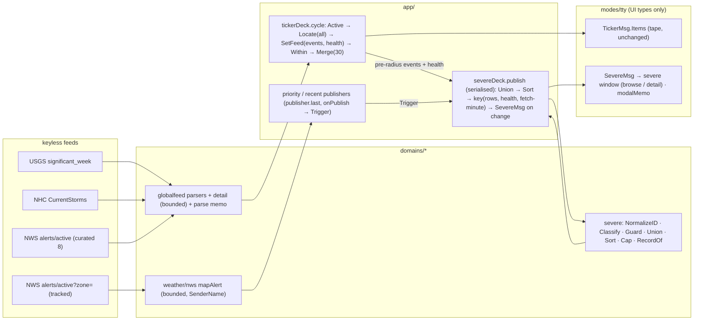
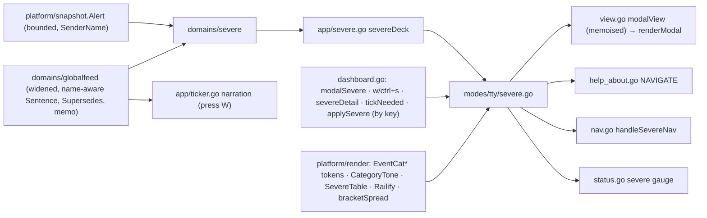
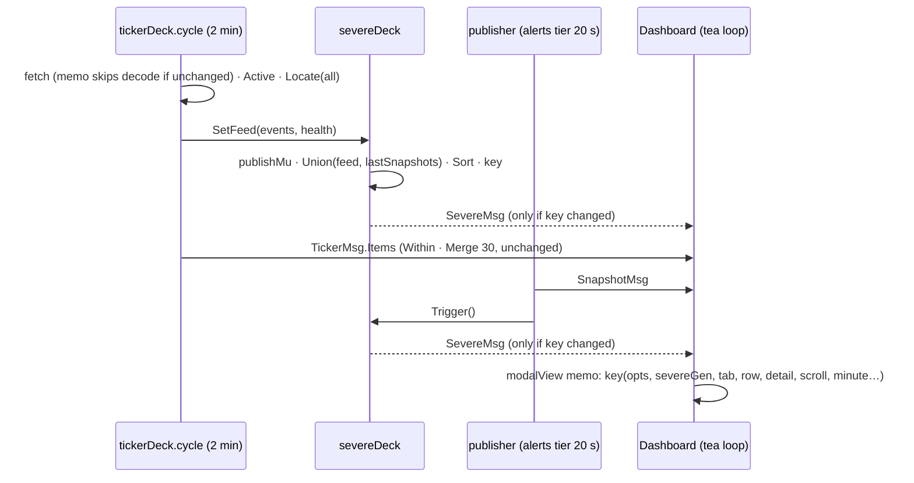
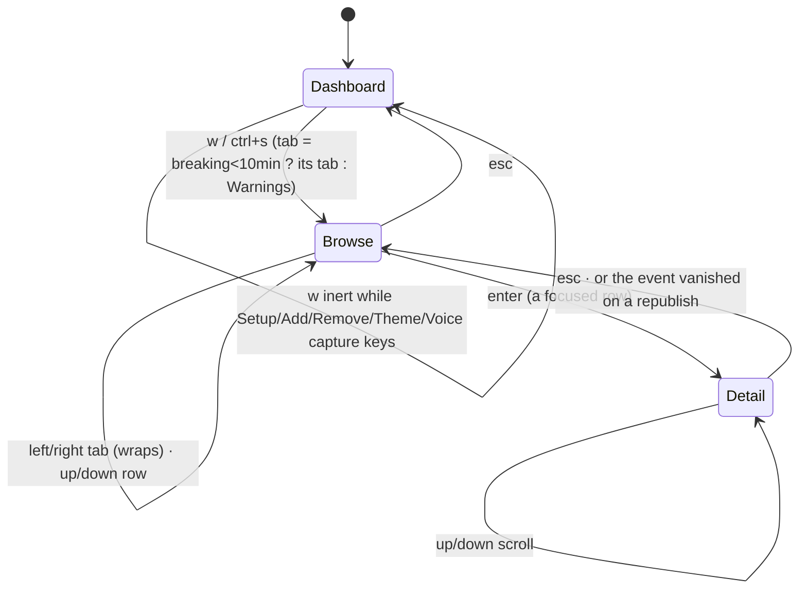

# Plan of Record — Severe Weather / Disaster Events Modals

| Field | Value |
|---|---|
| Report | por-report v1.0.0 · detail level FULL |
| Feature | `severe-alerts-modals` → **0.13.0** |
| Phase | PLAN — exit |
| Classification | LEVEL-1 · SEV-0 · HUMAN LEAD |
| Directives | FULL GIT · DOCS · REPORTS · RCC · PLAN · DIAGRAMS · TDD · standing performance lens |
| Branch | `feature/severe-alerts-modals` (PLAN commits `ef1ea69` → this exit) |
| Date range | 2026-08-28 (approaches → AX-1 evaluation → mocks → implementation plan → reviewer → red-team round 2 → remediation) |
| Related | `03-architecture-design/plan.md` · `04-development/{implementation-plan,p1-domain,p2-app,p3-tty,p4-verify}.md` · `02-analysis/mocks/mock.py` · `red-team-plan.md` · DISCOVER: `discover-report.md`, `objectives.md`, `data-shape.md` |
| Status | **APPROVED — HUM LEAD, 2026-08-28 ("APPROVED; GO 4 BUILD")** (SAM-D-29) |

## Executive Summary

The plan turns the approved design into 31 small, test-first tasks across four batches: the data layer
(feeds decode the full record, a new pure `domains/severe` index unifies the world's events with the
watchlist's alerts), the app join (a small deck that publishes the index only when it changes), the window
itself (six tabs, in-place record, every open window memoised, fixed category colours), and the
verification (escape-stripping on the shared alert path, real-terminal keyboard journeys, docs). Every
task carries its failing test, complete code and a verify command; the plan was checked by the framework's
plan reviewer and a second full red-team round — 100 findings, all resolved or ruled — before this report.
Recommendation: approve and open BUILD.

## Context

**Selected approaches (SAM-D-25/26).** AX-1 app-layer domain package (`domains/severe` + `severeDeck`),
evaluated at PLAN on the concrete join and ratified for separation of concerns and reuse; AX-2 per-class
detail structs; AX-3 `severeDetail bool`; AX-4 modal memo for the whole family; AX-5 go-studs `DataTable`
composed behind `platform/render`; AX-6 parse memo keyed on httpx's cache-hit fact with a hash fallback.
Mocks (M-1..M-6), narration script (N-1) and the sibling `SevereMsg` (P-1) ratified: "All recs approved; we
can fine tune in UAT once the feature is built."

**Perf spike (measured):** closed frame hit 554 / miss 7 126 allocs; Help modal open 4 422 allocs every
300 ms today — the number the memo exists to remove. Open-window budgets are measured, then pinned.

## Selected Approach

**Name:** A — app-layer index (`domains/severe`) joined by `app/severe.go` `severeDeck`; the TTY renders UI
rows only.

**Description.** The ticker cycle already fetches every source in full; it now ties (`Locate`) every event
*before* the tape's radius filter and hands the pre-radius set — plus each source's health — to the deck.
The two snapshot publishers already retain their last snapshot; their `onPublish` closures poke the deck.
The deck runs `severe.Union` (normalised ids with the OID grammar, the guarded superseded rule on both paths,
location record wins with the national record's CAP parameters kept beside it), sorts Declared DESC, caps at
500, and — serialised end to end — sends a `SevereMsg` only when the row set, a source's health or the fetch
minute changed. `Updated` is the newest successful fetch, never the publish time; a dead source is stated on
the category line. The window (`w`, alias `ctrl+s`) lists the index in six tabs on a go-studs table behind
`render.SevereTable`, with the rail on the table rows only, degrading EXPIRES → DECLARED → LOCATION as the
terminal narrows, with `--ascii` forms for every glyph; `enter` shows the `[A]`-shaped record in place;
`esc` backs out; `esc esc` closes; the focus follows its event by key across republishes. Every open window
is memoised on a comparable key (one field per input, no shimmer, minute-granular clock, the frame's
`Opts` as a whole), with a positive-control test and a renderer-purity test.

**Rationale.** The join point HUM LEAD worried about was already solved by `publisher.last`; the deck is the
`tickerDeck` pattern in miniature; the index is reusable by report mode, a JSON surface or the radio without
touching the TTY — none of which approach B offers (plan.md §2.6).

## Alternatives Considered

### AX-1 B: TTY composes
**Pros:** both inputs already meet in the model; no cross-goroutine seam. **Cons:** classification, id
normalisation and the superseded guard land in `modes/tty`; recompute on every `SnapshotMsg`; no reuse.
**Why not selected:** separation of concerns and reuse (HUM LEAD).

### AX-2 B/C: flat `Event` · ordered `[]Field`
**Pros:** rangeable; trivial COV test. **Cons:** ~30 mostly-empty fields on the struct the tape/narration
copy per tick; typed bounds lost; the `[A]` layout needs per-field hints anyway. **Why not:** per-class
structs with the switch confined to `RecordOf` give typed bounds and the `[A]` shape.

### AX-3 B: `modalSevereDetail` enum + breadcrumb
**Pros:** exclusivity stays one variable. **Cons:** five switches vs two. **Why not:** `addMode` is an
existing precedent for a mode inside one window; the esc/esc rule is pinned by test either way.

### AX-4 B: memoise the new window only
**Pros:** a six-field key. **Cons:** Help keeps costing 4 422 allocs per tick. **Why not:** the family cost
is measured and the `bodyKey` discipline is the house rule.

### AX-5 B: local composer
**Why not:** NFR-10 and the UAT ruling "use the component structure".

### AX-6 B: sha256 only
**Why not:** httpx already knows a cache hit; the hash is the fallback for revalidated bodies.

## Architecture & Design

**Components** (plan.md §3.1): widened `globalfeed` parsers + `detail.go` bounds + `supersede.go` guard +
`memo.go`; `snapshot.Alert.SenderName`; bounded `mapAlert`; **`domains/severe`** (`severe.go`,
`record.go`); `app/severe.go` deck + `SourceHealth`; `app/ticker.go` publish path + narration;
`app/pipelines.go` `startRecent(…, onPublish)`; `platform/render` tokens + `CategoryTone` + `SevereTable` +
`Railify`; `modes/tty/severe.go` window; `modes/tty/memo.go` `modalMemo`; `status.go` gauge;
`help_about.go` NAVIGATE; `scripts/quality/severe-modal.expect`.

**Interfaces.** `SevereMsg{Rows, Totals (pre-cap per tab), Updated, Sources, Gen}` — the only crossing
from app to TTY; `render.SevereTable(cells, focus, lo, hi, width)`; `render.CategoryTone(hue Token, dark)`;
`render.Railify(table, width, lo, total, window, glyphs)`; `severe.Union/Sort/Cap/ByTab/RecordOf`.

**Data model.** `globalfeed.Event` + `Name` + `Quake/Tropical/Severe` detail pointers; `severe.Row` with
`Detail{Quake, Tropical, Severe, Alert}` (`Alert` preferred, `Severe` kept for CAP parameters); `Record{Title,
Meta, Timing, Area, Paras}` — the one class switch. The tab registry `severeTabs()` in the TTY owns labels,
short labels, tint tokens and the watchlist hint; `severe.Classify` owns product → tab.

## Architecture Diagrams

FigJam skipped by rule (no Figma workspace belongs to this project); Mermaid is the diagram form.

### Diagram: Architecture
**Purpose:** feeds → domain → app join → TTY. **Tool:** Mermaid. **Status:** Active.

### Diagram: Component relationships
**Purpose:** what touches what. **Tool:** Mermaid. **Status:** Active.

### Diagram: Data flow — one cycle and one alerts tier
**Purpose:** cadence and change gating. **Tool:** Mermaid. **Status:** Active.

### Diagram: Modal states
**Purpose:** the esc/esc rule. **Tool:** Mermaid. **Status:** Active.

## Implementation Plan

31 tasks in four dependency-ordered batches (`04-development/`). Each task: exact file, RED test first,
complete code, verify command. Order notes: P1 Task 1.7 (parse memo) executes before 1.3–1.5; P3 Tasks
3.5–3.7 share one compile gate.

| # | Task | Depends on | Type | Success criteria |
|---|---|---|---|---|
| 1.1 | Detail structs + bounds (`detail.go`) | — | domain | `TestClamp*` green; prose ≤ 4 000 runes, lists ≤ 50 |
| 1.2 | `Event.Name`, detail pointers, name-aware `Sentence()`/`Title()` | 1.1 | domain | "Tropical Storm Dolly has been reported…" (no article); unnamed unchanged |
| 1.7 | Parse memo `sourceMemo` (cache-hit flag + sha256) | 1.1 | domain | one decode for one body; re-decode on change; error never memoised; read-only body guard |
| 1.3 | USGS parser: render list | 1.7 | domain | `TestUSGSDecodesTheRenderList`; `Mag *float64`, PAGER enum |
| 1.4 | NHC parser: name, intensity, pressure, movement, advisories | 1.7 | domain | `TestNHCKeepsTheStormName`; `Sentence()` names it |
| 1.5 | NWS parser: CAP fields, `SenderName`, parameters allowlist; `Supersedes`/`SupersededBy` | 1.7 | domain | rogue sender/product never supersedes; older never supersedes; allowlisted params decoded |
| 1.6 | `snapshot.Alert.SenderName`; bounded `mapAlert` | — | domain | every field ≤ bound; sender kept |
| 1.8 | `domains/severe`: `NormalizeID` (OID grammar), `Classify` (`TabNone`), `Guard`, `Union` (+ feed superseded merge, `Severe` kept beside `Alert`), `Sort`/`Sorted`, `Cap`, `ByTab` | 1.2, 1.5, 1.6 | domain | both id forms → one row; rogue reference cannot hide a warning; cap 500 keeps newest; totals pre-cap |
| 1.9 | `RecordOf` + `capExtras` + `shortDur`; `Plain` on every field | 1.8 | domain | warning/quake/storm records match the mocks; OSC-52 fixture stripped |
| 1.10 | Fixtures in place; `TestRenderListCoverage` | 1.3–1.5 | test | COV 100 % per class from the probe samples |
| 2.1 | `Locate` before the radius; source health; `SetFeed` | 1.8 | app | Nepal quake reaches the deck under a 50-mile tape filter |
| 2.2 | `severeDeck` (serialised publish, change key incl. health + fetch minute, zone rule, `toSevereRow`) | 2.1 | app | publishes once for one index; twice on a new event; `Updated` = newest OK fetch; final key = final feed under `-race` |
| 2.3 | Wiring: `startRecent(…, onPublish)`, `lastSnapshots` under `lp.mu`, deck to ticker | 2.2 | app | recent publish pokes the deck; `go build ./...` |
| 2.4 | Narration: press W; `Title()` on the tape; `Plain` in `eventNarration`; name pass-through | 1.2 | app | NAR 2/2; escape never reaches speech; `synth.Pronounce` keeps "Dolly" |
| 2.5 | NFR-1 by construction; `BenchmarkSevereDeckTrigger` | 2.2 | app | steady-state trigger ≪ 1 ms, no message |
| 2.6 | `seen.json` 0600/0700 + `maxSeenIDs` | — | app | mode 0600; load caps at 20 000 |
| 3.1 | `EventCat*` tokens; Monochrome greys; `CategoryTone(Token, dark)`; `UnregisterTheme`; independence guard with planted control; fg×bg AA | — | render | guard fails on the planted theme; AA on both substrates |
| 3.2 | UI types (`SevereMsg`, `SevereRow`, `SevereRecord`, `SevereSource`), `severeTabs()` | — | tty | six tabs in order; hints on Advisories/Statements |
| 3.3 | State fields, `modalSevere`, `"severe": w/ctrl+s`, `openSevere`, esc/esc, `applySevere` by key, dispatch, help, `tickNeeded` | 3.2 | tty | w opens; enter/esc/esc; ctrl+s alias; inert in Setup; opening tab rule; focus follows key; vanished record closes |
| 3.4 | `handleSevereNav` | 3.3 | tty | tabs wrap; rows clamp; scroll in detail |
| 3.5 | `render.SevereTable` + `Railify`/`RailGlyphs` (RECENT adopts them); browse renderer (tabs degrade, category line + source line, one-column rail, chips) | 3.1–3.4 | render+tty | frames within width at 80/100/120; EXPIRES drops first, DECLARED next; rail one column; `--ascii` clean; empty state |
| 3.6 | Detail renderer (`Plain` at use) | 3.5 | tty | record + `[esc] Back [esc esc] Close` |
| 3.7 | `modalKey`/`modalMemo` (family), `setupKey`, `d.now()` in `detail.go`, `statsGen` on change, invalidation table, loading-row positive control, `renderModal` purity | 3.5 | tty | 20 ticks with a loading row → 0 misses; each key field misses once; every modal pure |
| 3.8 | Exclusivity/markers; goldens at 80/100/120 + `--ascii` with the width invariant | 3.7 | test | `-update-golden` once, reviewed by eye |
| 3.9 | Budgets: `severeBench`, `BenchmarkOverlayOnly`, `TestSevereFrameAllocBudget` — measured then pinned × 1.05 | 3.8 | perf | numbers recorded in the build log; Help drops to the hit path |
| 3.10 | [S] gauge "severe index N rows / 500" | 3.3 | tty | gauge line present |
| 4.1 | `render.Plain` on every `[A]` field; drop the vestigial param | — | tty | OSC-52 fixture on all fields |
| 4.2 | End-to-end escape fixture on the window | 3.6 | test | no escape reaches the frame |
| 4.3 | `scripts/quality/severe-modal.expect` (`make pty-severe`) | 3.x | pty | 8 ok lines on macOS; Linux half HUM LEAD |
| 4.4 | README key row + paragraph; CHANGELOG 0.13.0 | 4.3 | docs | README Content Audit; keys exist |
| 4.5 | `07-readiness/gates.md` (incl. `make p10`, the seen.json bound, the owed Linux halves) | — | docs | gates enumerated |

## Risk Mitigations

| Risk (DISCOVER) | Mitigation in the plan | Residual |
|---|---|---|
| RS-5/RS-8 per-tick rebuild; re-parse churn | modal memo on `modalView` with positive controls; parse memo on the cache-hit fact; deck publishes on change only; `ByTab`/`Cap`/records behind the guard | budgets are pinned only after measurement — the BUILD spike decides |
| RS-7 duplicate rows | OID-grammar `NormalizeID`; both-forms test | a legitimately new id form from NWS would show as two rows, never merge wrongly |
| RS-9 hidden state | `severeDetail` reset in `openSevere`/close; exclusivity test covers both frames; focus by key | — |
| RS-11 light terminal | `CategoryTone` mixes onto the active substrate; AA test on both | tint values are HUM LEAD's UAT pass |
| RS-12 a11y | `--ascii` forms for every glyph incl. the rail; chips muted when dead; category and severity by glyph | Y1 (category line placement) declined — mock fidelity |
| RS-13 empty modal | FR-14 text; source line states a dead feed | a calm day still shows six tabs (SAM-D-16) |
| RS-14 narrow terminal | one degrade ladder; goldens at 80/100/120; worked line budget | sub-40-column terminals take what is left |
| RS-16 suppression | `Supersedes` guard on both paths, sender = `SenderName` on both; feed flag merged | — |
| RS-17 unstripped prose | `Plain` in `RecordOf`, in `eventNarration`, on the `[A]` path, at TTY use | — |
| New: cross-goroutine publish | `publishMu` end to end; `lastSnapshots` under `lp.mu`; `-race` in the verify | — |

## Decisions

| # | Date | Decision | Verbatim | Source |
|---|---|---|---|---|
| SAM-D-25 | 2026-08-28 | AX-2 A · AX-3 A · AX-4 A · AX-5 A · AX-6 rec; AX-1 to be evaluated deeper at PLAN | "AX-1: Evaluate at PLAN; I like A in terms of clear separation of concerns. If think if we evaluate that we may want to use this data in other features / applications in the future, this might be the technically correct approach long term. I'd like a little bit of a deeper discovery during plan when the shape of inmplementation becomes more concerete. AX-2: A AX-3: A AX-4: A AX-5: A AX-6: Rec Approved" | plan.md §1 |
| SAM-D-26 | 2026-08-28 | AX-1 = A; M-1..M-6; N-1; P-1 all approved | "All recs approved; we can fine tune in UAT once the feature is built" | plan.md §8 |
| SAM-D-27 | 2026-08-28 | PLAN-exit red-team dispatched (full lens set + four personas) | "GO" | `red-team-plan.md` |
| SAM-D-28 | 2026-08-28 | C-20 declined (house comment style) | — (agent, recorded in plan.md §7b) | `red-team-plan.md` |
| SAM-D-29 | 2026-08-28 | PLAN exit approved; BUILD opens | "APPROVED; GO 4 BUILD" | this report |

## Critical Analysis (red-team)

> red-team: **SHIP-WITH-CONDITIONS (post-remediation; pre-remediation 5 × NO-GO/BLOCK + a 22-fix plan
> review)** · multi-agent · scope:feature · personas:[Perf, A11y, InfoSec, JuniorDev] · artifact
> `08-reports/red-team-plan.md`

**Summary.** 100 findings (22 from the plan reviewer; 78 from nine lenses): 18 Critical/High · 38
Important/Medium · 22 Minor/Low. **88 Fixed · 9 Declined with rationale · 3 accepted limits · 0 dropped.**
The design-changing ones: the serialised deck publish (Architect B-2); `Updated` = dataAsOf + source health
(Business A-1); the table composer behind `platform/render` (Architect B-1 / JuniorDev J1); `detail.go`'s
own clock routed through `d.now()` (Perf P2); `Plain` on the speech path (InfoSec S1); the national CAP
record kept beside the location record (Code #5); the rail column alignment pinned by a test, not a golden
(Code #4). Declined against HUM LEAD rulings: the two-tab slice, deleting the parse memo, collapsing empty
tabs, memoising only the new window, the category line above the tabs. **Round 3 is due at BUILD exit on
compiled code** (find-rate material; the remediation created new code surface twice).

**PLAN can exit** on HUM LEAD approval, with conditions: budgets pinned after the P3 spike; goldens recorded
after `TestSevereRailIsOneColumn`; `make p10` per batch; owed Linux halves recorded at BUILD exit.

## Source Documents

| Document | Location | Status |
|---|---|---|
| Architecture & design (approaches, AX-1 evaluation, mocks, narration, tokens, diagrams) | `03-architecture-design/plan.md` | found |
| Implementation plan (index + P1–P4) | `04-development/{implementation-plan,p1-domain,p2-app,p3-tty,p4-verify}.md` | found |
| Mock generator | `02-analysis/mocks/mock.py` | found |
| Probe fixtures | `domains/globalfeed/testdata/*.json` | found |
| Red-team round 2 ledger | `08-reports/red-team-plan.md` | found |
| DISCOVER record | `08-reports/discover-report.md`, `01-objectives/objectives.md`, `02-analysis/data-shape.md` | found |
| Readiness / debugging / key learnings | `05-debugging/`, `06-key_learnings/`, `07-readiness/` | empty until BUILD (gates.md is Task 4.5) |

## Next Steps

1. HUM LEAD approves this Plan of Record (or edits).
2. On approval: commit both reports; `save-context` (gates `approach_selected`, `architecture_documented`,
   `diagrams_generated`, `implementation_plan_exists`, `critical_analysis_complete`, `human_approval`,
   `report_published`); announce **PHASE TRANSITION: PLAN → BUILD**.
3. BUILD opens with `before-you-write-code` (READY verdict), then P1 Task 1.7 → 1.1 … in the stated order;
   every batch ends with `make verify` + `make p10` and a build log in `04-development/`; BUILD exit runs
   red-team round 3 on the compiled code.

## Appendix — Technical

- **The change-gate key** (`app/severe.go`): sha256 over `{Key, Sent}` per row + `{Name, OK, FetchedAt
  minute}` per source. Identical rows + a fresh successful fetch → new key → "Updated" moves (FR-9);
  identical everything → no message → the modal memo is untouched by the 20-second alerts tier.
- **Memo key contract** (`modes/tty/memo.go`): one field per input any renderer reads — `opts` as a whole,
  `severeGen`, tab/row/detail/scroll, `setupKey` projection, `nvoices`, `darkBG`, `theme`, `minute`,
  `statsGen`; no `shimmer`, no `frame` outside `opts`. Adding an input = adding a field + a row in
  `TestModalMemoInvalidatesOnEveryInput`.
- **Rail alignment invariant:** every rail glyph sits at column `inner-1` — header `▲`, rows `│`/`█`, total
  `▼` — asserted by `TestSevereRailIsOneColumn` before any golden is recorded.
- **Degrade ladder:** full · −EXPIRES · −DECLARED · LOCATION→16, first rung with EVENT ≥ 22; below that
  EVENT ≥ 14.
