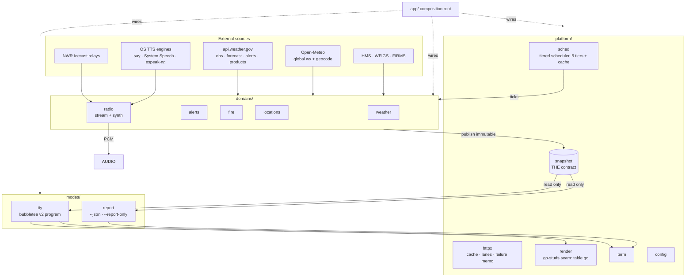
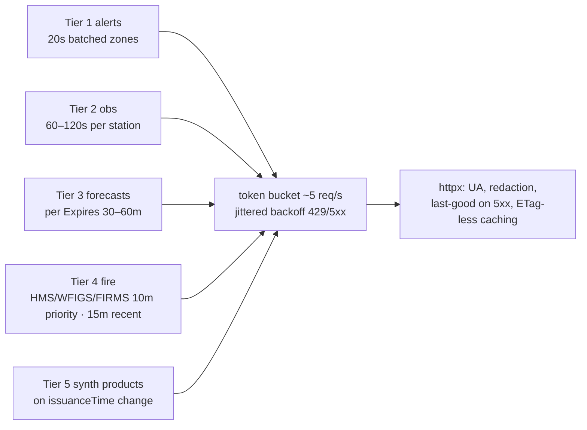
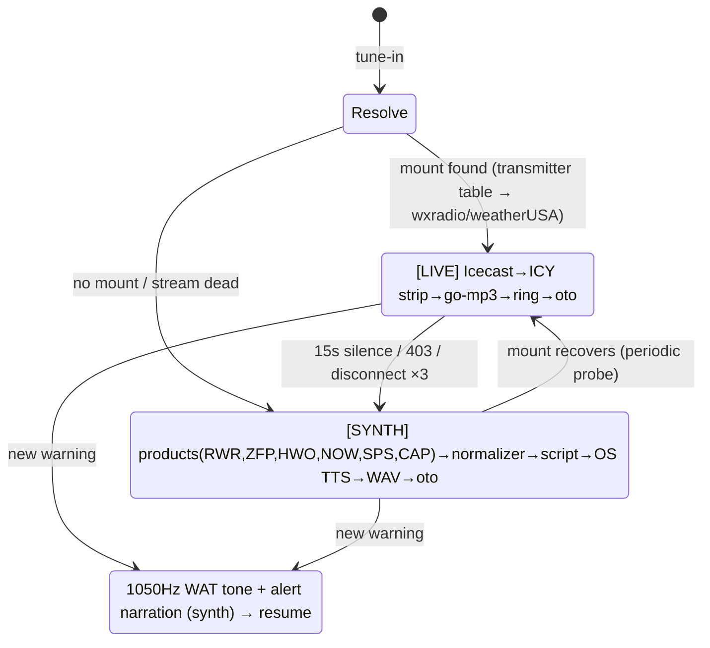

# PLAN Artifact 3 — Architecture & Phased Roadmap

| Field | Value |
|---|---|
| Phase | PLAN · SEV-0 · HUMAN LEAD · FULL PLAN depth |
| Inputs | Structure Option C (D-14) · Spikes S1/S2 (measured) · G5 verification · AI-1..13 · R-1..R-13 · C-1..C-6″ |
| Pins | Go ≥1.24 · `charm.land/bubbletea/v2 v2.0.9` · `charm.land/lipgloss/v2 v2.0.6` · `charm.land/bubbles/v2 v2.2.0` · `ebitengine/oto/v3 v3.4.1` · `hajimehoshi/go-mp3 v0.3.4` (vendored) · go-studs via local `replace` · `santhosh-tekuri/jsonschema/v6` |
| Diagrams | Mermaid in-repo (FigJam export offered per FULL DIAGRAMS preference) |
| Date | 2026-08-23 |
| Status | **APPROVED — HUM LEAD, 2026-08-23 ("Approved"), incl. P-1..P-4 recommendations and D-15 keymap amendment** |

## 1. System overview



**The one enforced arrow:** `modes/*` imports `platform/snapshot` and never any `domains/*` package (import-direction lint, Makefile `verify`). Everything M5 needs is structural.

## 2. Snapshot contract (platform/snapshot)

```go
// Snapshot is the single source every renderer consumes. Immutable after Publish.
type Snapshot struct {
    SchemaVersion string        // "1.0.0"
    GeneratedAt   time.Time     // UTC
    Locations     []Location    // stable order = config order
    Providers     []ProviderStatus
    Warnings      []Warning     // code, message, location, provider
}
type Location struct {
    Label string; Zip string; Lat, Lon float64; TZ string
    Harmonized Conditions        // NWS-tie-break merged (fill_from tracked)
    ByProvider map[string]Conditions
    // NOTE (PD-2 + red-team code#1): no Diffs field — the diff view derives
    // deltas from ByProvider at render time; nothing diff-shaped is stored or emitted.
    Alerts     []Alert           // CAP field names (AI-10 §2)
    Fire       FireState         // hotspots, incidents
    Radio      RadioState        // Station, Source(live|synth|none), Status
}
// Provider is the only interface a data source implements.
type Provider interface {
    ID() string                          // "nws", "open-meteo", "hms", ...
    Domains() []string                   // which snapshot sections it feeds
    Fetch(ctx context.Context, req FetchReq) (Fragment, error) // one scheduled unit
    // NOTE: no TTL method — per-kind cadence lives ONLY in scheduler tier config (§10.1)
}
```

**Concurrency contract (red-team #2):** providers never touch a live `Snapshot`. Each `Fetch` returns a `Fragment`; the **assembler** (single goroutine in `platform/snapshot`) merges fragments into a fresh `Snapshot` value and publishes it to `modes/tty` as a `tea.Msg` and to `modes/report` via a getter. `Update` swaps the whole pointer; no writer retains a reference. Renderers hold `*Snapshot` only for the frame.

**Parity (M5):** `pkg/schema/watchpost-report.v1.schema.json` generated from the struct (reflection test asserts every exported field has a json tag + schema property or `json:"-" // tty-only`); golden fixture uses **pairwise-distinct sentinel values** (red-team #3); parity tests enforce M5 at its RATIFIED granularity (superseded wording — B1 red-team #4 caught the §2 overstatement): **JSON ⊇ TTY** — every data token the renderer shows maps to a JSON leaf (reverse test, value-level), and the renderer's core-field set is spot-checked forward; TTY MAY summarize (e.g. "next hour" from Hourly[0]) but may never show a fact absent from JSON.

## 3. Scheduler (platform/sched)



Cache keys: gridpoint (`{wfo}/{x},{y}`), station id, zone-batch string, product id. Alert dedupe: by `id`, supersede via `references`, expire `ends ?? expires`. Alert zone batching: all locations' `forecastZone`+`county` UGCs in one `/alerts/active?zone=...` call, sharded at 80 zones. Geocode cache: never expires; bounded caps + rotation on fire-history and M2 latency log (red-team P-3/P-4).

## 4. Render seam (platform/render — D-9) — as built

> **Quality pass Q4a-004 (as built):** the table's colours are the theme's. `LocationTable` sets
> `NoAutoStyle` on the go-studs definition, `HeaderColor` on every headed column from
> `table.header`, and a `CellStyles` entry on every non-blank cell (`table.muted`, `table.name`, or
> the value tints), so the kit's `$TERM`-gated palette never paints and `NO_COLOR` is honoured by the
> one gate (`WrapSGR`). The kit itself is the pinned upstream commit plus the patches in
> `third_party/go-studs/patches/` (ADR-04; `LOCAL_CHANGES.md`).

`platform/render` is the **only** package importing go-studs, and since the quality pass (Q2) that
coupling is one file: `table.go` (`LocationTable` on go-studs `DataTable`: column spec, layout,
row data, marks, styles, group headers). Around it: `units.go` (units, `Opts`, the value formatters
with their `n/a` paths, the health and trend glyphs), `sgr.go` (tints, key caps, alert and radio
tones, the window and modal palette — every colour through `Tok(token)`, never a literal),
`panel.go` (panels, bands, modules, blocks, the scroll panel, the `Overlay` compositor), `text.go`
(wrapping, padding, display width, ANSI stripping), `theme.go` / `themes.go` (the default palette and
the live registry). The primitives the original design named (`Sparkline`, `Bars`, `WindGauge`,
`Meter`, `Marquee`, `Grid`) were never built: the visualizer rows live in `modes/tty/radio_panel.go`
over `domains/radio/spectrum`, and the marquee is `modes/tty/radio_panel.go:marquee`. Rules baked in:
severity always a text label + position (R-12a); `--ascii` glyph swaps resolved here; frame stepping
only from the program's tick (never goroutine tickers — S1/AI-9); widths always passed explicitly.
`modes/report` **does** import `platform/render` — for `Plain` (control-character stripping of
provider text, S-F6) and nothing that paints; the §1 arrow reads render → report, plain-text only.

## 5. Radio architecture (domains/radio — G-2, AI-13)



Per-OS TTS adapters behind `type Voice interface { Say(ctx, text) (io.Reader /*WAV*/ , error) }` — `say` (darwin), PowerShell System.Speech (windows), espeak-ng (linux, else text-ticker degradation + install hint) — C-6″. Per-segment WAV cache keyed on product issuance id. Normalizer (fixed-width de-wrap + abbreviation expansion) has golden tests per RS-17. oto Context **lazy-init on first tune-in** (S1: saves ~21 MB until radio used). Fuzz target: ICY reader + mp3 frame walker (RS-16, BUILD gate).

## 6. TTY mode (modes/tty)

Single `tea.Program`. Root model = view registry (from `app/registry.go`) + a **hot-swappable keybinding system (D-15)** — bindings are DATA, not code:

```go
// platform/term/keys.go
type Action string                 // "help", "quit", "search", "dive-in", "radio", ...
type Binding struct { Keys []string; Help string }
type KeyMap map[Action]Binding     // one per scope
// Resolution per keypress: active view's KeyMap → mode KeyMap → global KeyMap.
// Views declare the Actions they handle + a DefaultKeyMap(); app/keymap.go merges
// layers; user overrides load from config ([keys] table); SetKeyMap swaps a layer
// wholesale at runtime (a tea.Msg — no restart).
```

Guarantees: (1) each view — including the HUM LEAD's in-progress default view — ships its own `DefaultKeyMap()` and iterates without touching other views; (2) any Action rebinds globally or per-view via config, no code change; (3) `?` help renders live from the merged map (`bubbles/help` reads Bindings) so help stays truthful after any swap; (4) conflict detection at registration (two Actions on one key in the same scope = startup error, test-asserted). **The ONLY locked binding is `?` = help (R-3, HUM LEAD: "the only one for sure is \'?\' for help"); every other key named in these docs is a placeholder default awaiting the default-view design.** Views implement `type View interface { Name() string; Actions() []term.Action; DefaultKeyMap() term.KeyMap; Update(tea.Msg) tea.Cmd; Render(snap *snapshot.Snapshot, w,h int) string }` — activation keys live ONLY in `DefaultKeyMap()` (D-15; no hard-coded hotkeys — red-team code#2). Playlist (R-10): a config-driven `[]PlaylistEntry{View, Dwell}` cycler in the root model — architecture only in v0.1, refined later (OQ-10). Dashboard/detail = alt-screen (`view.AltScreen=true`); radio mini-player = inline auto-height (G5). One 300 ms `tea.Tick` alive only while the frame animates — as built by the quality pass Q3 (`tickNeeded`: a loading row, a volume blink, the radio marquee when the visualizer tick is not already redrawing, the `[S]` ages, Location Details' time-relative labels); a 50 ms visualizer tick only while the bars have something to draw.

## 7. Test architecture (FULL TDD)

| Suite | What it proves | Mechanism |
|---|---|---|
| Parity goldens | M5 | §2 bidirectional + reflection tests |
| Alert replay harness | **M3 = 100%, M2 ≤60s** | Recorded NWS `/alerts/active` sequences (fixtures) replayed through scheduler+assembler with fake clock; asserts every alert rendered and issuance→render ≤60s |
| Loop tests | Update/resize/keymap | `teatest`-style: scripted msgs → final model asserts (incl. `WindowSizeMsg` propagation — the the reference CLI gap) |
| Component goldens | render seam | width-keyed (40/60/80/120) ANSI goldens + invariant asserts (width bounds, severity-label presence with color stripped) — byte pins ride with invariants |
| Normalizer goldens | RS-17 | product fixture → narration script text |
| Fuzz | RS-16 | `FuzzICYReader`, `FuzzMP3Walk` with hostile inputs |
| Race/verify | all | `go test -race` per commit; import-direction lint; watermark grep; positive controls for every custom gate |

## 8. Phased roadmap (dependency-ordered; each phase = TDD, committed, red-team at exit per SEV-0)

| # | Milestone | Delivers | Requirements closed | Exit evidence |
|---|---|---|---|---|
| **B0** | Skeleton + gates | go.mod (activate `languages:[go]`, P10 — G-6), Option-C tree, Makefile verify (lint incl. import-direction, watermark, race), CI-less local gates, `platform/{config,term,httpx}` | C-3′, C-4, T-A | `make verify` green incl. positive controls |
| **B1a** ✅ *delivered 2026-08-23* | Snapshot contract + NWS + report mode | snapshot types (§10.1) + assembler, NWS provider (points/obs/forecast/alerts), `watchpost report <loc> --json/--report-only`, schema **v1.0-rc** published (ratified v1.0 at B5 exit — one-way-door rule, red-team F-7) | R-1(partial), R-2(zip), R-8(data), T-C, T-E(NWS), T-L, M5 | Parity green; live `report 92057` demo |
| **B1b** ✅ *delivered 2026-08-23 — tiers exercised in tests: 1–2 (+3 in forecast-tier test); scheduler runtime wiring lands at B3 (report mode is one-shot by design)* | Scheduler + replay harness | scheduler tiers 1–3 with `Clock` interface, alert replay harness + fixture recorder, 25-location assembler alloc bench (fake providers) | M2/M3 test design; RS-20 evidence | Replay harness green with fake clock; bench recorded |
| **B2** | Locations + setup | embedded compact geodata (S2 design), type-ahead resolver, Open-Meteo geocode fallback, `watchpost setup` wizard (locations, keys 0600, FIRMS prompt-in-fire-zone) | R-2′, R-4, T-G | lookup <10ms bench; setup PTY test |
| **B3** | TTY core | bubbletea v2 program, dashboard + dive-in detail views, render seam w/ on-demand components (table, badges, sparkline, wind gauge — others built when a view needs them), alerts panel w/ severity-as-text **+ stale-data badges (R-13, pulled forward from B6 — red-team B-4)**, `?` help, resize | R-1, R-3, R-7, R-8(UI), R-11, R-12a, T-B′, T-D, T-K | loop tests + component goldens; M1 timer asserts ≤3s warm on fixture data (pass/fail) |
| **B4** | Radio LIVE+SYNTH | `platform/audio` (PCM→oto), transmitter table (per §10.6 pipeline), stream client (S1 code hardened + reconnect), synth pipeline (products→normalizer→TTS→WAV, exec-safety per §10.5), mini-player inline view, WAT tone, `[LIVE]/[SYNTH]` badges | R-5″, R-6, T-H, C-6″ | fuzz suite green incl. argv-isolation tests; scripted tune-in asserts audio frames decoded (pass/fail) |
| **B5** | Multi-provider + fire | Open-Meteo weather provider, harmonize/fill_from + side-by-side + diff views (derived from ByProvider), HMS/WFIGS/FIRMS providers + fire panel; **schema v1.0 ratified** | R-9a′, T-E′, T-F′, T-I, OQ-9 | harmonization goldens; fire fixtures |
| **B6** | Playlist + polish | playlist cycler, national summary view, `--ascii`/`--no-animation`, About (attribution — OQ-15), R-13 disclaimers, M8/M9 soak | R-10, R-11(full), R-12b/c, R-13, M4/M8/M9 | 1-h soak flat heap; 25-loc bench; budgets re-derived (G-4b) |

UI mocks (yours) slot before B3 (main views) and B4 (radio mini-player) — flagged NEED INPUT at those entries. **UAT rule (D-21):** every UI-rendering milestone (B3, B4, B6) adds a live HUM LEAD UAT session to its exit evidence — machine-verified PTY for mechanics, human walk for look/feel; UAT findings enter the milestone ledger. **Mock-slip fallback (red-team B-2/code#10):** if a mock is not ready, B3/B4 proceed on CLIAmp-derived placeholder layouts behind the view interface (mock reconciliation is then a view-file-only change), and B5's data-layer work (providers, harmonize, fire) is the pull-forward buffer — it depends on no mock. T-J (publish via branden-thompson) is a SHIP-phase item. v0.2 backlog: `--watch`, `--fail-on-stale`, evac orders, paid providers, OS notifications.

## 9. Open decisions for this gate

| # | Decision | Recommendation |
|---|---|---|
| PD-1 | Wrap Option-C roots in `internal/`? | **No** for v0.1 (repo is private; nothing imports us); revisit at SHIP |
| PD-2 | `diffs[]` in v0.1 schema (red-team simplify list said default-cut; T-F′ diff view needs the *view*, not the JSON block) | Compute in-app; **omit `diffs[]` from JSON v1.0**, derive from `by_provider` — additive later |
| PD-3 | Dual golden systems (AI-6) | Byte-pins + invariant asserts only; no YAML fixture system |
| PD-4 | Height breakpoints | Only 2: `<12` rows = compact; else full (vs 10/24/40) |

*(IDs renamed P-x → PD-x post-approval to break the three-way "P-x" collision with risk-priority scores and DISCOVER perf findings — red-team docs D-4; substance unchanged from D-16 ruling.)*

**Amendment (D-15, 2026-08-23):** keybindings not locked — layered KeyMap system in §6; only `?`=help is fixed; all other keys are placeholders pending HUM LEAD default-view design.

## GATE: ARCHITECTURE & ROADMAP APPROVAL (SEV-0)

**APPROVE** (with P-1..P-4 recommendations) / rule P-1..P-4 individually / changes. On approval: commit, red-team the PLAN packet (full lens set), author plan-report, present for PLAN exit.

---

## 10. Specification Addendum (red-team PLAN round 1 remediations)

### 10.1 Snapshot payload types (F-1, code#7, J-a/J-b — the B0/B1a boundary artifact)

```go
type Conditions struct { // SI internal; nil-able pointers = "provider has no value" (renders n/a, marshals null)
    ObservedAt  time.Time  `json:"observed_at"`
    Temp        *float64   `json:"temp"`         // °C
    Feels       *float64   `json:"feels"`
    Dewpoint    *float64   `json:"dewpoint"`
    HumidityPct *float64   `json:"humidity_pct"`
    Pressure    *float64   `json:"pressure"`     // hPa
    Wind        *float64   `json:"wind"`         // m/s
    WindDirDeg  *float64   `json:"wind_dir_deg"`
    WindGust    *float64   `json:"wind_gust"`
    Precip1h    *float64   `json:"precip_1h"`    // mm
    PrecipProb  *float64   `json:"precip_prob_pct"` // forecast rows only
    CloudPct    *float64   `json:"cloud_pct"`
    Visibility  *float64   `json:"visibility"`   // m
    UVIndex     *float64   `json:"uv_index"`
    Condition   string     `json:"condition_code"` // WMO-mapped closed enum
    IsDay       *bool      `json:"is_day"`
    Source      SourceInfo `json:"source"`       // Provider, ModelOrStation, DistanceKm, IssuedAt, FillFrom map[string]string
}
// Hourly/Daily reuse Conditions plus: Hourly{Time}, Daily{Date, TempMax, TempMin, Sunrise, Sunset}.
type Alert struct { // CAP names verbatim (AI-10 §2): ID, Event, Severity, Urgency, Certainty,
    // MessageType, Sent, Effective, Onset, Expires, Ends, References, AffectedZones,
    // AreaDesc, Headline, Description, Instruction, Source
}
type FireState struct { Hotspots []Hotspot; Incidents []Incident } // Hotspot{Lat,Lon,DetectedAt,Confidence,FRPMW,DistanceKm,Source}; Incident{Name,Discovered,PercentContained,Acres,State,Source}
type RadioState struct { Station, StreamURL string; Source string /* live|synth|none */; Status string /* available|tuned|degraded */ } // availability only in JSON (code#5, DISCOVER)
type ProviderStatus struct { ID, Role, Status string; FetchedAt time.Time; Attribution string }
type PlaylistEntry struct { View string; Dwell time.Duration }
```

**Fetch plumbing:** `type FetchKind int` (KindAlerts, KindObs, KindForecast, KindFire, KindProducts, KindGeocode). `type FetchReq struct { Kind FetchKind; Locations []LocationRef; Hint map[string]string }`. `type Fragment struct { Provider string; Kind FetchKind; PerLocation map[LocationKey]PartialData; FetchedAt time.Time; Err error }`.
**Merge rule:** last-write-wins per `(provider, location, domain-section)`; a failed Fragment (`Err != nil`) never overwrites — prior data stands, a `Warning{Code:"provider_error"|"obs_stale"}` is appended, and `ProviderStatus.Status` degrades. **Single freshness authority:** `Provider.TTL()` is DELETED; per-kind cadence lives only in scheduler tier config (code#7).
**Report-mode read:** `atomic.Pointer[Snapshot]` getter (code axis "one word" fix).

### 10.2 Exit codes & Warning codes (F-2)

Exit: `0` ok · `1` error (no usable data / bad args) · `2` partial (a provider's status is `degraded`; `off` — registered but not a source, e.g. unkeyed FIRMS — does not count). Deferred to v0.2: `3` stale (`--fail-on-stale`). Chronic `obs_stale` warnings do NOT trigger exit 2 (DISCOVER code#9). `Warning.Code` closed enum v1: `provider_error`, `obs_stale`, `alert_feed_degraded`, `geocode_fallback`, `radio_unavailable`, `deprecated_field`.

### 10.3 Schema publication policy (F-7 — one-way door, flagged)

B1a publishes `watchpost-report.v1.0.0-rc` (shipped naming) (schema `$id` carries `-rc`); additive changes allowed while rc; **v1.0 ratified at B5 exit** when the multi-provider surface is real. The rc→1.0 ratification is a HUM LEAD gate item at B5.

### 10.4 Radio mechanics (code#5/#6)

- **Stall vs silence:** read-deadline 15 s on the HTTP body (byte-stall → reconnect w/ backoff 1s→30s jitter); decoded-PCM RMS below threshold for 60 s → treat as dead carrier → Synth (NWR never goes intentionally silent, AI-4).
- **oto invariant:** ONE `oto.Context`, created via `sync.Once` on first tune-in, **never closed** (AI-5: cannot be re-created). Tune-out stops/closes Players only. Test-asserted.
- **Alert interrupt:** current source pauses; WAT tone (short 250 ms amplitude ramp in/out — A·c) + alert narration play; **resume = re-Resolve** (fresh Live-vs-Synth decision, not blind return).
- **Synth regen race:** a newly-issued product never swaps mid-segment — finish current WAV segment, then swap in the regenerated cycle.

### 10.5 TTS & exec safety (IS·b/c/e)

All TTS adapters exec via **argv slices only — never a shell string**: darwin `exec("say", "-o", wav, "--data-format=...", "-f", scriptFile)`; windows PowerShell invoked with `-File` + narration via temp file/stdin, **never `-Command` interpolation**; linux `exec("espeak-ng", "--stdout", "-f", scriptFile)`. Narration text is written to a temp file (0600) and passed by path — product text NEVER enters an argv element or shell context. `--tts-cmd` override: parsed as argv template (shellwords, no shell), `{in}`/`{out}` placeholders, documented threat model ("you are trusting this binary"). Adapter tests assert argv isolation with hostile fixture text (`$(rm -rf)`, backticks, quotes). **Machine-output secret constraint (IS·a):** schema description + a parity golden assert no configured key value appears in any `--json`/`--report-only` output byte (fixture config carries sentinel keys).

### 10.6 Transmitter table pipeline (F-5, IS·d)

Build-time tool `tools/nwrtable` scrapes NWS county-coverage pages (`weather.gov/nwr/county_coverage?State=XX`, public domain) + SameCode.txt → vendored CSV `domains/radio/stream/transmitters.csv` (call sign, freq, state, county FIPS/SAME, coverage) with SHA-256 recorded in a checked-in checksums file (CI-verified, same mechanism as geodata — IS-6). Refresh: manually re-run per release; staleness policy: table date shown in About; mount lookup failures degrade to Synth regardless. Abbreviation dictionary: seeded from NWS directives' contraction list (~150 entries), checked-in TSV, golden-tested; unknown abbreviations pass through verbatim (mispronunciation ≠ failure).

### 10.7 Accessibility mechanisms (A·a/A·b)

- **R-12d mechanism:** `watchpost report --every <dur>` — line-oriented plain-text updates appended to stdout (no ANSI, no cursor movement, newest-last) = the documented screen-reader live-monitoring surface for v0.1. Alert lines prefixed `ALERT [severity]:`. (Full JSON `--watch` remains v0.2.)
- **KeyMap swap announcement:** any successful `SetKeyMap` renders a one-line status message ("Key bindings updated — press ? for help") through the normal message area (text, SR-readable).
- Conflict validation runs inside `SetKeyMap` as well as at registration (code#4); a conflicting swap is rejected with an error message.

### 10.8 Test-architecture additions (F-9, P·a/P·b)

`platform/sched` depends on `type Clock interface { Now() time.Time; After(d) <-chan time.Time }` (real + fake impls); replay fixtures are recorded by `tools/alertrec` (hits `/alerts/active` on a cadence, writes timestamped JSONL) — fixtures committed under `domains/alerts/testdata/replays/`. **M9 idle definition (written):** the ≤1 % idle window INCLUDES the full polling schedule (alerts 20 s batch + obs + forecast refresh) with animations off and radio off; measured over 60 s windows. 25-location assembler alloc bench runs at B1b with fake providers (RS-20 evidence).

### 10.9 Risk register additions (F-8)

| RS | Risk | P | I | Mitigation |
|---|---|---|---|---|
| RS-19 | charm.land vanity-domain outage breaks builds | Low | Med | `go mod vendor` before first release; GOMODCACHE retained; pins exact |
| RS-20 | Single-assembler throughput/GC churn at 25 loc | Low | Med | B1b bench (10.8); design stays immutable — measure before optimizing |
| RS-21 | KeyMap runtime-swap complexity (D-15 amendment never risk-rated) | Med | Low | Swap-time validation (10.7); layered-merge unit tests; help renders from merged map |

### 10.11 Round-2 completions (F-3 close-out + R2 findings)

- **Config format (F-3):** TOML at `$XDG_CONFIG_HOME/watchpost/config.toml` (0600); tables: `[locations]`, `[providers.<id>]` (incl. `key = "..."`), `[keys]` (bindings), `[radio]`, `[playlist]`. Atomic write per AI-7 pattern.
- **Harmonize `fill_from` algorithm (F-3):** per field, take NWS if non-nil; else first non-nil secondary in configured provider order with `observed_at` within 2× the field's tier cadence (staleness cutoff); record `SourceInfo.FillFrom[field]=providerID`. No blending, ever (OQ-9).
- **Remaining types (R2#7), defined at B0 alongside §10.1:** `Warning{Code, Message, Location, Provider string}`; `LocationRef{Label string; Lat, Lon float64}`; `LocationKey string` (normalized "lat,lon" @4dp); `PartialData` = per-domain-section pointers (`*Conditions`, `[]Alert`, `*FireState`, …) — nil sections untouched by merge; `SourceInfo{Provider, ModelOrStation string; DistanceKm *float64; IssuedAt time.Time; FillFrom map[string]string}`.
- **`obs_stale` never degrades `ProviderStatus` (R2#6):** stale observations append a Warning only; `Status` degrades solely on `Fragment.Err != nil` — keeping §10.2's exit-code carve-out consistent end-to-end.
- **Null-parity rule (R2#8):** a nil field marshals `null` and renders `n/a`; the bidirectional parity test treats `null ↔ n/a` as the matched pair; parity fixtures include at least one nil per section; schema types are `["number","null"]` for all pointer fields.
- **`--tts-cmd` template substitution (R2#9):** tokenize the template with shellwords FIRST; `{in}`/`{out}` replace only as whole tokens; a placeholder inside a larger token is a config error. Paths never re-parsed.
- **Mount mapping (R2 note):** call sign → mount = lookup in cached `status-json.xsl` directory by `ST-City-CALLSIGN` pattern match, fallback `radio.weatherusa.net/NWR/<CALL>.mp3` probe (AI-4 §6).

### 10.12 Install ergonomics (T-M, D-17) & mock schedule

**Curl install (T-M).** Target: `curl -fsSL https://…/install.sh | sh`. The architecture already cooperates: C-6″ + pure-Go playback mean the artifact is ONE static binary per OS/arch with zero runtime deps — install.sh only has to detect `uname -s`/`-m`, fetch the right binary from GitHub Releases, verify its SHA-256 against a checksums file, install to `~/.local/bin` (or `/usr/local/bin` with consent), and print PATH guidance. Plan adjustments:
- **B0** adds a `scripts/release/` stub + cross-compile matrix in the Makefile (`darwin/arm64, darwin/amd64, linux/amd64, linux/arm64, windows/amd64` → `./dist/`, C-4) so every milestone build proves the matrix stays green (AI-5 §4 verified CGO_ENABLED=0 works).
- **B6** adds a **release dry-run** exit item: build the matrix, generate `checksums.txt`, run `install.sh` end-to-end against a local file server on macOS + Linux (scripted, pass/fail).
- **SHIP** owns publishing: Releases assets + hosted install.sh. **Dependency flagged:** a public curl URL requires the public repo — T-M's *delivery* is therefore gated on the existing SHIP gate (go-studs distribution/IP, OQ-17); everything up to the dry-run is buildable while private. Documented-Commands-Execute applies: the README install line ships only after the URL actually works.
- Constraint honored: install.sh is convenience, never necessity — `go install` (post-public) and manual binary download must both work (AI-11: `replace` blocks `go install` until go-studs distribution resolves; manual binary is the guaranteed path).

**Mock schedule (M-1..M-6, D-17).** HUM LEAD supplies; I request each at the milestone that consumes it:

| ID | Mock | Needed at | Blocks |
|---|---|---|---|
| M-V1 | Default Dashboard (`watchpost`) | **B3 entry** | dashboard view layout + its DefaultKeyMap |
| M-V2 | Location Detail (`watchpost <loc>`) | B3 entry (with M-V1) | detail view |
| M-V3 | Add-location modal | B3 mid (after dashboard skeleton) | modal pattern |
| M-V4 | Search-location modal | B3 mid (pairs with M-V3; type-ahead from B2 is ready) | search UX |
| M-V5 | Help modal (`?`) | B3 mid (renders from merged KeyMap — needs M-V1 key vocabulary) | help layout |
| M-V6 | Setup view (`watchpost setup`) | **B2 entry** (earliest ask — setup ships in B2) | setup wizard UI |
| (M-V7) | Radio mini-player (R-6, already promised) | B4 entry | mini-player |

Fallback per PLAN mock-slip rule: CLIAmp-derived placeholders behind the view interface; B5-data is the pull-forward buffer. **First actual ask will be M-V6 at B2 entry, then M-V1/M-V2 at B3 entry.**

### 10.10 BUILD-entry preconditions (consolidated)

1. `docs/extending.md` with the two worked examples from the junior-dev traces (add-a-view UV meter; add-a-keyed-provider Pirate Weather incl. key config→`FetchReq.Hint` wiring — J·c/J·d) — authored in B0.
2. Activate `languages: [go]` + first `a2dh p10 check` (G-6).
3. `.gitignore` Go artifacts (H-4).
4. Spike code/artifacts copied to `04-development/spikes/` for durability (H-2) — done at PLAN exit.
5. Render primitives built on demand: B3 ships only what its views use; `Meter`/`Bars`/`Grid`/`Marquee` wait for a consuming view (code deletion list; `Marquee` arrives with the C-6″ text ticker in B4).

## 11. B3 UAT-driven infrastructure addendum (sessions 59–72)

> Recorded as built. B3 ran UX-backwards: each dashboard finding exposed what the data layer
> actually needed. This section is the current truth for the pieces §2–§3 described before that
> work; where they disagree, this section wins. Per-session detail: `04-development/b3-uat-log.md`;
> the consolidated view: `04-development/b3-infra-ledger.md`; caching: `caching.md`.

### 11.1 Pipelines and tiers (as wired in `app/dashboard.go`)

Two pipelines share one HTTP client (30 req/s NWS/NDBC lane) plus a separately paced CO-OPS
client (5 req/s). The favourites' pipeline runs on the client's **priority lane** so its
requests never queue behind the seed list's launch burst.

The cadences below are owned by `app/pipelines.go` (`priorityTiers`, `recentTiers`) and pinned by
`app/testdata/cadences.md` (`TestCadenceTableIsTheDoc`); edit there, then copy.

| Pipeline | Locations | Tier | Cadence | Notes |
|---|---|---|---|---|
| Priority | ≤ 10 favourites, one batched scheduler | alerts | 20 s | one `/alerts/active?zone=` call for all zones |
| | | observations | 90 s | server `max-age` 300 s coalesces this in the cache (confirmed live by the quality pass, C2) |
| | | marine observations | 10 min | NDBC `5day2` buoy files, CO-OPS water level |
| | | forecast (daily) | 30 min | HIGH/LOW holes filled from the gridpoint |
| | | forecast (hourly) | 30 min | fires with the daily tier |
| | | marine (predictions) | 30 min | NWS gridpoint swell/wave (inland grids remembered for a day), CO-OPS tides + currents |
| Recent | ≤ 50 seeds / lookups | alerts | 2 min | **one batched call for the whole list** |
| | one scheduler per location for: | observations | 10 min | |
| | | marine observations | 10 min | |
| | | forecast (daily) | 1 h | |
| | | marine (predictions) | 1 h | |
| | | forecast (hourly) | on demand | fetched when Details opens on the row, or when the row is a fresh lookup |

Fetch kinds: `KindAlerts`, `KindObs`, `KindForecast`, `KindForecastHourly`, `KindMarine`,
`KindMarineObs` (+ `KindFire`, `KindProducts`, `KindGeocode` reserved). Providers declare
domains (`weather`, `alerts`, `marine`, `marine-obs`); `sched.Serves` maps kinds to domains —
discovered, never enumerated.

### 11.2 Scheduler behaviours added in UAT

- **Fail-soft fragments** — one bad location never blanks the batch; `Assembler.Apply` merges a
  partially failed fragment (status degrades, warning appended; unserved locations keep prior data).
- **Retry-before-cadence** — unserved locations are re-requested alone on 10/20/40 s backoff.
- **Publish per provider** — a slow provider never holds another's data off screen.
- **`Update(refs)`** — the cadence continues over a new location set; only newcomers fetch now.
- **`Assembler.SetLocations(refs)`** — reconciles the tracked set in place (kept rows keep
  data). Together these make every watchlist/lookup commit incremental (UAT 69).
- **`OnPublish` is a notification, not a snapshot** (UAT 74) — the app coalesces notifications
  into one `Snapshot()` per window: 50 ms for the favourites, **5 s for the RECENT list** (quality
  pass Q3: a tier tick across fifty seeded locations is one snapshot, not ~47); `Snapshot()` is
  the expensive step (deep copy, harmonize, sun times for every location under the lock). Time
  zones come from `platform/tz` (memoized) — never `time.LoadLocation` in a hot path.
- **Tiers fire on a fixed grid** (Q3, red-team PF-9) — start, +Every, +2·Every …, not "Every
  after the cycle ends", so fifty schedulers started 10 ms apart stay 10 ms apart for days; a
  cycle that overruns its slot fires again at once and the grid restarts from then.

### 11.3 Providers (current)

| ID | Domain | Source | Selection rule |
|---|---|---|---|
| `nws` | weather, alerts | api.weather.gov | 4-station observation fallback chain (first *complete* observation; preferred station remembered); points resolution singleflighted |
| `nws-marine` | marine | gridpoint marine series | inland grids remembered 24 h |
| `ndbc` | marine-obs | `5day2` buoy files | waves from the nearest true buoys (4 deep), water temp from the nearest station of any kind (8 deep); upper-case product ids |
| `coops` | marine | CO-OPS predictions | tide stations 3 deep (datum-less answers fall through), current stations 3 deep (type W skipped) |
| `coops-obs` | marine-obs | CO-OPS water level | nearest gauge; outage never fails the batch |

### 11.4 Rehydration inside the snapshot

`finalize` = harmonize across providers → rehydrate a sparse observation's temperature /
condition from the hourly forecast period covering now (`fill_from: forecast`) → sun times →
normalize collections. Daily rows fill a missing HIGH/LOW from the gridpoint (`fill_from:
nws:gridpoint`). Observed and forecast-period values are never overwritten.

### 11.5 Caching

See `caching.md` (one rule, two tiers). Providers state lifetimes (`httpx.TTL`) only where they
know better than the server's headers.

### 11.5a Render frame pipeline (quality pass Q3 — as built)

`View` resolves the frame's geometry once (`layout`: compact mode, the player rows for the mode in
force, module heights, the control row, the RECENT window, the shared EXTENDED day count) and hands
it to every section. The two location tables — 42 % of a frame — come from a **single-slot memo**
on the model (a pointer allocated at construction; `View` is a value receiver) keyed on every input
they read: the layout values, both snapshot pointers, selection and scroll, units, `--ascii`, the
playing row and its ▶/∞ marks, the theme generation (`render.ThemeGeneration`), the bold-◆ rule and
the loading frame. A tick, marquee or visualizer frame is therefore the header + radio module +
alert area over two reused strings, finished (trim, indent, base tint) in one pre-sized pass:
~100 µs / 62 KB / 546 allocations at 133×44 (was ~660 µs / 436 KB / 10,044); a snapshot, key or
resize re-renders the tables (~585 µs / 9,165). Invalidation is pinned one row per
key input (`memo_test.go`); the miss and hit paths are both allocation-gated (`bench_test.go`).

### 11.6 Radio, Live path (B4 step 1 — UAT 76)

`location → county UGC (cached NWS point) → SAME → vendored transmitter table (NWS CCL.js, 1,035
sites with coordinates) → relay directories (wxradio.org, weatherUSA; 5-min TTL) → mounts`.
The covering transmitter plays live when relayed; otherwise the location's own products play
synthesized (UAT 78 — a neighbour's broadcast is a neighbour's forecast). The nearest relayed
transmitter is named as a secondary option, never the default. Player: Icecast (ICY strip, 15 s stall watchdog) → 3 s preroll → go-mp3 →
linear resample → one lazily-created, never-closed oto context; per-mount backoff 1→30 s, mount
failover, status callback → `tty.RadioStatusMsg`. Pure Go; `CGO_ENABLED=0` builds for
linux/windows/darwin. Synth (§5) is step 2; ~89 % of transmitters are unrelayed, so it is the
common case, not the fallback.

### 11.7 Radio, Synth path (B4 step 2 — UAT 77)

`office (cached NWS point) → latest HWO/SPS/NOW/ZFP → Normalize → Compose(observation, alerts,
products) → Source (narrate a cycle, re-plan at the boundary, cache by issuance key) → Voice →
player.StartSource`. Voices: macOS `say`; Piper on Linux/Windows, SHA-256-pinned and installed at
setup or first tune-in (§10.5 argv isolation held: text by file / stdin). Live → Synth failover
happens in the deck when every mount fails. What is still deferred from §5: the alert-interrupt
tone (WAT) and the silence detector on Live; the text ticker when no voice exists.

**Source mode (UAT 97).** `tty.RadioMode` — Synth (default: the location's own products) or
Nearest Relay (`chooseNearest`: the resolver's first relayed station — covering first, then by
distance; none → Synth). `[m]` re-tunes a playing location; persisted as `radio.mode`.

**Voice hand-over (UAT 94).** `Source.SetVoice` bumps a voice generation; the writer streams
segments in 100 ms chunks and, on a change, renders the remainder of the current line (time
fraction → word boundary, `Remainder`) in the new voice and continues; stale look-ahead is
re-voiced; the sign-off's `{{voice}}` token resolves at render time. The deck re-tunes only when
the sample rate differs.

**Repeat (UAT 83/93).** `tty.RepeatMode` — Off (one cycle, stop), One (`Source.Loop`), Watchlist
(the cycle ends, the deck tunes the next favourite from the queue the dashboard sent with
`SetRepeat(mode, watchlist)`; a live relay advances after `liveDwell` = 5 min, armed when it
reports Playing). The deck reports `RadioStatusMsg.Location` so the ▶ row follows an advance;
the dashboard re-sends the queue when the watchlist changes under Watchlist mode. `[p] Pin`
retired (UAT 93).

### 11.8 Radio visualizer (B4 step 3 — UAT 92)

`player.Engine` taps every PCM stream it plays (relay or synth) into a 3,072-frame mono ring
(`player.Tap`, before the volume); `Engine.Samples` hands the latest window to
`domains/radio/spectrum.Analyzer` (Hann + radix-2 FFT 2048 → ten voice-weighted log bands →
dB-like scale → attack/decay smoothing → silence gate); the app exposes that as the dashboard's
`Config.Spectrum func() []float64` feed and `platform/render.Spectrum(bands, width, rows)` draws
CLIAmp's Bars mode (fractional blocks, one-cell gaps, green/yellow/red by height — by level on a
single row). The dashboard runs a 50 ms `vizTick` only while Viz is on and there is something to
draw; `modes/tty` never imports the radio domain. Style reference: CLIAmp `ui/visualizer.go`,
`ui/vis_bars.go`, `player/tap.go` (MIT).

### 11.9 Where the record departs from the plan (0.9.0, from the BUILD-exit gap analysis)

The plan sections above are left as written; this is the as-built truth for each departure.

| Plan said | Record | Why / status |
|-----------|--------|--------------|
| Pins: bubbletea v2.0.9 · lipgloss v2.0.6 · bubbles v2.2.0 · oto v3.4.1 (§0, RS-18) | bubbletea **v2.0.3** · lipgloss **v2.0.2** · bubbles **v2.0.0-rc.1** · oto **v3.5.0-alpha.11** | oto: documented (UAT 76.4, pure Go on Linux). The charm set is what `go get` resolved at B0 against go-studs' own requirements; never re-pinned. **Decision for HUM LEAD at the exit gate:** accept as the 0.9.0 pin row (tests and 97 UAT sessions ran on it) or re-pin at 1.0. |
| View registry + layered KeyMap: `app/registry.go`, `View` interface, view → mode → global resolution, runtime `SetKeyMap` (§6, D-15, T-K) | One dashboard model (`modes/tty/dashboard.go`) with one `defaultKeyMap()` merged with the config `[keys]` layer (`term.Merge`); no runtime swap | The D-15 *promise* holds (any key rebindable, `?` locked, help truthful from the merged map). The mechanism was not needed for one view; the playlist cycler (R-10, B6) is where a registry earns its keep. Deviation, not debt, until B6. |
| PD-4: two height breakpoints, `<12` rows = compact | `tableBreakpoint = 20` + a measuring `compact()` (UAT 34/47/49) | HUM-LEAD-directed in UAT; supersedes PD-4. |
| `platform/audio` (PCM → oto) | The PCM path lives in `domains/radio/player` (engine, resample, tap); `platform/audio` removed at 0.9.0 | Radio is its only consumer; a platform seam with one client is indirection. |
| B4 exit evidence: fuzz suite green | `domains/radio/player/fuzz_test.go` (ICY stripper, preroll, resampler) and `domains/radio/synth/fuzz_test.go` (Normalize/Segments, Pronounce, Remainder) — seed corpus in every `go test`, `-fuzz` open-ended | Landed at the 0.9.0 exit (this addendum). |
| §10.6 abbreviation TSV (~150 entries), transmitter-table checksum + date in About | Inline Go map (~40 entries); no checksum file; credit line without a date | 1.0 items; the table is embedded and versioned by git. |
| §10.4 WAT tone + alert interrupt, Live silence detector; §10.5 `--tts-cmd`; text ticker | Not built | 1.0 items (§11.7). |
| B5 fire (HMS / WFIGS / FIRMS) | **Built** at the exit (HUM LEAD held BUILD for it; §11.10, UAT 99–100). Departure from §3: every fire source rides one 10-minute priority tier (15 on RECENT) instead of "HMS/WFIGS 15m · FIRMS 10m" — one download serves them all, so the split bought nothing. | Setup moved into the dashboard (UAT 100); the B2 standalone wizard is gone. |
| T-E′ keyless global provider; schema v1.0 ratification; B6 playlist / national summary / `--ascii` `--no-animation` flags / `report --every` | Not built; schema stays `-rc` | B6 is the 1.0 plan; 0.9.0 is US-only and says so (README). `report --every` (D-18/G-9, the screen-reader live surface) is the first 1.0 item. |
| C-6″ no installs beyond the OS | Piper (~85 MB) installs on Linux/Windows at setup or first tune-in, SHA-256-pinned, with progress | The constraint's escape hatches (text ticker, `--tts-cmd`) are the 1.0 items above; the install is explicit and reversible (cache dir). |
| RS-19 `go mod vendor` before first release | Not vendored; go-studs carried in `third_party/` (release checklist A3) | The Go module proxy caches every other dependency; accepted risk, recorded here. |

### 11.10 Fire (B5 — UAT 99)

Fire is another alert kind. `domains/fire` holds the rules (`Rules`: hotspot ring 25 km, incident
ring 50 km, minimum FRP 5 MW, bold at 50 MW, minimum confidence "nominal" — every knob from
`[fire]` in config, defaults filled by `config.Fire.WithDefaults`, one owner: `app.fireRules`)
and the pure geometry (`Near`, `Bounds`, `Cluster` — hotspots within ~0.003° on the same UTC day
fold into one, keeping the strongest, nearest first). Three providers serve `KindFire` (priority
tier every 10 minutes, RECENT tier every 15): **hms** (NOAA-NESDIS Hazard Mapping System — one
1.4 MB KMZ for the continent, cached 10 minutes, ~25k analyst-curated placemarks streamed with
`encoding/xml` under a 200k cap; every location gets a `FireState`, empty when nothing burns,
because "nothing nearby" is data), **wfigs** (NIFC incident locations — one national GeoJSON
query, `IncidentTypeCategory='WF'`, incidents inside the ring sorted largest first, capped at 5;
acreage falls back through IncidentSize → FinalAcres → DiscoveryAcres → InitialResponseAcres) and
**firms** (NASA VIIRS NOAA-20/21 NRT via the area CSV API — one request per location per source,
only when a MAP_KEY is stored; the key is a path segment httpx redacts; unkeyed, the provider is
not registered at all so the API status never reads "ok" for a source that contributes nothing).
`snapshot.Assembler` keeps fire per provider and `mergeFire` folds them at Snapshot time (hotspots
deduped across providers, incidents by name). The dashboard marks a row `n◆` (`render.FireMark`, orange; the
count is the named incidents nearby or 1 for unnamed hotspots; bold when any hotspot is at or above
the bold threshold; `*` under `--ascii`) in the marks block — 11 cells from UAT 110
(`›  ▶ 3◆ 2⚠ 001.`), the growth taken from NAME's floor so every other column keeps its offset — and the detail modal carries a FIRE section between MARITIME and the alert blocks —
hotspots nearest first with bearing (`geo.BearingDeg` + the 16-point compass shared with the
swell rows), distance, MW, satellite and age; incidents with distance, acres, % contained; the
Red Flag / Fire Weather alert when one is active; "none within the fire ring" otherwise. The plain
report says the same in words (`fireLines`); `--json` carries the `fire` object (M5 parity pinned).
