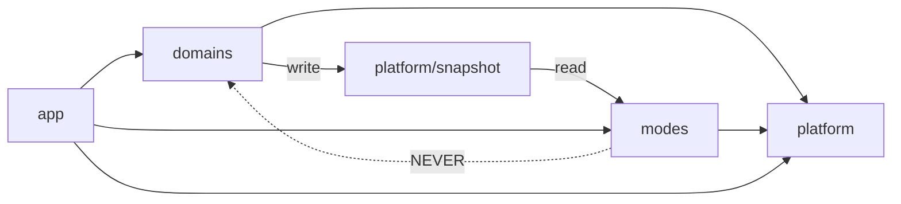

# PLAN Artifact 1 — Project Structure Proposal

| Field | Value |
|---|---|
| Phase | PLAN · SEV-0 · HUMAN LEAD |
| Purpose | HUM LEAD review/approval of repo structure before architecture locks (D-13) |
| Goal | "Keep plugins modular and easy for humans to understand as they navigate the project structure" |
| Date | 2026-08-23 |
| Status | **APPROVED — Option C** (HUM LEAD, 2026-08-23, "Approved for Option C") |

## Design forces (from DISCOVER)

1. **Human navigability first** (D-13) — a designer or engineer opening the repo should find "the radio feature" or "the NWS provider" in one guess.
2. **Pivot-ready rendering** (D-9) — go-studs must be swappable (personal fork / bubbletea-native / upstream) without touching views.
3. **Snapshot pivot** (AI-10) — providers write `Snapshot`; TTY and JSON both read it; UI code may never import providers (lint-enforced).
4. **Plugin modularity** (T-K, AI-7) — new views and providers slot in via explicit registration (interface + `BasePlugin` + registry pattern from the reference CLI; no hot-reload/speculative infra).
5. **Two front doors** (T-L) — `watchpost` (live TTY) and `watchpost report|schema|setup` (stdout/automation).
6. **Four data domains + audio** — weather, alerts, fire, geocoding, radio (LIVE stream + SYNTH voice per G-2/AI-13).

---

## Option A — Classic layered Go (`internal/` by technical role)

```
watchpost/
├── cmd/watchpost/main.go            # cobra root + subcommands
├── internal/
│   ├── config/                      # 0600 config, keys, XDG
│   ├── providers/                   # ALL data sources together
│   │   ├── nws/  openmeteo/  hms/  wfigs/  firms/  geocode/
│   ├── core/                        # Snapshot, scheduler, cache, harmonize
│   ├── ui/                          # ALL bubbletea models + views together
│   │   ├── dashboard/  detail/  radio/  setup/  playlist/
│   ├── audio/                       # icecast client, mp3→oto, tts, wat-tone
│   └── report/                      # --json/--report-only renderers, schema
├── pkg/schema/                      # published JSON schema artifacts
└── dist/
```

**Pro:** the most common Go idiom — any Go engineer knows where things live; smallest number of top-level concepts; clean layer boundaries match the Snapshot rule (providers → core → ui).
**Con:** features are *smeared across layers* — "the radio feature" lives in `providers/` + `audio/` + `ui/radio/` + `report/`; a designer hunting for "fire stuff" must know the layering. Weakest against your navigability goal.

## Option B — Plugin-first (the reference CLI lineage)

```
watchpost/
├── cmd/watchpost/main.go            # root + explicit plugin registration
├── plugins/                         # ← one folder per user-facing capability
│   ├── dashboard/   detail/   radio/   fire/   playlist/   setup/   report/
│   │   └── (each: plugin.go, model.go, view.go, plus its own cmd if any)
├── internal/
│   ├── core/                        # Snapshot, scheduler, cache, registry ifaces
│   ├── providers/                   # nws/ openmeteo/ hms/ wfigs/ firms/ geocode/
│   ├── audio/                       # shared: icecast, decode, tts, tone, oto
│   ├── render/                      # D-9 seam: go-studs wrapper + charts
│   └── config/
├── pkg/schema/
└── dist/
```

**Pro:** `plugins/` reads like the app's feature list — mirrors the reference CLI so the pattern is familiar to you; adding a view = adding one folder.
**Con:** "plugin" is a heavier concept than we need (the reference CLI's registry/validator was flagged AVOID-in-part by AI-7); data providers still live elsewhere, so "radio" is again split (plugins/radio + internal/audio); two organizing principles in one tree (feature folders *and* technical layers) is exactly what confuses newcomers.

## Option C — Domain-first with a thin platform (RECOMMENDED)

One folder per **domain a human would name** ("weather", "alerts", "fire", "radio", "locations"); each domain owns its providers *and* its views, colocated. A small `platform/` holds only what is genuinely shared. Registration stays explicit in `app/`.

```
watchpost/
├── cmd/watchpost/main.go            # thin: build cobra tree, call app.Run
├── app/                             # composition root — the ONLY place that
│   ├── app.go                       #   wires domains, providers, views together
│   ├── registry.go                  #   explicit view + provider registration
│   └── keymap.go                    #   global keybindings, '?' help
├── domains/                         # ← navigate by what the app DOES
│   ├── weather/                     #   conditions + forecasts
│   │   ├── nws/  openmeteo/         #   this domain's providers
│   │   ├── harmonize.go             #   NWS tie-break, fill_from (OQ-9)
│   │   ├── view_dashboard.go  view_detail.go
│   │   └── weather_test.go …
│   ├── alerts/                      #   CAP alerts, severity, dedupe (M2/M3)
│   ├── fire/                        #   hms/ wfigs/ firms/
│   ├── radio/                       #   LIVE+SYNTH (G-2)
│   │   ├── stream/                  #   icecast client, directory lookup
│   │   ├── synth/                   #   product fetch, normalizer, tts, wat-tone
│   │   └── view_player.go           #   mini-player (inline mode)
│   └── locations/                   #   geocoding, embedded index, type-ahead
├── platform/                        # ← shared machinery (no domain logic)
│   ├── snapshot/                    #   THE data contract (AI-10) + parity fixtures
│   ├── sched/                       #   tiered scheduler (5 tiers) + cache (tier-config cadence)
│   ├── httpx/                       #   client, UA, backoff, redaction
│   ├── audio/                       #   PCM pipeline: decode → ring → oto
│   ├── render/                      #   D-9 seam: go-studs wrapper, charts, tokens
│   ├── term/                        #   width, color, --ascii, breakpoints
│   └── config/                      #   0600 file, keys, XDG
├── modes/                           # ← the two front doors (T-L)
│   ├── tty/                         #   bubbletea program, playlist cycling, resize
│   └── report/                      #   --json/--report-only, exit codes, schema
├── pkg/schema/                      #   published watchpost-report.v1.schema.json
├── docs/                            #   engineer-facing (doc.go pattern per pkg)
├── 06_docs/                         #   A2DH feature docs (already present)
├── dist/                            #   binaries (C-4)
└── Makefile                         #   verify: fmt, vet, test -race, lint, parity
```

**Dependency rule (lint-enforced, one arrow):**

`modes/` (all rendering) reads **only** `platform/snapshot` — it may never import a domain. That single rule makes M5 parity structural and keeps the D-9 pivot contained in `platform/render/`.

**Pro:** answers "where is the fire feature?" with one folder; radio's stream+synth+player finally live together; the Snapshot rule becomes a visible import direction instead of tribal knowledge; `platform/` stays small enough to list from memory; explicit registration in `app/` keeps the the reference CLI plugin virtue without its machinery.
**Con:** less conventional than Option A — a new Go engineer expects `internal/`; colocated views mean a domain folder mixes data code and UI code (mitigated by `view_*.go` naming); needs the lint rule to stay honest.
*(Note: `domains/`, `platform/`, `modes/`, `app/` would sit under `internal/` if we ever want import-protection from other modules — trivially done by prefixing; deferred to your taste.)*

## Cross-cutting conventions (apply to whichever option)

1. **Adding a view** = one file/folder in its domain + one line in `app/registry.go`. **Adding a provider** = one folder implementing `platform/snapshot.Provider` + one registry line. Both documented in `docs/extending.md` with a worked example.
2. **File naming:** `view_*.go` (bubbletea UI), `provider.go` (interface impl), `*_test.go` colocated; every package carries a `doc.go` (G3/G4 gates from the reference CLI's verify surface).
3. **Quality gates (Makefile `verify`):** gofmt, vet, `test -race`, staticcheck, parity test, import-direction lint, watermark grep. P10 activates at BUILD entry (G-6).
4. **go-studs:** `replace` → local path; every go-studs call goes through `platform/render` (D-9). No `weather.*` tokens (AI-6 strip test).

## Recommendation

**Option C.** It is the only structure where your stated navigation test — a human finds a feature by its name — holds for every v0.1 feature including radio's dual pipeline, and it turns the two most important DISCOVER invariants (Snapshot parity, D-9 pivot) into folder boundaries a linter can enforce rather than conventions a reviewer must remember. Strongest counter-argument: Option A's familiarity is real — but familiarity helps the engineer who already knows Go layering, while C helps *everyone who can read the app's feature list*, which matches your audience priority (Designers > PMs > Engineers).

## GATE: STRUCTURE APPROVAL (SEV-0)

Options: **APPROVE C** / **APPROVE C with changes** (name them — e.g. wrap in `internal/`, rename `domains/`→`features/`) / **APPROVE A or B** / discuss.
