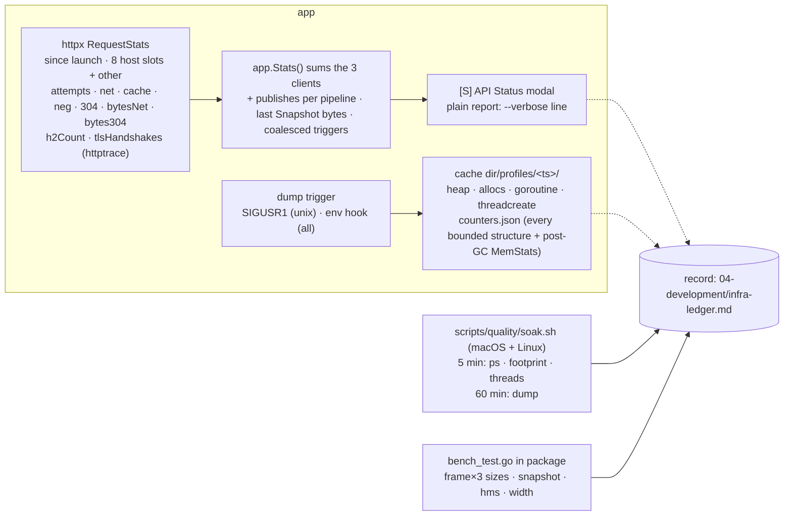
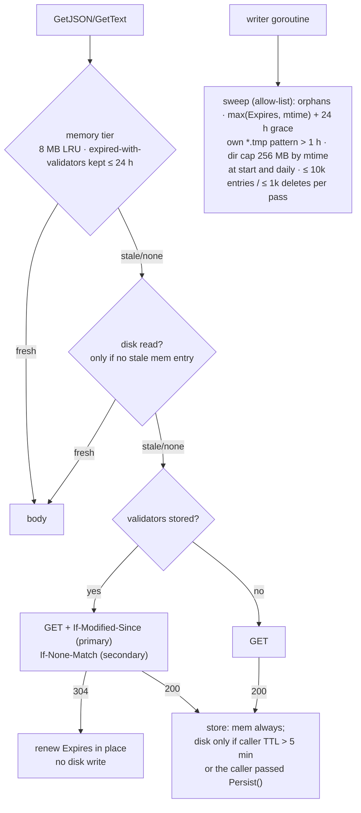
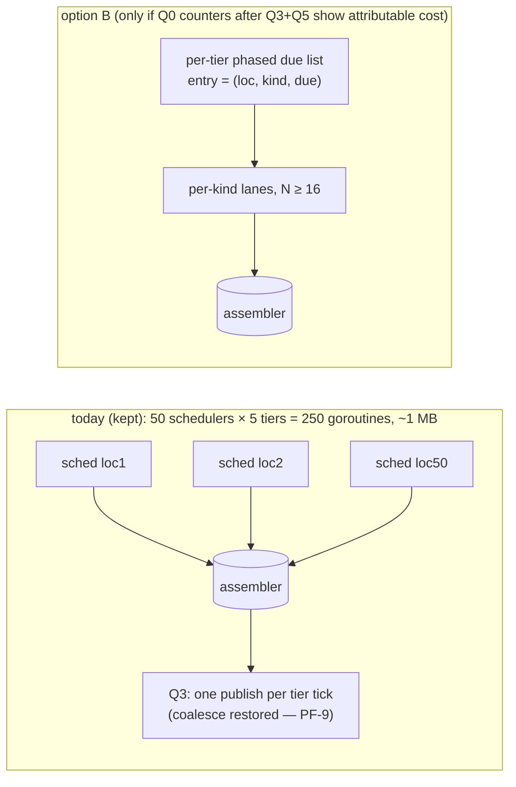
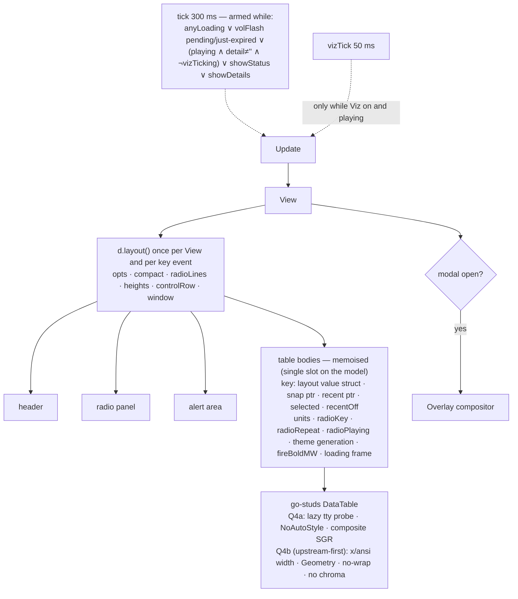

# Quality Pass — Plan of Record (FULL PLAN, v3 after two PLAN-exit red-team rounds)

| Field | Value |
|---|---|
| Phase | PLAN · SEV-0 · HUM LEAD (approves architecture) · FULL PLAN / DIAGRAMS / TDD |
| Inputs | DISCOVER report (approved 2026-08-26), lens reports L1–L5, live-run findings, baseline log, red-team PLAN (`08-reports/red-team-plan.md`, 11 lenses, 2026-08-26) |
| Output | eight batches Q0–Q7, each with alternatives considered, a chosen approach, a numbered TDD task list, gates (CI vs local named) and a release |
| v2 delta | every round-1 red-team disposition marked **Fixed** in the ledger is applied here; the v1 text is in git (`82d1d47`) |
| v3 delta | round 2 (single-agent, v2 delta): R2-1..R2-23 applied — M1 statistic re-posed with a measured detection floor, p10 gates relabelled local + fail-loud, memo *consulting* rule, full body-memo key, FIRMS straddle/parse bounds, derived disk-write comparator, publish counters, alloc pins outside `-race`; v2 text is in git (`975d991`) |

## How to read this record (JD-9)

| Prefix | Meaning | Defined in |
|---|---|---|
| M1–M5 | metrics of success | `08-reports/project-brief.md` |
| R1–R7 / RS-n | requirements / scope rules | brief |
| OQ-n | open questions answered by HUM LEAD | brief |
| C1–C5 | decisions carried from DISCOVER | `08-reports/discover-report.md` §4 |
| D1/D2 | functional defects found in DISCOVER | discover-report §2 |
| L{1..5}-F{n} / LR-n | lens findings / live-run findings | `02-analysis/lens-L*.md`, `live-run-findings.md` |
| JD/CQ/PA/PR/A11/BQ/IS/PH/DQ/SC/PF/RT-n | red-team findings by lens | `08-reports/red-team-plan.md` |
| RP-n | plan risks | §4 below |
| Qn | batch | §3 below |
| P10-nn | safety-critical rules checked by `a2dh p10 check` | li-A2DH `02_skills/implementation/p10/` |
| R2-n | round-2 red-team findings | `08-reports/red-team-plan.md` (Round 2) |
| UAT n | fit-and-finish items from the 0.9.x pass | `../watchpost-cli/05-debugging/` |

## 0. Principles that bind every batch

1. **Measure → change → re-measure.** Every batch starts from a number in the record and ends with the
   same number re-taken. Benchmarks live as `bench_test.go` **in the package they measure** (precedent:
   `platform/snapshot/bench_test.go`); the shell harness lives under `scripts/quality/`. Gates that can
   fail closed are deterministic (`testing.AllocsPerRun`, counters, goldens) and run in CI; wall-clock
   numbers are **recorded, never gated**, and are taken locally by HUM LEAD (`make quality-bench`,
   pty smokes, soaks) — the build log says which is which (PH-3, CQ-1, SC-6).
2. **Tests before code (FULL TDD).** A behaviour that is about to move gets a pin first; a behaviour that is
   about to change gets its new test first and the old golden updated in the same commit, with the reason.
3. **No cadence changes without an explicit freshness argument.** Every cadence-shaped change lands in a
   table in the batch's build log: cadence before → after, freshness argument, HUM LEAD initials; the
   per-provider request floor (M2) is re-derived in the same table (RT-11, BQ-11).
4. **Radio is sacred (R6).** Any batch that touches `app/radio.go`, `domains/radio/*` or the engine ends
   with the Synth and Relay pty smokes and a 1-hour soak before its gate.
5. **Junior-first documentation (R3).** Each changed file carries a "how this fits" header (per file, not a
   per-package file map — PH-8/CQ-13); each batch adds `04-development/qN-build-log.md` written for
   someone who has never seen the code, with a **docs-touched** line naming every existing doc line the
   batch stales (DQ-4, JD-3) and a before/after table.
6. **go-studs changes are patches, not edits (C4, revised).** Approved diffs live in
   `third_party/go-studs/patches/NNN-<name>.patch` with `third_party/go-studs/LOCAL_CHANGES.md` (pins the
   upstream commit; one row per patch: why, test, upstream-candidate status, removal condition).
   `scripts/sync-go-studs.sh` copies to a temp dir, refuses unless the source `rev-parse HEAD` matches the
   pinned commit (or `--allow-drift`), runs `git apply --check` then applies every patch in order, honours a
   copy-exclusion list, swaps atomically, regenerates `THIRD_PARTY_LICENSES.md`, re-runs `a2dh p10 check`
   on the kit, and **stops on the first failure naming the patch** (JD-1, PH-4, PA-5, IS-8). Every patch is
   an upstream candidate first; only patches with a correctness or measured-metric reason land locally.
7. **Fix-forward releases (OQ-7).** Each batch that changes user-visible behaviour ships as a point
   release from `main-publish` via the publish protocol; pure-structure batches ride with the next one;
   `CHANGELOG.md` keeps an `[Unreleased]` section between releases; user-visible seams (Q6) make the
   release `0.10.0`, otherwise `0.9.x` (PH-10).
8. **Bounds are stated, not implied (P10-03).** Every new memo, counter, cache or sweep names its owner,
   its bound and the test that pins the bound in the task that introduces it (SC-8, CQ-8).
9. **OQ-6 "fix in-pass" excludes** (RS-2, BQ-3): changes to spoken or written *content* (e.g. compass
   8→16 wording), cadence changes without a §0.3 table, kit API changes, and any new feature. Items in
   the exclusion list are listed for HUM LEAD as decisions, not folded in as nits.

## 1. Targets (C5 — recommendation for ratification, v2)

| Quantity | Baseline (source) | Target after the pass | Measured by (CI / local) |
|---|---|---|---|
| Idle footprint, radio off | 78 MB (brief:72, 30 min instrumented, L4-F15) | ≤ 90 MB | local: `soak.sh` idle phase (vmmap / `smaps_rollup`) |
| Plateau footprint, radio on | 98–101 MB instrumented (LR-6); 116–175 MB two vmmap samples of the 9 h process (LR-4) | ≤ 160 MB; peak ≤ 220 MB | local: 72 h soaks, footprint as the **fragmentation check only** (RT-3) |
| Growth term — memory | none found in code; Q0 measured the idle post-GC heap **flat at 34–39 MB from minute 5** (5-min minima sd ≈ 1.6 MB, 1 h) and showed a 1 h run cannot resolve a 30-day bar (R2-1 confirmed) | post-GC `HeapAlloc` sampled every 5 min, **per-hour minimum** as the series, 6 h warm-up, OLS slope with HAC (Newey–West) standard errors. **Criterion (restated at the Q0 gate, HUM LEAD 2026-08-26, option 3):** upper 95 % CI × 30 d < **max(5 % of the post-GC heap plateau, the run's measured detection floor)** — the floor is printed beside every verdict, so a run certifies exactly what it could resolve and says so; the per-counter zero-tolerance row below is the **primary** evidence of "no growth term", the slope the secondary bound. Q7's macOS soak runs **7 days** (floor ≈ 3.8 σ) and Arch 72 h (≈ 9.3 σ); `pprof -base` shows no site rising over ≥ 4 consecutive dumps | local: Q0 dump + `soak.sh`; `tools/slope` (Go, stdlib; prints n, σ, SE, floor, verdict PASS / GROWTH / UNCERTIFIABLE / INSUFFICIENT) |
| Growth term — structures | disk tier unbounded (L4-F1); neg-cache, `gridInfo` unbounded-slow (L1-F11/F15) | every counter in `counters.json` **flat** (zero tolerance against its code bound) at 24/48/72 h; disk files/bytes flat after the start sweep; 30-day extrapolation per counter in the baseline doc (RT-5) | local: dumps; CI: bound tests per structure |
| Threads after 72 h | 30–31 (LR-3); 32 today | Go M count **≤ constructed bound** (GOMAXPROCS + sysmon/template + 3 clients × (4 disk reads + 1 writer) + ≤ 2 `say` + one-offs) and identical at 24/48/72 h after warm-up; Apple audio threads named by `sample` (RT-2 — `threadcreate` records `<unknown>`) | local: `soak.sh` per phase |
| Frame cost | 133×44: 670 µs / 437 KB / 10,044 allocs (L5 ladder, colour on, canonical fixture); 133×70 and 200×60 taken at Q0 | **allocs** ≤ 6,000 (Q3) / ≤ 3,300 (Q4b landed) at 133×44, gated; µs recorded per size (expect ≤ 470 after Q3, ≤ 300 after Q4b) | CI: `TestFrameAllocBudget` (3 sizes); local: `BenchmarkFrame -count 10` + `benchstat` |
| Allocation rate (attributed, PF-1) | ~94 MB/min idle-with-tick (L1); ~140 MB/min radio-on max player | render, tick off, radio off ≤ 2 MB/min; publish ≤ the Q0-measured RECENT rate × Snapshot bytes (re-stated at Q0); parse spikes reported per event (HMS); radio-on render ≤ 20 MB/min with the body memo (PF-8) | local: allocs profile over 5 min per phase |
| Requests/hour (10 + 50, healthy) | 1,500–1,900 total (NWS ~1,000) derived (L2) | ≤ derived floor at unchanged cadences, floor re-derived per §0.3; bytes via 304 on forecast/hourly/gridpoint/products **measured** (alerts and `/points` cannot 304 — PR-3) | Q0 counters (`bytesNet`, `bytes304`) |
| Requests/hour during an NWS outage | ~23,000 estimated (L2-F1); measured at Q0 | ≤ 3× healthy; one URL 5xx never delays alerts or first view | CI: fault-injection tests; local: Q0 counters under a fault run |
| Warm launch → full view | 550 ms (one run) | ≤ 550 ms, median of 10, "warm" = disk primed with ≥ 5-min-TTL entries | local: `WATCHPOST_DEBUG_TIMING` × 10 |
| P10 exemptions (non-kit) | 56 (ledger 132 / kit 76 / non-kit 56) | **≤ 53** = 50 legacy (56 − 4 stale − 2 one-liners) + 2 Q0 build-tag entries + 1 `tools/slope` package-density entry (ratified by HUM LEAD at the Q0 gate, 2026-08-26 — the first restatement under this rule); **0 unmatched ledger entries**; 0 live; **new code lands with zero new exemptions** — any exception is a HUM LEAD gate decision that restates this row (R2-12) | **local** (the CLI and the ledger are outside the public tree — R2-2): `make p10` (fails loud if the CLI is absent) → `07-readiness/p10-qN.json` + `scripts/quality/p10-unmatched.sh` (ledger reasons − reasons seen in the JSON; framework backlog item for a native `unmatched[]` — R2-11) |

## 2. Architecture of the changes

### 2.1 Instrumentation (Q0)



**Alternatives.** (A) `SIGUSR1` → write a dump set under the cache dir — zero idle cost, works on a
running process, Unix-only. (B) a key in [S] that toggles the pprof server — needs the UI focused. (C) a
trigger file polled every minute — a timer the app runs forever. (D) drop the signal; the existing
loopback pprof server + `soak.sh` curling it (CQ-7). **Chosen: A + keep the env hook.** D is declined
because OQ-2's purpose is attributing a process that was *not* launched with the hook (LR-5); the cost
CQ-7 names is bounded: the handler lives in `app/dump_unix.go` / `app/dump_windows.go` (two P10-08
entries budgeted in §1), one dump in flight and ≥ 60 s apart, last 12 dumps retained, errors surface as a
Warning in [S], never `debug.WriteHeapDump` (IS-7); `profiles/<ts>` 0700, files 0600, pinned by the
temp-dir test (R2-19). Counters: `RequestStats` since launch + uptime (not "last hour" — CQ-5), keyed
by `url.Host` into **8 fixed slots + `other`** (IS-7, R2-21), with `bytesNet`, `bytes304`, `h2Count`
and `tlsHandshakes` from `httptrace` (so Q5a-4's h2/resumption check reads a number); `CacheStats`
stays. The app adds **publish counters** — publishes since launch per pipeline, last `Snapshot` bytes
per pipeline, coalesced-trigger count (R2-7; §1's allocation row, §2.4's threshold and Q3's gate all
read these names). `counters.json` carries len/bytes of: memory tiers, negative cache, `gridInfo`,
inland memo, HMS memo, PCM cache, assembler warnings, RECENT set, disk files + bytes, profiles-dir
bytes, Piper voices-dir bytes, open fds, goroutines, Ms, tz map (RT-5, R2-21), plus `MemStats` after
`runtime.GC()` (BQ-1) taken after the footprint sample so the GC does not perturb it.

**The M1 statistic (BQ-1, RT-3, R2-1).** Footprint cannot see a 1 MB/day leak under a 60 MB sawtooth,
and an hourly post-GC sample still carries in-flight bodies and HMS parse transients (σ ≈ 5 MB would put
the 30-day upper CI near 40 MB on a *flat* heap). The record's statistic is therefore: post-GC
`HeapAlloc` every 5 min, the **per-hour minimum** as the series (n ≈ 66 over 72 h after a 6 h warm-up),
OLS slope with HAC standard errors (the series is autocorrelated by cache-fill ramps and daily URL
churn), pass when upper-95 %-CI × 30 d < 5 % of the post-GC heap plateau, plus the per-counter
zero-tolerance check and `pprof -base` in-use diffs across consecutive dumps. `tools/slope` (Go, stdlib
only, embedded t-quantiles — R2-17) prints n, σ, SE and the **achievable detection floor**; Q0's local
gate is "the floor measured over ≥ 1 h sits below the bar", and if it does not the bar is restated from
the floor at the gate. `debug.SetMemoryLimit` was weighed and declined as a lever: it caps footprint
without proving the absence of a growth term (ADR-05).

### 2.2 Cache tiers (Q1, Q5)



**Alternatives for the disk tier.** (A) keep the tier, add a persistence floor, a sweep and the
known-stale skip — three edits in one file. (B) replace it with a size-capped embedded store (bbolt) —
new dependency, new failure modes, no user benefit. (C) drop the disk tier except for the ≥ 2 MB
station lists — loses warm relaunches for hourly forecasts. **Chosen: A.**

**The persistence floor (R2-6).** Disk writes happen only when the **caller's** TTL is strictly greater
than 5 min, or the caller passed an explicit `Persist()` option — the relay directory (exactly 5 min, the
one short-TTL entry that warms a relaunch) is the only `Persist()` caller. Server `max-age` never
promotes an entry to disk (NWS obs is `max-age=300`). The expected write rate per kind is derived in
Q1's §0.3 table from L4-F2's inventory (alerts, obs, FIRMS and the ≥ 5-min group each stated), and
the gate compares against that derived number, not a guess.

**One retention rule (CQ-3, PA-4, PF-4, PR-6, R2-20).** Validator storage (two fixed fields) lands in
**Q1** so the rule has something to retain from `v0.9.5` on; Q5 adds the send side. An expired entry
that carries validators is kept for a 24 h grace in memory (evicted as LRU, not expired-first, and
counted in the 8 MB budget) and on disk (the sweep deletes only beyond the grace). A 304 renews
`Expires` in memory and queues an `os.Chtimes` on the writer goroutine so the disk entry's mtime moves
with it; sweep expiry is `max(Expires, mtime) + grace`, so the most-alive entries are never the first
evicted (R2-9).

**The sweep is an allow-list (IS-1).** Non-recursive; `Lstat` regular files only; names matching
`^[0-9a-f]{64}\.(cache|json)$`, or the writer's **own** temp pattern `^[0-9a-f]{64}\.cache\.[0-9]+\.tmp$`
older than 1 h (R2-9); refuses to run unless `c.dir` contains a `watchpost/` path element; a planted
README, symlink and subdirectory must survive the test. Bounded per pass (≤ 10k entries listed, ≤ 1k
deletes) on the writer goroutine. The negative cache is capped at 1,024 entries, **LRU drop on
overflow** (BQ-9, L1-F11, R2-21). The profiles dir is a sibling, never swept, and excluded from the
"disk flat" statistic (RT-5).

**Conditional GETs (Q5).** NWS ignores `If-None-Match` (Dynatrace-mangled ETags) but honours
`If-Modified-Since`; alerts (`max-age=5`, no `Last-Modified`) and `/points` cannot 304 (PR-3). Store
`Last-Modified` and `ETag` as two fixed fields ≤ 512 B each, `httpguts`-valid or dropped (IS-6); send
`If-Modified-Since` first, ETag for hosts that honour it (HMS/NDBC). A 304 with no stored body is an
invariant violation → one bounded refetch, never re-entering `fetch` (SC-8). Request counts are
unchanged (M2 honest); bytes fall on forecast/hourly/gridpoint/products — measured, not promised.

**C2 (obs cadence)** is answered by the probe: NWS serves obs with `max-age=300`, so the 90 s tier is
already coalesced server-side; no cadence change (recorded at the Q5 gate with the counter).

### 2.3 Retry layering (Q1 network half — hoisted from Q5: BQ-2, RT-6)

```mermaid
sequenceDiagram
  participant T as sched tier
  participant X as httpx (Config.MaxRetries=1 on dashboard clients; report keeps 3)
  participant H as host
  T->>X: fetch
  X->>H: attempt 1
  H-->>X: transport error / 5xx / 429
  Note over X: memo ARMS only on transport errors,<br/>or 5xx after ≥3 consecutive failures on ≥2 distinct URLs;<br/>never on ctx.Err, never on 4xx
  Note over X: memo is CONSULTED on the normal lane only —<br/>the priority lane always attempts (half-open probe) and clears the memo on 2xx
  X-->>T: frag.Err (unserved locations)
  T->>T: rehydrate 10/20/40 s (unchanged); station chain continues on any error
  Note over X,H: memo TTL ≤ 30 s (below the 2nd rehydrate), cleared on any 2xx,<br/>not refreshed by memoised fails, ≤ 16 hosts (refuse to arm on overflow);<br/>Retry-After parsed (int or date): clamped ≤ 5 min into the normal-lane memo,<br/>and ≤ 30 s pacing hold on every lane for that host — never a sleep in do()
```

**Alternatives.** (A) drop httpx retries entirely for scheduler calls — loses the sub-second heal on a
single blip. (B) keep both ladders but add the per-host memo only — still 4 attempts per URL on the first
failure. (C) `MaxRetries` on the client `Config` (providers call httpx, not the scheduler — CQ-2, PA-7),
a per-host memo with the arming rule above (PA-1, PF-3, IS-4), `Retry-After` clamped (IS-5), the station
chain continuing on any error (PR-2). **Chosen: C.** The v1 memo (any 5xx → 60 s) would have turned one
station 500 into a 60–71 s blackout of `api.weather.gov` including the 20 s alerts tier. **Arming and
consulting are separate rules (R2-3):** RECENT failures may arm the memo, but only the *normal* lane
reads it; the priority lane (alerts, the watchlist's first view) always attempts and clears the memo on
any 2xx — so "alerts never delayed" is a property of the lane, not of the arming statistics. A
`Retry-After` on a 429 clamps into the normal-lane memo (≤ 5 min) and into a ≤ 30 s pacing hold on
every lane, so a server's request is honoured without the dashboard going dark. One transport error
arms the normal-lane memo deliberately: the cost is ≤ 30 s of fast-fails on RECENT rows (a RST on
hostile Wi-Fi), never a priority row — recorded here as the rationale IS-4 asked for. The fault tests in
Q1 pin: single 5xx heals ≤ 15 s; one station 500 never delays alerts; **three distinct RECENT 5xx then
an alerts tick is attempted**; **one transport error delays no priority row**; first view unchanged under
one URL 5xx; a failing relay directory is hit at most once per 5 min (PR-9 — directory failures are
negatively cached for `directoryTTL`).

**Redirects (IS-3).** `CheckRedirect`: same host, same scheme, ≤ 3 hops on `httpx.New` and on the stream
client, in Q1 with the weatherUSA change.

### 2.4 RECENT scheduling (C3 — decided at PLAN: A)



**Decision (PA-3, CQ-6, BQ-4, RT-8, PF-5).** Goroutine count is not a metric; the 250 parked goroutines
are ~1 MB and bounded; the "batchable fetches" benefit is delivered by the HMS/WFIGS memos (Q3) and the
FIRMS tile canonicalisation (Q5) without a new scheduler; a single pool would let CO-OPS (5/s) starve obs
rows. **A is the plan of record**; the cost is recorded in the baseline document. B is re-opened only if
Q0 counters after Q3 + Q5 show > 5 MB live or publish-coalescing failures attributable to the 50
schedulers — measured as `counters.json` `publishes.recent` per hour and `coalescedTriggers` against
the Q3 post-consolidation baseline (R2-7) — and then as the per-tier phased variant (no heap, no pool;
per-kind lanes; entries stay per (location, kind); the pins in PR-7 preserved; equivalence on
**publish** times over ≥ 3 simulated hours with injected failures). What does move to Q3: the RECENT publish consolidation (one publish per tier
tick, `app/dashboard.go:700-705`) so Q3's gate measures the final publish cadence (PF "reorder").

### 2.5 Render frame pipeline (Q3, Q4)



**Tick predicate (PF-2, RT-4, PR-4, A11-4).** Radio-off frames are byte-identical across ticks (safe to
gate); radio-on frames are not: the marquee is wall-clock paced at render (`radioClock`), the volume
blink needs one tick after `volFlashEnd`, the [S] ages and the Details `LoadingDots`/"N min ago" labels
move. The predicate above is the plan of record; a `tickArmed` guard mirrors `vizTicking`. Round 2
enumerated every `time.Now()` reachable from `View()` today (R2-23): `:486` volFlash, `:1196`
maritime rows (tide countdown / "Observed … ago"), `:1199` fire rows ("N h ago"), `:1429`/`:1482`
Details `LoadingDots` (frame-driven, not implied by `anyLoading`), `:2004` [S] ages, `:2731` marquee —
which is why the Details term is simply `showDetails` (every coastal/fire location has a time-relative
label). The Q3 build log re-takes that list after the moves; tests pin the marquee advancing across two
ticks with viz off, the blink clearing, the [S] ages and a Details frame advancing.

**Layout once (PR-5).** `d.layout()` is used by `View` and by `syncRecentView` (the key-handler path
that also calls `compact()`); the pin is `AllocsPerRun`, not a call-count hook (CQ-9, JD-7).

**Body memo (PF-8, L1-F1 option 2, L4-F9, R2-4).** The two table strings are 42 % of the frame and
change only when one of their inputs does. The key is **complete by construction**: the layout value
struct `d.layout()` returns (size, `radioHeight`, `alertHeight`, `controlRow`, `numPriority`, compact),
the two snapshot pointers, `selected`, `recentOff`, units, `radioKey`, `radioRepeat` (the ∞ mark),
`radioPlaying` (the ▶ mark clears on stop while `radioKey` stays), the theme generation (`render.SetTheme`
re-tints every cell), `fireBoldMW()` (Setup rules) and the loading frame. `View()` is a value receiver,
so the slot is a pointer field allocated at construction — never package state (P10-06). The Q3
invalidation table has one row per input, including `[r]`, stop, `[t]`, `[T]`, `[v]` and a Setup
save. Memoised, every marquee/viz frame is ~27× cheaper (24 µs / 12 KB for the radio panel alone),
which is what makes a radio-on allocation target reachable.

**Q3 (app only):** tick predicate; `d.layout()`; single-slot `layoutFor` memo (bound: last key — CQ-8);
body memo; `snapshot.Key` avoided in `row()`; geodata loaded once; WFIGS memo (bound: last body hash);
HMS streaming parse with `strings.Cut` description parser and hand-decoded `<Placemark>` (PF-7),
interned satellite/method, refusal paths in the equivalence table (CQ-11); `GetText` read-only contract
test (CQ-12); RECENT publish consolidation; colour-off **and** `ASCII:true` frame goldens (A11-10).
**Q4a (kit, correctness):** 004 `NoAutoStyle` + theme-owned table colours with per-theme overrides and a
contrast test (D2, A11-1/2) — ordered first; 001 lazy capability probe as **one untagged file** on
`term.GetSize` (SC-3), scope re-measured after 004 (CQ-10); 003 composite-aware `ColorSequence` with
qualified-param precompute at `Tok()` registration instead of a kit memo (SC-8); 008 bounded loops on
the truncation path (SC-4). **Q4b (upstream-first):** 002 width authority + O(n) truncate; 005
`Geometry()` + `Clamp`; 006 no-wrap fast path; 007 drop chroma; 009 spinner `Start` error; 010 theme
write under lock — proposed upstream; landed locally only if Q3 + Q4a miss ≤ 470 µs at 133×44 or a
correctness need appears (RT-7, BQ-10).

### 2.6 Fire fan-out (Q5 — FIRMS)

`Fetch` is called per location by the RECENT schedulers, so "merge boxes" has nothing to merge (PA-2).
The plan of record: FIRMS requests are canonicalised to a fixed 5° tile grid inside the provider — the
cache key and singleflight key are the tile, every location in a tile shares one request, a request
never exceeds one tile (SC-8, PR-8: no CONUS request), failure isolation is per tile, and `fire.Near`
output is byte-identical. **Bounds (R2-5):** a location's 25 km box (`fire.Bounds`, ≈ 0.45°) that
straddles a tile edge fetches **every touched tile, ≤ 4**, so identity holds; the request bound is
therefore ≤ 4 × 2 sources per location-tile-set but shared across locations, and the Q0 transaction
count fixes the real number before the size is chosen. Tiles are **parsed once**: a parsed-tile memo
keyed (tile, body hash), owner `firms.Provider`, bound = the distinct tiles touched by the current
location set (≤ 240, test-pinned), so a peak-season tile is not re-parsed 60× per cycle (the HMS-spike
shape SC-8 warned of). If a tile's body exceeds a 2 MB budget in the Q0 count, the grid falls back to
2.5° for that source. Transactions are counted at Q0 before the gate.

## 3. Batches — approaches, numbered tasks (TDD order), gates (CI / local)

### Q0 — Instrumentation and the measuring apparatus (ships as tooling + README lines; rides with v0.9.5)
0. Copy the DISCOVER artefacts out of the session scratchpad into `02-analysis/discover-run/` (profiles, bench sources, sampler output) and the red-team perf overlays into `02-analysis/red-team-perf/` (BQ-5, RT-1); the PID 67943 sampler runs at 5 min (restarted 2026-08-26 12:02 UTC) and its 24 h completes before Q1 ships.
1. `go mod tidy`; `go mod tidy -diff`, `go mod verify` and `govulncheck ./...` added to `make verify` and CI (PH-1, PH-9, IS-9).
2. Test then code: `httpx.RequestStats` (8 host slots + `other`, bytes, `h2Count`, `tlsHandshakes`, uptime; no `/` in any key) and `app.Stats()` aggregating the three clients plus the publish counters (PA-6, R2-7, R2-21).
3. Test then code: [S] rows "REQUESTS since launch host · attempts · net · cache · 304 · bytes" + snapshot test; `--verbose` request line in the plain report (A11-9).
4. Test (temp dir) then code: `app/dump_unix.go` + `app/dump_windows.go`; the signal loop is a bounded `select` that exits on ctx (R2-12); rate bound; retention 12; `profiles/<ts>` 0700 / files 0600 (R2-19); `counters.json` per §2.1 incl. fds and voices-dir bytes; Warning on failure; invariants (dir ≠ "", ts ≠ 0, profile name ∈ fixed set, bytes > 0) so no P10-05 entry is needed (SC-5).
5. `bench_test.go` in `modes/tty` (frame at 133×44 / 133×70 / 200×60, `TERM=xterm-256color` set and colour forced on inside the test, canonical L5 fixture — PA-6, DQ-6, R2-8), `platform/snapshot`, `domains/fire/hms`, `platform/render` (width, layout); `TestFrameAllocBudget` in a **non-race** CI step (`make test-norace`; skipped under the existing `raceEnabled` tag) at ≤ baseline × 1.05, absolute budgets from Q3 (R2-8); `make quality-bench` = `go test ./modes/tty -run '^$' -bench . -benchmem -count 10 | benchstat` (local, HUM LEAD).
6. `scripts/quality/{soak.sh,dump.sh,p10-unmatched.sh}` and `tools/slope` (Go): macOS (vmmap) and Linux (`/proc/<pid>/smaps_rollup`, `status`) branches; `ps -o` columns only (RT-15); post-GC `MemStats` every 5 min, per-hour minimum series, HAC OLS slope + CI, printed n / σ / SE / detection floor (R2-1, R2-17); `make p10` target that fails loud when the CLI is absent (R2-2).
7. README "Diagnostics" lines (SIGUSR1, Windows env-only, `scripts/quality/*`, `make quality-bench`, `make p10`); CHANGELOG `[Unreleased]` "Added" (DQ-3); `04-development/infra-ledger.md` created; `07-readiness/soak-profile.md` (fixture config, phase schedule: idle 2 h → synth → viz → relay → cache-miss storm — RT-2/RT-10).
Gate (CI): verify incl. tidy/vuln; `TestFrameAllocBudget` green in the non-race step. Gate (local, HUM LEAD): `make p10` live 0, snapshot to `07-readiness/p10-q0.json` with the exemption delta and `p10-unmatched` = 0 in the build log (SC-2, PH-6, R2-2); bench reproduces the L5 numbers within 10 % on the canonical fixture, colour on; a ≥ 1 h instrumented run produces dumps, a σ, and a **detection floor below the §1 bar** (else the bar is restated at this gate — R2-1).

### Q1 — Defect, hygiene, cache retention, network resilience (`v0.9.5`)
1. Tests then code: both weatherUSA constants to `http://` (PR-1, IS-2); `Mount.URL` scheme asserted; mounts accepted only when `url.Hostname()` equals the directory's host (port-agnostic — Icecast `listenurl`s carry `:8000`; wxradio's HTTPS construction unchanged; fixture with `host:8000` listenurls — R2-18); `radio_unavailable` warning when a directory returns nothing, with the reason (enum already exists — no schema change); directory failures negatively cached for `directoryTTL` (PR-9).
2. Tests then code: `CheckRedirect` same host/scheme/≤ 3 hops on `httpx.New` and the stream client (IS-3).
3. Tests then code: validator storage (two fixed fields — R2-20), the retention rule, the sweep allow-list with `max(Expires, mtime)` expiry and the 304 `Chtimes` hook, the `put` floor (`> 5 min` or `Persist()`; the relay directory passes `Persist()`), `get` stale-skip, negative-cache LRU cap per §2.2 (planted README/symlink/subdir survive; forged mtimes hit the cap; own-pattern `*.tmp` younger than 1 h survive; expired-with-validators survive 24 h; a 304-renewed entry outlives an untouched one; existing pin `TestCacheDiskTierWarmsARelaunch` and the `{"url":"` header prefix unchanged — PR-13); the §0.3 table derives the expected disk-write rate per kind from L4-F2's inventory (R2-6).
4. Tests then code: `Config.MaxRetries` (dashboard clients 1, `report` 3; drop the 0/−1 encoding trap — PA-7), per-host memo per §2.3 (arming rule, **normal-lane-only consulting**, priority-lane clear, ≤ 16 hosts refuse-to-arm), `Retry-After` clamp into the memo + ≤ 30 s all-lane pacing hold, station chain on any error; fault-injecting `httptest` server counting attempts under 5xx / transport / 429 / ctx cancel, with the six pins named in §2.3.
5. Delete 4 stale exemptions (`app/setup.go` ×3, `resample.go Read` — SC-5) and the two one-liners (`timeType()`, `defaultTheme()`); delete the six stray `tea_debug.log` files (PH-7, DQ-10); every remaining kit exemption reason rewritten to the template "frozen because / real items / patch NNN / removable when" and the 10 dead directory-level kit entries deleted (76 → 66, nothing lost — SC-1, JD-6).
6. Rebuild `dist/` so `checksums.txt` matches (RT-15); CHANGELOG names the plain-HTTP relay policy and the redirect policy (IS-2); `caching.md` rewritten for floor/sweep/retention (docs-touched line).
Gate (CI): fault tests; sweep tests. Gate (local, HUM LEAD): `make p10` snapshot `p10-q1.json` (non-kit ≤ 52, unmatched 0); 1 h soak — orphans 0 after the start sweep, disk-write counter within ± 20 % of the rate derived in the §0.3 table (BQ-8, R2-6); Nearest Relay **tunes a weatherUSA mount and a wxradio mount to PLAYING** on macOS and Arch (fallback if the Arch laptop is unavailable: defer the Linux half to Q7 — PA-11); counters under a fault run ≤ 3× healthy.

### Q2 — Pure structure (rides with Q3)
1. File moves per L3-F1–F6, one package per commit, `go build && go test ./...` after each; a `go/parser` test pins that the sorted set of top-level declarations per package is unchanged by the batch (rename detection cannot certify a 1→13 split — R2-22, RP-1); P10 exemptions re-keyed to the moved paths in the same commit, same count, `p10-q2.json` in the gate (R2-10); per-file "how this fits" headers.
2. Tests: `invariant.Check` 4-case table (L3-F27), plain-report width-80 golden, `app` pure-logic tables (`parseLatLon`, `resolveQuery`, `staleWarnings`, `fullyPopulated`, `toKeyMap`, refs mapping, deck label/reason/station helpers), `cmd` report path with a fake `ReportOnce`, the tty theme-value pin → `render.Tok`; generated cadence table test (L3-F14); `sortAlerts` owned-copy contract documented at the publisher (L3-F16).
3. `docs/where-things-happen.md`: 12-row flow map (event → `pkg/file.go:Func`), Vocabulary, record-ID key; pinned by a test that every named symbol exists (JD-4, JD-5); `docs/extending.md` symbols updated; `architecture.md` §4 corrected + as-built import graph (generated) + the `audio` box + `:316` obs note (L3-F30, DQ-4); stale comments fixed (L1-F13, L2-F9 — the launch-burst comment points at the Q0 counter, no number).
4. ADRs under `03-architecture-design/`: adr-01 dump trigger (C1), adr-02 disk tier, adr-03 RECENT scheduler (C3 = A), adr-04 go-studs patch process (C4), adr-05 `SetMemoryLimit` non-decision, adr-06 targets (C5) (JD-5, RT-14).
Gate (CI): coverage ≥ baseline everywhere, app ≥ 35 %; declaration-set test; the Q2 gate greps docs for moved symbols (JD-3). Gate (local): `make p10` — same count, unmatched 0.

### Q3 — Render path, app side (`v0.9.6`)
1. Tests first: `TestTickArmedOnlyWhileAnimating` (rows: loading, volFlash expiry, marquee viz-off, [S] ages, Details frame), `TestFrameAllocBudget` ≤ 6,000 at 133×44 (plus 133×70 / 200×60 values; non-race step), `TestLayoutOncePerViewAndKey` (AllocsPerRun), body-memo invalidation table (one row per key input incl. `[r]`, stop, `[t]`, `[T]`, `[v]`, Setup save), geodata-once, WFIGS memo bound, HMS streaming equivalence incl. refusal fixtures, interning, `TestGetTextCallersMustNotMutate`, RECENT publish-per-tier-tick test, colour-off + ASCII goldens, `TestFrameHonoursNoColorUnderColorTerm` (`NO_COLOR=1 TERM=xterm-256color` → zero `\x1b`; **expected red until Q4a-004** — recorded as the known-failing pin, skipped with the reason until 004 lands).
2. Code per §2.5.
3. `--ascii`: HUM LEAD decision under §0.9 (wire the flag — B6 promise — or record deferred); legend glyphs from `Opts` either way.
Gate (CI): alloc budget (non-race step); goldens; tick tests. Gate (local): `make p10` snapshot; frame ≤ 470 µs recorded at 133×44; 1 h soak with viz on **and** a viz-off idle sample (BQ-12); allocation rate per phase and `publishes.recent`/h recorded against §1 (R2-7).

### Q4a — go-studs, correctness patches (`v0.9.7`; each patch presented to HUM LEAD)
0. Rewrite `scripts/sync-go-studs.sh` per §0.6 with a test on a temp checkout; `LOCAL_CHANGES.md` pins the upstream commit; NOTICE updated; `third_party/go-studs/patches/` created (JD-1).
1. 004 `NoAutoStyle` + theme-owned table colours: fidelity golden captured **before** the patch with `t.Setenv("TERM","xterm-256color")` (CQ-4); per-theme token overrides (Mono 255 bold / 250 / 255; HC 231 / 255 / 231; Synthwave/Solarized ≥ 4.5:1) + `TestThemeTokenContrastAA` (A11-2); `TestFrameHonoursNoColorUnderColorTerm` goes green; CHANGELOG names the look change for `TERM`-unset users (PR-11); tokens documented in README/extending (DQ-12).
2. 001 lazy capability probe — one untagged file on `term.GetSize`, retiring the `unsafe` ioctl block and its Windows twin (SC-3); scope re-measured after 004.
3. 003 composite-aware `ColorSequence` + `Tok()`-time precompute (no kit memo).
4. 008 bounded loops on the truncation path (`data_table_row.go:692`, `ansi.go:140`).
5. `Plain` drops U+FE0E/U+FE0F (A11-8).
Gate (CI): goldens byte-identical colour-off; fidelity + NO_COLOR + contrast tests. Gate (local): `make p10` snapshot (kit entries retired per patch, itemised — no collapse); frame recorded; Synth/Relay smokes.

### Q4b — go-studs, performance patches (upstream-first; local only on a miss)
002 width authority + O(n) truncate; 005 `Geometry()` + `Clamp`; 006 no-wrap fast path; 007 drop chroma (+ `THIRD_PARTY_LICENSES.md` regenerated); 009 spinner `Start` error; 010 theme write under lock. Each is opened as an upstream candidate with its test; landed locally only if Q3 + Q4a miss ≤ 470 µs at 133×44 or a correctness need appears. Target if landed: allocs ≤ 3,300, µs ≤ 300 at 133×44.

### Q5 — Network, bytes and fan-out (`v0.9.8`)
5a. (1) conditional GETs per §2.2 — the send side on the validators Q1 already stores: tests for `If-Modified-Since` primary, 304 renewal after budget overflow (PF-4), 304 `Chtimes` queued, 200 replacement, missing validators, 304-without-body invariant; (2) FIRMS tile canonicalisation per §2.6 incl. the straddle rule and the parsed-tile memo bound (R2-5); (3) `httpx.NewTransport()` for ICY/Piper, idle timeout 11 min; (4) h2 / TLS-resumption read from the Q0 counters (`h2Count`, `tlsHandshakes` — L2-F10/F11) and recorded.
5b. (5) CO-OPS predictions TTL to next UTC midnight; (6) evening gridpoint max/min memo per issuance; (7) `gridInfo` 24 h expiry + drop on removal — each with its §0.3 table row; (8) synth narrow assembler read; (9) `report` errgroup over kinds + one `newClient()`; (10) weigh one shared disk cache for the NWS and CO-OPS clients with the Q0 numbers (L4-F14, RT-6) and the two alert schedulers as one (L2-F15) — decided in the build log.
Gate (CI): all tests. Gate (local): `make p10` snapshot; Q0 counters over 1 h ≤ the re-derived floor; bytes on the 304-able kinds recorded; FIRMS tiles touched and bytes per tile recorded; C2 recorded with the observed `max-age`.

### Q6 — Seams (`v0.10.0`)
1. Modal exclusivity test asserting the **rendered** frame (exactly one of the 10 titles for every modal × opener × `voiceErrMsg`; `selected` unchanged after `esc` — A11-6) → `type modal int`.
2. Duplicates/knobs: `render.Thousands`, `geo.CompassIndex`, `render.DisplayCondition`, `tty.RecentCap`/`WatchCap`, `controlsRow`, `WrapSegments` → `[]string`.
3. Compass 8→16 (wind spoken as 16 points, "north-northwest", instead of today's 8) and any other §0.9
   item: **excluded from the pass** (HUM LEAD, 2026-08-26); if ever wanted it arrives as a specific
   change-approval request with a compose golden first.
4. C3 re-check against the Q0 counters (A stays unless the §2.4 threshold trips).
Gate (local): radio smokes + soak; `make p10` snapshot; (CI) the modal test.

### Q7 — Proof + baseline document (VALIDATE)
A **7-day** soak on macOS (this machine; Q0 gate decision) and a 72 h soak on Arch (HUM LEAD's laptop; fallback: a VM for the Linux half) under `07-readiness/soak-profile.md`'s phase schedule (phases A–F fill the first 72 h; the macOS run then idles in phase F to day 7); dumps hourly; `06-key_learnings/quality-baseline.md`: every number in §1 with its command and source, the measured σ and detection floor, the per-counter 30-day extrapolation table, the thread bound by construction, the cost of C3 = A, and the accepted non-decisions; plus `06-key_learnings/reading-profiles-and-soak-logs.md`, the junior walkthrough of a heap/allocs profile and a soak log (RT-14, R2-14). Gate: the §1 growth statistics pass on both platforms; VALIDATE report.

## 4. Risk register

| ID | Risk | Mitigation |
|---|---|---|
| RP-1 | A pure file move is not pure (init order, unexported name collisions across the split) | one package per commit; `go vet` + full tests after each; a `go/parser` test pins the per-package declaration set unchanged (R2-22) |
| RP-2 | Kit patches drift from upstream | pinned upstream commit + `git apply --check` + fail-loud sync; upstream-first for Q4b so the local stack stays ≤ 5 patches |
| RP-3 | Width authority change alters a golden | measured zero drift on all fixtures; VS16 handled in `Plain` (A11-8) |
| RP-4 | Retry layering under-retries a real blip / the memo over-reacts | fault-injection tests in Q1: single 5xx heals ≤ 15 s; alerts never delayed; memo arming rule per §2.3 |
| RP-5 | Conditional GETs poison the cache with a wrong 304 | body kept only when the stored entry has validators; `forget()` path unchanged; 304-without-body → bounded refetch |
| RP-6 | Tick gating freezes something the tests do not see | the build log enumerates every `time.Now()` reachable from `View()`; tests per predicate term; tall-terminal (133×70) fixture |
| RP-7 | Doc load (R3/R7) starves the code work | build logs written during the batch; sizing re-derived (§5) |
| RP-8 | The sweep deletes a user file | allow-list + `watchpost/` path guard + planted-file test (IS-1) |
| RP-9 | Plain-HTTP relay directory/mounts are tampered on path | same-host/scheme redirect policy; mounts pinned to the directory host; audio was plain HTTP already; recorded in CHANGELOG |
| RP-10 | Arch laptop unavailable for a Linux gate | Linux half of the gate deferred to Q7 or run in a VM (PA-11) |

## 5. Sizing, release and record cadence

Q0 2 d (R2-16: two-OS soak harness, the slope tool, the tagged handler, counters + [S], four bench
files, docs) · Q1 2 d · Q2 1 d · Q3 1½ d · Q4a 2 d (approvals) · Q4b upstream (0 local unless
triggered) · Q5 3 d · Q6 1 d · Q7 3 d elapsed (PA-9). Releases: Q1 → `v0.9.5` (with Q0's tooling), Q3 (+Q2) →
`v0.9.6`, Q4a → `v0.9.7`, Q5 → `v0.9.8`, Q6 → `v0.10.0`; each lands via the publish protocol
(`main-publish` fix-forward, tag → release workflow), with `[Unreleased]` folded into the release
section, gates, and `qN-build-log.md` (with its docs-touched line, before/after table and p10 snapshot).
REVIEW runs once over the whole pass (a docs-vs-code lens and a regression lens); VALIDATE = Q7; SHIP =
the record; REFLECT = the baseline document.

## 6. Finding disposition — DISCOVER lenses → batch (PH-5)

| Finding(s) | Batch | Note |
|---|---|---|
| #1 weatherUSA directory TLS / no warning | Q1 (1) | both constants, host pin, redirect policy |
| #2 disk tier unbounded | Q1 (3) | allow-list sweep, floor, retention rule |
| #3 outage amplification, `Retry-After` | **Q1 (4)** (was Q5) | memo arming/consulting rules |
| #4 `/dev/tty` probe per frame | Q4a 001 | one untagged file |
| #5 regexp width strip, `SGR` allocs | Q3 (app side) + Q4b 002 / Q4a 003 | upstream-first for the width authority |
| #6 render churn (tick, layout, column spec) | Q3 | predicate, `d.layout()`, body memo |
| #7 no conditional GETs | Q1 (3) storage + Q5a (1) send side | `If-Modified-Since` primary |
| #8 kit table colours / composite mangling (D2) | Q4a 004 + 003 | NO_COLOR pin, contrast test |
| #9 FIRMS per-location boxes | Q5a (2) | 5° tiles with straddle and parse bounds |
| #10 file sizes / responsibilities | Q2 | declaration-set test |
| #11 modal booleans | Q6 (1) | rendered-frame exclusivity test |
| #12 geodata twice, WFIGS re-decode, `GetText` copy, HMS memo pins | Q3 | bounds stated per §0.8 |
| #13 HMS parse spike | Q3 | streaming + `strings.Cut` + hand-decode |
| #14 RECENT one scheduler per location | **C3 = A** (§2.4); publish consolidation → Q3 | cost recorded; threshold to re-open |
| #15 `report` serial fan-out | Q5b (9) | |
| #16 CO-OPS hourly, evening gridpoint, synth re-fetch, two alert schedulers | Q5b (5, 6, 8, 10) | §0.3 table per item |
| #17 `gridInfo` never expires | Q5b (7) | |
| #18 duplicates / single-owner knobs | Q6 (2) | |
| #19 P10 exemptions stale / collapsible | Q1 (5) | 4 stale deleted; **no collapse**; itemised |
| #20 test gaps | Q2 (2) | pty smokes recorded as local (L3-F26) |
| #21 transports, idle timeout, TLS resumption, `CacheStats`, no counters | Q0 (2) + Q5a (3, 4) | `CacheStats` stays |
| #22 kit correctness off the app's path | Q4b | upstream candidates |
| #23 docs stale | Q2 (3) | docs-touched line per batch |
| L1-F1 (option 2), L4-F9 body memo | Q3 | PF-8 |
| L1-F11 negative-cache cap | Q1 | BQ-9 |
| L1-F13, L2-F9 stale comments | Q2 | no numbers in comments (PH-8) |
| L2-F10, L2-F11 h2 / TLS resumption | Q5a (4) | verified from the Q0 run, recorded |
| L2-F14 alerts URL length | Q5b | documented; shard at 80 only if the counter shows a failure |
| L2-F15 two alert schedulers | Q5b (10) | weighed with numbers |
| L3-F14 cadence table generated | Q2 | |
| L3-F16 `sortAlerts` contract | Q2 | documented at the publisher |
| L3-F26 pty smokes not in CI | Q0 (7) | recorded as local, HUM LEAD; command in the checklist |
| L3-F27 `invariant.Check` / `tools/alertrec` | Q2 (invariant); `tools/alertrec` **declined** — out of scope (RS: `tools/` unless a finding lands there; a 0 % coverage note is not a defect) | |
| L4-F14 two memory tiers | Q5b (10) | |
| L5-F9 Overlay canvas per modal frame | **declined for now** — modal-only, under the viz tick; re-opened if the Q3 gate misses | Perf: "leave as planned" |
| L5-F13 kit byte-width family | Q4b 002 (upstream candidate) | not exempted-away (BQ-10) |
| L5-F18 kit exemptions | Q1 (5) itemised; no collapse | SC-1 |
| L5-F20 stray logs | Q1 (5) | six files |
| C1 / C2 / C3 / C4 / C5 | Q0 / Q5 gate (answered) / **A at PLAN** / §0.6 / §1 | |
