# Watchpost

[](https://github.com/branden-thompson/watchpost/releases/latest)
[](https://github.com/branden-thompson/watchpost/actions/workflows/ci.yml)
[](https://github.com/branden-thompson/watchpost/actions/workflows/release.yml)
[](go.mod)
[](https://github.com/branden-thompson/watchpost/releases/latest)
[](https://github.com/branden-thompson/watchpost/releases)
[](LICENSE)

A live weather station that lives in your terminal.

## Install

macOS and Linux — one line, then run it:

```sh
curl -fsSL https://raw.githubusercontent.com/branden-thompson/watchpost/main/scripts/install.sh | sh
watchpost
```

Windows: download `watchpost-windows-amd64.exe` from the
[Releases](https://github.com/branden-thompson/watchpost/releases) page and run it. On the first run
the Settings window asks for your location and you are on the air. Details, requirements and the by-hand
install are under [Get it running](#get-it-running).

## What it is

Your places on one screen — what it is like there
right now, today and the week ahead, every active alert, the tide and the sea if you are near the coast,
wildfire and earthquakes in reach — with NOAA Weather Radio playing the real broadcast where a
transmitter is streamed, and a correspondent reading your location's own forecast aloud where it is
not. Up top, a ticker scrolls the world's largest active hazards, and a breaking one is read over the
radio. Press `w` and every active warning, watch, advisory, quake and storm is one window away.

Why a terminal? It opens in about a second, idles under a hundred megabytes with fifty places on watch
where a browser tab with one weather site runs to several times that, never shows an ad, never asks
you to log in, works over SSH and on the oldest laptop you own, and every control is a single key. It reads the same public sources the websites do —
the National Weather Service, NOAA's buoys and tide stations, the USGS, the NHC, NASA and NOAA fire
detections — straight from the source.

## What it looks like

Real data, 133×44, the default theme unless noted (0.14.0).

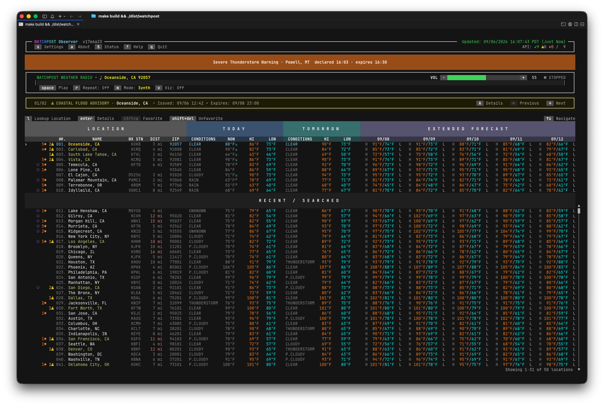


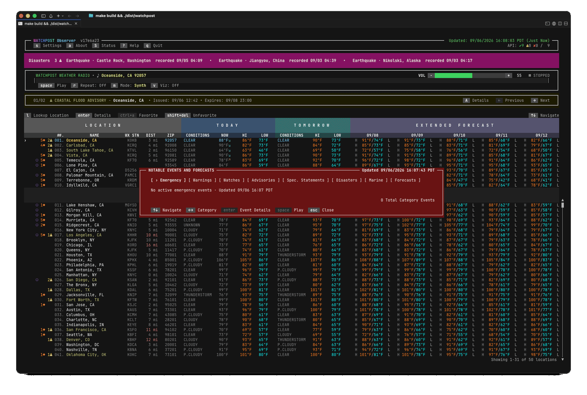

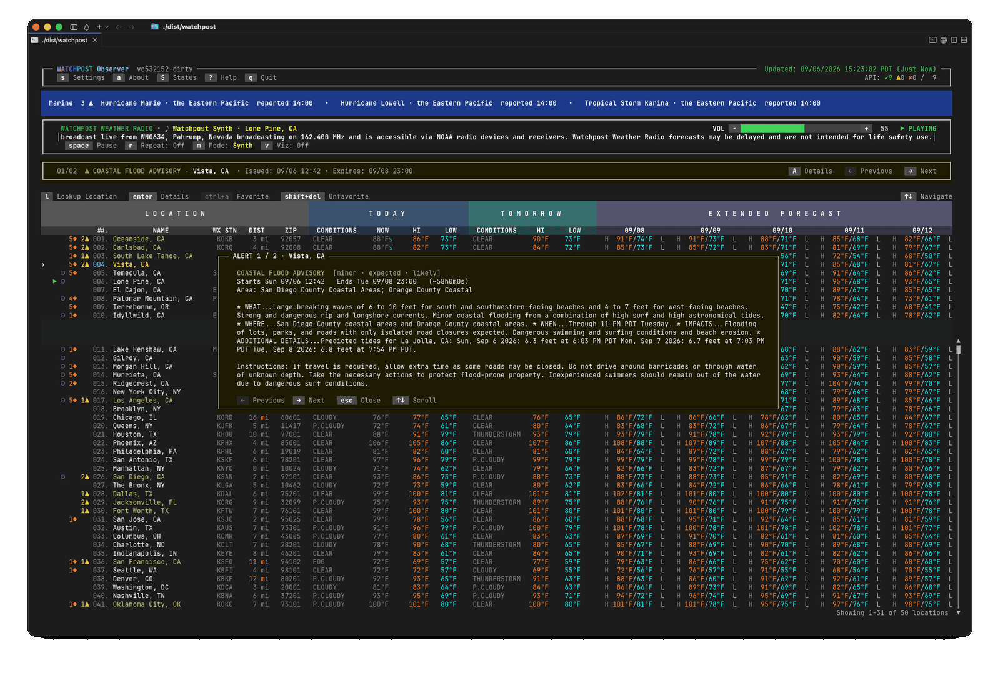


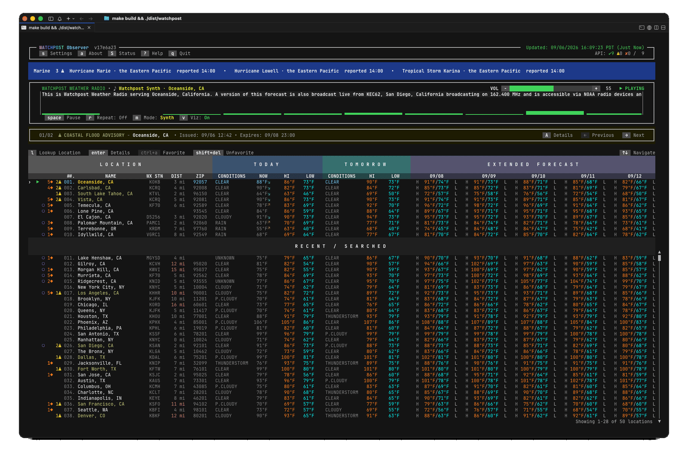

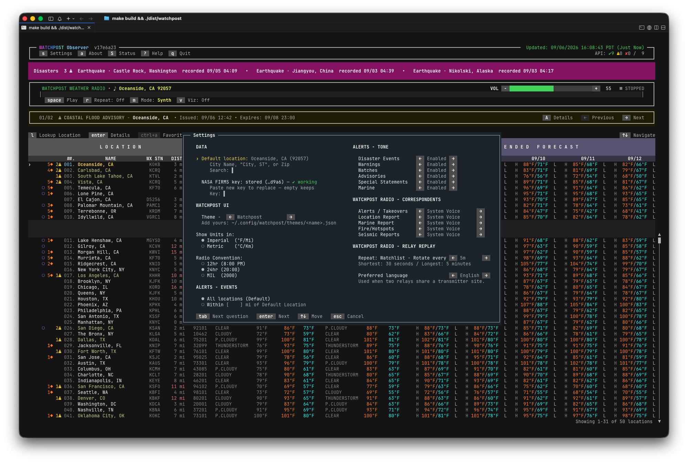


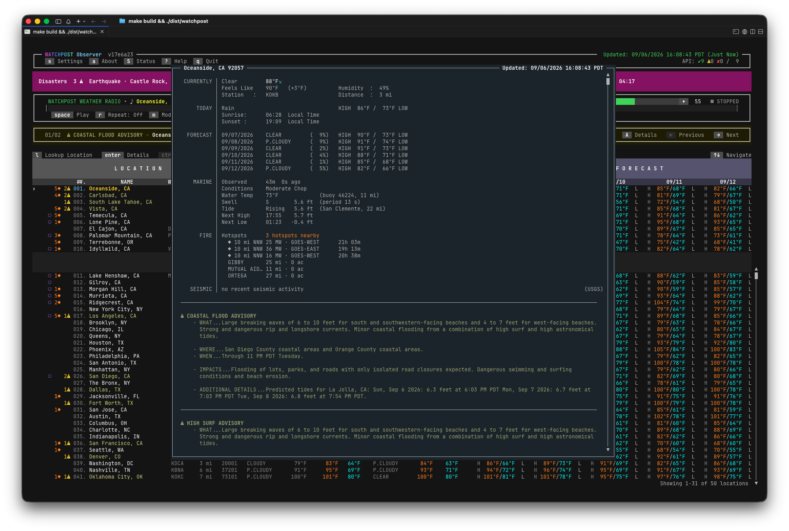

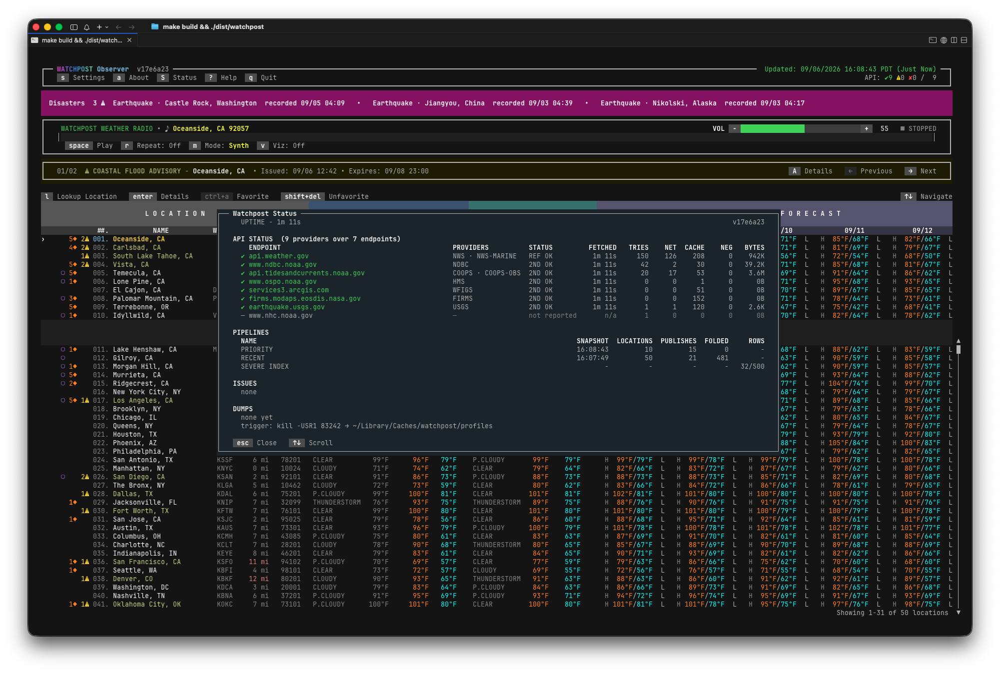

## Get it running

The one-line install at the top of this page covers macOS and Linux (Intel or Apple silicon / amd64 or
arm64). It downloads the right build for your machine, checks it against the release's published checksums,
puts it in `~/.local/bin` (or `/usr/local/bin` when that is the better place) and tells you the one
thing left to do, if any. Windows: download `watchpost-windows-amd64.exe` from the
[Releases](https://github.com/branden-thompson/watchpost/releases) page. You can always install by
hand instead: download the binary and `checksums.txt`, verify, `chmod +x`, put it on your PATH.

You need a terminal with a UTF-8 locale and a font that has the block and arrow characters — any
modern terminal does (not the bare Linux console). The window wants at least 80 columns by 24 rows;
give it more and it uses all of it. On Linux the binary needs glibc (not Alpine/musl), and the radio voice
needs `libstdc++6` and a sound system (PulseAudio/PipeWire or ALSA).

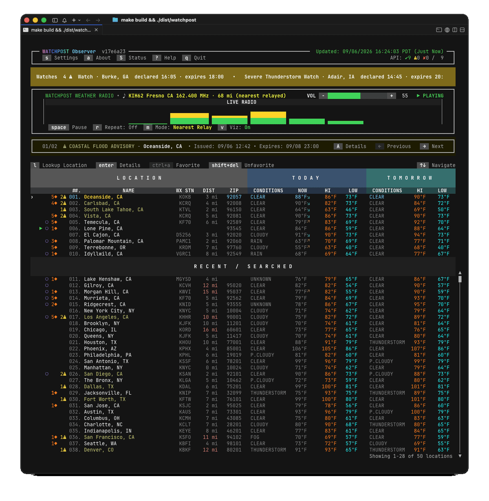

Then:

```sh
watchpost
```

On the first run the Settings window opens over the dashboard and asks three things, all on one screen:
your default location (start typing a city or ZIP; the list narrows as you type), an optional NASA
FIRMS key for satellite fire detections minutes old (leave it empty — the built-in fire sources need
no key), and whether the radio should announce every severe event nationwide or only those within a
distance of you. `tab` moves between the questions, `enter` saves. Press `s` to come back to it any time.

**Your correspondents.** Settings' *Watchpost Radio — Correspondents* group gives the station a cast: a
row for each thing you hear — the alerts and takeovers, the location report, the marine report, the fires,
the quakes — and a voice for each. A row you have not set names the voice it inherits, so every row says
who will actually speak, and `p` previews the focused one. When correspondents change mid-broadcast they hand over by name
— *"This is Rishi, taking over for Samantha."* Press `V` to jump straight to that group.

The voices themselves need nothing on macOS — the correspondents are the system's own. On Linux and
Windows the voice (Piper) installs itself the first time you tune in; picking one you have not used yet
downloads it (about 63 MB, verified) with progress shown in the player. Watchpost fetches at most two
voices in the background per session, so a hand-edited config cannot quietly pull hundreds of megabytes
on launch.

**Alert tones.** Every alert opens with a sound that says what KIND of alert is coming, before a word is
spoken: warnings and significant quakes share the loudest, and watches, advisories, special statements
and tropical/winter storms each have their own. Settings' *Alerts — Tone* group mutes any class you like,
and `M` opens Settings there so you can change them while the radio is talking. The words always
read: muting a class silences its tone, never its announcement.

**A marine report.** Coastal locations gain a spoken sea report between the forecast and the fire
report: the coastal-waters forecast, the nearest buoy, the tide in force, the next high and low, and the
tidal current.

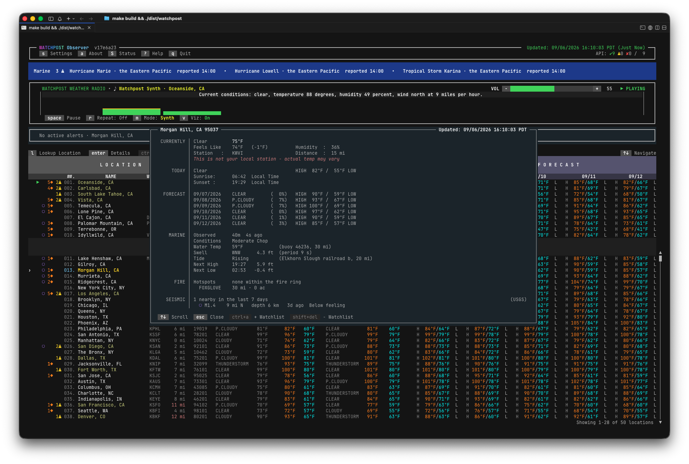

## Every day

| Key | Does |
|-----|------|
| `↑` `↓` | move between locations (your favourites, then RECENT / SEARCHED) |
| `enter` | the location in full: hourly, the week, marine and tides, fire, quakes, the alerts |
| `A` / `←` `→` | the focused location's alerts, one at a time |
| `w` | **Severe Weather / Disaster Events** — every active event, by category (`←` `→`), event (`↑` `↓`); `enter` opens the record, `space` reads it aloud, `esc` backs out |
| `l` | look up any city or ZIP — it joins the top of RECENT and stays there |
| `ctrl+a` / `shift+delete` | make the focused location a favourite (up to 10) / remove it |
| `space` `+` `-` | radio: play or pause the focused location · volume up (`=` too) and down |
| `r` `m` | Repeat: Off · One · Watchlist (each favourite in turn) · Mode: Synth (your forecast, read aloud) or Nearest Relay (the live station) |
| `v` `V` | the visualizer · your correspondents (opens Settings) |
| `M` | open Settings at the alert TONES, where each class can be muted (the words always read; the tape keeps scrolling) |
| `f` `c` | Fahrenheit / Celsius |
| `t` | the colour theme — thirteen built in, **Watchpost Light** for a light terminal |
| `s` `a` `S` `?` `q` | Settings · About and data credits · the status of every data source · help · quit (`ctrl+c` too) |

(`ctrl+s` also opens the severe window — unless your shell or tmux has it reserved for flow control,
which is why `w` is the key to remember.)

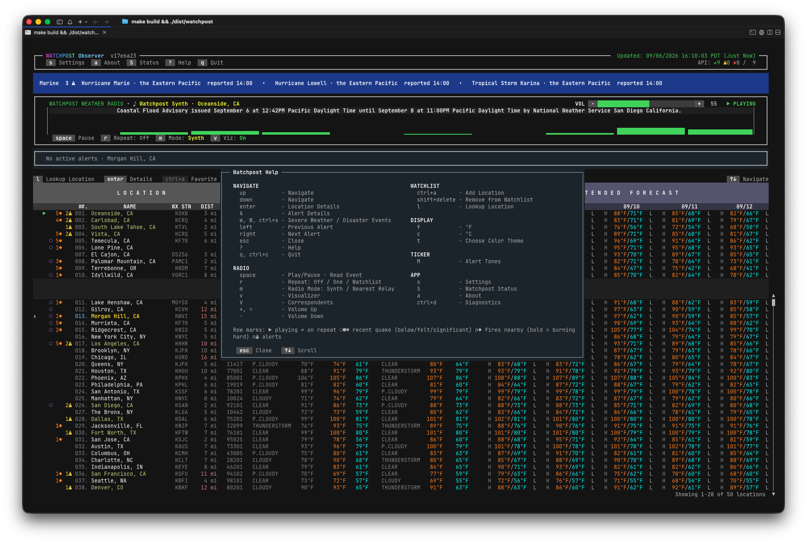

## Severe events

`w` opens the Severe Weather / Disaster Events window: every active event in six categories —
Warnings · Watches · Advisories · Spec. Statements · Disasters · Marine — each painting the window
in its own colour. It combines the national feeds (USGS significant quakes, NHC tropical cyclones,
the NWS severe-warning feed) with the alerts of every place on your watchlist, one row per event; an
alert a newer message from the same office has replaced is dropped everywhere it would show. Each row
tells you the EVENT, its LOCATION, how it was **detected** (a warning's own source line — Radar
Indicated, Spotter Reported, Law Enforcement — or the alert's certainty; a quake's review status),
when it was **declared** (the time it was issued; an alert that starts later says so in its record)
and when it **expires**. `enter` opens the full record; `space` has the correspondent read it over
the radio; `esc` backs out; `esc` `esc` closes. Open the window within ten minutes of a breaking event
and it lands on that event's category. A source that is down is named on the category line ("NHC
unavailable") — never a silently empty list.

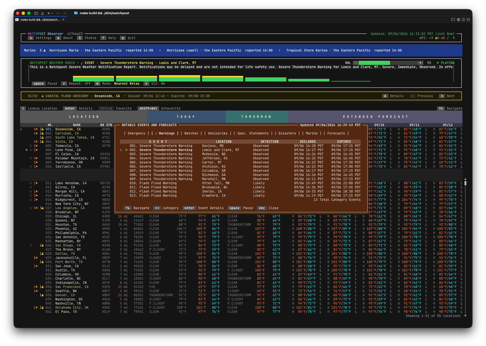

## Radio

`space` tunes the focused location. **Synth** is a broadcast the correspondent composes for that place,
in the order NOAA Weather Radio uses: the notice and the station lead, current conditions, active
alerts, the forecast office's products, then — when there is something to say — the Marine report on
the coast, the Fire and Hotspot report and the Seismic Activity report, and the sign-off.
**Nearest Relay** (`m`) plays the real transmitter, streamed by the community relays. `r` cycles
Repeat: Off · One · Watchlist; `v` puts the visualizer inside the marquee. A **breaking event**
always speaks first: the broadcast dips, the attention tone sounds, the event is read; a `space` read
in progress pauses for it and carries on afterwards; the broadcast comes back up when nothing else
is waiting.

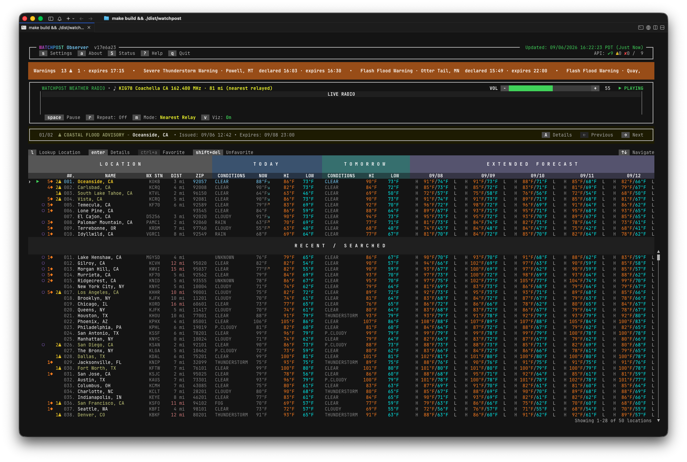


## Quakes

Every location watches for earthquakes the way it watches for alerts: a row wears a violet mark for
the strongest quake in reach — `○` below feeling, `●` felt (M 3.5 and up), `◉` significant (M 5.0 and
up) — and the location's details have a SEISMIC section listing the week's quakes with magnitude,
distance, bearing, depth and age. "In reach" scales with strength: a small tremor counts within 3
miles, a great quake within 1 000, over a seven-day lookback. The radio's Seismic Activity report reads
the same list. Source: the USGS real-time feed, no key.

## Fire

Every location watches for wildfire the way it watches for alerts: a row wears an orange `◆` with a
count (named incidents nearby, or 1 for unnamed hotspots; bold when a hotspot is burning hard) and the
location's details have a FIRE section — satellite hotspots inside a 25 km ring (bearing, distance,
strength, satellite, age), named incidents within 50 km (acres, % contained) and the Red Flag / Fire
Weather alert when one is active. Two sources need no key: NOAA's Hazard Mapping System
(analyst-curated satellite detections, refreshed every 10 minutes) and NIFC's incident list.

**NASA FIRMS (optional, free key).** FIRMS adds detections minutes old, straight from the satellites,
before an analyst has looked at them. Get a MAP_KEY at
<https://firms.modaps.eosdis.nasa.gov/api/map_key/> (it arrives by email at once), press `s`, `tab` to
the key line and paste it — it is masked, `ctrl+r` shows it, and the window tells you whether FIRMS
accepts it. The key takes effect at once and only ever travels to NASA's FIRMS servers; without one,
FIRMS simply reads `off` in the status window and the other two sources carry the default.

## Themes and looks

`t` opens Settings at the theme picker: Watchpost, Watchpost Light (for a light terminal), High Contrast,
Monochrome and nine more, applied live and remembered. Every colour pair in every theme is checked to
read at the WCAG AA contrast level. `watchpost --ascii` draws every mark with plain characters
(`>` pointer, `*` playing, `R` on repeat, `n*` fires, `n!` alerts, `.`/`o`/`O` quakes, `+ - |` box
rules, arrow keys named in words) and spells out headers a screen reader would read letter by letter,
for terminals or screen readers that mishandle the glyphs. It covers the marks, the box rules, the
legend and those headers — **not** the weather text itself, which is the forecast offices' words and
is printed as they wrote them; punctuation inside an alert's own title travels with it. With
`NO_COLOR` set, every state still reads in text — the meaning never rides on colour alone.

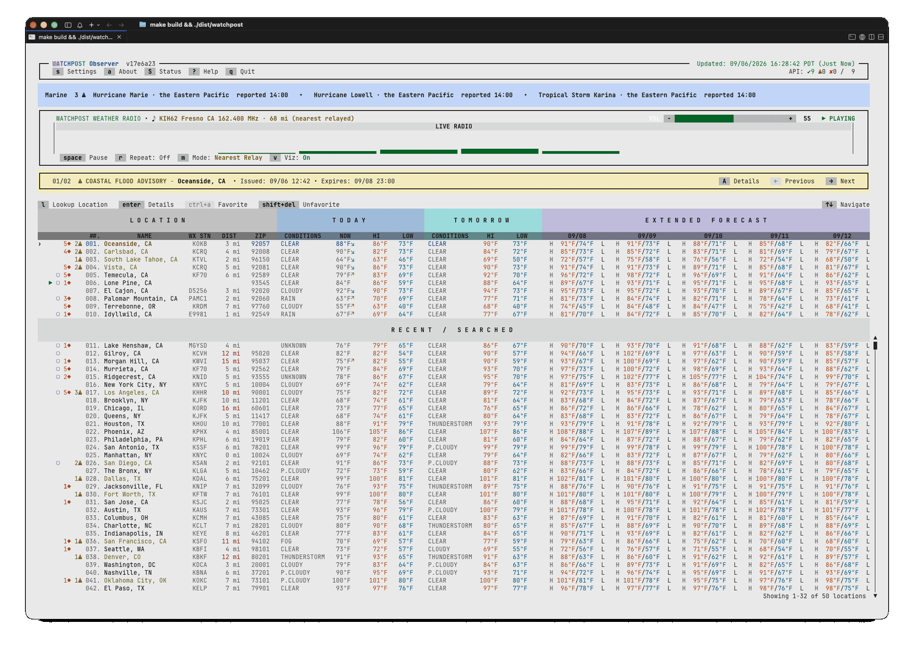

## Good to know

**Not a substitute for official warnings.** Everything here is fetched on a schedule and can lag;
for life safety use NOAA Weather Radio and Wireless Emergency Alerts. Coverage is US-only (the
National Weather Service); places outside the US resolve but carry no weather data yet.

**Data and credits.** Watchpost reads public sources and shows their credits in the About window
(`a`): National Weather Service / NOAA (forecasts, observations, alerts, products, coastal waters,
transmitter list — public domain); NDBC buoys and CO-OPS tides/currents (NOAA); NOAA-NESDIS Hazard
Mapping System fire detections and NIFC WFIGS incidents (public domain); active fire data from NASA
FIRMS (<https://earthdata.nasa.gov/firms>, NASA open data — attribute LANCE/FIRMS); the USGS earthquake
feed; GeoNames and Open-Meteo geocoding (CC BY 4.0, <https://creativecommons.org/licenses/by/4.0/>);
NWR audio relayed by wxradio.org and weatherUSA (community relays — relayed audio lags and is not
for life-safety use). Watchpost is not affiliated with NOAA, NIFC, the USGS or NASA.

**What it talks to, and when.** Watchpost fetches only from the providers above, on the schedule the
dashboard shows, and it sends nothing about you to any of them. One further connection is available and
is **off unless you turn it on**: `update_check = true` asks `api.github.com`, **once at startup**, whether a
newer release has been published. It is a plain GET — no version, no identifier, nothing about your
machine — and the answer is compared locally; the `S` window shows the result. Left off, the app never
contacts GitHub at all.

**Where things live.** Your settings are in `~/.config/watchpost/config.toml` (written so only you can
read it). **Settings rewrites that file when it saves: keys it does not know are kept, but hand-written
comments are dropped.** If you keep notes in there, keep a copy — a comment-preserving writer is a
later job, not this release's. The download cache and the voice live under `~/.cache/watchpost/` (`~/Library/Caches/watchpost/`
on macOS) and are safe to delete at any time.

## For tinkerers

Everything below is optional — the app needs none of it.

**Thresholds** (`config.toml`; the defaults shown):

```toml
[fire]
radius_km          = 25   # hotspot ring around each location
incident_radius_km = 50   # named-incident ring
min_frp_mw         = 5    # hotspots below this fire radiative power are noise
bold_frp_mw        = 50   # at or above this the mark and the strength read bold
min_confidence     = "nominal"   # low | nominal | high — FIRMS points; HMS points are analyst-curated and always pass

[providers.firms]
key = "your-32-character-map-key"   # or paste it in Settings
```

**Display and behaviour** (`config.toml`; every one of these is also a row in Settings):

```toml
units         = "imperial"   # imperial (°F/mi) | metric (°C/km)
clock         = "12h"        # 12h | 24h | mil — how times are written AND spoken
update_check  = false        # true asks GitHub ONCE at startup whether a newer release exists
```

**The radio's own keys** (`[radio]`). Most are Settings rows, so you never have to write them by
hand — **four are not, deliberately**; see below the block.

```toml
[radio]
mode = "synth"            # synth (the correspondent reads) | relay (a live NOAA stream)
cast = ""                 # "" one voice reads everything | "cast" each role has its own

[radio.voices.alerts]     # one table per role: alerts, breaking, severe_read, standard,
macos = "Samantha"        # weather, maritime, fire, seismic, station. A role you leave out
piper = "en_US-amy"       # inherits from the level above it, so setting `alerts` alone is fine.

[radio.tones]
mode  = ""                # "" every class sounds | "mute" silence the classes below
muted = ["warning"]       # class keys; EMPTY under mute means every class
```

**Four voice roles are config-only, on purpose.** Settings has a row for the five a listener picks
between — *Alerts / Takeovers*, *Location Report*, *Marine Report*, *Fire/Hotspots*, *Seismic
Reports* — and **`breaking`, `severe_read`, `standard` and `station` have no row**. They are set by
hand or not at all, and each inherits from the level above it if you leave it out, so the app is
fully usable without ever naming one. They stay out of the window because a picker for every role
was tried and rejected: fine-grained controls for the five that get chosen, rather than nine rows
where four are almost always inherited. Write them the same way as the block above —
`[radio.voices.station]`, and so on.

**`[M]` silences tones, never words.** Muting a class stops its attention tone; the alert is still
read aloud. There is no setting that stops the words — that is deliberate.

`[seismic]` holds the earthquake rule — the magnitude → radius bands, the lookback in days and the
USGS event types — with the same shape as the defaults in the app.

**Your own theme.** Drop a JSON file of colour tokens in `~/.config/watchpost/themes/<name>.json`;
it appears in the picker. Every colour has a token, the tables' included (`table.muted`, `table.name`).

**What the correspondent says.** Every report script is a text file, not code:
`domains/radio/script/scripts/<report>/<part>.txt` (Go text/template; each file's first line names its
data), plus `scripts/global/head.txt` and `tail.txt`, which any report inherits when it has none of its
own. Today: `weather-radio/` (the broadcast's lead, conditions, alerts, sign-off), `fire-report/`,
`seismic-report/` and `marine-report/`, `event-report/` (the `space` read), `breaking/` (the takeover),
`handover/` (one correspondent passing to another) and `voice-preview/`. There is also
`transition/`, written and pinned but **not yet on air** — it is the line between a takeover and the
programme resuming, and it arrives with the wiring in a later release.
To re-word a phrase, put the same `<report>/<part>.txt` under `~/.config/watchpost/scripts/`; it
replaces that phrase alone. How the correspondent *pronounces* things is data too:
`domains/radio/pronounce/rules/<table>.txt` — `zones` (PDT → "Pacific Daylight Time"), `states`,
`states-ambiguous` (the codes that are also words), `abbreviations`, `words` (voice-only spellings) — one
`KEY<TAB>spoken form` per line (a bare `KEY` for a set).

**One-shot and scripting.** `watchpost report "El Cajon, CA"` prints the report as text; `--json` gives
the same as JSON (schema `1.0.0-rc`, additive changes only — `watchpost schema` prints it; the checked-in
copy is `pkg/schema/`). Exit codes: `0` ok · `1` no usable data or bad arguments · `2` a provider is
degraded (an unkeyed `off` FIRMS does not count). `watchpost completion bash|zsh|fish|powershell`
installs shell completion.

**Diagnostics.** `WATCHPOST_DEBUG_TIMING=1` prints launch→full-view time on exit.
`WATCHPOST_DEBUG_PPROF=1` serves pprof on `127.0.0.1:6060` (or `WATCHPOST_DEBUG_PPROF_ADDR`), plus
`/debug/counters` (live request, publish and memory counters as JSON) and `/debug/dump` (**POST** —
it writes a profile set to disk, so a GET is refused). The `S` window shows the request counters per host since launch and the severe index
against its 500-row cap. A running dashboard writes a diagnostic dump — heap, allocs, goroutine and
threadcreate profiles with `counters.json` — under the cache directory's `profiles/` on
`kill -USR1 <pid>` (macOS/Linux; on Windows use `curl -X POST .../debug/dump`); dumps are at least a minute apart and
the newest twelve are kept. `watchpost report <loc> --verbose` appends one request-counter line per
host. `WATCHPOST_DEBUG_RADIO=1` writes one line per radio engine state change, one per
synthesized segment as it reaches the air, one when a cycle ends (the voice's error, if that is why),
and one when a read is ended for not finishing — the first thing to send when a relay "plays nothing"
or a broadcast ends before its sign-off. It lands at `<cache>/watchpost/debug/radio.log`, mode 0600,
rotated once past 8 MiB. **The variable names the LOG, not a path**: set it to a lower-case name
(`WATCHPOST_DEBUG_RADIO=soak`) to keep a run's log beside the others, and anything that is not a name
falls back to `radio`.

## Building from source

Go 1.25 is the floor (`go.mod`); CI and the releases build with 1.27. `make build` (binary in
`./dist`, version stamped from `git describe`), `make verify` (fmt, vet, tidy, vulnerability, race,
import-direction, watermark and control gates with positive controls), `make release-matrix` (all
targets, CGO off), `make install-test` (installer end to end against a local server). The soak and
benchmark harness lives in `scripts/quality/` and `make quality-bench`. The terminal UI kit (`go-studs`,
MIT, same author) is carried in-tree under `third_party/go-studs` (its LICENSE and NOTICE.md ride with
it; import paths rewritten), so the tree builds anywhere with no private access.

## Licence

MIT — see `LICENSE`. Use it freely; keep the copyright and permission notice (attribution).
